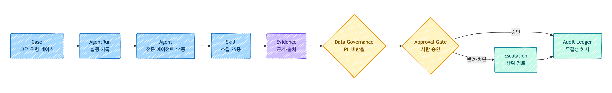
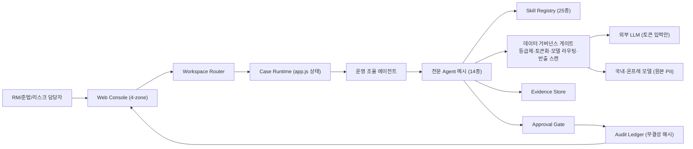
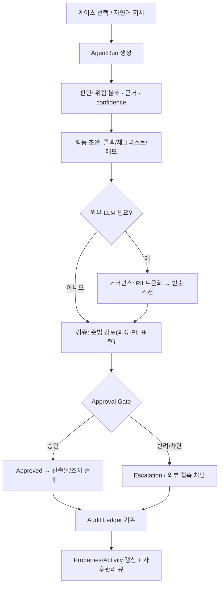
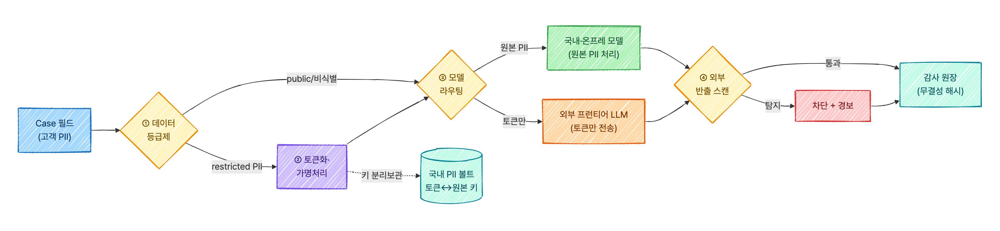

# JB LocalGuard OS — 기능명세서

> JB금융그룹 Fin:AI Challenge · 자유주제 · 제출물 ②(필수) · 공식 6파트(+변경이력) · 본문 3페이지 권장(부록 별도)
> 사실/수치 단일 출처: [`_canon.md`](../_canon.md) · MVP 제안서와 동기화

---

## 1. 서비스 개요 (Service)

**JB LocalGuard OS**는 지역 금융 고객의 위험 신호를 `Case`로 모아, 14종 전문 AI Agent가 스킬을 장착해 **판단·행동 초안·검증**을 수행하고, 고객 대상 행동은 사람 승인 전까지 차단하는 **금융 AI Agent 운영 콘솔**이다.

| 항목 | 내용 |
| --- | --- |
| 사용자 | RM·기업금융·사후관리·준법/리스크 담당자 (1차), 지역 소상공인·개인사업자·전세 고객 (수혜자) |
| 형태 | 브라우저 운영 콘솔(현재 정적 MVP), 본선 백엔드 API로 승격 |
| 운영 계약 | `Case → AgentRun → Agent → Skill → Evidence → Approval → Audit` |
| 핵심 원칙 | 승인 우선 자동화(완전 자동 발송 금지), 근거·감사 일급 객체, **PII 외부 비반출** |
| 골든 패스 | `?demo=sme`(전주 카페), `?demo=jeonse`(전세), `?demo=phishing`(사기) |
| 규모 | 에이전트 14 · 스킬 25 · 플러그인/MCP 6 · 화면 15 · E2E 19 |

---

## 2. 시스템 구성도 (Architecture)

- **4-zone UI**: Sidebar(내비) / Topbar(지시·검색) / Workbench(대시보드·케이스·승인·전세·플러그인 등) / Properties(케이스·근거·감사 맥락).
- **거버넌스 게이트**는 모든 외부 LLM·플러그인 조회의 관문(차별점). 상세: [`04_아키텍처/`](../04_아키텍처/README.md), [`02_제품/element-specs/07-data-governance-pii.md`](../02_제품/element-specs/07-data-governance-pii.md).
- **구현 추적성**: 화면/기능 ↔ `app.js` 함수 ↔ 아키텍처 노드 1:1 매핑(부록 B).

---

## 3. 핵심 기능 명세 (Feature Specification)

| # | 기능 | 입력 | 처리(에이전트/스킬) | 출력 | 승인레벨 |
| --- | --- | --- | --- | --- | --- |
| F1 | 케이스 운영보드/대시보드 | 케이스 큐 | 운영 조율 에이전트 · `case-os-core` | 위험·상태·SLA 큐, 칸반 상태 전환 hook | L0 |
| F2 | AgentRun 실행 | 자연어 지시 + 케이스 | 상환위험 분류/정책금융 매칭/위험신호 감지 · `cashflow-stress` 등 | 단계별 판단 로그(근거·confidence) | L1 |
| F3 | 스킬 저장소 | — | 25종 스킬(위험도·승인정책) | 에이전트별 장착 스킬·승인 레벨 | L0 |
| F4 | 데이터 거버넌스 패널 | 외부 호출 페이로드 | 준법 검토 에이전트 · `privacy-redaction` | 토큰화 전/후, 라우팅 표, 반출 스캔 결과, 법령 칩 | L1 |
| F5 | 승인 게이트 + 감사 원장 | 제안 행동 | 승인 게이트 · `approval-gate`/`audit-ledger` | 승인/반려/상위검토 + 무결성 해시 로그 | L2–L4 |
| F6 | 전세 Shield 라인 | 전세 케이스 | 전세위험 관리 리드 + 4개 전문 에이전트 | 전세가율·권리·손실위험·계약·은행 연계 판단 | L1–L3 |
| F7 | 케이스 산출물 | AgentRun 결과 | deliverable 생성 | MD 업무 산출물(콜백 초안·체크리스트 등) | L1 |

**결정 규칙(Rule Engine 발췌)**: `riskScore ≥ 85` → 외부 행동 차단(승인·준법 통과 전); `fraud` pain → 이상거래 탐지·차단 에이전트 선실행; 모든 케이스 → 감사 원장에 actor·action·evidence·시각 기록.

---

## 4. 주요 기능 흐름도 (Flow)

외부 LLM 호출 구간의 PII 비반출 4중 방어:

판단→행동→검증→(승인)→감사→후속의 **운영 루프**가 정적 분석 보고서가 아니라 실제 상태 변화로 재현된다(심사 3.1/4.2).

---

## 5. 향후 발전 방향 (Future Work)

- **데이터 연동**: 공공데이터포털·한국은행 ECOS·HUG·국토부 실거래가 API 연결, 등기/실거래는 사람 트리거+캐시(대량수집 제약 대응).
- **모델**: 국내·온프레 모델(원본 PII)과 외부 프런티어 모델(토큰 입력) 라우팅 운영, RAG(공공/내부 문서) + Rule Engine(승인 레벨).
- **백엔드 승격**: 정적 함수 계약(`computeRiskDecision`·`buildDashboardData`·`auditChainRecords`·`moveCaseToColumn`)을 서버 API로 1:1 전환.
- **발전 경로**: PoC(현재) → 파일럿(1개 본부) → 내부 적용(사후관리·심사 보조, 네이버클라우드 MOU 방향) → 고객 서비스화.
- **확장**: 계열사(광주은행·JB우리캐피탈)·업무영역(기업여신 심사·WM)·고객군(중소기업·가계)로 스킬 추가 확장.

---

## 6. 부록 (Appendix)

### A. 외부 데이터·오픈소스·상용 API 인벤토리 (라이선스·제약) — 발췌
| 항목 | 제공처 | 용도 | 라이선스 | 제약 |
| --- | --- | --- | --- | --- |
| ECOS API | 한국은행 | 금리·경제지표 | 출처표시 시 상업이용 가능 | 인증키·호출제한 |
| 등기 Open API | 대법원 | 부동산 권리관계 | 확인 필요 | 일 1,000건·분당 30건 |
| 실거래가/전세보증 | 국토부·HUG | 시세·전세 위험 | 공공누리(유형 확인 필요) | 자동 대량수집 제약 |
| Claude/OpenAI API | Anthropic/OpenAI | 비식별 추론 | 상용 약관 | 학습 미사용·국외이전 → **원본 PII 전송 금지** |
| HyperCLOVA X | 네이버클라우드 | 국내·온프레 라우팅 | 확인 필요 | — |
| Playwright / python-pptx | OSS | 테스트/데크 | Apache-2.0 / MIT | — |

> 전체 표·출처·미검증 항목: [`05_리서치/data-api-license-inventory.md`](../05_리서치/data-api-license-inventory.md)

### B. 구현 추적성 (화면 ↔ 함수 ↔ 노드)
대시보드↔`renderDashboardView`, 케이스보드↔`moveCaseToColumn`, 승인↔`approveCase`/`rejectCase`, AgentRun↔`dispatchCommand`/`startAgentRun`, 전세↔`renderJeonseView`, 거버넌스↔`modules.js` governance. 상세: [`04_아키텍처/README.md`](../04_아키텍처/README.md).

### C. 용어집
Case(작업 단위)·AgentRun(실행 기록)·Skill(장착 처리능력)·Evidence(근거·출처)·Approval Gate(사람 승인 단계)·Audit Ledger(무결성 감사 원장)·데이터 등급제/토큰화/모델 라우팅/반출 스캔(거버넌스 4중 방어).

### D. 검증 방법
`python3 02_제품/scripts/verify_static.py`, `node --check 02_제품/app/app.js`, Playwright E2E 19종, 골든 패스 3종 데모.

---

## 7. 기능 변경이력 (Change Log)

예선 제출 시점 기준. 본선 단계에서 추가·수정·삭제가 발생하면 아래 형식으로 기록한다. (아래는 실제 git 커밋 이력 기반 주요 단계 요약이다.)

| 단계 | 일자 | 구분 | 내용 | 대표 커밋/태그 |
| --- | --- | --- | --- | --- |
| 초기 MVP 베이스라인 | 2026-06-11 | feat | LocalGuard 콘솔 골격·에이전트 모델·전세 Shield 라인 구성 | a208dba |
| 라이브 상호작용·제안서 데크 | 2026-06-12 | feat/docs | 인박스·승인 큐·하트비트 운영 루프 가동, 공식 양식 제안서 데크 초안 | adb0e39·f084e78 |
| UI 밀도·디자인 시스템(M1–M5) | 2026-06-13~14 | style/refactor | 결정 밀도 정제, 데이터 시각화·용어·위계 단계 정제, 토큰 통계 | `m1`~`m5` |
| 거버넌스·문서 체계(C0–C6) | 2026-06-14 | docs/fix | 사실 캐논·법령 인용, 공식 양식 제안서·기능명세서, 일관성 정합화 | `c0`~`c6` |
| 폴더 개혁·제출물 보강(C7–C9) | 2026-06-14 | refactor/docs | 단일 한국어 번호 체계 통합, 공식 양식(PPTX/DOCX) 반영·이미지 보강 | `c7`~`c9`·bbbda7a |
| (예정) 본선 | — | 추가 | 공공 API·온프레/외부 모델 라우팅 실연동, 백엔드 API 승격, RAG·산식 고도화 | — |

> 전체 커밋 추적 이력: [기능-변경이력.md](기능-변경이력.md)
