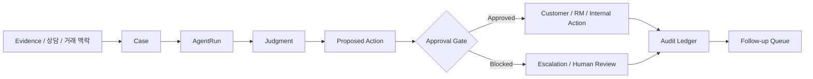

# Agent System

This document adapts the operating system pattern from `River-181/KEG-Mangsanggwedo` without copying the academy domain.

## What Was Transferred

- Case-centered workflow
- Agent runs as auditable work units
- Skill packages mounted onto Agents
- Approval gate before risky external action
- Activity log and traceable evidence
- Zero-human levels by risk

## What Was Not Transferred

- Academy operator persona
- Student, parent, lecture, tuition, attendance, or education operations
- Any education-specific pain point

## Operating Model

## Agents

| Agent | Mission | Mounted Skills |
| --- | --- | --- |
| LocalGuard Orchestrator | Create case, assign Agents, control run order, maintain status | `case-os-core`, `approval-gate`, `audit-ledger` |
| Pain Radar Agent | Search pain signals from articles, policy pages, customer notes | `evidence-harvest`, `source-ranker`, `pain-classifier` |
| Cashflow Triage Agent | Detect repayment stress, rate shock, delinquency signals | `cashflow-stress`, `rate-relief`, `risk-banding` |
| Policy Match Agent | Match customer context to policy finance, refinance, support clues | `policy-match`, `document-checklist`, `eligibility-explain` |
| Fraud Shield Agent | Detect suspicious call, phishing, deepfake, abnormal request patterns | `fraud-shield`, `escalation-memo`, `do-not-contact-rule` |
| RM Copilot Agent | Draft RM memo, customer call guide, branch follow-up checklist | `notification-brief`, `tone-control`, `next-best-action` |
| Compliance Guard Agent | Review proposed action before customer-facing use | `compliance-guard`, `privacy-redaction`, `claim-limiter` |
| Analytics Agent | Summarize portfolio-level pain clusters and queue health | `portfolio-signal`, `trend-summary`, `case-metrics` |

## Zero-human Levels

| Level | Automation | Allowed Output |
| --- | --- | --- |
| L0 | Auto observe and log | Evidence feed, tag, audit event |
| L1 | Draft for internal review | RM memo, risk reason, document checklist |
| L2 | One-click approval | Customer call guide, branch callback task |
| L3 | Human decision required | Restructuring, refinance, limit change recommendation |
| L4 | Information only | Fraud escalation, legal or regulatory risk, adverse action |

## Cooperation Patterns

- Sequential: Pain Radar -> Cashflow Triage -> RM Copilot -> Compliance Guard
- Parallel: Cashflow Triage, Policy Match, Fraud Shield run against one case at the same time
- Escalation: Fraud Shield can block all outbound actions
- Review loop: Compliance Guard returns a correction request, then RM Copilot revises the draft

## Safety Posture

The MVP does not automate credit decisions. It automates preparation, triage, evidence gathering, and approval-ready drafts. High-risk or regulated decisions remain human-owned.

