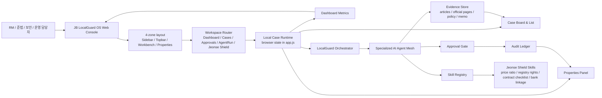
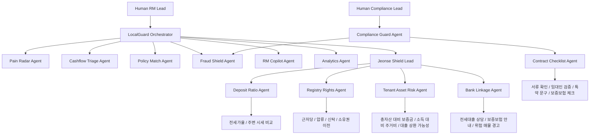
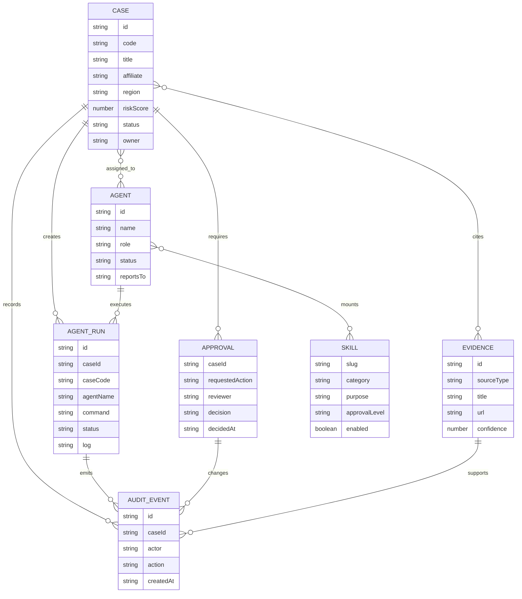
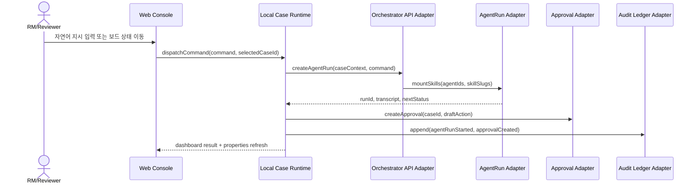
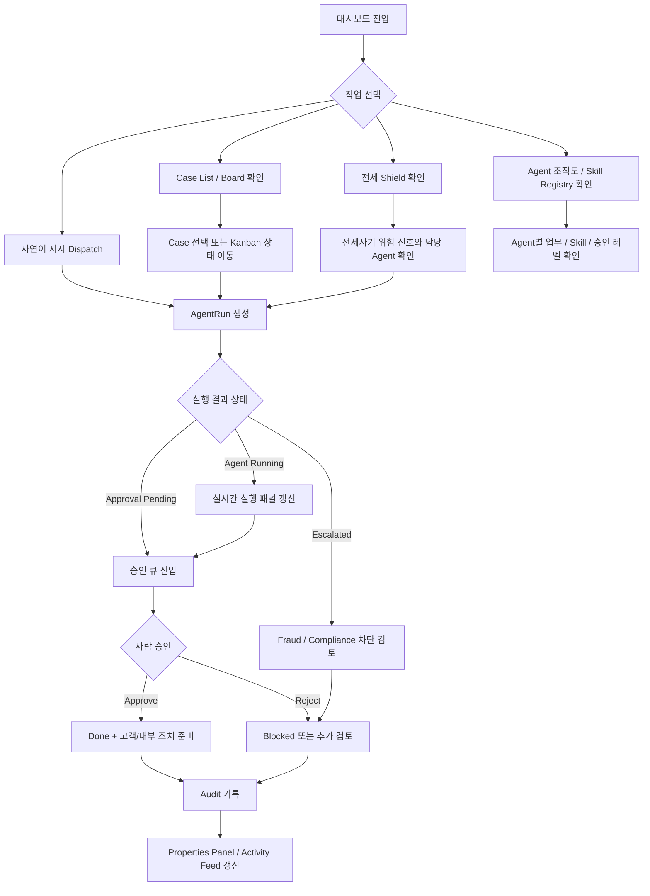
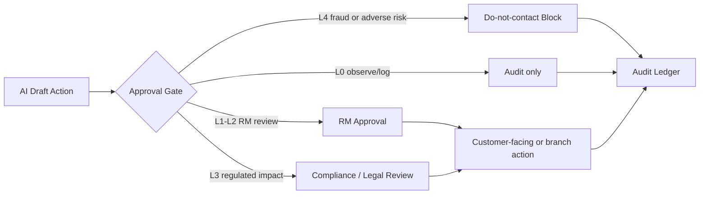
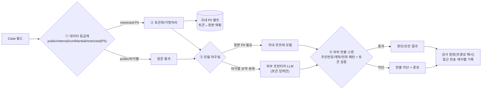

# 07_아키텍처

JB LocalGuard OS의 시스템, 데이터, API, 사용자 흐름을 Mermaid 다이어그램으로 정리한 아키텍처 문서입니다.

현재 MVP는 `app/index.html`, `app/styles.css`, `app/app.js`만으로 실행되는 정적 브라우저 앱입니다. 다만 구조는 추후 백엔드 API, AgentRun 서버, Evidence 저장소, Audit Ledger로 분리할 수 있도록 `Case -> AgentRun -> Approval -> Audit` 계약을 기준으로 설계했습니다.

## 이 폴더의 역할

이 폴더는 심사자와 개발자가 같은 그림을 보도록 만드는 아키텍처 기준점입니다. 구현은 정적 앱이지만, 문서는 서버/API/데이터 저장소로 확장했을 때의 목표 구조를 함께 설명합니다.

## 다이어그램 색인

| 다이어그램 | 설명 |
| --- | --- |
| 시스템 아키텍처 | UI, Local Runtime, Agent Mesh, Skill Registry, Evidence, Approval, Audit 연결 |
| Agent 조직 아키텍처 | 사람 승인자와 AI Agent의 보고 체계 |
| 데이터 아키텍처 | Case, AgentRun, Agent, Skill, Evidence, Approval, AuditEvent 관계 |
| API 아키텍처 | 정적 함수 계약을 서버 API로 승격할 때의 목표 인터페이스 |
| 사용자 흐름 | 대시보드, 케이스, 전세 보호, AgentRun, 승인, 감사 로그 흐름 |
| 승인/통제 흐름 | 고객-facing 행동을 사람 승인과 준법 통제로 묶는 방식 |

## 구현 연결

| 구현 파일 | 책임 |
| --- | --- |
| [`../app/index.html`](../02_제품/app/index.html) | 정적 앱 엔트리, 레이아웃 shell |
| [`../app/styles.css`](../02_제품/app/styles.css) | HagentOS 기반 UI 레이아웃, 반응형, 그룹/패널 스타일 |
| [`../app/app.js`](../02_제품/app/app.js) | Case, Agent, Skill, Evidence, Approval, Audit 상태와 렌더링 |
| [`../scripts/verify_static.py`](../02_제품/scripts/verify_static.py) | 필수 정적 파일/문구/구조 검증 |

## 아키텍처 원칙

- UI는 HagentOS Process Mirroring 방식으로 `Dashboard`, `Case`, `Approval`, `AgentRun`, `전세 Shield`, `Agent 조직도`, `Skill Registry`, `Audit`을 같은 운영 콘솔 안에서 전환합니다.
- Agent는 독립된 기능 화면이 아니라 `Case`를 처리하는 실행 주체입니다.
- Skill은 Agent에 장착되는 처리 능력이며, 전세사기 대응은 `Jeonse Shield` 라인으로 분리합니다.
- 고객-facing 행동은 반드시 `Approval Gate`를 통과합니다.
- 판단 근거는 `Evidence`, 실행 흔적은 `AuditEvent`로 남깁니다.
- 현재 정적 MVP의 함수 계약은 추후 API 서버 엔드포인트로 1:1 승격할 수 있게 유지합니다.

## 시스템 아키텍처

## Agent 조직 아키텍처

## 데이터 아키텍처

### 데이터 책임

| 데이터 | 현재 MVP 위치 | 책임 |
| --- | --- | --- |
| Case | `initialCases`, `cases` | 고객/사업자/전세 위험 케이스의 단일 작업 단위 |
| AgentRun | `agentRuns` | Agent 실행 이력, 명령, 진행률, 결과 상태 |
| Agent | `agents` | 역할, 보고 체계, 장착 Skill, 상태 |
| Skill | `skillRack` | Agent가 수행할 수 있는 기능 단위 |
| Evidence | Case 내부 evidence 필드 | 판단 근거, 출처, 리스크 설명 |
| Approval | Case status와 승인 액션 | 고객-facing 행동 전 사람 승인 |
| AuditEvent | `activity`, Case audit | 실행/승인/반려/상태변경 기록 |

## API 아키텍처

현재 MVP는 네트워크 API 없이 브라우저 내부 함수로 동작합니다. 아래 API는 같은 계약을 서버로 분리할 때의 목표 인터페이스입니다.

| API | 현재 MVP 함수 | 목적 |
| --- | --- | --- |
| `GET /cases` | `renderCasesView`, `renderCaseBoard` | 케이스 목록과 보드 조회 |
| `POST /cases` | `initialCases` 확장 지점 | 새 위험 케이스 생성 |
| `PATCH /cases/{id}/status` | `moveCaseToColumn` | Kanban 이동과 상태 변경 |
| `POST /agent-runs` | `dispatchCommand`, `startAgentRun` | Agent 실행 생성 |
| `GET /agent-runs?caseId=` | `renderRunsView` | 특정 Case 실행 이력 조회 |
| `POST /approvals/{caseId}/approve` | `approveCase` | 승인 처리와 감사 로그 생성 |
| `POST /approvals/{caseId}/reject` | `rejectCase` | 반려/차단 처리와 감사 로그 생성 |
| `GET /agents` | `renderOrgView`, `renderTeamsView` | Agent 조직도와 담당 업무 조회 |
| `GET /skills` | `renderSkillRegistryView` | Skill Registry 조회 |
| `GET /evidence?caseId=` | `renderEvidenceView` | 판단 근거 조회 |
| `GET /audit?caseId=` | `renderAuditView`, `activity` | 감사 로그 조회 |

## 사용자 흐름

## 승인/통제 흐름

## 데이터 거버넌스 아키텍처 (PII 비반출 — 최대 차별점)

외부 LLM을 쓰되 고객 원본 PII는 외부로 나가지 않는 4중 방어 관문. 모든 외부 LLM·플러그인 조회는 이 게이트를 통과한다.

**법적 근거(검증)**: 은행은 **신용정보법 §40조의2**(특별법 우선, §3조의2)로 분리보관·재식별 금지, **개인정보보호법 §28조의4(안전조치)·§28조의5(재식별 금지)** 보충. 환경: **전자금융감독규정 §15조①(망분리)**, 금융위 **망분리 개선 로드맵(2024-08-13, 다층보안체계·생성형 AI 클라우드 허용)**, 금융보안원 **클라우드 가이드(2025)**. 상세: [`docs/05_evidence/legal-citation-verification.md`](../06_증빙/legal-citation-verification.md) · [`docs/02_product/element-specs/07-data-governance-pii.md`](../02_제품/element-specs/07-data-governance-pii.md)

## 구현 추적성

| 화면/기능 | 구현 위치 | 아키텍처 노드 |
| --- | --- | --- |
| Dashboard | `renderDashboardView` | Dashboard Metrics, Activity Feed |
| Case Board | `renderCaseBoard`, `moveCaseToColumn` | Case Board, Case status |
| Approval Queue | `approveCase`, `rejectCase` | Approval Gate, Audit Ledger |
| AgentRun | `dispatchCommand`, `startAgentRun` | Orchestrator, AgentRun Adapter |
| 전세 Shield | `renderJeonseView` | Jeonse Shield Lead, 전세 전용 Skill |
| Agent 조직도 | `renderOrgView` | Agent Mesh, 보고 체계 |
| Skill Registry | `renderSkillRegistryView` | Skill Registry |
| Properties Panel | `renderProperties` | Case, AgentRun, Evidence, Audit 연결 |

## 검증 체크리스트

- Mermaid 시스템 아키텍처, 데이터 아키텍처, API 아키텍처, 사용자 흐름 다이어그램을 모두 포함합니다.
- UI에서 보이는 Agent 이름과 문서의 Agent 이름을 동일하게 유지합니다.
- `Case -> AgentRun -> Approval -> Audit` 계약을 벗어나는 자동 고객-facing 실행을 금지합니다.
- 전세사기 Agent Skill은 가격, 권리관계, 고객 자산, 계약 체크리스트, 은행 연계로 분리합니다.
- `app/app.js`의 상태 전환 함수가 바뀌면 이 문서의 API/사용자 흐름 다이어그램도 함께 갱신합니다.
