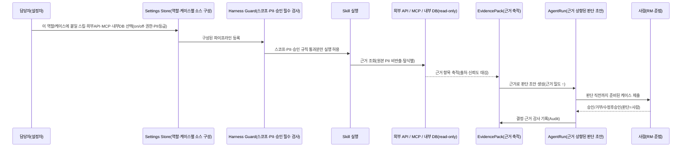

---
tags:
  - area/product
  - type/vision
  - status/active
date: 2026-07-04
up: "[[INDEX|제품 인덱스]]"
aliases:
  - 설정-근거상향 차별성
  - configuration-first
  - 담당자 설정 흐름
  - evidence-raising
---
# 차별성 — 담당자 설정 → 근거 상향 → 판단 직전 보조 (메커니즘 척추)

> **왜 이 문서가 새로 필요했나**: 팀장(River)이 반복해서 강조한 우리 실차별성 — *"각 기관·계열사·담당자가 **스킬 + 외부 API/MCP + 내부 DB 접근**을 **설정**해서 케이스의 **근거를 높이고**, AI는 **판단 직전까지만** 돕는다"* — 이 **무제 폴더 5개 문서에도, 우리 22종 문서에도 그 구체성으로 정착돼 있지 않았다**([[무제폴더-핵심이해]] §2, MCP는 어디에도 0회 등장). 이 문서가 그 공백을 메운다.
> [[차별성-경험레이어-서사]]가 **"왜"(경험 재해석)**의 척추라면, 이 문서는 **"어떻게"(설정으로 근거를 조립하는 메커니즘)**의 척추다.

---

## 1. 한 문장

일반 AI 자동화는 **고정 파이프라인**(정해진 입력→정해진 출력)이다. 우리는 담당자가 **케이스·역할·계열사에 맞게 근거 소스를 스스로 조립(configure)**하게 하고, AI는 그 조립된 근거로 **판단 직전까지의 준비**를 대신한다. **판단과 책임은 사람.** = "설정 가능한 근거 조립기 + 사람 판단 게이트".

## 2. 왜 이것이 진짜 차별성인가

- 범용 챗봇/RPA는 소스가 고정 → 케이스마다 다른 근거 요구를 못 따라간다. 담당자가 **어떤 스킬·API·DB를 이 케이스에 붙일지 정하는 순간**, 근거 밀도가 케이스별로 최적화된다.
- 이것이 [[차별성-경험레이어-서사]]의 **"역할 기반 게이트"를 실제로 구동하는 엔진**이다 — 역할이 콘솔을 정하고, 담당자 설정이 그 콘솔의 **근거 파이프라인**을 정한다.
- 심사 방어: "그냥 LLM 붙인 것 아니냐"에 대한 답 = **"근거 소스를 담당자가 설정·검증하고, 원본 PII는 반출 안 하며, 판단은 사람이 한다"**. 근거: D9(RAG·규칙·승인·추적 분리)·D18(RM은 답이 아니라 검증가능 근거팩을 산다)·D21(정책신호·케이스기억·시뮬레이션 운영레이어). [E2]

## 3. 핵심 흐름 (설정 → 근거 상향 → 판단 직전 보조)

**빠져 있던 단계 = "설정(configuration)" 그 자체.** 담당자가 무엇을 연결할지 고르는 화면·상태·권한이 우리 문서·프로토타입에 없었다 → §5 신설 대상.

## 4. paperclip에서 가져오는 것 / 안 가져오는 것

[[paperclip-통합-블루프린트]] 결론 반영:
- **가져옴(스키마 셰이프·패턴만)**: adapter/plugin registry, settings 계층, secrets 분리, agent routing 개념, activityLog(에이전트가 "생각"을 보여줌), per-agent evals, MCP 서버 패턴.
- **안 가져옴**: paperclip의 코드·스택(pnpm/React/Express/Drizzle)·비주얼/아이콘. 무빌드 vanilla JS 하네스(`harnessRegistry`/`harnessCore`/`modules.js` pluginRegistry) 위에 **재작성**. 디자인은 JBFG 토큰 전량.
- JB_project2는 이미 `pluginRegistry`·connectors 패널을 부분 보유([[승보-프로토타입-반영]]) → 설정 레이어의 착지점.

## 5. 신설 필요 (이 차별성이 요구하는 것)

| 대상 | 내용 | 소유 |
|---|---|---|
| **설정(Config) 뷰** | 역할/계열사별 연결 가능 소스 카탈로그(스킬·플러그인·외부 API·MCP·내부 DB) + on/off·권한·PII등급 토글 | 디자이너(뷰) + 나(스펙) → [[_디자이너-핸드오프]]에 추가 |
| **Config 스키마** | `{sourceId, type: skill|api|mcp|db, scope(role·affiliate), piiGrade, approvalPolicy, enabled}` | feature-spec·domain-model 보강 |
| **근거 상향 지표** | 케이스별 근거 밀도/출처 수/신뢰도 = 설정 효과 측정 | [[business-metrics]] Trust 카테고리 |

## 6. 결정 필요 (팀/사용자)

- **[팀결정] MCP 채택 여부** — 외부 소스 연결 타입에 MCP를 1급으로 넣을지. 블루프린트는 패턴 존재 확인, 채택은 미정.
- **[사용자] 49% 수치** — 무제폴더 최종안은 "Enter 49% 빠름"을 성과로 주장 / 우리 가드레일은 금지. 발표 원고 택1([[무제폴더-핵심이해]] §5).
- **[경계] 담당자 설정 허용 범위** — 어느 소스까지 담당자가 직접 on/off 하나(vs 관리자만). 권한·감사 영향.

## 7. 근거층 (심사 "왜?" 대비)

- D9(RAG·규칙·승인게이트·추적을 분리해 쌓는다) · D18(검증가능 근거팩을 산다) · D21(정책신호·기억·시뮬 운영레이어) · D7a/D7b(외부·대체데이터, 원문 비반출) · D25(데이터레인 최소공유). 근거등급은 각 인용 시 부여, 핵심 주장 E2+.

## 연결
[[차별성-경험레이어-서사]] · [[paperclip-통합-블루프린트]] · [[무제폴더-핵심이해]] · [[08_본선/03_제품/00_결정-준비/설계/skills-스킬·플러그인·외부 플러그인·데이터 구상|skills-구상]] · [[08_본선/03_제품/00_결정-준비/설계/agents-v2-paperclip기반-재설계|agents-v2]] · [[05_domain-model]] · [[08_feature-spec]] · [[_디자이너-핸드오프]]
