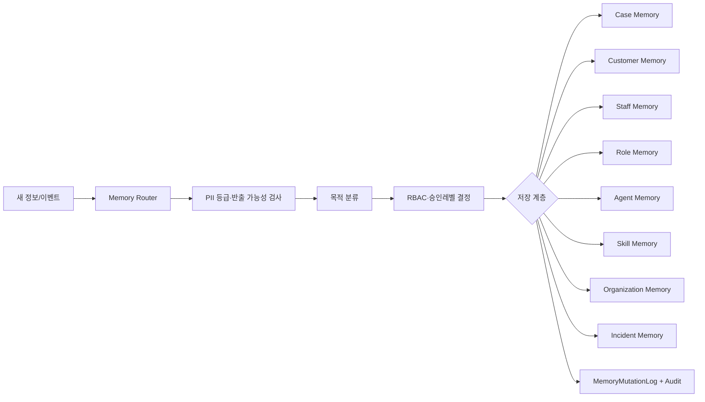
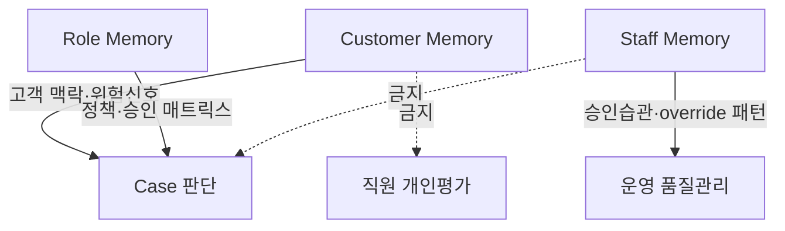

---
tags:
  - area/product
  - type/design
  - status/active
date: 2026-07-04
up: "[[_INDEX|CaseOps 분기]]"
aliases:
  - Memory Governance Layer
  - 메모리 거버넌스
  - 8계층 메모리
---

# 01 — 메모리 거버넌스

> **상태**: CaseOps 분기 설계안. 정본 승격 전까지 이 문서의 신규 스키마·보존기간·UI 반영 범위는 [분기/미확정]이다.
> **SSOT 정합**: 제품명은 `JB LocalGuard OS`, 본선 히어로는 `CCL-0001`, 고객 원본 PII·개인신용정보는 외부 프런티어 LLM으로 비반출, 현재 구현은 `_vendor/JB_project2/app`의 vanilla JS/localStorage CCL 하네스다.
> **핵심 주장**: 메모리는 "많이 기억"하는 기능이 아니라 **목적별 격리·접근권한·보존·삭제·감사**를 통제하는 운영 계층이다. D11은 메모리 분리와 provenance, D25·D17은 Zero-PII/레인 분리, D14는 결정 패키지와 재심 파이프라인, D15는 승인·감사·사고대응의 한계를 지적한다. [E2]

## 근거등급

| 등급 | 의미 | 이 문서에서의 사용 |
|---|---|---|
| E0 | 가정·분기 아이디어 | 신규 Memory Router 세부 보존기간·UI 반영 범위 |
| E1 | 설계 정합·코드 미구현 | 8계층 라우팅 정책, Incident Memory 자동 생성 |
| E2 | 리서치 요약·다중 설계 근거 | D11·D14·D25·D17·D15 기반 주장 |
| E3 | 백본 SSOT·규칙 문서와 정합 | `_canon.md`, `definitions.md`, `data-rules.md` |
| E4 | 현재 코드/데모로 확인 가능 | `ccl_cases`, `ccl_agent_runs`, `approvals`, `ccl_audit_logs`, PII/scope hooks |
| E5 | 운영 PoC 실측 | 현재 없음 |

## 설계 목표

현재 CCL 하네스는 `Case → AgentRun → Agent → Skill → Evidence → Approval → Audit`의 골격을 localStorage로 재현한다. `CCL-0001`은 `BIZ-REF-0001`만 저장하고 실제 사업자 식별정보 원문을 두지 않으며, `cclTable(table, roleKey)`는 scope 없이는 `"role scope is required"`를 던진다. [E4]

이 분기에서 추가하는 목표는 다음이다.

| 목표 | 설명 | 근거 |
|---|---|---|
| 목적별 메모리 분리 | Case/Customer/Staff/Role/Agent/Skill/Organization/Incident를 같은 저장소에 섞지 않는다 | D11 [E2] |
| Customer↔Staff 격리 | 담당자 승인 습관이 고객 위험판단에 새지 않도록 물리·논리적으로 분리한다 | D11·D14 [E2] |
| Zero-PII 장기 기억 | 고객 원본이 아니라 조치·승인·근거 포인터·상태만 장기화한다 | D25·D17 [E2] |
| Memory Router | 새 정보가 들어올 때 계층·권한·보존·감사 로그를 자동 결정한다 | 원문 CaseOps 대화 + D11 [E1] |
| 메모리 변이 감사 | 생성·수정·삭제·consolidation·forgetting을 `MemoryMutationLog`로 남긴다 | D11·D15 [E2] |



## 8계층 메모리

### 1. Case Memory

| 항목 | 설계 |
|---|---|
| 무엇을 기억 | 특정 Case의 현재 상태, 위험신호, AgentRun 결과, EvidencePack, RecommendationDraft, 승인 상태, 반려·수정 이력, 감사 포인터 |
| 보존기간 | 데모: `ccl-ops-db-v1` localStorage until reset. 운영: Case 종료 후 법무·감사 정책에 따른 보존 [분기/미확정] |
| 접근 역할(RBAC) | 담당 RM/여신 담당자, 해당 Case 승인자, 준법, 운영 조율 에이전트. 타 역할 scope는 기본 차단 |
| PII 등급 | `internal` 중심, 상담 요약·금융 구간값은 `confidential`; 원본 식별정보는 저장 금지 |
| 저장위치 | 현재 localStorage; 운영 시 계열사 내부 DB. 외부 LLM에는 Case code, risk code, evidence pointer만 가능 |
| 구체 예시 | `CCL-0001` 전주 카페 운전자금: `aiReview`, `riskLevel=high`, `requiresHumanReview=true`, `CCL-NOTE-0001/0003/0006`, `APR-CCL-0002` |

Case Memory는 작업기억에 가깝다. 완료 전에는 자주 읽고 갱신되지만, 완료 후에는 감사·재심·유사 케이스 검색을 위해 정제 요약과 원본 이벤트 포인터를 분리해야 한다. D11은 실행 로그 원본과 정제 요약 분리를 권고한다. [E2]

### 2. Customer Memory

| 항목 | 설계 |
|---|---|
| 무엇을 기억 | 고객이 반복 설명하지 않아도 되는 맥락: 이전 상담 주제, 과거 위험신호, 선호 채널, 설명 필요 수준, 승인된 조치 이력 |
| 보존기간 | Zero-PII 요약만 장기 후보, 원본 상담·식별키는 원천계에 둔다. 정확 기간은 법무 정책 확정 필요 [분기/미확정] |
| 접근 역할(RBAC) | 해당 고객을 맡은 계열사·역할 담당자, 준법, 데이터 스튜어드. 계열사 간 식별형 원장 통합은 금지 |
| PII 등급 | 토큰/Ref는 `internal`, 상담요약은 `confidential`, 성명·전화·계좌·정확주소는 `restricted` |
| 저장위치 | 계열사 내부 실명 레인 또는 Zero-PII 파생 레인. 외부 금지: 원본 PII, 상담원 메모 원문, 신용조회 원본 PDF |
| 구체 예시 | `BIZ-REF-0001`: "최근 3개월 매출 둔화로 운전자금 상담, 서류 보완 요청 초안 승인 대기"만 저장하고 실명·전화번호는 저장하지 않음 |

Customer Memory는 "고객을 잘 기억한다"가 아니라 **목적구속된 최소 기억**이다. D25는 고객 메모리를 원장 통합이 아니라 Zero-PII 메모리로 설계하라고 권고한다. [E2]

### 3. Staff Memory

| 항목 | 설계 |
|---|---|
| 무엇을 기억 | 담당자 업무스타일, 자주 보는 케이스 유형, 승인·반려 패턴, override 사유코드, 검토 지연 패턴, 교육 필요 신호 |
| 보존기간 | 운영 품질 개선용 집계·통계 중심. 개인평가·인사 활용 여부는 내부정책 필요 [분기/미확정] |
| 접근 역할(RBAC) | 본인, 팀장/감독자, 준법·감사. Customer 판단 에이전트는 원문 접근 금지 |
| PII 등급 | 직원 ID·패턴은 `internal`, 자유서술 override 사유는 `confidential` 가능 |
| 저장위치 | 내부 운영 레인. 외부 LLM에는 익명 집계만 가능 |
| 구체 예시 | `USR-CCL-SME-01`이 L3 초안을 평균 18초 만에 승인하고 사유코드가 반복되면 rubber-stamping 위험으로 표기 |

Staff Memory는 고객 리스크 모델의 입력으로 직접 쓰지 않는다. 승인 습관은 운영 품질 개선 신호이지 고객의 신용·상환위험을 높이거나 낮추는 근거가 아니다. D15의 rubber-stamping 경고와 D14의 override 편차 모니터링을 반영한다. [E2]

### 4. Role Memory

| 항목 | 설계 |
|---|---|
| 무엇을 기억 | RM·여신심사·준법·FDS·데이터스튜어드 역할별 표준 판단 기준, 필수 Evidence, 승인레벨 매트릭스, 금지 행동 |
| 보존기간 | 정책·규칙 버전과 함께 보존. 개정 전후 비교를 위해 버전 히스토리 필요 [분기/미확정] |
| 접근 역할(RBAC) | 역할 소유자, 준법, 운영 조율 에이전트. 일반 담당자는 조회·제안 가능, 확정은 관리자 승인 |
| PII 등급 | 대부분 `internal`; 규칙 원문 일부는 `confidential` 가능 |
| 저장위치 | 내부 설정 저장소. 외부에는 정책 ID·설명 요약만 |
| 구체 예시 | L3(80~89) 고객 안내는 RM+준법 공동 승인, L4(90~100)는 차단·상위검토. 준법 L3~L4 관여 |

Role Memory는 담당자 개인 습관을 표준으로 오인하지 않게 만드는 층이다. 현재 `agent-roster.md`와 `_canon.md`는 L0~L4, 사람 승인자 2종, 승인 게이트를 정본으로 둔다. [E3]

### 5. Agent Memory

| 항목 | 설계 |
|---|---|
| 무엇을 기억 | 에이전트별 성공·실패, hallucination, 반려 이력, handoff 품질, 최근 장애, 모델·프롬프트 버전 |
| 보존기간 | 운영 개선·eval 목적의 버전별 보존. 모델/프롬프트 원문 보존기간은 보안정책 필요 [분기/미확정] |
| 접근 역할(RBAC) | 운영 조율, 빌더, 판단 QA, 준법. 고객 담당자는 자기 Case 관련 AgentRun 요약만 |
| PII 등급 | AgentRun input/output은 `confidential` 가능; 원본 PII 포함 시 저장 금지 또는 내부 전용 |
| 저장위치 | 현재 `ccl_agent_runs` localStorage. 운영 시 trace/audit 저장소; 외부 LLM에는 비식별 replay context만 |
| 구체 예시 | `ccl-financial`이 `CCL-RUN-0001`에서 "매출 구간 하락 — 담당자 확인 필요"를 남기고 `needsReview` 처리 |

Agent Memory는 에이전트를 자동 학습시키기 위한 원천이 아니라, 실패를 재현하고 개선할 증거다. 실패 케이스와 반례도 저장해야 case-base 편향을 줄일 수 있다. D11 [E2]

### 6. Skill Memory

| 항목 | 설계 |
|---|---|
| 무엇을 기억 | 스킬별 입력조건, 성공/실패 조건, blockedActions, approvalPolicy, PII 등급, 버전, 편집된 운영 콘텐츠 |
| 보존기간 | 스킬 버전별 보존. 잘못된 스킬은 비활성화 후 Incident와 연결 [분기/미확정] |
| 접근 역할(RBAC) | 스킬 오너, 빌더, 준법, 역할 관리자. 현업은 제안/편집 초안 가능하되 승격은 승인 필요 |
| PII 등급 | 스킬 설명은 `internal`; 입력 샘플은 `confidential`/`restricted-scan` 가능 |
| 저장위치 | 현재 `skillContentStorageKey = jb-localguard-skill-content-v1` localStorage. 운영 시 버전관리 저장소 |
| 구체 예시 | `repayment-band-check`, `doc-gap-check`, `approval-memo-draft`; 기존 메인 앱에는 `cashflow-stress`, `policy-match`, `compliance-guard` 콘텐츠 편집 저장 |

Skill Memory는 "각 에이전트가 스킬을 착용한다"는 차별점의 실체다. 현재 CCL 하네스는 6개 CCL 스킬만 보유하고, 메인 앱 `modules.js`는 일부 스킬 콘텐츠 편집·영속화를 제공한다. [E4]

### 7. Organization Memory

| 항목 | 설계 |
|---|---|
| 무엇을 기억 | 조직 암묵지, 반복 반려 사유, 우수 품의 사례, 계열사별 정책 차이, 업무 매뉴얼, 공통 금지표현 |
| 보존기간 | 조직 지식 베이스로 장기 후보. 단, 원본 PII·상담원 메모 원문은 제외 [분기/미확정] |
| 접근 역할(RBAC) | 조직 관리자, 준법, 역할별 담당자. 계열사 간 공유는 목적코드·승인·최소필드 원칙 |
| PII 등급 | 정제 매뉴얼은 `internal`; 실제 사례 요약은 `confidential`; 식별 원문은 금지 |
| 저장위치 | 그룹 공통 토큰 레인 또는 가명/클린룸 레인. 외부 LLM은 Zero-PII 요약만 |
| 구체 예시 | "정책금융 후보는 가능 여부 확정 금지", "품의 초안에는 확인 필요 항목과 근거 포인터 필수" |

D17은 계열사 내부 실명 레인, 그룹 공통 토큰 레인, 전문기관 결합 레인, 외부 LLM 비식별 요약 레인의 4단 분리를 권고한다. Organization Memory는 식별형 원장 통합이 아니다. [E2]

### 8. Incident Memory

| 항목 | 설계 |
|---|---|
| 무엇을 기억 | 사고 탐지, kill switch 발동, 격리 범위, 영향 Case/Agent/Skill, 원인, rollback/replay/hotfix, 감독보고 초안, 재발방지 |
| 보존기간 | 감사·감독 대응용 장기 보존 후보. 세부 기간은 법무·보안 정책 필요 [분기/미확정] |
| 접근 역할(RBAC) | 준법, 보안, 운영 조율, 빌더, 데이터 스튜어드, 감사. 일반 RM은 자기 Case 영향 요약만 |
| PII 등급 | 사고 원인에 따라 `confidential` 또는 `restricted`; 외부 공유는 익명·집계만 |
| 저장위치 | 내부 사고 저장소 + Audit/Event store. 외부 LLM 금지: 원본 로그, 고객 식별자, 프롬프트 원문 |
| 구체 예시 | `ccl-reply`가 미승인 고객 회신을 발송하려는 시도 → `beforeCustomerMessage` 차단 → Incident 후보 생성 |

Incident Memory는 119 사고대응 에이전트의 장기 기억이다. D15는 승인·감사만으로는 kill switch 미연결, false block, rubber-stamping을 못 막는다고 지적한다. [E2]

## Customer↔Staff 분리 논거

Customer Memory와 Staff Memory를 섞으면 두 가지 편향이 생긴다.

| 위험 | 잘못된 설계 | 분리 설계 |
|---|---|---|
| 담당자 편향 전이 | 특정 RM이 자주 반려한 업종을 고객 위험점수에 반영 | Staff 패턴은 운영품질·교육·승인감사에만 사용 |
| 자동화평가 설명 실패 | 고객에게 "담당자 습관상 위험" 같은 설명 불가능한 사유가 섞임 | 고객 판단은 Case Evidence와 Role Policy로만 설명 |
| rubber-stamping 은폐 | 승인 속도·사유 반복이 Customer Memory에 묻힘 | Staff Memory에서 별도 지표화해 준법·감사에 노출 |
| 개인정보 과잉 결합 | 고객 상담 원문과 직원 평가 기록이 함께 조회됨 | 목적별 저장소·권한·보존기간 분리 |



**Memory Governance Layer**는 이 격리를 강제하는 라우터·권한·감사 계층이다. "Customer↔Staff 분리"는 UX 취향이 아니라 자동화평가 설명가능성, 편향 통제, 개인정보 최소화의 조건이다. D14·D25 [E2]

## Memory Router 알고리즘

### 입력 스키마

| 필드 | 예시 | 설명 |
|---|---|---|
| `eventType` | `agent_run.completed`, `approval.approved`, `pii.egress.blocked` | 이벤트 종류 |
| `caseId` | `CCL-0001` | Case scope |
| `subjectRef` | `BIZ-REF-0001` | 고객 토큰/Ref |
| `actorId` | `USR-CCL-SME-01`, `ccl-financial` | 사람/에이전트 행위자 |
| `roleKey` | `corporate-credit` | 역할 scope |
| `payload` | 요약·근거·승인 결과 | 저장 후보 |
| `piiGrade` | `internal`, `confidential`, `restricted` | 최고 민감도 |
| `purpose` | `case_continuity`, `quality_improvement`, `incident_response` | 저장 목적 |
| `evidenceIds` | `CCL-NOTE-0001` | 근거 포인터 |
| `approvalLevel` | `L0`~`L4` | 승인·보존 라우팅 입력 |

### 의사코드

```pseudo
function routeMemory(event):
  pii = classifyPii(event.payload)
  if pii == "restricted" and event.destination == "external":
      block(event)
      writeLog("DataAccessLog", status="blocked", reason="restricted_external")
      writeLog("IncidentLog", severity="critical", trigger="PII_EGRESS")
      return HOLD_119

  value = estimateMemoryValue(event)
  if value == "none":
      writeLog("MemoryMutationLog", action="drop", reason="no_reuse_value")
      return DROP

  layers = []
  if event.caseId:
      layers.append("CaseMemory")
  if event.subjectRef and isCustomerContext(event):
      layers.append("CustomerMemory")
  if isStaffBehavior(event):
      layers.append("StaffMemory")
  if isRolePolicyOrApprovalRule(event):
      layers.append("RoleMemory")
  if isAgentPerformance(event):
      layers.append("AgentMemory")
  if isSkillResultOrConfig(event):
      layers.append("SkillMemory")
  if isReusableOrgKnowledge(event):
      layers.append("OrganizationMemory")
  if isFailureOrSafetyEvent(event):
      layers.append("IncidentMemory")

  for layer in layers:
      acl = deriveAccessPolicy(layer, event.roleKey, event.approvalLevel, pii)
      retention = deriveRetentionPolicy(layer, pii, event.eventType)
      storageLane = deriveStorageLane(layer, pii)
      if violatesPurposeIsolation(layer, event):
          writeLog("MemoryMutationLog", action="reject", reason="purpose_mismatch")
          continue
      writeMemory(layer, minimize(event.payload, layer), acl, retention, storageLane)
      writeLog("MemoryMutationLog", action="upsert", layer=layer, pii=pii)

  writeLog("AuditEvent", action="memory.routed", target=event.caseId || event.actorId)
  return layers
```

### 라우팅 결정표

| 입력정보 | 저장 계층 | 권한 | 보존 | 비고 |
|---|---|---|---|---|
| `CCL-0001` 상담 요약: "매출 하락 원인·자금 용도 상담" | Case + Customer | 담당 RM, 여신감독, 준법 | Case 종료 후 정책 보존 [분기/미확정] | 원문 녹취·실명은 저장 금지, `BIZ-REF` 요약만 |
| 준법이 고객 회신 초안을 반복 반려: "지원 가능 확정 표현" | Case + Staff + Role + Organization | 준법, 해당 담당자, 역할 관리자 | Role/Org는 버전별 장기 후보 | 고객 판단 근거가 아니라 금지표현 교육·규칙 개선 |
| RM이 AI 권고를 수정 후 승인, 사유코드 입력 | Case + Staff + Audit | 해당 RM, 감독자, 준법 | 승인 로그 보존 정책 | D15의 override 사유 강제와 연결 [E2] |
| `ccl-financial`이 근거 없는 매출 결론을 생성 | Agent + Incident + Case | 운영 조율, 빌더, 판단QA, 준법 | Incident 장기 후보 | Replay·Hotfix 대상 |
| high Case를 `completed`로 자동 전이 시도 | Incident + Agent + Audit | 운영 조율, 준법, 빌더 | 사고 로그 | 현 코드 `harnessGuardCheckAutoClose()`가 탐지 가능 [E4] |
| `repayment-band-check` 스킬 입력에 전화번호 패턴 포함 | Skill + Incident + DataAccess | 스킬 오너, 데이터 스튜어드, 준법 | 사고·DLP 로그 | 외부 반출 전 차단 |
| 정책금융 후보 2건이 실제 승인 가능처럼 표현됨 | Case + Role + Skill | RM, 준법, 스킬 오너 | 규칙 버전 보존 | "지원 가능 확정 금지"를 Role/Skill Memory로 승격 |
| 승인자가 L3 초안을 5초 내 연속 승인 | Staff + Incident 후보 | 준법, 감사, 팀장 | 운영품질 모니터링 | Customer Memory에는 쓰지 않음 |

## 로그 카탈로그

| 로그 | 무엇을 남김 | 필수 필드 | 현재 코드 매핑 | 목적 |
|---|---|---|---|---|
| CaseLog | Case 생성·상태·위험레벨 변화 | `caseId`, `status`, `riskLevel`, `actorId`, `at` | `ccl_cases`, `ccl_audit_logs` [E4] | 케이스 연속성 |
| DataAccessLog | 데이터 조회·반출·차단 | `source`, `scope`, `piiGrade`, `decision`, `reason` | scope 훅 일부, 전용 로그는 신규 [E1] | 최소권한·반출 입증 |
| ModelLog | 모델·버전·라우팅·fallback | `model`, `version`, `route`, `piiGrade`, `fallback` | `llmClient.js` fallback 일부 [E4], 전용 로그 신규 | 재현성 |
| PromptContextLog | 프롬프트·컨텍스트 요약·마스킹 결과 | `templateId`, `contextHash`, `tokenMapRef`, `egressScan` | `dataGovernance.tokenizePII()` [E4], 로그 신규 | PII 비반출 증명 |
| AgentDecisionLog | AgentRun 판단·사유·불확실성 | `agentId`, `caseId`, `signals`, `confidence`, `evidenceIds` | `ccl_agent_runs` [E4] | 설명가능성 |
| SkillExecutionLog | 스킬 입력·출력·승인정책·오류 | `skillId`, `inputPiiGrade`, `approvalPolicy`, `status` | `cclConsoleSkills` + run 로그 일부 [E4] | 스킬 개선 |
| HumanApprovalLog | 승인·반려·수정·override 사유 | `approvalId`, `level`, `approverId`, `decision`, `reasonCode` | `approvals`, `cclDecideApproval()` [E4], reasonCode 신규 | 책임 추적 |
| MemoryMutationLog | 메모리 생성·수정·삭제·consolidation | `layer`, `action`, `actor`, `retention`, `acl` | 신규 [E0] | 메모리 거버넌스 |
| EvidenceLineageLog | 근거 생성자·출처·버전·연결 claim | `evidenceId`, `source`, `claimId`, `version` | `ccl_review_notes` 등 부분 [E4] | provenance |
| IncidentLog | 사고탐지·격리·rollback·hotfix | `incidentId`, `trigger`, `severity`, `affectedIds`, `state` | 신규 [E0] | 119 재발방지 |

## JB_project2 매핑

| 8계층/기능 | 현 코드에 있음 | 파일/객체 | 신규 필요 |
|---|---|---|---|
| Case Memory | 있음 | `ccl_cases`, `ccl_review_notes`, `ccl_doc_checks`, `ai_recommendations` in `cclConsole.data.js` | Case summary와 EvidencePack 정식 분리 |
| Customer Memory | 부분 | `bizRefId=BIZ-REF-*`; 메인 `modules.js`에는 `customers` 시드 | Zero-PII 고객 메모리, 삭제·정정·재산출 |
| Staff Memory | 부분 | `users`, `approvals.approverId`, `cclDecideApproval()` | 승인속도·override·rubber-stamping 지표 |
| Role Memory | 있음/부분 | `CCL_ROLE_KEY`, `CCL_COMMON_BLOCKED_ACTIONS`, hooks, L0~L4 문서 | 역할별 정책 버전관리 |
| Agent Memory | 있음 | `cclConsoleAgents`, `harness_agents`, `ccl_agent_runs` | 모델/프롬프트 버전, 실패 taxonomy |
| Skill Memory | 있음/부분 | `cclConsoleSkills`, `skillContentStorageKey` | CCL 스킬 본문·버전·승인승격 워크플로 |
| Organization Memory | 없음 | 매뉴얼/반려사유는 문서에 산재 | 조직 지식베이스 + 계열사 레인 분리 |
| Incident Memory | 없음 | guard 차단은 있으나 Incident 엔티티 없음 | 119 Incident Agent 저장소 |
| Memory Router | 없음 | 라우팅 로직은 서비스 함수에 흩어짐 | 계층·보존·ACL 자동 결정 |
| 로그 10종 | 부분 | `ccl_audit_logs`, `harnessHookLog()` | DataAccess/Model/Prompt/Memory/Incident 전용 로그 |

## 데모 반영 범위 제안

| 범위 | 반영 계층 | 이유 | 상태 |
|---|---|---|---|
| 최소 | Case + Agent + Skill | 현재 CCL 코드로 이미 보일 수 있는 계층. `CCL-0001`, `ccl_agent_runs`, `cclConsoleSkills` 사용 | 권장 |
| 본선 안정 | Case + Agent + Skill + Staff 신호 | 승인 큐·사람 결정자(`USR-*`)가 있어 rubber-stamping 반박까지 가능 | [분기/미확정] |
| 확장 | Customer Zero-PII + Incident | 차별점은 크지만 UI/데이터 추가가 필요. 코드 구현 금지인 현 태스크에서는 문서 설계만 | [분기/미확정] |
| 비권장 | Organization까지 전부 시연 | 계열사 공유·클린룸·장기 보존을 데모로 단정하면 과장 위험 | 보류 |

결론: 본선 데모는 **4계층까지**가 현실적이다. Case/Agent/Skill은 현 코드로, Staff는 승인 로그 기반 "운영품질 신호" 수준으로만 표현한다. Customer/Organization/Incident는 Q&A와 후속 고도화 설계로 남긴다. [E1]

## 심사 반박

| 반박 질문 | 답변 |
|---|---|
| "메모리는 편향을 키우지 않나?" | 맞다. 그래서 고객 판단 메모리와 직원 습관 메모리를 분리한다. Staff Memory는 품질관리·교육·감사용이지 Customer riskScore 입력이 아니다. [E2] |
| "개인정보 장기 저장 아닌가?" | 장기화 대상은 원본 PII가 아니라 Zero-PII 요약, 조치 이력, 승인 이력, 근거 포인터다. 성명·전화·계좌·상담 원문은 원천계에 남기고 외부 LLM에는 보내지 않는다. D25·D17 [E2] |
| "그냥 localStorage 로그 아닌가?" | 현재 데모는 localStorage지만, 계약은 `Case → AgentRun → Agent → Skill → Evidence → Approval → Audit`로 이미 분리되어 있다. 본선 목표는 서버 API 1:1 승격이며, 이 문서는 그 위에 Memory Router를 얹는 설계다. [E3/E4] |
| "승인자가 그냥 누르면 끝 아닌가?" | Staff Memory와 HumanApprovalLog가 승인 소요시간, 사유 공란, 반복 사유를 별도 감시한다. D15가 지적한 rubber-stamping을 메모리로 관측한다. [E2] |
| "계열사 데이터 공유가 위험하지 않나?" | 기본은 계열사 내부 실명 레인, 그룹 공통 토큰 레인, 전문기관 결합 레인, 외부 LLM 비식별 요약 레인으로 분리한다. 원장 상시 통합이 아니다. D17 [E2] |

## 승격 후보

| 정본 문서 | 반영 후보 |
|---|---|
| `05_domain-model.md` | 8계층 메모리 중 Case/Agent/Skill/Incident 엔티티 관계 |
| `04_tech/data-model.md` | `MemoryMutationLog`, `IncidentMemory`, `retentionPolicy`, `aclPolicy` |
| `rules/data-rules.md` | Memory Router의 PII 등급·레인 규칙 |
| `02_agent-design/orchestrator.md` | Router 호출 위치, AgentRun 이후 consolidation |
| `evals/failure-modes.md` | 메모리 오염·성공사례 편향·프라이버시 누적 실패모드 |

## 연결 위키링크

[[_INDEX|CaseOps 분기]] · [[03-119-사고대응-에이전트]] · [[08_본선/03_제품/00_vision/definitions|Definitions]] · [[08_본선/03_제품/05_domain-model|도메인 모델]] · [[08_본선/03_제품/rules/data-rules|Data Rules]] · [[08_본선/03_제품/02_agent-design/agent-roster|에이전트 로스터]] · [[08_본선/03_제품/evals/failure-modes|Failure Modes]] · [[08_본선/03_제품/00_vision/risk-impact-register|Risk & Impact Register]]
