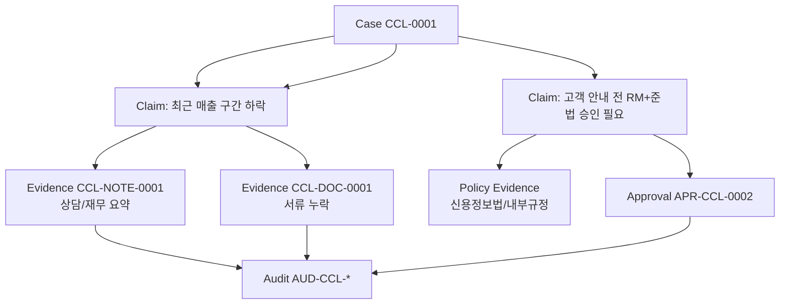
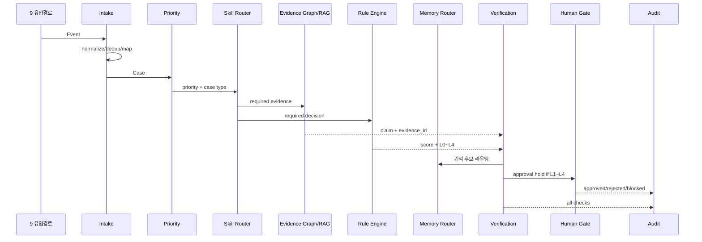

---
tags:
  - area/product
  - type/design
  - status/active
date: 2026-07-04
up: "[[_INDEX|CaseOps 분기]]"
aliases:
  - CaseOps Engine
  - CaseOps 7 알고리즘
  - 모델·알고리즘·데이터처리 로직 답변
---
# CaseOps Engine — 7 알고리즘

> **분기 상태**: [분기/미확정]. 이 문서는 잠근 정본을 바꾸지 않는 CaseOps 탐색 설계다. 팀 확정 전까지 정본 문서(`05_domain-model`, `07_architecture`, `08_feature-spec`, `data-strategy`)로 승격하지 않는다.
>
> **심사 답변 한 줄**: JB LocalGuard OS의 기술 코어는 파운데이션 모델 자체가 아니라, 은행 케이스를 **수집·정규화·우선순위화·에이전트/스킬 라우팅·근거 연결·모델 라우팅·검증**하는 `CaseOps Engine`이다.
>
> **현 구현 경계**: 현재 MVP/JB_project2는 `computeRiskDecision`, `buildDashboardData`, `auditChainRecords`, `moveCaseToColumn`, CCL 하네스 hook/repository로 일부 계약을 E4 수준으로 보여준다. 은행 DB 실연동, 독립 원시신호 점수화, RAG 인덱스, 모델 라우터, 메모리 서버는 [분기/미확정] 설계 또는 서버 승격 대상이다.

## 0. 근거등급

| 등급 | 이 문서에서의 의미 | 예시 |
|---|---|---|
| E5 | 법령·감독규정·정본 canon에서 직접 고정한 통제 | 신용정보법 §40조의2, PII 비반출 4중방어 |
| E4 | 현재 코드/데모에서 직접 확인 가능한 동작 | `_vendor/JB_project2/app/app.js`의 `computeRiskDecision`, `auditChainRecords` |
| E3 | 백본 SSOT 문서에서 정식화된 설계 | `_canon.md`, `07_architecture`, `05_domain-model`, `08_feature-spec` |
| E2 | 리서치 근거층 요약에서 확인한 외부 패턴 | D2, D9, D18, D21, D5a, D6, D7a/b, D17, D25 |
| E1 | 팀 설계 의도·분기 제안 | CaseOps 7 알고리즘 명명, `case_priority_v1` 등 |
| E0 | 아직 근거가 약한 아이디어 | 정량 성능 목표, 실제 은행 로그 기반 보정치 |

핵심 주장 목표선은 E2 이상, 실동작 주장은 E4만 사용한다.

## 1. CaseOps Engine 정의

`CaseOps Engine`은 콘솔 화면 뒤에서 은행 내외부 이벤트를 케이스로 만들고, 케이스를 역할별 큐와 에이전트 실행으로 변환하며, 모든 판단을 Evidence/Approval/Audit으로 닫는 데이터 처리 엔진이다.

```mermaid
flowchart LR
  E["은행/외부 이벤트<br/>9개 유입 경로"]
  I["① Case Intake<br/>dedup + mapping"]
  P["② Priority Scoring<br/>설명가능 가중식"]
  R["③ Auto Skill Routing<br/>Agent/Skill/Model/Evidence"]
  G["④ Evidence Graph/RAG<br/>claim -> evidence_id"]
  M["⑤ Memory Router<br/>계층·보존·권한"]
  L["⑥ Guarded Model Routing<br/>local/external/rule/specialized"]
  V["⑦ Verification<br/>policy·PII·audit·human gate"]
  H["Human Gate<br/>L0~L4"]
  A["Audit Ledger"]

  E --> I --> P --> R --> G --> M --> L --> V --> H --> A
  V -.fail closed.-> H
```



### 1.1 운영계약과의 위치

정본 운영계약은 `Case → AgentRun → Agent → Skill → Evidence → Approval → Audit`이다 [E3, `_canon.md` §8]. CaseOps Engine은 이 7단 계약 앞뒤에 붙는 처리층이다.

| 운영계약 | CaseOps Engine 책임 | 현 구현 근거 |
|---|---|---|
| Case | 이벤트를 케이스로 정규화, 중복 제거, 상태·역할 큐 배치 | CCL `createCorporateCreditCase`, seed `CCL-0001` [E4] |
| AgentRun | 라우팅된 에이전트 실행 기록, 실패 시 `needsReview` | CCL `recordCorporateCreditAgentRun` [E4] |
| Agent | Case type/role/risk에 맞는 agent 선택 | CCL 8종, canon 14종 로스터 [E4/E3] |
| Skill | 필요한 스킬 자동 장착 | CCL 6종, 메인 `skillRack` 25종 [E4/E3] |
| Evidence | 모든 claim에 근거 연결 | 현재 seed evidence/review note 부분구현, 서버 승격 필요 [E4/E1] |
| Approval | L0~L4 human gate | `approvalLevelMatrix`, CCL `approvals` [E4] |
| Audit | append-only/해시체인 기록 | `auditChainRecords` 해시체인, CCL append log [E4] |

### 1.2 왜 "모델"보다 "엔진"인가

금융형 에이전트 콘솔은 RAG, 규칙, 승인게이트, 추적을 분리해서 쌓아야 한다 [E2, D9]. RM은 긴 AI 답변보다 검증 가능한 근거 패키지를 신뢰한다 [E2, D18]. 따라서 JB LocalGuard OS의 알고리즘 가치는 "모델이 답했다"가 아니라 "은행 업무 이벤트가 설명 가능한 케이스 처리 절차로 변환된다"에 있다.

## 2. 알고리즘 ① Case Intake

### 2.1 정의

`Case Intake`는 은행 이벤트를 `Case`로 변환하는 `event-to-case` 알고리즘이다. 담당자가 수동으로 일을 입력하는 구조가 아니라, 은행/외부 시스템에서 들어온 신호가 케이스 후보가 되고, 중복 제거와 매핑을 거쳐 역할별 큐로 들어간다 [E1, 원문 CaseOps 분기].

### 2.2 유입 9경로

| # | 경로 | 이벤트 예시 | 주 케이스 타입 | 근거 |
|---|---|---|---|---|
| 1 | CRM/상담 | 영업점 상담, RM 메모, 고객 요청 | 소상공인 여신, 민원 | D18, D21 [E2] |
| 2 | 대출/여신 | 신규 신청, 사후관리, EOD 타이머 | 여신 검토, EWS | D2 [E2] |
| 3 | 거래/FDS | 이상거래, 신규 수취계좌, 콜백 위험 | 보이스피싱/AML | D7b, canon [E2/E3] |
| 4 | 전세/부동산 | 전세가율, 등기 미확인, 보증 상태 | 전세위험 | D7a, JB_project2 전세 하네스 [E2/E4] |
| 5 | 챗봇/콜센터 | 반복 문의, 긴급 키워드, 감정 신호 | 상담 긴급도, 고객이탈 | D18, D21 [E2] |
| 6 | 문서 업로드 | 재무제표, 등기부, 임대차계약서 | 서류 체크, Evidence | D9, D7a [E2] |
| 7 | 외부 공공데이터/뉴스 | 정책 시행일, 지역 상권 악화, 금리 | 정책/상권/위험신호 | D21, D7a [E2] |
| 8 | 담당자 수동 | 신규 케이스 등록, 현장 이슈 | 전체 | CCL 신규 접수 flow [E4] |
| 9 | 스케줄러 | 사후관리, EOD, 재확인, SLA 초과 | Follow-up, EWS | D2 [E2] |

### 2.3 입력

```json
{
  "event_id": "evt-crm-20260704-0001",
  "source_system": "crm",
  "source_type": "consult_log",
  "occurred_at": "2026-07-04T09:12:00+09:00",
  "subject_token": "BIZ-REF-0001",
  "affiliate_id": "jeonbuk-bank",
  "role_hint": "corporate-credit",
  "payload": {
    "summary": "최근 3개월 매출 구간 하락, 운전자금 문의",
    "loan_type": "smeWorking",
    "amount_band": "5천만~1억",
    "docs_status": "missing"
  },
  "pii_grade": "G4-zero-pii-derived",
  "evidence_pointer": "crm://consult/abc123"
}
```

### 2.4 출력

```json
{
  "case_id": "CCL-0001",
  "case_type": "sme_credit_review",
  "biz_ref_id": "BIZ-REF-0001",
  "role_key": "corporate-credit",
  "status": "aiReview",
  "dedup_group_id": "dedup:BIZ-REF-0001:smeWorking:2026-W27",
  "mapped_agents": ["ccl-intake", "ccl-financial", "ccl-repayment"],
  "required_evidence": ["consult_log", "financial_summary", "doc_check"],
  "review_required": true,
  "audit_event": "CASE_CREATED"
}
```

### 2.5 의사코드

```pseudo
function intakeEvent(event):
  assert event.event_id
  assert event.subject_token or event.anonymous_customer_ref

  normalized = normalizeSourceEvent(event)
  piiResult = classifyAndMask(normalized)
  if piiResult.containsRawRestricted:
    routeToLocalOnly(normalized)

  dedupKey = makeDedupKey(
    subject_token = normalized.subject_token,
    case_family = inferCaseFamily(normalized),
    time_bucket = week(normalized.occurred_at),
    evidence_pointer = normalized.evidence_pointer
  )

  existing = findOpenCaseByDedupKey(dedupKey)
  if existing:
    appendEvidence(existing.case_id, normalized.evidence_pointer)
    writeAudit("CASE_EVENT_MERGED", existing.case_id, event.event_id)
    return existing

  case = mapEventToCase(normalized)
  case.role_key = inferRoleQueue(case)
  case.status = initialStatus(case)
  case.required_evidence = requiredEvidence(case.case_type)
  saveCase(case)
  writeAudit("CASE_CREATED", case.id, event.event_id)
  return case
```

### 2.6 데이터 예시 — 9경로 병합

| 이벤트 | dedup 결과 | 케이스 반영 |
|---|---|---|
| CRM 상담 "운전자금 문의" | 신규 | `CCL-0001` 생성 |
| 서류 업로드 "부가세 증명 누락" | 동일 `subject_token + loan_type` | `CCL-DOC-0001` Evidence 추가 |
| 정책금융 공고 변경 | 별도 공공 이벤트 | `policy-candidates` Evidence 추가 |
| SLA 하루 전 스케줄러 | 동일 케이스 | Priority `SLA Delay` 상승 |

### 2.7 현 구현/신규

| 항목 | 현재 있음 | 신규/승격 필요 |
|---|---|---|
| 수동 케이스 생성 | CCL `createCorporateCreditCase` [E4] | 은행 이벤트 adapter 입력 [E1] |
| role scope 강제 | CCL `cclTable(table, roleKey)` scope 필수 [E4] | 계열사별 실제 SSO/권한 [E1] |
| 중복 제거 | seed/수동 플로우에는 없음 | `dedupKey`, merge policy [E1] |
| 9경로 intake | 설계 문장만 있음 | connector별 adapter [E1] |

## 3. 알고리즘 ② Priority Scoring

### 3.1 정의

`Priority Scoring`은 케이스를 어떤 순서로 처리할지 정하는 운영 우선순위 점수다. 승인 레벨 L0~L4와 다르다. L0~L4는 고객 행동·준법 승인 게이트이고, Priority는 큐 정렬과 SLA 대응을 위한 점수다.

설명가능 가중식:

```text
Priority =
  0.35 * Risk
  + 0.25 * Urgency
  + 0.15 * CustomerVulnerability
  + 0.15 * RegSensitivity
  + 0.10 * SLA Delay
```

각 입력은 0~100. 블랙박스 모델보다 설명 가능한 산식을 우선한다 [E1, 원문 CaseOps 분기]. 여신은 전결권·사후관리·EWS 같은 상태/트리거가 중요하다 [E2, D2].

### 3.2 입력

| 변수 | 정의 | 예시 산출 |
|---|---|---|
| `Risk` | 업무/금융 손실 위험. `computeRiskDecision.score` 또는 도메인 rule 점수 | CCL-0001 `88` |
| `Urgency` | 계약일·경공매·SLA·고객 영향 시급성 | 계약 D-7이면 90 |
| `CustomerVulnerability` | 고령자, 피해 가능성, 디지털 장벽, 소상공인 취약성 | 취약 자영업자/전세피해 의심 70 |
| `RegSensitivity` | 준법·PII·신용정보·소비자보호 민감도 | L3/L4 후보 80 |
| `SLADelay` | 목표 처리시간 대비 지연 정도 | SLA 70% 소진 70 |

### 3.3 출력

| 점수 | 큐 | 의미 |
|---|---|---|
| 0~39 | `normal_queue` | 일반 처리 |
| 40~59 | `watch_queue` | 관찰/재확인 |
| 60~79 | `priority_queue` | 우선 처리 |
| 80~100 | `urgent_queue` | 즉시 담당자/준법 알림 |

### 3.4 산출 예

히어로 `CCL-0001`(전주 카페 운전자금) 운영 우선순위 예시 [E1]:

| 변수 | 값 | 가중치 | 기여 |
|---|---:|---:|---:|
| Risk | 88 | 0.35 | 30.80 |
| Urgency | 75 | 0.25 | 18.75 |
| CustomerVulnerability | 65 | 0.15 | 9.75 |
| RegSensitivity | 80 | 0.15 | 12.00 |
| SLA Delay | 55 | 0.10 | 5.50 |
| **합계** |  |  | **76.80** |

출력:

```json
{
  "case_id": "CCL-0001",
  "priority_score": 76.8,
  "priority_queue": "priority_queue",
  "explanation": [
    { "factor": "Risk", "value": 88, "weight": 0.35, "contribution": 30.8 },
    { "factor": "RegSensitivity", "value": 80, "weight": 0.15, "contribution": 12.0 }
  ],
  "not_approval_level": "Priority is queue order; L0-L4 still comes from approval policy"
}
```

### 3.5 의사코드

```pseudo
function scorePriority(case):
  risk = clamp(case.risk_score or computeRiskDecision(case).score, 0, 100)
  urgency = urgencyFromDates(case.due_at, case.contract_end_at, case.auction_deadline)
  vulnerability = vulnerabilityFromSegment(case.segment, case.flags)
  reg = regulatorySensitivity(case.case_type, case.pii_grade, case.approval_level)
  sla = slaDelay(case.created_at, case.sla_target)

  terms = [
    ("Risk", risk, 0.35),
    ("Urgency", urgency, 0.25),
    ("CustomerVulnerability", vulnerability, 0.15),
    ("RegSensitivity", reg, 0.15),
    ("SLADelay", sla, 0.10)
  ]
  score = sum(value * weight for each term)
  return { score, queue: priorityQueue(score), terms }
```

### 3.6 현 구현/신규

`buildDashboardData()`는 고위험, 전세위험, 차단, 승인대기, Evidence 연결률, 지점별 평균 등을 집계한다 [E4]. 하지만 위 5요소 우선순위 점수는 아직 독립 함수로 구현되어 있지 않다 [E1].

## 4. 알고리즘 ③ Auto Skill Routing

### 4.1 정의

`Auto Skill Routing`은 `Case Type + Role + Risk + Permission`을 입력으로 받아 어떤 에이전트, 스킬, 모델, 근거 소스를 장착할지 결정하는 라우터다. 이 문서에서 가장 중요한 차별점이다 [E1, 원문 CaseOps 분기]. 팀 차별성 문서의 "담당자 설정 → 근거 상향 → 판단 직전 보조"와 직접 연결된다 [E3].

### 4.2 입력

```json
{
  "case_id": "CCL-0001",
  "case_type": "sme_credit_review",
  "role_key": "corporate-credit",
  "affiliate_id": "jeonbuk-bank",
  "risk_level": "high",
  "approval_level": "L3",
  "permission": {
    "can_read": ["ccl_cases", "ccl_review_notes", "ccl_doc_checks"],
    "can_write": ["ccl_agent_runs", "ccl_audit_logs", "approvals"],
    "pii_grades_allowed": ["internal", "confidential"],
    "external_llm_allowed": false
  },
  "configured_sources": ["policy-sema", "news-local", "jb-db-masked"]
}
```

### 4.3 출력

```json
{
  "agent_plan": [
    {
      "agent_id": "ccl-financial",
      "skills": ["financial-brief"],
      "model_route": "local_or_rule",
      "required_evidence_types": ["financial_summary", "consult_log"]
    },
    {
      "agent_id": "ccl-repayment",
      "skills": ["repayment-band-check"],
      "model_route": "rule_engine",
      "required_evidence_types": ["cashflow_band", "repayment_band"]
    },
    {
      "agent_id": "ccl-supervisor",
      "skills": ["approval-memo-draft"],
      "model_route": "human_gate",
      "required_evidence_types": ["approval_reason", "risk_signals"]
    }
  ],
  "blocked": [],
  "audit": "ROUTING_PLAN_CREATED"
}
```

### 4.4 라우팅 매트릭스

| Case Type | Role | Risk/Level | Agent | Skill | Model | Evidence |
|---|---|---|---|---|---|---|
| 소상공인 여신 | `corporate-credit` | L2~L3 | 상환위험 분류, 정책금융, RM 보좌 | `cashflow-stress`, `policy-match`, `notification-brief` | rule + local/external masked | 매출구간, 상담요약, 정책공고 |
| 전세 위험 | `jeonse-protection` | high/critical | 전세위험 리드, 전세가율, 등기, 보증 | `jeonse-price-ratio`, `registry-rights-scan` | `computeJeonseRiskAssessment` + local | RTMS, 등기 피처, HUG |
| 보이스피싱 | AML/FDS | L4 | 이상거래 탐지·차단, 준법 | `fraud-shield`, `do-not-contact-rule` | specialized FDS/rule | FDS 신호, 콜백/URL 플래그 |
| 고객 회신 | RM | L1~L3 | RM 보좌, 준법 | `notification-brief`, `compliance-guard` | masked external or local | 승인된 판단, 문안근거 |

### 4.5 의사코드

```pseudo
function routeSkills(case, actor):
  role = requireRoleScope(actor)
  permission = permissionFor(actor, case)
  caseType = classifyCaseType(case)
  risk = currentRisk(case)
  approvalLevel = approvalLevelFor(risk.score)

  candidateAgents = agentRegistry.filter(
    agent.supports(caseType)
      and agent.roleScope == role
      and agent.requiredPermission subsetOf permission
  )

  plan = []
  for agent in candidateAgents:
    skills = skillRegistry.filter(skill =>
      skill.agentIds contains agent.id
      and skill.riskAllowed(risk.level)
      and skill.piiGrade <= permission.maxPiiGrade
    )
    modelRoute = guardedModelRoute(case, skills, permission)
    evidenceNeed = evidenceRequirements(caseType, skills)
    plan.append({ agent, skills, modelRoute, evidenceNeed })

  if approvalLevel in ["L3", "L4"]:
    plan.append(complianceOrSupervisorPlan(case))

  writeAudit("ROUTING_PLAN_CREATED", case.id, plan)
  return plan
```

### 4.6 현 구현/신규

| 구성 | 현재 있음 | 신규/승격 필요 |
|---|---|---|
| CCL 에이전트/스킬 registry | `cclConsoleAgents` 8종, `cclConsoleSkills` 6종 [E4] | 전체 14종/25스킬과 CCL 8종 정합 [E1] |
| 권한 경계 | `allowedActions`, `blockedActions`, `dbReads`, `dbWrites` [E4] | 실제 IAM/SSO 권한 [E1] |
| 자동 장착 | handoff seed와 `recordCorporateCreditAgentRun` [E4] | Case Type+Permission 기반 완전 자동 라우터 [E1] |
| 담당자 설정 | 차별성 문서에서 신설 필요 [E3] | Config UI/스키마 [E1] |

## 5. 알고리즘 ④ Evidence Graph / Grounded RAG

### 5.1 정의

`Evidence Graph`는 모든 주장(`claim`)을 하나 이상의 `evidence_id`와 연결하는 근거 그래프다. RAG는 텍스트를 생성하는 기능이 아니라 Evidence를 수집·정규화하고, 에이전트의 claim이 그 Evidence로 지지되는지 검사하는 계층이다 [E2, D9/D18].



### 5.2 Claim 객체

```json
{
  "claim_id": "claim-CCL-0001-001",
  "case_id": "CCL-0001",
  "text": "최근 3개월 매출 구간 하락으로 상환 부담 확인이 필요하다.",
  "claim_type": "risk_signal",
  "evidence_ids": ["CCL-NOTE-0001", "CCL-CON-0001"],
  "confidence": 0.82,
  "counter_evidence_ids": [],
  "policy_rule_ids": ["policy:no-final-credit-decision"],
  "created_by": "ccl-repayment",
  "created_at": "2026-07-04T09:20:00+09:00"
}
```

### 5.3 Evidence Card JSON 스키마

```json
{
  "$schema": "https://json-schema.org/draft/2020-12/schema",
  "$id": "https://localguard.example/schemas/evidence-card.schema.json",
  "title": "EvidenceCard",
  "type": "object",
  "required": [
    "evidence_id",
    "case_id",
    "source_type",
    "source_uri",
    "summary",
    "linked_claim_ids",
    "access_level",
    "pii_level",
    "retention_policy",
    "created_at"
  ],
  "properties": {
    "evidence_id": { "type": "string", "examples": ["CCL-NOTE-0001"] },
    "case_id": { "type": "string", "examples": ["CCL-0001"] },
    "source_type": {
      "type": "string",
      "enum": ["bank_db", "consult_log", "document", "public_api", "policy", "manual", "model_output", "audit_event"]
    },
    "source_uri": {
      "type": "string",
      "description": "원문 위치 포인터. 원본 PII 자체를 담지 않는다."
    },
    "summary": { "type": "string" },
    "linked_claim_ids": { "type": "array", "items": { "type": "string" } },
    "counter_evidence_for": { "type": "array", "items": { "type": "string" } },
    "confidence": { "type": "number", "minimum": 0, "maximum": 1 },
    "freshness": { "type": "string", "examples": ["2026-07-04"] },
    "access_level": { "type": "string", "enum": ["public", "internal", "confidential", "restricted"] },
    "pii_level": { "type": "string", "enum": ["G0", "G1", "G2", "G3", "G4"] },
    "retention_policy": { "type": "string", "examples": ["credit-info-processing-log-3y"] },
    "hash": { "type": "string" },
    "created_by": { "type": "string" },
    "created_at": { "type": "string", "format": "date-time" }
  }
}
```

### 5.4 의사코드

```pseudo
function attachGroundedClaim(caseId, claimText, candidateEvidence):
  evidence = []
  for source in candidateEvidence:
    card = normalizeEvidence(source)
    if card.pii_level in ["G0", "G1"]:
      card.summary = maskOrSummarizeInsideBoundary(source)
    saveEvidence(card)
    evidence.append(card.evidence_id)

  if evidence.empty:
    return hold("EVID_MISSING")

  claim = {
    case_id: caseId,
    text: claimText,
    evidence_ids: evidence,
    confidence: estimateFaithfulness(claimText, evidence),
    counter_evidence_ids: findCounterEvidence(claimText, caseId)
  }
  saveClaim(claim)
  writeAudit("EVIDENCE_ATTACHED", caseId, claim.claim_id)
  return claim
```

### 5.5 현 구현/신규

현재 seed에는 `ccl_review_notes`, `ccl_doc_checks`, `ccl_consult_logs`, `ai_recommendations`가 Evidence 역할을 일부 수행한다 [E4]. 그러나 모든 claim에 `evidence_id`를 강제하는 그래프와 RAG 인덱스는 아직 설계 단계다 [E1]. `08_feature-spec`의 Evidence traceability 목표와 연결해 서버 승격 시 적용한다 [E3].

## 6. 알고리즘 ⑤ Memory Router

### 6.1 정의

`Memory Router`는 새 정보가 들어왔을 때 저장 가치, 민감도, 저장 계층, 보존기간, 접근권한, 감사기록을 결정한다. 상세 설계는 [[01-메모리-거버넌스]]로 연결한다.

원칙: 많이 기억하는 것이 아니라, **무엇을 어디에, 누가, 언제까지 기억하고 언제 지울지**를 결정하는 계층이다 [E1, 원문 CaseOps 분기]. 장기 메모리에 provenance/삭제·정정 구조가 없으면 프라이버시 리스크가 누적된다 [E2, D17/D25].

### 6.2 입력/출력

입력:

```json
{
  "case_id": "CCL-0001",
  "memory_candidate": {
    "text": "RM이 정책금융 후보 2건을 안내 후보로만 남기라고 수정함",
    "source": "approval_comment",
    "actor_id": "USR-CCL-SME-01",
    "pii_level": "G4",
    "event_type": "human_override"
  }
}
```

출력:

```json
{
  "write_decision": "write",
  "memory_layers": ["CaseMemory", "StaffMemory", "SkillMemory", "OrganizationMemory"],
  "retention": "short_or_policy_defined",
  "access_roles": ["corporate-credit", "supervisor"],
  "audit_event": "MEMORY_MUTATION_REQUESTED",
  "redactions": []
}
```

### 6.3 계층 라우팅

| 정보 유형 | 저장 계층 | 금지/주의 |
|---|---|---|
| 현재 케이스 상담·근거·판단·상태 | Case Memory | 케이스 종료 후 보존/파기 규칙 필요 |
| 고객 반복상담·과거 위험신호 | Customer Memory | 원본 PII 대신 Zero-PII/토큰 |
| 담당자 승인/반려 패턴 | Staff Memory | Customer Memory와 분리, 편향 전이 금지 |
| 역할별 판단패턴 | Role Memory | 직군 표준화용, 개인화와 분리 |
| 에이전트 성공/실패·환각 | Agent Memory | eval/incident와 연결 |
| 스킬 성공/실패 조건 | Skill Memory | skill version과 연결 |
| 조직 암묵지·우수사례 | Organization Memory | 내부 접근권한 |
| 장애·오판·PII 사고 | Incident Memory | 119 Incident와 연결 |

### 6.4 의사코드

```pseudo
function routeMemory(candidate):
  value = assessStorageValue(candidate)
  pii = classifyPII(candidate)
  if value == "none":
    writeAudit("MEMORY_DISCARDED", candidate.case_id)
    return { decision: "discard" }

  layers = []
  if candidate.case_id: layers.append("CaseMemory")
  if candidate.event_type == "human_override": layers.extend(["StaffMemory", "SkillMemory"])
  if candidate.event_type == "incident": layers.append("IncidentMemory")
  if candidate.source == "policy_change": layers.append("OrganizationMemory")

  if "CustomerMemory" in layers and "StaffMemory" in layers:
    splitCandidateToAvoidBiasLeak(candidate)

  retention = retentionPolicy(pii, layers)
  access = accessPolicy(layers, candidate.role_key)
  writeMemory(candidate, layers, retention, access)
  writeAudit("MEMORY_WRITTEN", candidate.case_id, layers)
  return { decision: "write", layers, retention, access }
```

### 6.5 현 구현/신규

CCL은 `ccl_cases`, `ccl_agent_runs`, `ccl_review_notes`, `approvals`, `ccl_audit_logs`로 메모리 유형을 사실상 분리한다 [E4, `05_domain-model`]. 그러나 계층형 Memory Router, 보존/삭제/정정 인터페이스, Customer↔Staff 분리 정책은 [분기/미확정] 설계다 [E1].

## 7. 알고리즘 ⑥ Guarded Model Routing

### 7.1 정의

`Guarded Model Routing`은 모델 품질보다 데이터 등급과 업무결정 성격을 먼저 본다. 원본 PII·개인신용정보는 외부 LLM으로 나가지 않고, 비식별 초안은 외부 모델을 쓸 수 있으며, 정책/승인/차단은 rule engine 또는 specialized model이 맡는다 [E5/E2, canon §4, D5a/D25].

### 7.2 라우팅 규칙

```pseudo
function modelRoute(task):
  if task.payload.containsRawPII or task.pii_level in ["G0", "restricted"]:
    return "local_model_or_onprem_only"

  if task.kind in ["policy_check", "approval_level", "forbidden_assertion"]:
    return "rule_engine"

  if task.case_type in ["fraud", "aml", "fds"]:
    return "specialized_fraud_model_or_fds_rule"

  if task.kind in ["draft", "summary", "explanation"] and task.masked == true:
    return "external_llm_allowed_with_dlp_and_audit"

  return "local_or_rule_default"
```

요청 조건의 축약형:

```text
if PII -> local
elif masked draft -> external
elif policy -> rule
elif fraud -> specialized
```

### 7.3 모델 경로 표

| 경로 | 허용 데이터 | 용도 | 예시 | 근거 |
|---|---|---|---|---|
| Local/on-prem | G0/G1, `restricted`, 내부 상담/신용정보 | 요약, 분류, PII 포함 문서 처리 | `llmClient.js` Ollama opt-in fallback | E4/E2 |
| External LLM | G3/G4, masked draft | 고객 회신 초안, 일반 설명, 문장 개선 | Claude/OpenAI 등 비식별 컨텍스트 | E2, D5a/D25 |
| Rule Engine | 파생 피처, 정책 변수 | L0~L4, 금지표현, 승인 조건 | `computeRiskDecision`, `approvalLevelMatrix` | E4 |
| Specialized Model | FDS/AML, 신용/여신 feature | 이상거래, 여신 사전리스크 | 내부 FDS, LightGBM/XGBoost 후보 | E2/E1 |

### 7.4 데이터 예시

```json
{
  "task": "customer_reply_draft",
  "case_id": "CCL-0001",
  "payload_before_masking": {
    "customer_name": "[restricted]",
    "summary": "운전자금 문의, 매출 구간 하락"
  },
  "payload_after_masking": {
    "subject_token": "BIZ-REF-0001",
    "risk_code": "SME_CASHFLOW_STRESS",
    "amount_band": "5천만~1억",
    "evidence_ids": ["CCL-NOTE-0001", "CCL-DOC-0001"]
  },
  "route": "external_llm_allowed_with_dlp_and_audit",
  "approval_required": "L3"
}
```

### 7.5 현 구현/신규

`llmClient.js`는 `?live=1` opt-in, Ollama/Anthropic 호출, 20초 timeout, 실패 시 mock fallback, guardrail 위반 시 mock 유지 구조를 갖는다 [E4]. CCL/전세 하네스의 hooks는 PII·단정표현·자동종결·승인누락을 검사한다 [E4]. 다만 중앙 모델 라우터, egress DLP proxy, 외부 LLM 계약·리전·로그 보존 정책은 [분기/미확정]이다 [E1/E2, D25].

## 8. 알고리즘 ⑦ Verification

### 8.1 정의

`Verification`은 AgentRun 결과가 고객 행동이나 승인 큐로 넘어가기 전, claim/evidence/policy/PII/audit/human gate를 검사하는 마지막 계층이다. 금융 업무는 "틀리면 고친다"가 아니라, 불확실하면 보류하고 사람 승인으로 닫아야 한다 [E2, D18/D9].

### 8.2 검증 항목

| 검증 | 실패 시 | 근거 |
|---|---|---|
| Evidence coverage | `EVID_MISSING`, 보류/재검색 | D18 [E2] |
| Counter-evidence | 반대근거 표시, confidence 하향 | D18 [E2] |
| Policy/rule | 승인 레벨 상향 또는 차단 | D9 [E2] |
| PII/DLP | 외부 전송 hard fail, Audit | D5a/D25 [E5/E2] |
| Human gate | L1~L4 미승인 고객 행동 차단 | canon §8 [E3] |
| Audit completeness | 전이 무효 또는 재기록 | `auditChainRecords` [E4] |
| Model confidence | 낮음이면 `needsReview` | D18 [E2] |
| High/critical auto-close | 자동종결 차단 | CCL/전세 hooks [E4] |

### 8.3 의사코드

```pseudo
function verifyAgentOutput(case, output):
  checks = []

  checks.append(requireEvidenceForEveryClaim(output.claims))
  checks.append(scanCounterEvidence(output.claims, case.evidence_graph))
  checks.append(policyCheck(output.actionDraft, case.approvalLevel))
  checks.append(piiDlpScan(output.externalPayload))
  checks.append(auditContinuityCheck(case.audit_chain))

  if case.approvalLevel in ["L1", "L2", "L3", "L4"]:
    checks.append(requireHumanApproval(output.actionDraft))

  if case.approvalLevel in ["L3", "L4"]:
    checks.append(requireComplianceRoute(case))

  if any(check.status == "fail" for check in checks):
    writeAudit("VERIFICATION_FAILED", case.id, failedChecks(checks))
    return holdOrEscalate(case, checks)

  writeAudit("VERIFICATION_PASSED", case.id, checks)
  return { ok: true, checks }
```

### 8.4 L0~L4 승인과 Verification

| 레벨 | Verification 강도 | 실행 가능 여부 |
|---|---|---|
| L0 | 내부 기록·Evidence 필수 | 고객 행동 없음 |
| L1 | RM 검토, 기본 DLP | RM 승인 후 가능 |
| L2 | RM 편집/사유 선택, Evidence 링크 | RM 승인 후 가능 |
| L3 | RM+준법, 원문확인/규정근거 | 공동 승인 전 불가 |
| L4 | 차단·상위검토·119 후보 | 사람 결정 전 차단 |

준법 L3~L4는 사용자 제약에 따라 반드시 준법/상위검토 레인으로 둔다. FDS의 실시간 선차단은 예외적으로 사람 승인 전 차단이 가능하지만, 외부 접촉/해제는 사람 승인 뒤로 둔다 [E2/E3].

### 8.5 현 구현/신규

| 검증 | 현재 있음 | 신규/승격 필요 |
|---|---|---|
| PII 패턴 검사 | `harnessGuardCheckPII` [E4] | egress proxy 전수 적용 [E1] |
| 단정 표현 차단 | CCL/JPO forbidden assertions [E4] | 전체 도메인 공통 policy registry [E1] |
| 자동종결 차단 | `harnessGuardCheckAutoClose` [E4] | `moveCaseToColumn`과 원자적 연결 [E1] |
| 승인 결정자 사람 검사 | CCL/JPO `decidedBy startsWith USR-` [E4] | 실제 IAM actor 검증 [E1] |
| Audit hash chain | `auditChainRecords` [E4] | CCL append log와 SHA-256 통합 [E1] |
| 모든 claim evidence_id | 부분 seed | 강제 스키마/테스트 [E1] |

## 9. JB_project2 실제 함수계약 매핑

### 9.1 `computeRiskDecision(item)` → Rule/Explanation Engine

| 항목 | 내용 |
|---|---|
| 위치 | `_vendor/JB_project2/app/app.js`, `02_제품/app/app.js` |
| 입력 | `item.riskScore`, `item.pains`, `item.rootCauses`, `item.gates`, `item.evidenceIds`, 전세 입력 일부 |
| 출력 | `{ score, level, route, matrixReason, actionType, signals[] }` |
| 현재 성격 | `riskScore` 시드값을 actionType별 가중 신호로 재분배하는 **설명 가능성 함수** [E4] |
| 연결 알고리즘 | ② Priority Risk 입력, ③ Skill Routing 승인레벨, ⑥ Rule route, ⑦ Verification |
| 신규 필요 | 원시 신호 입력에서 점수를 독립 산출하는 rule engine v2 [E1] |

주의: 현재 `computeRiskDecision`은 원시 매출/상환/전세 피처에서 risk score를 새로 계산하지 않는다. `baseScore = item.riskScore` 후 `round(baseScore * weight)`로 signals를 만든다 [E4, `04_tech/data-model`]. 발표에서는 "현 MVP는 설명 가능 분해, 본선 승격은 독립 규칙엔진"으로 말해야 한다.

### 9.2 `buildDashboardData()` → 운영 집계/큐 뷰

| 항목 | 내용 |
|---|---|
| 입력 | `visibleCases()`, `agents`, 케이스 상태/score/evidence |
| 출력 | `highRisk`, `jeonseRisk`, `blocked`, `pending`, `evidenceRate`, `regions`, `roi` 등 |
| 현재 성격 | 콘솔 우선순위·현황 카운트/집계 [E4] |
| 연결 알고리즘 | ② Priority Scoring의 대시보드 후보, ⑦ Verification KPI |
| 신규 필요 | 5요소 Priority 점수, SLA sorting, role queue API [E1] |

### 9.3 `auditChainRecords(item)` → 감사 원장

| 항목 | 내용 |
|---|---|
| 입력 | `item.audit[]`, `item.evidenceIds[]` |
| 출력 | `{ seq, time, actor, action, target, evidenceId, previousHash, hash }[]` |
| 현재 성격 | GENESIS부터 `previousHash`로 연결하는 FNV-1a 32bit 해시체인 [E4] |
| 연결 알고리즘 | ④ Evidence Graph, ⑦ Verification, 심사 신뢰 장치 |
| 신규 필요 | CCL append log와 통합, SHA-256/서명, entity partition [E1] |

### 9.4 `moveCaseToColumn(caseId, column)` → Case FSM

| 항목 | 내용 |
|---|---|
| 입력 | `caseId`, board column |
| 출력 | status/stage 전이, 필요 시 `startAgentRun`, audit append |
| 현재 성격 | 보드 드래그/상태 이동과 AgentRun 트리거 [E4] |
| 연결 알고리즘 | ① Case Intake 후 상태 전이, ③ Routing 시작, ⑦ Verification 실패 시 보류 |
| 신규 필요 | 금지전이/approval/audit 원자성 강화, L0~L4 큐와 정합 [E1] |

### 9.5 CCL 하네스 함수와의 보강 매핑

| CCL 함수/구조 | 의미 | CaseOps 연결 |
|---|---|---|
| `cclTable(table, roleKey)` | role scope 없는 조회 예외 | ① Intake scope, ③ Permission, ⑦ Verification |
| `createCorporateCreditCase(form)` | 수동 접수→case/approval/audit/run 생성 | ① Case Intake 현 구현 |
| `recordCorporateCreditAgentRun(run)` | AgentRun, handoff, audit 기록 | ③ Routing, ⑦ Verification |
| `cclWriteAudit(row)` | append-only CCL audit | ④/⑦ Audit |
| `cclConsoleHooks` | PII, 단정, 자동종결, 승인자 검사 | ⑥/⑦ Guarded routing/Verification |

### 9.6 전세 함수

| 함수 | 의미 | CaseOps 연결 |
|---|---|---|
| `computeJeonseRiskAssessment(input)` | 전세가율, 공시가 추정, 주변 중앙값, 표본 부족, 등기/보증 미확인, 경공매 일정으로 `signals`, `riskLevel`, `confidence`, `requiresHumanReview` 산출 | ② Risk 입력, ③ 전세 agent routing, ⑥ specialized/rule path |

## 10. 데이터 처리 로직 한 장 요약



## 11. 심사 답변 스크립트

### 질문: "모델이 뭔가요?"

> 저희는 파운데이션 모델을 새로 학습한 팀이 아니라, 금융기관에서 실제로 필요한 **CaseOps Engine**을 설계했습니다. 모델은 4종으로 라우팅합니다. 원본 PII·개인신용정보는 로컬/on-prem 모델, 비식별 초안은 외부 LLM, 승인·차단·정책 판단은 rule engine, FDS/여신 위험은 특화 모델로 보냅니다. 이 라우팅 자체가 금융권 도입의 핵심입니다. [E5/E2/E4]

### 질문: "알고리즘이 있나요?"

> 있습니다. 7개입니다. ①9경로 Case Intake ②설명가능 Priority Scoring ③Case Type+Role+Risk+Permission 기반 Auto Skill Routing ④모든 claim에 `evidence_id`를 붙이는 Evidence Graph ⑤계층형 Memory Router ⑥PII/정책/FDS에 따른 Guarded Model Routing ⑦Evidence·PII·정책·Audit을 검사하는 Verification입니다. 현재 MVP에서는 `computeRiskDecision`, `buildDashboardData`, `auditChainRecords`, `moveCaseToColumn`이 그 중 일부를 작동 함수계약으로 보여줍니다. [E4/E1]

### 질문: "데이터 처리 로직은 어디까지 구현됐나요?"

> 브라우저 MVP/JB_project2 기준으로는 정적 데이터와 `localStorage`에서 운영계약을 재현합니다. `computeRiskDecision`은 현재 riskScore를 설명 가능한 신호로 분해하고 L0~L4를 라우팅합니다. `buildDashboardData`는 고위험·승인대기·근거연결률을 집계합니다. `auditChainRecords`는 GENESIS 해시체인을 만들고, `moveCaseToColumn`은 상태 전이와 AgentRun을 연결합니다. 은행 DB read-only CDC, RAG 인덱스, 중앙 모델 라우터는 서버 승격 대상입니다. [E4/E1]

### 질문: "그럼 정확도는 어떻게 증명하나요?"

> 본선 MVP에서는 범용 정확도 99% 같은 주장을 하지 않습니다. 케이스 N건 평가셋에서 `근거 연결률`, `승인 전 고객행동 차단`, `PII 반출 차단`, `Audit 무결성`, `L3/L4 준법 라우팅`이 재현되는지를 봅니다. 금융 업무에서는 모델 단독 정확도보다, 틀릴 때 보류·승인·감사로 닫히는 구조가 더 중요합니다. [E2, D18/D9]

### 질문: "Paperclip 같은 AgentOps와 뭐가 다른가요?"

> Paperclip형 control plane에서 배울 수 있는 건 agent orchestration, approval, activity log입니다. 저희 차이는 기본 단위가 task가 아니라 **은행 Case**이고, 판단 근거가 은행 DB·공공데이터·규정·상담 이력이며, PII 비반출·L0~L4 사람 승인·감사원장·119 대응까지 금융 통제로 묶인다는 점입니다. [E1/E3]

## 12. 약한 근거와 [미검증]

| 항목 | 상태 | 처리 |
|---|---|---|
| Priority 5요소 가중치 | [분기/미확정] E1 | 심사용 설명가능식. 실로그 보정 전까지 성능 주장 금지 |
| 9경로 은행 이벤트 실유입 | [미검증] E1 | MVP는 mock/수동. Pilot에서 read-only adapter |
| 모든 claim `evidence_id` 강제 | [미검증] E1 | seed Evidence는 있으나 graph schema 미구현 |
| Memory Router 서버 | [미검증] E1 | [[01-메모리-거버넌스]]로 분리 |
| Guarded Model Router 중앙화 | [미검증] E1 | `llmClient.js` fallback/hook은 있음, egress proxy 없음 |
| CCL audit와 해시체인 통합 | [미검증] E1 | 04_tech 해시체인과 CCL append log 통합 필요 |
| L4 실 승인 주체 | [미검증] E1 | `준법/상위검토` 정본 확정 필요 |

## 연결

[[_INDEX|CaseOps 분기]] · [[01-메모리-거버넌스]] · [[03-119-사고대응-에이전트]] · [[04-은행DB연결-특화모델]] · [[05-9파이프라인-아키텍처-저장소]] · [[08_본선/03_제품/07_architecture|아키텍처]] · [[08_본선/03_제품/05_domain-model|도메인 모델]] · [[08_본선/03_제품/08_feature-spec|Feature Spec]] · [[08_본선/03_제품/00_vision/data-strategy|Data Strategy]] · [[08_본선/03_제품/02_agent-design/orchestrator|오케스트레이터]] · [[08_본선/03_제품/02_agent-design/skill-spec|스킬 명세]]
