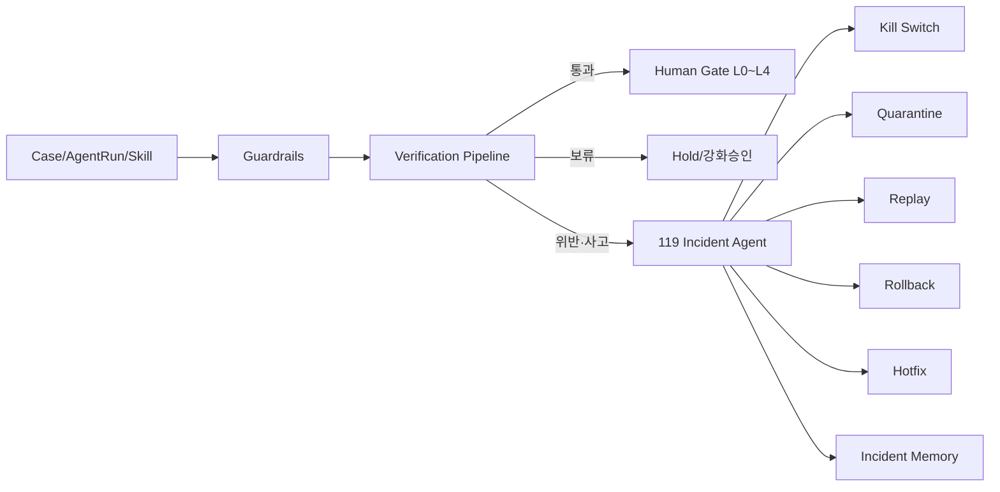
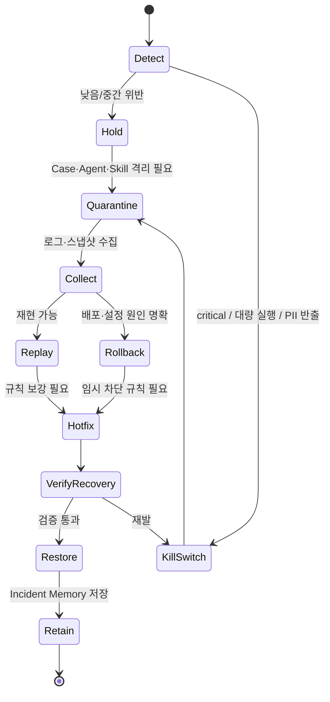
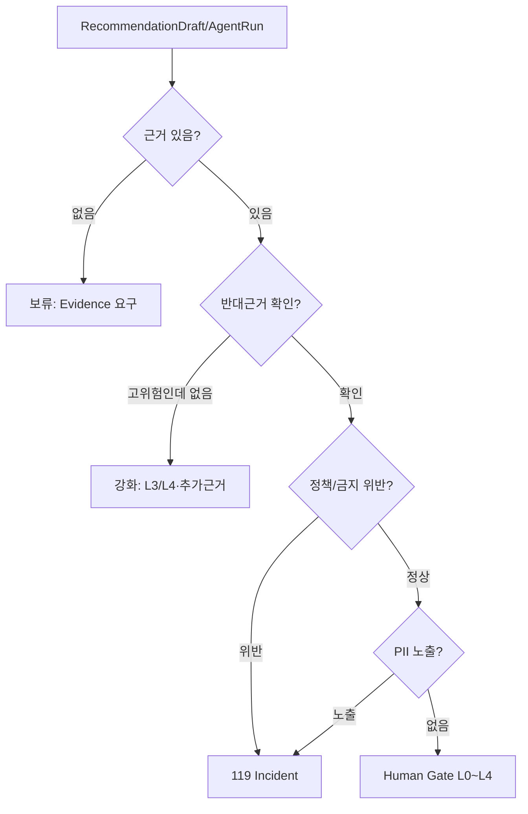

---
tags:
  - area/product
  - type/design
  - status/active
date: 2026-07-04
up: "[[_INDEX|CaseOps 분기]]"
aliases:
  - 119 Incident Agent
  - 사고대응 에이전트
  - Kill Switch
---

# 03 — 119 사고대응 에이전트

> **상태**: CaseOps 분기 설계안. 현재 `_vendor/JB_project2/app`에는 PII·scope·자동종결·승인누락을 막는 hook/guard가 있으나, `119 Incident Agent` 엔티티·저장소·UI는 아직 없다. 본 문서의 119 오케스트레이션은 [분기/미확정]이다.
> **정합 제약**: 히어로는 `CCL-0001`, 승인 레벨은 L0~L4, 준법 관여는 L3~L4, 원본 PII 외부 비반출, 고객 대상 행동은 사람 승인 전 자동 실행 금지, 현 구현은 vanilla JS 무빌드 하네스다.
> **핵심 주장**: 승인 게이트와 감사원장은 필요조건이지 충분조건이 아니다. 실제 차이는 **Kill Switch + Rollback + Replay + Quarantine + Hotfix**를 사고 시나리오별로 연결하느냐에서 난다. D15 [E2]

## 위치

119 Incident Agent는 일반 업무 에이전트가 아니다. `CaseOps Engine`의 마지막 방어선이며, 규칙·검증·승인 게이트가 위험을 감지했을 때 **실행을 멈추고, 범위를 격리하고, 원인을 재현하고, 임시복구를 걸고, 재발방지 기억으로 남기는 운영자 에이전트**다.



현재 코드에서 확인되는 선행 방어선은 다음이다.

| 방어선 | 현재 구현 | 한계 |
|---|---|---|
| PII 패턴 차단 | `harnessGuardCheckPII()` [E4] | 사고 티켓·영향범위 집계는 없음 |
| scope 강제 | `cclTable(table, roleKey)` scope 필수 [E4] | cross-scope 시도 누적 분석 없음 |
| 자동종결 차단 | `harnessGuardCheckAutoClose()` [E4] | kill switch 연동 없음 |
| 단정 표현 차단 | `CCL_FORBIDDEN_ASSERTIONS` [E4] | 반복 위반 시 hotfix 승격 없음 |
| 승인 주체 검사 | `afterApprovalDecision`에서 `USR-*` 확인 [E4] | rubber-stamping 탐지는 없음 |

## 119 상태 기계



## 1. Kill Switch

| 항목 | 정의 |
|---|---|
| 정의 | 고객 대상 발송, 외부 LLM/API, batch, queue, 자동 AgentRun, 특정 Skill 실행을 즉시 정지하는 실제 실행 차단 장치 |
| 트리거 | 원본 PII 외부 전송 시도, high/critical 자동종결 반복, 승인 없는 고객 발송 시도, 대량 AgentRun 폭주, FDS/여신 오차단 급증, 외부 API 장애로 잘못된 fallback 반복 |
| 승인 | 시스템 자동 발동 가능. 해제는 준법/운영 책임자 승인 필요 [분기/미확정] |
| 현재 구현 | UI 버튼형 kill switch 없음. guard hook은 차단·안전강등만 수행 [E4] |
| 근거 | D15는 kill switch가 UI 버튼이 아니라 채널·배치·API·큐까지 끊어야 한다고 지적 [E2] |

```pseudo
function maybeKillSwitch(signal):
  if signal.type in ["PII_EGRESS", "RUNAWAY_AUTOMATION"]:
      disable("customer_message.send")
      disable("external_llm.call")
      disable("agent_run.auto_queue")
      pauseQueues(scope=signal.roleKey)
      createIncident(severity="critical", trigger=signal.type)
      writeAudit("kill_switch.activated", affected=signal.affectedIds)
      notify(["orchestrator", "compliance", "builder"])
      return ACTIVATED
  return NOT_TRIGGERED
```

## 2. Rollback

| 항목 | 정의 |
|---|---|
| 정의 | 최근 변경된 스킬 본문, prompt template, model route, rule version, connector config, seed data를 이전 안전 버전으로 되돌리는 절차 |
| 트리거 | 특정 배포·스킬 수정 직후 품질저하, 단정표현 증가, 승인 누락, scope 위반 증가 |
| 범위 | 코드 git rollback이 아니라 운영 config/data rollback. 현 태스크에서는 코드 구현 금지 |
| 현재 구현 | `skillContent`는 localStorage 편집 저장 가능하지만 버전 rollback은 없음 [E4] |
| 근거 | D15의 immutable evidence·변경 히스토리 요구 [E2] |

```pseudo
function rollbackIncident(incident):
  snapshot = findLastKnownGood(
    skillId=incident.skillId,
    agentId=incident.agentId,
    route=incident.modelRoute
  )
  if snapshot == null:
      quarantine(incident.affectedScope)
      requireHumanHotfix()
      return "no_snapshot"
  restoreConfig(snapshot)
  markPendingOutputs("void_until_replay", incident.affectedIds)
  writeAudit("rollback.applied", snapshotId=snapshot.id)
  return "rolled_back"
```

## 3. Replay

| 항목 | 정의 |
|---|---|
| 정의 | 사고 당시의 입력 스냅샷, Evidence, model route, prompt/context hash, rule version을 사용해 판단을 재현하는 절차 |
| 트리거 | hallucination, 잘못된 데이터 접근, 근거 누락, 고위험 누락, 고객 불만·이의제기, 감독 질의 |
| 원칙 | Replay는 고객 행동을 다시 실행하지 않는다. 내부 재현·검증만 수행 |
| 현재 구현 | `ccl_agent_runs`와 `ccl_audit_logs`는 있으나 prompt/model/context snapshot은 없음 |
| 근거 | D11 provenance, D14 결정 패키지, D15 chain-of-custody [E2] |

```pseudo
function replayDecision(caseId, runId):
  run = loadAgentRun(runId)
  evidence = loadEvidence(run.evidenceIds)
  policy = loadPolicyVersion(run.policyVersion)
  model = loadModelRoute(run.modelRoute)
  if missing([run.inputSnapshot, evidence, policy]):
      holdCase(caseId, reason="replay_material_missing")
      return "hold"
  result = executeDryRun(run.inputSnapshot, evidence, policy, model, sideEffects=false)
  compare(result, run.outputSnapshot)
  writeAudit("replay.completed", diff=result.diff)
  return result
```

## 4. Quarantine

| 항목 | 정의 |
|---|---|
| 정의 | 사고 영향 범위의 Case, Customer token, Staff action, Agent, Skill, Evidence, connector를 읽기전용·발송금지·승인보류 상태로 격리 |
| 트리거 | PII 유출 의심, cross-scope 조회, 잘못된 근거 연결, 대량 오차단, agent hallucination 반복 |
| 격리 단위 | `caseId`, `subjectRef`, `actorId`, `agentId`, `skillId`, `roleKey`, `connectorId` |
| 현재 구현 | high/critical 자동종결은 `needsReview`로 안전 강등되지만 quarantine table은 없음 [E4/E0] |
| 근거 | D15 false block 복구·최소범위 차단, D17 레인 분리 [E2] |

```pseudo
function quarantine(scope, reason):
  affected = resolveAffectedObjects(scope)
  for object in affected:
      setFlag(object, "quarantined", true)
      disableSideEffects(object)
  createApprovalHold(affected, level="L4", approver="준법/상위검토")
  writeAudit("quarantine.applied", reason=reason, count=len(affected))
  return affected
```

## 5. Hotfix

| 항목 | 정의 |
|---|---|
| 정의 | 사고 재발을 막기 위한 임시 규칙·blockedActions·PII 패턴·prompt guard·model route 변경 |
| 트리거 | 동일 위반 2회 이상, 사고 원인이 규칙 누락으로 확인, 외부 API 장애, 특정 모델 품질저하 |
| 제한 | Hotfix는 임시 통제다. 정식 배포 전 replay/eval/준법 승인 필요 [분기/미확정] |
| 현재 구현 | `CCL_FORBIDDEN_ASSERTIONS`, `CCL_COMMON_BLOCKED_ACTIONS`는 있으나 런타임 hotfix registry는 없음 |
| 근거 | D15의 kill switch·fallback mode, D14의 룰+모델 혼합 [E2] |

```pseudo
function applyHotfix(incident):
  patch = proposePatch(incident.rootCause)
  if patch.affectsCustomerFacing or patch.level in ["L3", "L4"]:
      requireApproval("준법")
  installTemporaryRule(patch)
  tagRule(patch.id, expiresAt=now()+duration("72h"))
  replayAffectedCases(incident.affectedIds)
  writeAudit("hotfix.installed", patchId=patch.id)
  return patch
```

## 사고유형별 행동표

| 사고유형 | 탐지 신호 | 즉시 행동 | 복구·재발방지 | Owner | 근거 |
|---|---|---|---|---|---|
| 환각 | Evidence 없는 주장, faithfulness 낮음, 단정 표현 | 해당 RecommendationDraft 보류, Case `needsReview`, AgentRun replay | prompt/rule hotfix, 근거 없는 claim 생성 차단 | 판단QA + 준법 | D8·D14 [E2] |
| 잘못된 데이터접근 | scope 불일치, 타 역할 seed 노출, 권한 없는 connector 호출 | Quarantine + DataAccessLog 기록 + 승인 보류 | RBAC/RLS 규칙 보강, affected Case replay | 데이터 스튜어드 | `cclTable` scope [E4], D17 [E2] |
| PII 외부전달 | `restricted` payload, 주민/전화/계좌 패턴, DLP hit | Kill Switch: external LLM/API 중지, Incident critical, 회수·파기 절차 | 토큰화/마스킹 hotfix, 반출 프록시 로그 묶음 보존 | 준법 + 보안 | canon §4 [E3], D25 [E2] |
| 과잉자동화 | high/critical 자동 completed/closed, 대량 AgentRun | Kill Switch + affected scope quarantine | 자동 큐 rate limit, 승인 전 side effect 전면 차단 | 운영 조율 + 빌더 | D15 [E2], hook [E4] |
| 고위험누락 | L3/L4 대상이 L0~L2로 라우팅, fraud 보호 보류 실패 | Case L4 보류, 준법/상위검토 재상정 | 라우팅 룰 replay, threshold hotfix | 운영 조율 + 준법 | `_canon` L0~L4 [E3] |
| 습관적승인 | 초단기 승인, 사유코드 공란, 동일 사유 반복 | 승인 완료 보류 또는 재큐잉 [분기/미확정] | 이유코드·자유서술 강제, Staff Memory 지표화 | 준법 + 감독자 | D15 [E2] |
| 품질저하 | 재작업률 상승, faithfulness 하락, 반려율 급증 | 해당 Agent/Skill 격리, fallback mode | 모델/스킬 rollback, 품질 eval 재통과 전 복귀 금지 | 판단QA + 빌더 | D8·D14 [E2] |
| API장애 | 외부 LLM/API timeout, 공공데이터 stale, connector error | 외부 호출 중지, 사전 snapshot/fallback 사용, 최신성 경고 | connector 상태 점검, replay 후 결과 갱신 | 빌더 + 데이터 엔지니어 | D14 freshness [E2] |

## 무기 / 방패 프레임

| 무기(Weapon) | 쓰임 | 실패 가능성 | 방패(Shield) | 119 연동 |
|---|---|---|---|---|
| 외부 LLM | 설명 초안, 비식별 요약, 추가 확인 질문 | PII 반출, hallucination | PII masking, egress scan, claim limiter | PII hit → Kill Switch |
| 내부/온프레 모델 | 원본·민감 데이터 처리 | 품질저하, 모델 drift | 모델 로그, replay, human gate | drift → Quarantine/Hotfix |
| RAG/Evidence Graph | 근거 검색·claim 연결 | 근거 누락, 오래된 근거 | Evidence required, counter-evidence search | faithfulness fail → Hold |
| 은행 DB read-only | Case·상담·여신 맥락 | 잘못된 scope, 과잉 조회 | RBAC, roleKey, DataAccessLog | scope violation → Quarantine |
| 공공데이터/API | 정책·시세·법령 확인 | stale, API 장애, 라이선스 제한 | freshness label, fallback snapshot | stale critical → Hold |
| OCR/문서추출 | 서류 체크 | 원문 PII 포함, 오인식 | restricted scan, 사람이 원문확인 | PII hit → 119 |
| 보고서·품의 초안 | RM 업무 보조 | 확정 표현, 근거 없는 주장 | Human Gate L1~L4, forbidden assertions | 반복 위반 → Hotfix |
| 상담요약 | 반복 설명 감소 | 민감 원문 저장 | Zero-PII summary, retention policy | 원문 포함 → Quarantine |
| 전세위험/FDS 특화 모델 | 위험 신호 조기감지 | 오탐·미탐, false block | 룰+모델 혼합, 이의제기·재산정 | 오차단 급증 → Kill Switch |
| Audit Ledger | 책임 추적 | 무결성·동일성 부족 | append-only, hash/signature, forensic export | chain fail → Incident |

## Verification 파이프라인

Verification은 "좋은 답인지"만 보는 단계가 아니다. 고객 행동으로 넘어가기 전에 **보류(Hold), 강화(Harden), 119 승격**을 결정한다.



| 검사 | 조건 | 결과 | 119 승격 기준 |
|---|---|---|---|
| 근거누락 | `evidenceIds` 비어 있음, sourceTag 없음 | 보류, 승인 큐 미상정 | 반복 또는 고객영향 초안이면 Incident 후보 |
| 반대근거 누락 | L3/L4인데 counter-evidence search 없음 | 강화: RM+준법 공동 확인 | 고위험 누락으로 고객 피해 가능 시 |
| 정책위반 | 대출승인/금리/신용등급 확정, 지원 가능 확정, 법률 단정 | 차단, Hotfix 후보 | 금지표현 반복·이미 노출 시 |
| PII노출 | 주민/전화/계좌/원문 상담, `restricted` 외부 payload | 즉시 119, Kill Switch | 항상 critical |
| 승인우회 | customerFacing인데 approval pending 없음 | 차단, 감사 기록 | 자동 발송 경로 존재 확인 시 |
| scope위반 | roleKey/affiliateId 누락·불일치 | 차단, Quarantine | 타 계열사/타 역할 데이터 노출 시 |

```pseudo
function verifyBeforeApproval(draft):
  if missingEvidence(draft):
      return HOLD("evidence_required")
  if isHighRisk(draft) and not searchedCounterEvidence(draft):
      return HARDEN("counter_evidence_required", level="L3_or_L4")
  if violatesPolicy(draft):
      openIncident(trigger="POLICY_VIOLATION", affected=draft.ids)
      return INCIDENT
  if exposesPII(draft):
      maybeKillSwitch({ type: "PII_EGRESS", affectedIds: draft.ids })
      return INCIDENT
  if draft.customerFacing and draft.approvalStatus != "pending":
      openIncident(trigger="APPROVAL_BYPASS", affected=draft.ids)
      return INCIDENT
  return HUMAN_GATE(level=approvalLevelFor(draft.riskScore))
```

## `failure-modes`·`risk-impact-register` 연결

이 문서는 중복 문서가 아니라 **승격 후보**다. `failure-modes.md`는 실패를 catalog로 정의하고, `risk-impact-register.md`는 리스크와 mitigation을 관리한다. 119 문서는 두 문서에서 "발생했다면 실제로 무엇을 끊고 되돌리고 재현하는가"를 구체화한다.

| 119 항목 | 연결 FailureID | 연결 Risk ID | 승격 후보 |
|---|---|---|---|
| Kill Switch | FM-D1, FM-D2, FM-C1 | RISK-GOV-003, RISK-PRIVACY-001 | `failure-modes`의 RequiredFallback 세부화 |
| Rollback | FM-B4, FM-B5, FM-D1 | RISK-DATA-002, RISK-GOV-004 | `risk-impact-register` Mitigation에 config rollback 추가 |
| Replay | FM-A3, FM-B5, FM-C3 | RISK-GOV-004, RISK-BIAS-001 | 결정 패키지 필수 필드 승격 |
| Quarantine | FM-C2, FM-A4, FM-B3 | RISK-AFFIL-001, RISK-GOV-002 | 최소범위 격리 플로우 추가 |
| Hotfix | FM-A2, FM-B3, FM-E4 | RISK-ACTION-001, RISK-DATA-001 | 임시 rule lifecycle 추가 |
| 습관적승인 탐지 | FM-A1 | RISK-GOV-001 | Staff Memory + ApprovalLog 필드 추가 |

## 데모·문서 반영 제안

| 단계 | 내용 | 구현 필요 | 상태 |
|---|---|---|---|
| 문서/Q&A | "119는 hook 위반 후속 오케스트레이션"으로 설명 | 없음 | 가능 |
| 데모 최소 | PII/단정/자동종결 guard가 차단되는 것을 보여주고 119 설계 화면은 이미지/문서로 설명 | UI 추가 필요 [분기/미확정] | 보류 |
| 데모 확장 | Incident queue, kill switch banner, quarantine badge, replay diff | 신규 JS 구현 필요 | 본 태스크 범위 밖 |
| 운영 승격 | Incident entity, DataAccessLog, ModelLog, PromptContextLog, Hotfix registry | 서버/API 필요 | 본선 후속 |

## 심사 반박

| 질문 | 답변 |
|---|---|
| "승인 게이트 있으면 119가 왜 필요한가?" | 승인 게이트는 무단 실행을 줄이지만 rubber-stamping, false block, kill switch 미연결, 데이터 오염, API 장애를 막지 못한다. 119는 승인 이후/주변의 운영사고를 처리한다. D15 [E2] |
| "AI가 사고를 스스로 고치면 더 위험하지 않나?" | 119는 고객 행동을 자동 실행하지 않는다. Kill/Quarantine/Hold는 닫는 방향이고, Hotfix 해제·복귀는 준법/운영 승인 뒤다. [E1] |
| "PII 유출이면 어떻게 입증하나?" | 반출 프록시 로그, DLP 판정 로그, 토큰화 로그, 승인 로그, 모델/리전/보존옵션 로그를 묶어 보존한다. D25 [E2] |
| "오차단 고객 피해는?" | false block은 무조건 더 세게 막는 게 아니라 최소범위 차단, 부분 제한, 임시 해제, 재산정·이의제기, SLA를 둔다. D15 [E2] |
| "현재 코드에 있나?" | 현재는 guard hook과 localStorage audit만 있다. 119 엔티티·UI·복구 자동화는 [분기/미확정] 설계이며, 정본 승격 전 구현 범위를 별도 결정해야 한다. |

## 연결 위키링크

[[_INDEX|CaseOps 분기]] · [[01-메모리-거버넌스]] · [[08_본선/03_제품/evals/failure-modes|Failure Modes]] · [[08_본선/03_제품/00_vision/risk-impact-register|Risk & Impact Register]] · [[08_본선/03_제품/rules/agent-rules|Agent Rules]] · [[08_본선/03_제품/rules/compliance-rules|Compliance Rules]] · [[08_본선/03_제품/02_agent-design/orchestrator|오케스트레이터]] · [[08_본선/03_제품/00_vision/principles|Principles]]
