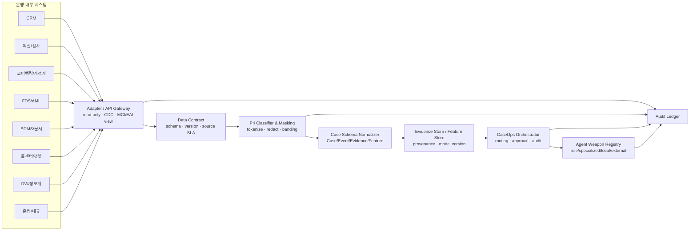
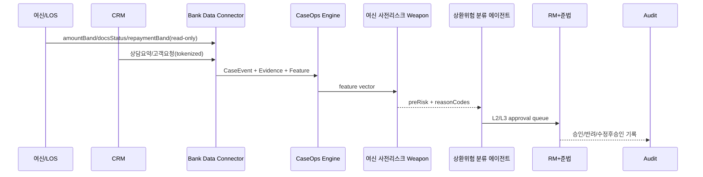
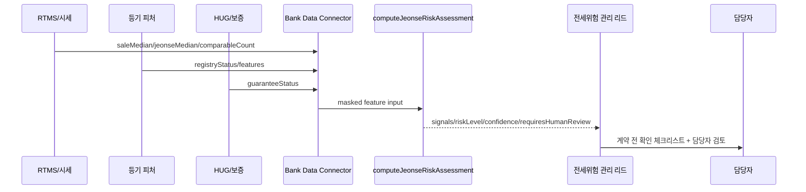

---
tags:
  - area/product
  - type/design
  - status/active
date: 2026-07-04
up: "[[_INDEX|CaseOps 분기]]"
aliases:
  - Bank Data Connector
  - 은행 DB 연결
  - Agent Weapon Registry
  - 특화 모델 레지스트리
---
# 은행 DB 연결 · 특화 모델

> **분기 상태**: [분기/미확정]. 이 문서는 CaseOps 확장 분기의 설계안이며, 실제 은행 DB 연동을 했다는 주장이 아니다.
>
> **핵심 원칙**: JB LocalGuard OS는 은행 원장을 직접 읽거나 쓰는 도구가 아니다. MVP는 mock/샘플, PoC는 비식별 샘플, Pilot부터 read-only API/CDC와 감사로그로 붙고, Production에서도 원장은 비접촉으로 둔다. 쓰기는 사람 승인 후 기존 MCI/EAI/발송계 경로를 탄다 [E2, D6].
>
> **심사 답변 한 줄**: 은행 DB 연결은 `Adapter/Gateway → Data Contract → PII Classifier·Masking → Case Schema Normalizer → Evidence/Feature Store → Orchestrator` 파이프라인이고, 에이전트는 그 위에서 전세위험·FDS·여신·상담·준법·민원·병목 모델을 "무기(Weapon)"처럼 장착한다.

## 0. 근거등급

| 등급 | 이 문서에서의 의미 | 예시 |
|---|---|---|
| E5 | 법령·정본 통제 | 신용정보법 §40조의2, canon PII 비반출 |
| E4 | 현 코드/데모 확인 | JB_project2 `computeJeonseRiskAssessment`, CCL hooks/repository |
| E3 | 백본 문서 정합 | `_canon.md`, `07_architecture`, `data-strategy` |
| E2 | 리서치 근거층 | D5a, D6, D7a, D7b, D17, D25 |
| E1 | 분기 설계 제안 | Bank Data Connector 계약, Weapon Registry |
| E0 | 미검증 가정 | 은행 내부 API 스키마, 실제 모델 성능 |

## 1. Bank Data Connector 정의

`Bank Data Connector`는 은행 내부 시스템을 CaseOps Engine에 연결하는 읽기 전용 경계층이다. 목표는 원장 데이터를 AI 콘솔로 복제하는 것이 아니라, 각 시스템에서 필요한 최소 신호를 가져와 `Case`, `Evidence`, `Feature`로 정규화하는 것이다.

### 1.1 원칙

| 원칙 | 설명 | 근거 |
|---|---|---|
| Read-only adapter-first | 초기 연동은 읽기 전용 adapter/API/CDC. 계정계 직접 조회·직접 write 금지 | D6 [E2] |
| 원장 비접촉 | OLTP/원장 가용성 보호. 콘솔은 원장 상태를 바꾸지 않음 | D6 [E2] |
| PII 내부 유지 | 원본 개인신용정보·식별자는 계열사 내부/Vault에만 | D5a/D25 [E5/E2] |
| Data Contract 우선 | 시스템별 자유 payload를 바로 쓰지 않고 계약 스키마로 검증 | E1 |
| Evidence/Feature 분리 | 설명 근거(Evidence)와 모델 피처(Feature)를 분리 저장 | D9/D18 [E2] |
| 모든 접근 감사 | 조회·마스킹·모델 라우팅·승인·차단을 Audit에 남김 | D5a/D25 [E5/E2] |

## 2. 파이프라인 상세



### 2.1 Adapter / API Gateway

역할:
- 시스템별 연결 방식을 숨기는 읽기 전용 adapter.
- CDC, 내부 API Gateway, DW view, 파일 drop, 샘플 CSV 등 조달 방식 차이를 표준 이벤트로 변환.
- 원장 write 기능은 노출하지 않는다. 고객 안내·발송·계정계 write는 사람 승인 뒤 기존 채널(MCI/EAI/Nexacro 런타임 등)로 간다 [E2, D6].

입력 예:

```json
{
  "source_system": "loan_origination",
  "source_event": "loan_review_updated",
  "source_record_id": "LOS-20260704-9921",
  "read_mode": "readonly_api",
  "occurred_at": "2026-07-04T09:10:00+09:00",
  "payload_version": "los.loan_review.v1",
  "payload": {
    "subject_token": "BIZ-REF-0001",
    "loan_type": "smeWorking",
    "amount_band": "5천만~1억",
    "docs_status": "missing",
    "repayment_band": "부담 확인 필요"
  }
}
```

### 2.2 Data Contract

역할:
- 시스템별 payload를 즉시 Case로 쓰지 않고, 스키마·버전·필수필드·PII 등급·업데이트 주기를 먼저 검증한다.
- 은행별 내부 규정과 필드명이 비공개/상이하므로 절대 금액·전결 기준을 하드코딩하지 않고 설정값과 구간값을 받는다 [E2, D2].

계약 예:

```json
{
  "contract_id": "bank.loan_review.v1",
  "owner_system": "loan_origination",
  "allowed_use": ["case_intake", "risk_feature", "evidence_summary"],
  "fields": [
    { "name": "subject_token", "type": "string", "required": true, "pii_grade": "G1" },
    { "name": "loan_type", "type": "enum", "required": true, "pii_grade": "G4" },
    { "name": "amount_band", "type": "string", "required": true, "pii_grade": "G1" },
    { "name": "docs_status", "type": "enum", "required": true, "pii_grade": "G4" },
    { "name": "repayment_band", "type": "string", "required": false, "pii_grade": "G1" }
  ],
  "external_llm_policy": "masked_or_aggregated_only",
  "retention": "credit-info-processing-log-3y"
}
```

### 2.3 PII Classifier & Masking

역할:
- `restricted/G0` 원본 식별정보를 제거하거나 토큰화한다.
- 원본키는 은행 내부 Vault/HSM에만 두고, 콘솔에는 `subject_token`, 구간값, 플래그, Evidence pointer만 전달한다 [E5/E2, D5a/D25].
- 출력단 재식별 차단(DLP)과 감사로그를 남긴다.

마스킹 방식:

| 데이터 | 원본 위치 | 콘솔 전달 |
|---|---|---|
| 성명/주민번호/계좌/전화 | 원천 시스템/Vault | 전달 금지 또는 token |
| 정확 주소 | 원천 시스템 | 법정동/권역/마스킹 주소 |
| 신용점수 원값 | 내부 시스템 | score band, risk segment |
| 카드매출 원액 | 내부/상용 계약 시스템 | 매출 하락 단계, 권역 평균 대비 |
| 상담 녹취 원문 | 콜센터/녹취 시스템 | 비식별 상담 요약, evidence pointer |

### 2.4 Case Schema Normalizer

역할:
- 모든 입력을 `CaseEvent`, `EvidenceCard`, `FeatureVector` 중 하나로 변환한다.
- 케이스 생명주기와 역할 큐를 건드리는 것은 `CaseEvent`.
- claim의 근거가 되는 것은 `EvidenceCard`.
- 특화 모델 입력은 `FeatureVector`.

정규화 예:

```json
{
  "case_event": {
    "case_family": "sme_credit_review",
    "subject_token": "BIZ-REF-0001",
    "role_key": "corporate-credit",
    "event_type": "docs_missing",
    "case_fields": {
      "loanType": "smeWorking",
      "amountBand": "5천만~1억",
      "docsStatus": "missing",
      "repaymentBand": "부담 확인 필요"
    }
  },
  "evidence_card": {
    "evidence_id": "EV-LOS-9921",
    "source_type": "loan_system",
    "summary": "운전자금 검토 중 서류 누락 및 상환 부담 구간 확인 필요",
    "pii_level": "G4",
    "source_uri": "los://readonly/LOS-20260704-9921"
  },
  "feature_vector": {
    "feature_set": "sme_credit_pre_risk.v1",
    "features": {
      "repayment_band_code": 2,
      "docs_missing_count": 1,
      "policy_candidate_flag": 1
    }
  }
}
```

### 2.5 Evidence/Feature Store

역할:
- Evidence Store: 출처, 생성시각, 접근권한, retention, claim 연결을 보관.
- Feature Store: 모델/룰 입력 피처와 버전, 생성 시점, 결측/품질 상태를 보관.
- 둘을 분리해야 "왜 그렇게 판단했는가"와 "모델이 무엇을 입력받았는가"를 각각 감사할 수 있다 [E2, D9/D18].

### 2.6 Orchestrator 연결

역할:
- CaseOps Engine의 `Case Intake`, `Auto Skill Routing`, `Guarded Model Routing`, `Verification`에 연결.
- L3~L4는 준법/상위검토로 올리고, 고객 행동은 Approval 전까지 차단한다 [E3].

## 3. 연결 대상 8종 시스템

| 시스템 | 들어오는 데이터 | 우리 콘솔 용도 | PII/보안 처리 | 근거 |
|---|---|---|---|---|
| CRM/고객관리 | 상담 이력 요약, 고객 세그먼트, 접촉 채널, 요청 유형 | Case Intake, 고객 맥락, 상담 긴급도 | 원문 PII/VOC는 내부 보관, token/summary만 | D18/D21 [E2] |
| 여신/대출(LOS/LMS) | 신청 상태, 상품유형, 금액구간, 서류상태, 사후관리 트리거 | 여신 케이스, EWS, Priority, 전결/승인 라우팅 | 금액 원값보다 band, 내부 전결표 설정값 | D2/D6 [E2] |
| 코어뱅킹/계정계 | 계좌/거래/원장 이벤트 pointer, 실행/상환 상태 | 사후관리·상환 신호, 고객 행동 승인 후 write-back 참고 | AI 직접 조회/write 금지, CDC/view만 | D6 [E2] |
| FDS/AML | 이상거래 score, 신규 수취계좌, URL/콜백 플래그, override 이력 | 보이스피싱/이상거래 Agent Weapon, 차단 후보 | 내부 FDS 전용, 외부 LLM 격리 | D7b [E2] |
| EDMS/문서관리 | 재무제표, 등기부, 계약서, 증빙문서 OCR 결과 | Evidence Card, 문서 체크리스트, RAG source | 원문 장기보관 금지/요약·피처화, 접근 로그 | D9/D7a [E2] |
| 콜센터/챗봇 | 상담 텍스트 요약, 감정/긴급 키워드, 반복 문의 | 상담긴급도·감정, 고객이탈/민원 모델 | 녹취/자유텍스트 원문 외부 반출 금지 | D18/D21/D25 [E2] |
| DW/정보계/Data Mart | 집계 매출, 지점/권역, 상품/업종 통계, 포트폴리오 지표 | 대시보드, 포트폴리오 분석, feature enrichment | 집계·셀 억제, 재식별 위험 점검 | D17/D25 [E2] |
| 준법/내규/규정DB | 내규, 법령, 승인 기준, 금지표현, 보존정책 | Rule Engine, compliance guard, Evidence | 공개/내부 문서 등급 분리, 버전 로그 | D5a/D9 [E5/E2] |

## 4. 4단계 로드맵

| 단계 | 이름 | 연결 방식 | 데이터 | 목표 | 심사 표현 |
|---|---|---|---|---|---|
| ① | MVP Mock | 정적 seed/mock DB/localStorage | 합성·더미·비식별 샘플 | 운영계약·승인·감사·전세규칙 시연 | "실제 DB 연동 아님, 함수계약 검증" |
| ② | PoC 비식별 샘플 | CSV/Excel/샘플 API import | 익명/가명/코드화 데이터 | schema, masking, Evidence/Feature 정규화 검증 | "은행 제공 샘플로 보안검토 전 단계" |
| ③ | Pilot read-only API + 감사 | API Gateway, read-only view, CDC 일부 | 내부망 tokenized data | 권한별 조회, audit, DLP, L3/L4 승인 검증 | "원장 비접촉 Pilot" |
| ④ | Production Gateway/EventBus/CDC/Data Mart | Gateway + EventBus/Kafka + CDC + Data Mart | 최소필드/Zero-PII 파생 레인 | 운영 확장, 모델 버전관리, 계열사 분리 | "AI 직접 write 없음, 승인 후 기존 채널" |

### 4.1 4원칙

1. **원장 비쓰기**: AI 콘솔은 계정계/발송계에 직접 write하지 않는다. 고객 행동은 사람 승인 후 기존 MCI/EAI/단말 채널을 탄다 [E2, D6].
2. **원본 PII 비반출**: 원본 개인신용정보·상담 원문·계좌·정확 주소는 외부 LLM으로 보내지 않는다 [E5/E2, D5a/D25].
3. **권한별 필요데이터만 읽기**: 역할·계열사·목적코드별 최소 필드만 조회한다. CCL 구현의 `roleKey` scope 강제는 현 데모 근거다 [E4].
4. **모든 조회·판단 로그**: adapter read, masking, model route, Evidence attach, approval, DLP 결과를 Audit에 남긴다 [E5/E4].

## 5. 데이터 등급과 레인

`data-strategy`의 5단계 등급과 4레인을 따른다 [E3].

| 등급/레인 | 설명 | 외부 LLM | Connector 처리 |
|---|---|---|---|
| G0 원본 개인신용정보 / L-실명 | 이름, 주민번호, 계좌, CB 원값, 상담 원문 | 불가 | 내부 Vault/원천 시스템에만 |
| G1 가명정보 / L-가명 | subject_token, score band, risk code | 조건부 | key 분리, 접근통제 |
| G2 익명·집계 / L-결합 | 권역 평균, 집계통계 | 조건부 | 셀 억제/재식별 점검 |
| G3 공개·공공 | 법령, ECOS, RTMS 등 | 가능 | 라이선스·식별요소 재확인 |
| G4 Zero-PII 파생 | 위험코드, evidence pointer, approval state | 가능 | 외부 초안/설명에 사용 |

## 6. Agent Weapon Registry

### 6.1 정의

`Agent Weapon Registry`는 각 에이전트가 장착할 수 있는 특화 모델·룰·점수화기를 표준 카드로 관리하는 레지스트리다. 여기서 "Weapon"은 자동 실행 권한이 아니라, 에이전트가 판단 직전까지 근거와 초안을 만드는 데 쓰는 도구라는 의미다. 고객 대상 행동은 Approval Gate 전까지 차단된다 [E3].

### 6.2 Registry Card 스키마

```json
{
  "weapon_id": "jeonse-risk-score-v1",
  "display_name": "전세위험 점수",
  "type": "deterministic_rule",
  "owner_agent": "전세위험 관리 리드",
  "inputs": [
    { "name": "depositAmount", "pii_grade": "G1", "source": "case_form" },
    { "name": "market.saleMedian", "pii_grade": "G3", "source": "RTMS/public_api" },
    { "name": "registryStatus", "pii_grade": "G1", "source": "registry_feature" }
  ],
  "outputs": ["riskLevel", "signals", "confidence", "requiresHumanReview", "nextActions"],
  "model_route": "rule_engine_local",
  "approval_policy": "high_or_critical_requires_human_review",
  "evidence_required": true,
  "current_implementation": "_vendor/JB_project2/app/jeonsePriceRisk.service.js::computeJeonseRiskAssessment"
}
```

## 7. 특화 모델 7종 상세

> "모델"에는 ML 모델뿐 아니라 deterministic rule engine도 포함한다. 금융 업무에서는 결정형 차단·승인 조건을 LLM에 맡기지 않는다 [E2, D9].

### 7.1 전세위험 점수

| 항목 | 내용 |
|---|---|
| Weapon ID | `jeonse-risk-score-v1` |
| 성격 | deterministic rule + public/open data feature |
| 입력 | 보증금, 추정 매매가, 주변 전세 중앙값, 공시가격 추정, 등기 확인상태, 보증보험 상태, 경공매/계약 일정 |
| 출력 | `signals[]`, `riskLevel(low/medium/high/critical)`, `confidence`, `requiresHumanReview`, `nextActions` |
| 에이전트 사용례 | 전세위험 관리 리드가 하위 전세가율/등기/보증 확인을 묶어 담당자 검토 큐로 올림 |
| 데이터소스 | RTMS/국토부 실거래, 등기 피처(인터넷등기소 유료 열람 후 정규화), HUG/HF, 케이스 입력 |
| 현재 구현 | `_vendor/JB_project2/app/jeonsePriceRisk.service.js`의 `computeJeonseRiskAssessment(input)` 존재 [E4] |
| 주의 | 전세사기 여부·보증 가능 여부·법률 판단 확정 금지. `확인 필요`와 human review로 표현 |

현 규칙버전 요약 [E4]:

```pseudo
if deposit / saleMedian >= 0.9:
  signal JEONSE_RATIO_HIGH high, requiresHumanReview
if deposit >= estimatedOfficialPrice:
  signal DEPOSIT_OVER_OFFICIAL_PRICE medium/high
if deposit >= jeonseMedian * 1.2:
  signal ABOVE_NEIGHBORHOOD_MEDIAN medium/high
if comparableTradeCount + comparableRentCount < 5:
  signal LOW_COMPARABLE_COUNT low, review
if registryStatus != verified:
  signal REGISTRY_RIGHTS_UNKNOWN medium, review
if guaranteeStatus unknown:
  signal GUARANTEE_STATUS_UNKNOWN medium, review
if auctionNoticed:
  signal AUCTION_OR_FORECLOSURE_DEADLINE high/critical
```

데이터 예:

```json
{
  "input": {
    "depositAmount": 235000000,
    "market": {
      "sourceMode": "snapshot",
      "saleMedian": 260000000,
      "jeonseMedian": 190000000,
      "comparableTradeCount": 3,
      "comparableRentCount": 2
    },
    "registryStatus": "unknown",
    "guaranteeStatus": "unknown",
    "auctionNoticed": false
  },
  "output": {
    "riskLevel": "high",
    "confidence": "medium",
    "requiresHumanReview": true,
    "signals": ["JEONSE_RATIO_HIGH", "REGISTRY_RIGHTS_UNKNOWN", "GUARANTEE_STATUS_UNKNOWN"]
  }
}
```

### 7.2 보이스피싱/이상거래

| 항목 | 내용 |
|---|---|
| Weapon ID | `fraud-anomaly-shield-v1` |
| 성격 | FDS/AML specialized model + deterministic rule |
| 입력 | 거래 금액/빈도 변화, 신규 수취계좌, 콜백 URL, 원격제어 앱 징후, 고객 접촉 채널, 내부 FDS score, 과거 override 사유 |
| 출력 | `fraudRiskLevel`, `blockCandidate`, `doNotContact`, `evidence_ids`, `requiredApproval` |
| 에이전트 사용례 | 이상거래 탐지·차단 에이전트가 L4 차단 검토 요청, 고객 접촉 보류, 보안팀/준법 큐 생성 |
| 데이터소스 | FDS/AML, 콜센터/챗봇, 경찰청/KISA/금융위 공개 경보, 내부 거래로그 |
| 현재 구현 | 메인 `computeRiskDecision`의 `actionType=fraud` 신호 분해와 차단 gate는 존재 [E4]. 실제 FDS 연동/모델은 [미검증] |
| 주의 | ASAP/FDS 위협지표는 외부 프런티어 LLM과 섞지 않고 내부 룰/FDS 전용 피드로 격리 [E2, D7b] |

의사코드:

```pseudo
fraudScore = max(internalFdsScore, ruleScore(features))
if callbackUrlRisk or remoteControlHint:
  fraudScore += boost
if newBeneficiary and abnormalAmount:
  fraudScore += boost
if fraudScore >= L4:
  output.doNotContact = true
  output.requiredApproval = "security_team_or_compliance"
```

### 7.3 여신 사전리스크

| 항목 | 내용 |
|---|---|
| Weapon ID | `sme-credit-pre-risk-v1` |
| 성격 | rule + future supervised model(LightGBM/XGBoost 후보) |
| 입력 | 상환 부담 구간, 매출 하락 단계, 서류 누락, 업종/상권 신호, 정책금융 후보, 연체/EWS trigger |
| 출력 | `preRiskScore`, `riskBand`, `reasonCodes`, `routingLevel`, `requiredDocs` |
| 에이전트 사용례 | 상환위험 분류 에이전트가 L0~L4 후보와 RM/준법 큐를 제안. 정책금융 매칭 에이전트가 보증/대환 후보를 준비 |
| 데이터소스 | 여신/LOS, DW 집계, 카드매출(구간화), ECOS, 상권정보, 국세청 사업자 상태조회, 내부 상담 |
| 현재 구현 | CCL `riskLevel`, `repaymentBand`, `requiresHumanReview`, CCL 에이전트/스킬 seed 존재 [E4]. 독립 ML 모델은 [미검증] |
| 주의 | 대출 승인/거절, 금리/한도, 신용등급 확정 금지 [E4, CCL blocked actions] |

설명가능 reason code 예:

```json
{
  "preRiskScore": 78,
  "riskBand": "priority_queue",
  "reasonCodes": [
    { "code": "SALES_DROP_BAND_2", "evidence_id": "EV-DW-0101" },
    { "code": "DOC_MISSING_1", "evidence_id": "CCL-DOC-0001" },
    { "code": "POLICY_CANDIDATE_AVAILABLE", "evidence_id": "CCL-NOTE-0006" }
  ],
  "routingLevel": "L2_or_L3_candidate"
}
```

### 7.4 상담긴급도·감정

| 항목 | 내용 |
|---|---|
| Weapon ID | `consult-urgency-sentiment-v1` |
| 성격 | text classifier + rule keyword + human review |
| 입력 | 상담 요약, 챗봇 문장, 콜센터 태그, 반복 문의 횟수, 긴급 키워드("피해", "사기", "급하다", "불안") |
| 출력 | `urgencyScore`, `sentiment`, `repeatContactFlag`, `escalationReason`, `recommendedScriptType` |
| 에이전트 사용례 | RM 보좌 에이전트가 콜백 우선순위와 답변 tone 초안을 만들고, 준법 검토 에이전트가 과장/단정 표현을 차단 |
| 데이터소스 | CRM, 콜센터/챗봇, 상담 이력, 고객 메모(비식별 요약) |
| 현재 구현 | CCL `ccl_consult_logs`, `Customer Reply Draft Agent` 초안/승인 구조는 존재 [E4]. 감정 classifier는 [미검증] |
| 주의 | 상담 원문은 외부 LLM 반출 금지. Zero-PII 요약만 사용 [E2, D25] |

### 7.5 준법 룰엔진(deterministic)

| 항목 | 내용 |
|---|---|
| Weapon ID | `compliance-rule-engine-v1` |
| 성격 | deterministic rule engine |
| 입력 | action draft, approval level, data grade, claim list, forbidden assertions, policy rule id |
| 출력 | `pass/fail/hold`, `violations[]`, `requiredApproval`, `auditPayload` |
| 에이전트 사용례 | 준법 검토 에이전트가 고객 발송 전 PII·단정·승인 누락을 차단. L3~L4는 준법/상위검토로 라우팅 |
| 데이터소스 | 국가법령정보, 내부 내규, canon §4, CCL/JPO forbidden assertion rules |
| 현재 구현 | `harnessGuardCheckPII`, `harnessGuardCheckAssertions`, `harnessGuardCheckAutoClose`, `harnessGuardCheckApprovalRequired`, CCL/JPO hooks 존재 [E4] |
| 주의 | 생성형 모델이 최종 금지/승인 판단을 내리지 않는다. rule이 최종 게이트 [E2, D9] |

검사 예:

```json
{
  "draft": "대출 승인 확정입니다.",
  "checks": [
    {
      "rule_id": "NO_FINAL_CREDIT_DECISION",
      "status": "fail",
      "message": "대출 승인/거절 단정 표현 금지"
    },
    {
      "rule_id": "APPROVAL_REQUIRED_L3",
      "status": "hold",
      "message": "RM+준법 승인 전 고객 발송 불가"
    }
  ],
  "route": "blocked_until_human_review"
}
```

### 7.6 고객이탈/민원

| 항목 | 내용 |
|---|---|
| Weapon ID | `churn-complaint-risk-v1` |
| 성격 | event scoring + classifier |
| 입력 | 반복 문의, 미해결 상담, 불만 키워드, 응답 지연, 상품/채널 이력, 승인 반려 이력 |
| 출력 | `complaintRisk`, `churnRiskBand`, `nextBestActionDraft`, `evidence_ids` |
| 에이전트 사용례 | RM 보좌/운영 조율 에이전트가 보류·재작업 케이스를 재상정하고, 고객 안내 초안을 approval queue에 올림 |
| 데이터소스 | CRM, 콜센터, 챗봇, Approval/Audit, Customer 360 token lane |
| 현재 구현 | Zero-PII customer memory는 설계 수준 [E1]. `approval/replyDraft`와 상담 seed는 존재 [E4] |
| 주의 | 계열사 간 원본 고객정보 통합 금지. 그룹 공통 Hub는 최소 필드만 [E2, D17/D25] |

### 7.7 담당자 병목탐지

| 항목 | 내용 |
|---|---|
| Weapon ID | `staff-bottleneck-detector-v1` |
| 성격 | operations analytics + SLA rule |
| 입력 | 케이스 큐 길이, AgentRun 상태, Approval pending 시간, override 사유, 반려/수정 횟수, SLA 소진율 |
| 출력 | `bottleneckScore`, `queueHotspot`, `handoffRecommendation`, `trainingGapSignal` |
| 에이전트 사용례 | 운영 조율 에이전트/포트폴리오 분석 에이전트가 병목 큐를 supervisor에게 표시하고, 반복 반려 사유를 SkillMemory/OrganizationMemory로 보냄 |
| 데이터소스 | Case, AgentRun, Approval, Audit, activity log |
| 현재 구현 | `buildDashboardData()` 집계, CCL sidebar counts, audit reviewRequired count 존재 [E4]. 병목 점수 모델은 [미검증] |
| 주의 | Staff Memory는 Customer Memory와 분리해야 한다. 담당자 습관이 고객 판단에 새면 편향 리스크 [E1, CaseOps 원문] |

## 8. Weapon Registry 통합 표

| Weapon | Agent | 입력 | 출력 | 데이터소스 | 현재 상태 |
|---|---|---|---|---|---|
| 전세위험 점수 | 전세위험 관리 리드 | 보증금·시세·등기·보증 | riskLevel/signals | RTMS·등기·HUG | `computeJeonseRiskAssessment` 있음 [E4] |
| 보이스피싱/이상거래 | 이상거래 탐지·차단 | FDS·거래·콜백/URL | 차단후보/L4 | FDS/AML·공개경보 | 부분 rule/화면 [E4/E1] |
| 여신 사전리스크 | 상환위험 분류 | 상환 band·서류·매출 | preRisk/reason | LOS·DW·ECOS·상권 | CCL seed/hook [E4] |
| 상담긴급도·감정 | RM 보좌 | 상담요약·반복·키워드 | urgency/sentiment | CRM·콜센터 | seed only [E4/E1] |
| 준법 룰엔진 | 준법 검토 | draft·PII·policy | pass/fail/hold | 내규·법령 | hooks 있음 [E4] |
| 고객이탈/민원 | 운영/RM 보좌 | 상담·승인·지연 | churn/complaint | CRM·Approval/Audit | 설계 [E1] |
| 담당자 병목탐지 | 운영/포트폴리오 | 큐·SLA·override | bottleneck | Case/Run/Audit | 집계 있음 [E4/E1] |

## 9. 은행/오픈데이터 소스 매핑

| 데이터 | 조달층 | 사용 Weapon | 처리 규칙 | 근거 |
|---|---|---|---|---|
| ECOS 금리/경기 | 무상 공개형 | 여신 사전리스크 | 공개 데이터, 라이선스 확인 | D7a [E2] |
| RTMS 실거래가 | 무상 공개형 | 전세위험 점수 | 주소 정규화, 시세 feature | D7a [E2] |
| 상권정보/인허가 | 무상 공개형 | 여신 사전리스크 | 업종·지역 feature | D7a [E2] |
| 국세청 사업자 상태조회 | 무상 공개형 | 여신 사전리스크 | 캐시/재조회 룰 | D7a [E2] |
| 인터넷등기소 | 유료 건별 | 전세위험 점수 | 원문 오래 보관 금지, 권리 피처만 | D7a [E2] |
| NICE/KCB/CRETOP | 기관/상용 | 여신 사전리스크 | 원본 score 외부 반출 금지, 구간화 | D7b [E2] |
| 카드매출 | 기관/상용 | 여신 사전리스크, 고객이탈 | 하락율/권역 대비 단계만 | D7b/D25 [E2] |
| 더치트/사기 데이터 | 상용/조건부 | 보이스피싱/이상거래 | 전화/계좌 원문 로컬 조회, flag만 | D7b [E2] |
| 금융보안원 ASAP | 내부/FDS 전용 | 보이스피싱/이상거래 | 외부 LLM 경로 부적합 | D7b [E2] |

## 10. 운영 흐름 예시

### 10.1 CCL-0001 여신 케이스



### 10.2 전세 위험 케이스



## 11. 보안·준법 제약

| 제약 | 적용 |
|---|---|
| 히어로 CCL-0001 | 문서 예시는 CCL-0001을 기준으로 통일. 예선 ID `JBG-104`와 충돌 가능성은 여기서 해소하지 않음 [미검증] |
| 승인 L0~L4 | L3~L4는 준법/상위검토 레인. 고객 행동은 Approval 전 차단 |
| PII 외부 비반출 | 외부 LLM에는 `subject_token`, 위험코드, evidence pointer, masked draft만 |
| vanilla JS 무빌드 | monorepo/TS/서버 패키지명은 개념 차용만. 실제 본선 MVP는 무빌드 vanilla JS 경계 유지 |
| 은행 DB 실연동 | 현재 미구현. Mock→PoC→Pilot→Production 순차 승격 |

## 12. 미검증·오픈 질문

| 항목 | 상태 | 리스크 | 다음 조치 |
|---|---|---|---|
| 실제 전북은행/광주은행 API/CDC 접근 | [미검증] | 연동 가능 범위 과장 위험 | PoC 전 보안/전산 협의 |
| MCI/EAI 전문 스키마 | [미검증] | write-back 경로 불명확 | Pilot 단계에서 기존 승인 채널 확인 |
| Nexacro WebView 엔진 | [미검증] | 콘솔 임베딩 호환성 | D6 기준 확인 필요 |
| 상용데이터 계약 | [미검증] | 계열사 공유·재학습·재배포 금지 | 계약/라이선스 검토 |
| FDS/AML 위협지표 연동 | [미검증] | 외부 LLM 경로 혼입 위험 | 내부 FDS 전용 레인 분리 |
| 병목/이탈 모델 성능 | [미검증] | E0/E1 주장 | 초기에는 rule/KPI로만 표현 |
| L4 승인 주체 | [미검증] | 준법/상위검토 역할 불명확 | 정본 승인 UX 문서 확정 |

## 13. 심사 답변 스크립트

### 질문: "은행 DB에 어떻게 붙나요?"

> 원장에 직접 붙지 않습니다. MVP는 mock이고, 실제 도입은 read-only adapter/API Gateway와 CDC로 시작합니다. 계정계 write는 AI가 하지 않고, RM/준법 승인 후 기존 MCI/EAI/단말 채널을 탑니다. 중간에는 Data Contract, PII Classifier/Masking, Case Schema Normalizer, Evidence/Feature Store가 있어 원본 PII와 모델 입력을 분리합니다. [E2, D6]

### 질문: "고객정보를 외부 LLM에 보내나요?"

> 원본 개인신용정보와 PII는 보내지 않습니다. 외부 LLM에는 token, 위험코드, evidence pointer, 승인상태, 비식별 초안만 갑니다. 토큰↔원본 키는 내부에 분리보관하고, 출력 재식별 차단과 감사로그를 남깁니다. [E5/E2, D5a/D25]

### 질문: "각 에이전트의 무기는 뭔가요?"

> Agent Weapon Registry입니다. 전세위험 점수, 보이스피싱/FDS, 여신 사전리스크, 상담긴급도·감정, 준법 룰엔진, 고객이탈/민원, 담당자 병목탐지를 에이전트별로 장착합니다. 전세위험은 JB_project2에 `computeJeonseRiskAssessment` 규칙버전이 이미 있고, 준법 룰엔진은 hooks로 PII·단정·자동종결·승인 누락을 차단합니다. [E4/E1]

### 질문: "이 모델들이 자동으로 결정하나요?"

> 아닙니다. 특화 모델은 판단 직전까지의 근거·점수·초안만 만듭니다. L1/L2는 RM, L3는 준법 포함, L4는 차단·상위검토입니다. 특히 여신 승인/거절, 금리/한도, 신용등급, 전세사기 여부, 법률/보증 가능성은 AI가 확정하지 않습니다. [E3/E4]

## 연결

[[_INDEX|CaseOps 분기]] · [[02-CaseOps-Engine-7알고리즘]] · [[01-메모리-거버넌스]] · [[03-119-사고대응-에이전트]] · [[05-9파이프라인-아키텍처-저장소]] · [[08_본선/03_제품/00_vision/data-strategy|Data Strategy]] · [[08_본선/03_제품/07_architecture|아키텍처]] · [[08_본선/03_제품/05_domain-model|도메인 모델]] · [[08_본선/03_제품/08_feature-spec|Feature Spec]] · [[08_본선/03_제품/02_agent-design/skill-spec|스킬 명세]]
