---
tags:
  - area/product
  - type/architecture
  - status/active
date: 2026-07-04
up: "[[_INDEX|CaseOps 분기]]"
---

# 05 — 9파이프라인·아키텍처·저장소

> **문서 성격**: CaseOps 분기에서 9개 파이프라인을 "흐름·입출력 계약·저장소 배치" 관점으로 통합한 설계 문서다. 메모리 세부는 [[01-메모리-거버넌스]], 알고리즘 세부는 [[02-CaseOps-Engine-7알고리즘]], 119 세부는 [[03-119-사고대응-에이전트]], 은행 DB·특화모델 세부는 [[04-은행DB연결-특화모델]]로 보낸다. 현재 분기 폴더에는 위 01~04 파일이 아직 없으므로 연결 대상은 승급 예정 문서다. [분기/미확정][미검증]
>
> **구현 경계**: 히어로 앵커는 `CCL-0001`(전주 카페 운영자 운전자금, `BIZ-REF-0001`)이다. canon 데모 노출 코드는 `JBG-104`, riskScore `88`, 상태 `Approval Pending`, 노출 `운전자금 1.8억 · 카드매출 둔화`로 고정한다. [E5:_canon] [E3:07_architecture]  
> **중요 결론**: Paperclip의 `pnpm` monorepo, React, Express, Drizzle, PostgreSQL, CLI adapter runtime은 이식하지 않는다. 우리 결론은 `vanilla JS` 무빌드 유지이며, Paperclip에서는 control-plane 개념·상태 이름·레지스트리 패턴·IA만 차용한다. [E3:paperclip-통합-블루프린트] [E2:B1]

## 근거 등급

| 등급 | 의미 | 이 문서에서의 사용 |
|---|---|---|
| E5 | `_canon.md` 고정 사실 | 제품명, 히어로 데모 facts, 에이전트 표시명, KPI, PII 비반출 원칙 |
| E4 | 실코드 직접 확인 | `_vendor/JB_project2/app/harnessCore.js`, `harnessRegistry.js`, `harnessVerification.js`, `modules.js` |
| E3 | 본선 백본·설계 SSOT | `07_architecture.md`, `05_domain-model.md`, `paperclip-통합-블루프린트.md` |
| E2 | 리서치 근거층 | `_요약-D9.md`, `_요약-D20.md`, `_요약-B1.md`, `_요약-D11.md` |
| E1 | 원문·벤더 구조 조사 | `_원문-ChatGPT-CaseOps대화.md`, `_vendor/paperclip-master/docs`, `packages`, `adapter-plugin.md` |
| E0 | 분기 가설·미확정 | `[분기/미확정]`, `[미검증]`로 표시하고 정본 승급 전 재검증 |

## 범위와 중복 회피

이 문서는 파이프라인별 "목적 → 입력 → 처리 단계 → 출력 → 다음 파이프라인으로 넘기는 계약"을 쓴다. 다음 항목은 여기서 세부 구현을 반복하지 않는다.

| 세부 주제 | 위임 문서 | 여기서 다루는 범위 |
|---|---|---|
| 메모리 8계층·Customer/Staff 분리 | [[01-메모리-거버넌스]] | Memory Governance 파이프라인의 입출력과 감사 접점 |
| CaseOps Engine 7 알고리즘 | [[02-CaseOps-Engine-7알고리즘]] | Intake·Priority·Routing·Evidence·Model·Verification 사이의 연결 |
| 119 Kill Switch·Rollback·Replay | [[03-119-사고대응-에이전트]] | Incident 파이프라인의 트리거·격리·복구 루프 |
| Bank Data Connector·특화모델 | [[04-은행DB연결-특화모델]] | read-only connector가 Data Governance와 Evidence/Feature Store로 넘기는 계약 |
| 정본 도메인 엔티티 | [[08_본선/03_제품/05_domain-model|05_domain-model]] | `Case → AgentRun → Agent → Skill → Evidence → Approval → Audit` 운영 계약만 인용 |
| 정본 아키텍처 | [[08_본선/03_제품/07_architecture|07_architecture]] | 신뢰경계·모델 라우팅·Human approval·Failure handling을 파이프라인에 끼워 넣음 |

## 0. 한 장 요약

JB LocalGuard OS의 CaseOps는 "AI가 결론을 내리는 시스템"이 아니라 **은행 케이스가 안전하게 생성·정규화·근거화·라우팅·승인·감사·복구되는 운영 체계**다. LLM은 점수화·여신심사·차단 판단의 최종권자가 아니라, 의도 분류·근거 범주 결정·도구 호출·결과 요약을 담당한다. 신용/여신 점수는 특화모델과 규칙엔진으로, 최종 승인·차단·적격성은 정책 게이트와 사람 승인으로 보낸다. [E2:D20] [E2:D9]

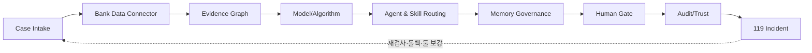

핵심 운영 계약은 `_canon.md`와 도메인 모델의 `Case → AgentRun → Agent → Skill → Evidence → Approval → Audit`을 따른다. [E5:_canon] [E3:05_domain-model] 이 문서는 그 계약을 9개 파이프라인으로 펼친다.

## 1. 9레이어 전체 스택

요청된 전체 스택은 아래처럼 읽는다. 노드는 11개로 보이지만, 운영상 묶음은 **은행 데이터 인입, 거버넌스, CaseOps, 모델/에이전트/스킬, 근거, 사람 게이트, 감사, 119**의 9개 파이프라인이다.

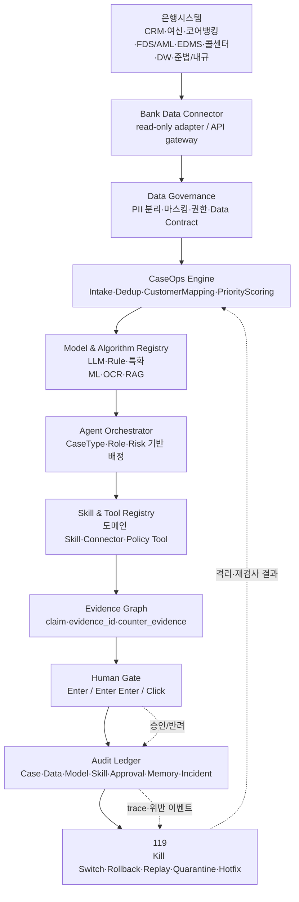

**스택 해석**

| 구간 | 책임 | 근거 |
|---|---|---|
| 은행시스템 → Bank Data Connector | 원장 비접촉 read-only 인입. 연결 대상은 CRM, 여신/대출, 코어뱅킹/계좌, FDS/AML, EDMS, 콜센터/챗봇, 그룹DW, 준법/내규. | [E1:원문] |
| Bank Data Connector → Data Governance | Data Contract, PII Classifier, Masking, 권한 검사, 원본 PII 비반출. | [E5:_canon] [E3:07_architecture] |
| Data Governance → CaseOps Engine | 이벤트를 `Case`로 정규화하고 중복제거·고객/계좌/상품/역할 매핑·우선순위 산정. | [E1:원문] |
| CaseOps Engine → Model & Algorithm Registry | LLM이 아니라 특화모델·규칙엔진·레거시 어댑터를 묶는 하네스. | [E2:D20] |
| Model Registry → Agent/Skill Registry | Case Type, Role, Risk, Data Permission에 따라 에이전트·스킬·모델·근거를 자동선택. | [E1:원문] [E4:harnessRegistry] |
| Evidence Graph → Human Gate | 모든 주장은 `evidence_id`를 가진다. 담당자는 근거를 보고 책임 분리된 입력 행위로 승인한다. | [E2:D9] [E2:D11] |
| Human Gate → Audit Ledger → 119 | 승인·반려·차단·위반·복구를 append-only 이벤트로 남기고 사고 대응으로 되돌린다. | [E2:B1] [E1:원문] |

## 2. Pipeline ① — Case Intake

### 목적

Case Intake는 은행 안팎에서 들어오는 이벤트를 사람이 수작업으로 만들지 않아도 **검토 가능한 `Case` 후보**로 바꾸는 첫 관문이다. 원문은 Paperclip과의 차이를 "사용자가 일을 입력하는 것이 아니라 CRM/상담·대출/여신·거래/FDS·전세/부동산·챗봇/콜센터·문서업로드·외부공공데이터/뉴스·담당자 수동·스케줄러에서 케이스가 자동 유입된다"로 정의했다. [E1:원문]  
히어로 검증 앵커는 `CCL-0001`이고, 대외 데모 라벨은 canon의 `JBG-104`다. [E5:_canon] [E3:05_domain-model]

### 입력

| 입력 | 예시 | 데이터 등급·통제 |
|---|---|---|
| 은행 이벤트 | 상담 이력, 여신 신청, 사후관리 알림, FDS 경보 | `internal/confidential/restricted` 분기 |
| 공공·외부 이벤트 | 정책금융 공고, 지역경제 뉴스, 부동산/전세 데이터 | 보통 `public`, exact match/출처 필요 |
| 담당자 수동 입력 | RM이 생성하는 보완 케이스 | `roleKey`·`workspaceId` 필수 |
| 스케줄러 | 사후관리 재점검, SLA 지연 | 생성자·시각·근거 남김 |

### 단계

| 단계 | 처리 | 출력 필드 |
|---|---|---|
| 1. Event capture | 이벤트 원천·시간·actor를 수집 | `source_type`, `source_event_id`, `created_at` |
| 2. Data contract check | 필수 필드와 데이터 등급 검사 | `contract_status`, `pii_level` |
| 3. Dedup | 같은 고객·계좌·상품·사건을 중복 병합 | `dedup_key`, `linked_case_ids` |
| 4. Case schema normalize | `Case` 스키마로 정규화 | `case_id`, `case_type`, `bizRefId`, `amountBand` |
| 5. Priority seed | 설명가능 우선순위 점수의 초기값 부여 | `riskLevel`, `requiresHumanReview` |
| 6. Queue assign | 역할·계열사 큐에 배정 | `roleKey`, `workspaceId`, `status` |

### 출력

- `Case` 후보: `CCL-0001` 같은 내부 case id, `BIZ-REF-0001` 같은 비식별 고객 참조, `roleKey` 스코프.
- `Case Intake Audit`: 생성 근거, 중복 병합 여부, PII 검사 결과.
- 다음 파이프라인 입력: Bank Data Connector가 보강 조회할 최소 키와 Data Governance가 통제할 데이터 등급.

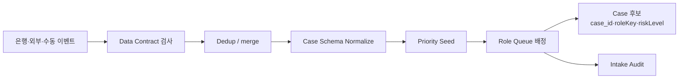

## 3. Pipeline ② — Bank Data Connector

### 목적

Bank Data Connector는 은행 내부 시스템을 CaseOps에 직접 붙이는 것이 아니라 **read-only adapter-first, 원장 비접촉** 방식으로 필요한 피처와 근거만 가져오는 계층이다. 원문은 연결 대상 8종과 4원칙(원장 비쓰기, 원본 PII 비반출, 권한별 필요데이터만 읽기, 모든 조회·판단 로그)을 제시했다. [E1:원문]  
정본 아키텍처는 계정계/정보계에 대해 "읽기=CDC, 쓰기=승인 후 MCI/EAI 전문"이라는 현실 경로를 제시하되 실제 MCI/EAI 스키마는 비공개라 [미검증]으로 둔다. [E3:07_architecture]

### 입력

| 입력 | 설명 | 필수 통제 |
|---|---|---|
| `case_id` | Case Intake가 만든 후보 | `roleKey` 스코프 검증 |
| 조회 목적 | 심사 보강, 상담 이력 확인, FDS 경보 검증 등 | 목적 외 조회 금지 |
| 권한 컨텍스트 | 담당자 역할, 계열사, 승인 레벨 | 최소권한·조회 로그 |
| 데이터 계약 | source별 허용 필드 목록 | 원본 PII 반출 금지 |

### 단계

| 단계 | 처리 | 산출 |
|---|---|---|
| 1. Adapter select | CRM/여신/계정계/FDS/EDMS/콜센터/DW/준법 중 조회 원천 선택 | `adapter_id` |
| 2. Purpose & role check | 역할·목적·스코프 승인 | `access_decision` |
| 3. Read-only fetch | API Gateway, CSV/Excel, Mock DB, CDC mart 중 단계별 조회 | `raw_snapshot_ref` |
| 4. PII classify | `restricted/confidential/internal/public` 태그 | `pii_level` |
| 5. Mask/tokenize | 외부·모델 입력 전 비식별화 | `masked_payload`, `token_map_ref` |
| 6. Normalize | Case Schema, Evidence Card, Feature Store로 분기 | `feature_set`, `evidence_candidates` |
| 7. Data access audit | 조회자·목적·필드·결과 요약 기록 | `data_access_log_id` |

### 출력

- Evidence Graph 후보: 상담 이력, 문서 체크, 정책 근거, FDS 신호.
- Feature Store 후보: 모델·룰엔진이 사용할 `risk`, `urgency`, `vulnerability`, `regulatory_sensitivity`, `sla_delay`.
- Data Access Audit: 모든 조회·마스킹·반출 결정을 남김.

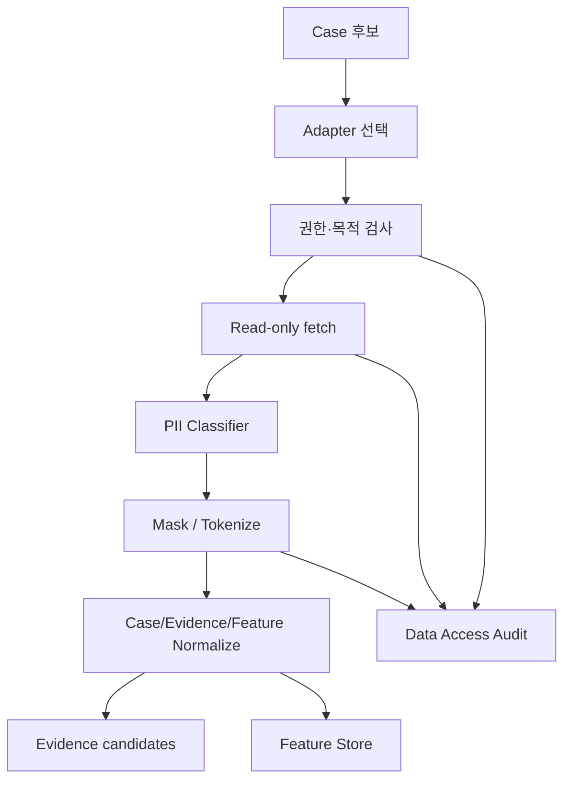

## 4. Pipeline ③ — Evidence Graph

### 목적

Evidence Graph는 AI 답변의 장식이 아니라 **판단을 감사 가능한 주장 그래프**로 바꾸는 파이프라인이다. 원문은 모든 주장에 `evidence_id`를 붙이고 `{claim, evidence_ids[], confidence, counter_evidence[]}` 형태를 제안했다. [E1:원문] D9는 `classic RAG + hybrid retrieval + reranking + citations`를 기본값으로 두고, 규정·약관·심사자료에서는 pure vector만 쓰지 말고 키워드 검색을 병행해야 한다고 정리했다. [E2:D9]

### 입력

| 입력 | 예시 | 근거 |
|---|---|---|
| Bank evidence candidates | 상담 요약, 여신 문서, FDS signal | [E1:원문] |
| Public references | 법령, 정책금융 공고, 지역 뉴스, 부동산 데이터 | [E4:modules.js `pluginRegistry`] |
| Agent claim draft | 에이전트가 만든 위험·조치·보완 필요 주장 | [E3:05_domain-model] |
| Counter evidence request | 반대근거 탐색, 누락 근거 점검 | [E1:원문] |

### 단계

| 단계 | 처리 | 출력 |
|---|---|---|
| 1. Evidence Card 생성 | `evidence_id`, `source_type`, `summary`, `access_level`, `pii_level`, `retention_policy` 부여 | Evidence Card |
| 2. Claim extraction | 에이전트 출력에서 주장 단위 분리 | `claim_id` |
| 3. Retrieval | classic RAG, 키워드, hybrid, rerank | `candidate_evidence_ids` |
| 4. Citation attach | 주장과 근거를 링크 | `claim.evidence_ids[]` |
| 5. Counter evidence | 반대근거·누락근거 탐색 | `counter_evidence[]` |
| 6. Confidence scoring | 근거 수, 출처 신뢰도, 최신성, 충돌 여부 계산 | `confidence` |
| 7. Evidence coverage audit | 근거 없는 주장 차단 또는 Human Gate 강화 | `coverage_status` |

### 출력

- `EvidenceGraph`: `claim_id`, `evidence_ids`, `confidence`, `counter_evidence`, `coverage_status`.
- Human Gate용 "근거 카드": 담당자가 근거·반대근거·불확실성을 한 화면에서 확인.
- Audit/Trust용 citation coverage 지표.

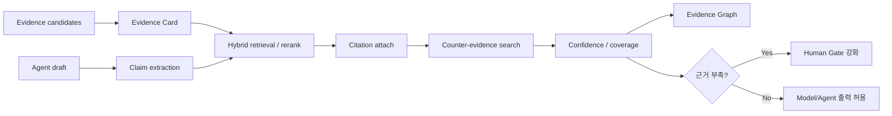

## 5. Pipeline ④ — Model/Algorithm

### 목적

Model/Algorithm 파이프라인은 "어떤 모델을 쓰는가"보다 **어떤 계산과 판단을 어디에 맡길 것인가**를 분리한다. D20은 금융 AX의 주 모델이 LLM이 아니라 특화모델·규칙엔진·레거시 어댑터를 묶는 하네스라고 정리한다. LLM은 점수화·예측·탐지를 직접 맡지 않고 의도 분류, 근거 범주 결정, 도구 선택, 결과 설명을 맡는다. [E2:D20]

### 입력

| 입력 | 설명 |
|---|---|
| `case_type`, `riskLevel`, `roleKey` | 모델·룰 선택의 기본 키 |
| Feature Store | 위험, 긴급도, 취약성, 규제 민감도, SLA 지연 |
| Evidence Graph | citation이 붙은 주장·근거·반대근거 |
| Data grade | `restricted/confidential/internal/public` 등급 |
| Policy constraints | 고객 발송 금지, 승인 레벨, 데이터 반출 제한 |

### 단계

| 단계 | 처리 | 적용 원칙 |
|---|---|---|
| 1. Task classify | 요약, 점수, 규칙판정, OCR, 검색, 초안 작성 구분 | LLM은 의도·도구 선택 |
| 2. Data grade gate | 민감정보가 있으면 로컬/온프레 또는 규칙으로 강등 | 원본 PII 외부 반출 금지 [E5:_canon] |
| 3. Algorithm route | 여신·FDS·조기경보·문서IE·추천별 엔진 선택 | 특화모델/Rule 우선 [E2:D20] |
| 4. Rule final gate | 승인·차단·적격성은 BRMS/DMN/정책 엔진이 최종 | [E2:D9] |
| 5. LLM summary | 근거 묶음과 결과를 설명 가능한 문장으로 패키징 | 단정 표현 금지 |
| 6. Model log | 모델/버전/입력요약/출력요약/룰 결과 기록 | Audit Skill [E2:D20] |

### 출력

- `model_decision_packet`: 점수, 룰 결과, 근거 요약, 불확실성, 다음 확인 항목.
- `routing_hint`: Agent & Skill Routing이 사용할 agent/skill/tool 후보.
- `model_log`: 모델·룰·도구·버전·데이터 등급·결과 요약.

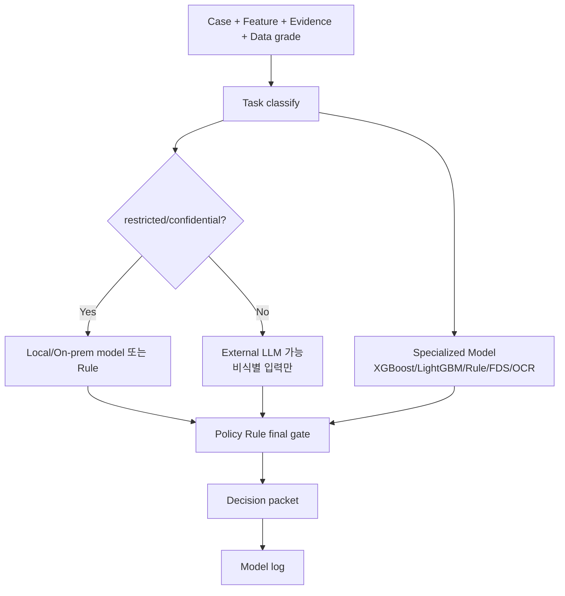

## 6. Pipeline ⑤ — Agent & Skill Routing

### 목적

Agent & Skill Routing은 Case Type, Role, Risk, Data Permission을 보고 에이전트·스킬·모델·근거를 자동 선택하는 파이프라인이다. 원문은 이를 "가장 중요한 차별점"으로 규정했다. [E1:원문] 실제 코드에서 `harnessRegistry.js`는 `jeonse-protection`, `corporate-credit`, `fds-response`, `jb-woori-capital` 같은 하네스를 manifest로 등록하고, 각 manifest가 `agents`, `skills`, `hooks`, `rules`, `guardrails`, `verification`을 가진다. [E4:harnessRegistry.js]

### 입력

| 입력 | 예시 |
|---|---|
| `Case` | `CCL-0001`, `loanType=smeWorking`, `riskLevel=high` |
| `roleKey`/`affiliateId` | `corporate-credit`, 계열사 스코프 |
| `model_decision_packet` | 점수·룰 결과·근거 요약 |
| `EvidenceGraph` | claim/evidence/counter-evidence |
| Skill registry | `modules.js`의 `skillContent`, `pluginRegistry`, 하네스별 `skills` |
| Guardrail state | PII, 단정 표현, 자동 종결, 승인 누락 |

### 단계

| 단계 | 처리 | 코드 대응 |
|---|---|---|
| 1. Harness resolve | `roleKey`/`affiliateId`로 manifest 조회 | `getHarness`, `listHarnesses` [E4] |
| 2. Agent candidate select | case type·risk·role에 맞는 에이전트 후보 | manifest `agents` [E4] |
| 3. Skill attach | 절차기억/업무기능을 자동 장착 | manifest `skills`, `skillContent` [E4] |
| 4. Tool/connector attach | 법령·정책·뉴스·JB DB connector 연결 | `pluginRegistry` [E4] |
| 5. Hook preflight | `beforeAgentRun` 등 훅 실행 | `harnessRunHooks` [E4] |
| 6. Guardrail decision | 위반 있으면 보류·Human Gate 강화 | `harnessGuardCheck*` [E4] |
| 7. AgentRun create | 실행 이력 생성, Evidence/Audit로 연결 | `AgentRun` 계약 [E3:05_domain-model] |

### 출력

- `AgentRun`: `queued/running/needsReview/pendingApproval/completed` 상태.
- `skill_bundle`: 실행할 skill, connector, model, policy gate 목록.
- `handoff_plan`: 다음 담당 에이전트 또는 사람 승인자.
- `routing_audit`: 어떤 조건 때문에 어떤 agent/skill/tool을 선택했는지 기록.

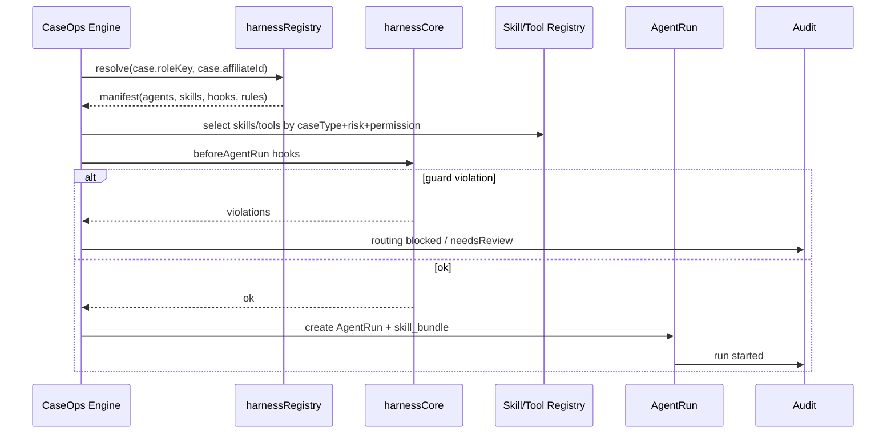

## 7. Pipeline ⑥ — Memory Governance

### 목적

Memory Governance는 "많이 기억하는 것"이 아니라 **무엇을, 어디에, 누가, 언제까지, 어떤 근거로 저장하고 지울지**를 정하는 파이프라인이다. D11은 메모리를 한 덩어리 저장소로 보지 말고 작업기억, 일화기억, 의미기억, 절차기억으로 나눠야 재사용성과 거버넌스가 같이 선다고 정리한다. [E2:D11] 원문은 Case, Customer, Staff, Role, Agent, Skill, Organization, Incident Memory의 8계층과 Customer↔Staff 분리를 제시했다. [E1:원문]

### 입력

| 입력 | 저장 후보 |
|---|---|
| Case 상태 | 현재 케이스 상담·근거·판단·상태 |
| AgentRun | 실행 이력, 성공/실패, 반려 이유 |
| Evidence | provenance가 붙은 의미기억 |
| Skill result | 특정 스킬 성공/실패 조건 |
| Approval/Audit | 사람 승인·반려·감사 이벤트 |
| Incident | 장애·오판·잘못된 추천·대응 이력 |

### 단계

| 단계 | 처리 | 원칙 |
|---|---|---|
| 1. 저장 가치 평가 | 재사용성, 감사 필요성, 고객 영향, 리스크 판단 | "최종 답"만 저장 금지 [E2:D11] |
| 2. 민감정보 검사 | PII·신용정보·희소속성 포함 여부 | 원본/요약 분리 |
| 3. 메모리 계층 선택 | Case/Customer/Staff/Role/Agent/Skill/Org/Incident | Customer↔Staff 분리 [E1:원문] |
| 4. Provenance attach | 출처, 생성자, 수정자, 시각, 버전, 변경 이력 | 없으면 비감사성 캐시 [E2:D11] |
| 5. 접근권한 부여 | 역할·계열사·목적별 읽기 권한 | `roleKey` scope |
| 6. Retention/forgetting | 보존기간·삭제·정정·재산출 정책 | 서버 이관 항목 [분기/미확정][미검증] |
| 7. Memory mutation audit | 모든 write/update/delete를 Audit에 연결 | `Memory Mutation` 로그 |

### 출력

- `memory_write_decision`: 저장 위치, 보존기간, 접근권한, 삭제조건.
- `memory_ref`: 후속 Case와 AgentRun이 참조할 id.
- `memory_mutation_log`: 어떤 정보가 왜 어떤 계층에 들어갔는지 남김.

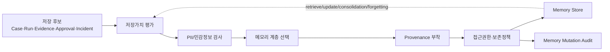

## 8. Pipeline ⑦ — Human Gate

### 목적

Human Gate는 AI의 권한을 UX 제스처로 제한하는 책임분리 파이프라인이다. 이 문서의 핵심 표현은 **Enter / Enter Enter / Click = 책임분리**다. 즉 같은 "확인"이라도 내부 검토, 고객 영향 초안, 실제 승인·전송은 입력 방식과 권한 주체를 분리한다. 정본 아키텍처는 고객 대상 행동을 사람 승인 전 자동 실행 금지로 고정하고, 고위험은 감독/준법 결재를 강제한다. [E5:_canon] [E3:07_architecture]

### 입력

| 입력 | 의미 |
|---|---|
| `decision_packet` | 모델·룰·근거 결과 |
| `EvidenceGraph` | 주장별 근거·반대근거 |
| `riskLevel` | low/medium/high/critical |
| `requiresHumanReview` | 승인 필요 여부 |
| `approval_status` | pending/approved/rejected 등 |
| `actorId` | 사람은 `USR-*`, 에이전트는 `ccl-*` |

### 단계

| 단계 | UI 책임분리 | 허용 행동 | 차단 행동 |
|---|---|---|---|
| 1. Enter | 담당자가 내부 검토 상태를 넘김 | 큐 이동, 근거 확인, 초안 재생성 | 고객 발송·결재 |
| 2. Enter Enter | 고위험·고객 영향 초안을 명시 재확인 | 승인 요청 등록, 보완 요청 | 자동 승인·자동 발송 |
| 3. Click | 감독/준법 최종 클릭 승인 | approved/rejected 결정 | AI actor의 자체 결재 |
| 4. Hook enforcement | `beforeCustomerMessage`, `afterApprovalDecision` | PII·단정·승인 누락 검사 | 위반 시 hold |
| 5. Approval event | 승인/반려를 Audit과 Memory에 기록 | Revise/Retain | 누락 기록 금지 |

### 출력

- `Approval`: pending, approved, rejected.
- `Human approval audit`: actor, timestamp, input gesture, evidence snapshot.
- 고객 영향 행동 허용/차단 결정.

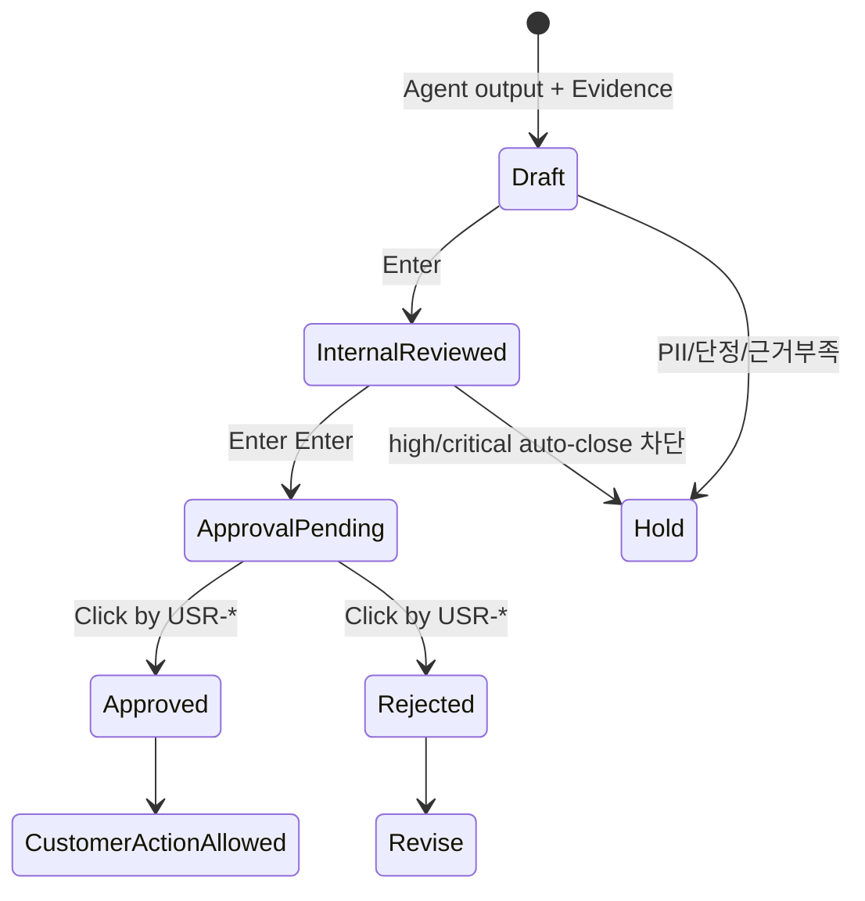

## 9. Pipeline ⑧ — Audit/Trust

### 목적

Audit/Trust는 "로그를 남긴다"가 아니라 **AI를 의심·검증·운영할 수 있는 신뢰 장치**다. 원문은 최소 로그 범주로 Case, Data Access, Model, Prompt/Context, Agent Decision, Skill Execution, Human Approval, Memory Mutation, Incident를 제시했다. [E1:원문] B1은 AgentRun 계약을 Temporal식 append-only `events`, 승인 게이트를 StackStorm `core.ask`식 상태기계로 잡으라고 정리한다. [E2:B1]

### 입력

| 입력 | 출처 |
|---|---|
| Case event | Intake, state transition |
| Data access event | Bank Data Connector |
| Model event | Model/Algorithm Registry |
| Agent/Skill event | Agent & Skill Routing |
| Evidence event | Evidence Graph |
| Approval event | Human Gate |
| Memory event | Memory Governance |
| Incident event | 119 |

### 단계

| 단계 | 처리 | 코드·근거 |
|---|---|---|
| 1. Normalize audit event | `actorId`, `action`, `targetType`, `targetId`, `riskLevel`, `reviewRequired` | `cclWriteAudit()` 필드 [E3:05_domain-model] |
| 2. Append-only write | 기존 이벤트를 덮어쓰지 않고 추가 | B1 append-only events [E2:B1] |
| 3. Hash/sign target | 이전 로그 해시 또는 서명 연결 | 정본에서는 목표, CCL은 append-only 구현 [E3:07_architecture] |
| 4. Trace linkage | case/run/evidence/approval/memory/incident 간 링크 | Evidence traceability 100% 목표 [E5:_canon] |
| 5. Review queue | `reviewRequired=true`만 감독 감사 큐에 표시 | [E3:05_domain-model] |
| 6. Trust dashboard | pass rate, tool success, approval burden, time-to-resolution | Harness benchmark [E2:D20] |

### 출력

- `Audit Ledger`: CaseOps 전체의 append-only event stream.
- `Trust signals`: 근거 커버리지, 승인 안전성, 반출 차단, 모델·도구 버전, 재검사 필요 여부.
- 119 입력: 위반 패턴, 이상 징후, 재발 후보.

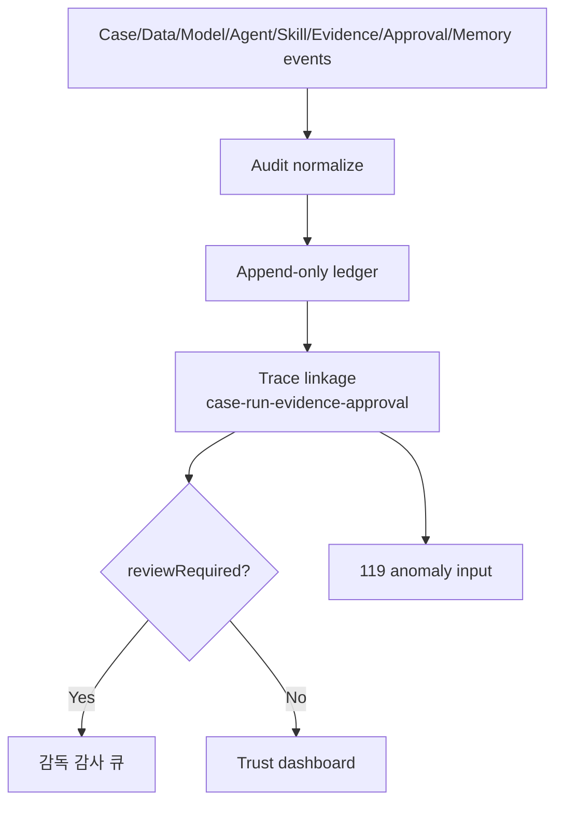

## 10. Pipeline ⑨ — 119 Incident

### 목적

119 Incident는 운영 중 사고를 "나중에 사과하는 일"로 두지 않고 **즉시 정지·격리·원인분류·복구·재검사**하는 파이프라인이다. 원문은 핵심 동작을 `Kill Switch + Rollback + Replay + Quarantine + Hotfix`로 정리했다. [E1:원문] D9는 운영에서 `independent rollback`과 trace가 필요하다고 정리한다. [E2:D9]

### 입력

| 트리거 | 예시 |
|---|---|
| Guardrail violation | PII 외부 전달 시도, 단정 표현, 승인 누락 |
| Evidence failure | 근거 누락, 반대근거 무시, 낮은 confidence |
| Model/tool failure | 모델 장애, tool timeout, adapter 오류 |
| Human pattern risk | 습관적 승인, 고위험 누락 |
| Audit anomaly | 동일 케이스 반복 실패, 로그 불일치 |

### 단계

| 단계 | 처리 | 산출 |
|---|---|---|
| 1. Detect | Audit/Trust, Guardrail, Human Gate에서 이상 감지 | `incident_id` |
| 2. Kill Switch | 해당 에이전트·스킬·커넥터 일시 정지 | `disabled_target` |
| 3. Quarantine | 케이스와 관련 Evidence/Memory 격리 | `quarantine_scope` |
| 4. Log collect | Case/Data/Model/Prompt/Agent/Skill/Approval/Memory 로그 수집 | `incident_bundle` |
| 5. Root cause classify | 환각, 데이터 접근 오류, PII 반출, 과잉자동화, 고위험 누락, API 장애 등 분류 | `cause_type` |
| 6. Rollback/Hotfix | 잘못된 추천·메모리·스킬·룰 되돌림 또는 긴급 패치 | `rollback_plan`, `hotfix_rule` |
| 7. Replay | 유사 케이스 재검사 | `replay_result` |
| 8. Memory update | Incident Memory와 Skill/Agent 개선 후보 저장 | `learning_ref` |

### 출력

- `Incident Report`: 원인, 영향 범위, 조치, 재발 방지.
- `Quarantine state`: 해당 케이스·에이전트·스킬·커넥터의 격리 상태.
- `Replay queue`: 유사 케이스 재검사 목록.
- `Hotfix`: 정책룰, connector 상태, skill 문구, Human Gate 강화.

```mermaid
flowchart LR
    TRG["Audit/Guardrail/Human anomaly"] --> DET["119 Detect"]
    DET --> KILL["Kill Switch"]
    KILL --> Q["Quarantine Case/Skill/Memory"]
    Q --> COL["Log collect"]
    COL --> RCA["Root cause classify"]
    RCA --> RB["Rollback / Hotfix"]
    RB --> RP["Replay similar cases"]
    RP --> MEM["Incident Memory update"]
    MEM --> TRUST["Trust dashboard 회복"]
```

## 11. 9개 파이프라인 간 데이터 계약

| From | To | 넘기는 것 | 반드시 남기는 로그 |
|---|---|---|---|
| Case Intake | Bank Data Connector | `case_id`, `roleKey`, 조회 목적, 최소 키 | Case log |
| Bank Data Connector | Evidence Graph | Evidence 후보, Feature 후보, PII level | Data Access log |
| Evidence Graph | Model/Algorithm | claim/evidence/counter-evidence/confidence | Evidence log |
| Model/Algorithm | Agent & Skill Routing | decision packet, routing hint, model log id | Model log |
| Agent & Skill Routing | Memory Governance | AgentRun, skill result, handoff plan | Agent/Skill log |
| Memory Governance | Human Gate | 이전 케이스·역할·조직 메모리 요약 | Memory Mutation log |
| Human Gate | Audit/Trust | approval decision, actor, evidence snapshot | Human Approval log |
| Audit/Trust | 119 Incident | anomaly, trace bundle, reviewRequired events | Incident log |
| 119 Incident | Case Intake/Model/Skill | replay result, hotfix rule, disabled target | Incident closure log |

## 12. Paperclip vs JB LocalGuard OS

| 항목 | Paperclip | JB LocalGuard OS | 차용/비차용 |
|---|---|---|---|
| 기본단위 | `Company → Goal → Issue/Task → Agent` | `Case → Customer/Role/Risk → AgentRun → Evidence → Approval → Audit` | Task 구조가 아니라 CaseOps 구조로 재정의 |
| 입력방식 | 사용자 목표, task assignment, comment, manual heartbeat | 은행 이벤트 자동 생성 + 담당자 수동 보완 + 스케줄러 | heartbeat 개념명만 일부 차용 |
| 에이전트 | 범용 AI employee, role/reporting/budget 중심 | RM, 여신, 전세, FDS, 준법, 운영 등 금융 역할 특화 | "agent as employee" IA만 참고 |
| 데이터 | 프로젝트 컨텍스트, task, comment, repo/workspace | 은행 DB, 상담, 거래, 공공데이터, 매뉴얼, 정책, Evidence | 금융 데이터 등급·PII 비반출 우선 |
| 모델 | Adapter가 Claude/Codex/process/http 등 실행 런타임 연결 | 외부 LLM + 내부/온프레 모델 + 룰엔진 + 특화ML + OCR/RAG | CLI adapter 런루프 비차용 |
| 스킬 | runtime skill injection, skills catalog | 금융 역할별 자동장착, 도메인팩, connector, policy tool | `SKILL.md` 패키징 아이디어만 참고 |
| 거버넌스 | board approval, budget, rollback, activity audit trail | PII 비반출, Human Gate, 준법룰, 감사원장, 119, 원장 비쓰기 | approval/audit/rollback 상태명 차용 |
| 목적 | AI 회사/팀 운영 control plane | 금융 케이스 안전처리 CaseOps control plane | 목적 자체가 다름 |
| 저장소 | `pnpm` workspaces, DB schema/migration, React UI, Express API | `vanilla JS`, 정적 파일, `localStorage`, 추후 서버 API 1:1 승격 | monorepo·React·Express·Drizzle 비차용 |
| UI/IA | org, issue, agent, approval, activity 중심 | org rail, case board, evidence, approval, audit, incident 중심 | 화면 정보구조만 클린룸 재구현 |

**결론**: JB LocalGuard OS는 Paperclip형 AgentOps control plane을 금융기관용 CaseOps로 재설계한 것이다. Paperclip의 스택을 가져오는 것이 아니라, **은행 데이터·모델·스킬·사람 승인·감사·119가 연결되는 운영체계 이름과 경계**를 가져온다. [E1:원문] [E3:paperclip-통합-블루프린트]

## 13. GitHub 저장소 구조 제안

### 13.1 원문 monorepo `packages/` 제안의 vanilla JS 매핑

원문은 `packages/case-intake`, `case-priority`, `agent-orchestrator`, `skill-registry`, `memory-router`, `evidence-rag`, `model-router`, `policy-engine`, `audit-ledger`, `incident-119` 같은 monorepo 구조를 제안했다. [E1:원문] 하지만 본선 결론은 `vanilla JS` 무빌드다. 따라서 `packages/`를 실제 `pnpm workspace`로 만들지 않고, **심사위원에게 보이는 논리 패키지명**을 문서·파일 섹션·전역 객체·하네스 manifest로 매핑한다.

| 원문 package 개념 | 책임 | 현재 대응 파일/모듈 | 신규 파일 필요 여부 | 충돌 해소 |
|---|---|---|---|---|
| `case-intake` | 이벤트→Case 정규화, dedup, priority seed | `harnessCore.js` hook 계약, `harnessRegistry.js` `caseCreationFlow`, CCL 서비스는 백본에서 `cclConsole.data.js`로 인용 | 승급 시 `caseIntake` 섹션 또는 파일 [분기/미확정][미검증] | 실제 package 대신 `<script>` 로드 모듈 |
| `case-priority` | 설명가능 priority scoring | `07_architecture`·원문 Case Priority Scoring, 현 CCL은 `riskLevel/requiresHumanReview` | 산식 함수 승급 필요 [분기/미확정][미검증] | 함수 계약만 노출, 빌드 없음 |
| `bank-data-connector` | read-only adapter, Data Contract, PII classify | `modules.js` `pluginRegistry`의 `jb-db`, `dataGovernance`; 블루프린트 §3 | connector manifest 확장 필요 [분기/미확정][미검증] | pluginRegistry 객체 리터럴로 구현 |
| `evidence-rag` | Evidence Card, claim/evidence/citation, counter-evidence | `modules.js` deliverable/evidence UI, `05_domain-model` Evidence 엔티티 | EvidenceGraph 객체화 필요 [분기/미확정][미검증] | localStorage rows + JS helper |
| `model-router` | 데이터 등급별 LLM/로컬/룰/특화ML 라우팅 | `modules.js` `dataGovernance.route`, `07_architecture` 모델 라우팅 | 실모델 adapter는 서버 이관 때 [분기/미확정][미검증] | 외부 API client 추가 금지, mock/계약 우선 |
| `agent-orchestrator` | AgentRun, handoff, hook 실행 | `harnessCore.js` `registerHarness`, `harnessRunHooks`; `harnessRegistry.js` manifests | 현 구조 유지 | 핵심 엔진으로 명명만 강화 |
| `skill-registry` | role별 skill/tool 자동장착 | `harnessRegistry.js` `skills`, `modules.js` `skillContent`, `pluginRegistry` | `registerPlugin/requirePlugin`은 블루프린트 Task | 정적 배열→런타임 등록은 차후 소규모 리팩터 |
| `memory-router` | 8계층 메모리 분리, retention/forgetting | `05_domain-model` Data lifecycle, D11 근거 | 서버 이관 시 신규 필요 [분기/미확정][미검증] | 문서 계약 먼저, localStorage에는 요약만 |
| `policy-engine` | BRMS/DMN, 승인 레벨, 금지 표현 | `harnessCore.js` guard util, CCL rules/hook, `harnessVerification.js` | L0~L4 매핑 확정 필요 [분기/미확정][미검증] | 정규식·함수 guard부터 |
| `audit-ledger` | append-only trace, review queue, trust metrics | `harnessCore.js` `hookLog`, `harnessVerification.js`, CCL `ccl_audit_logs` 백본 | hash/sign은 미구현 [분기/미확정][미검증] | append-only contract를 문서화 |
| `incident-119` | Kill Switch, Quarantine, Rollback, Replay | 원문·블루프린트 개념, `harnessVerification.js` self-test 일부 | 신규 view/registry 필요 [분기/미확정][미검증] | 코드 구현 전 문서/데모 스크립트 우선 |

### 13.2 Paperclip 실제 package 개념의 대응

| Paperclip 실제 구조 | Paperclip 역할 | JB LocalGuard OS 대응 | 결론 |
|---|---|---|---|
| `packages/db` | Drizzle schema, migrations, embedded Postgres | CCL localStorage + 향후 서버 DB 후보 | Drizzle 이식 금지. `Audit`, `Approval`, `Activity` 필드 shape만 참고 |
| `packages/shared` | API types, constants, validators | `harnessCore.js` 필수 manifest key, guard util | TS type 대신 JS 런타임 validator |
| `packages/adapter-utils` | agent runtime env, skill materialization, redaction | `dataGovernance`, `pluginRegistry`, 모델 라우팅 계약 | CLI adapter env 비차용 |
| `packages/adapters/*` | Claude/Codex/local/http adapter | 외부 LLM/로컬모델 라우팅 개념 | agent CLI spawn 비차용 |
| `packages/plugins/sdk` | worker/RPC plugin isolation | `modules.js` pluginRegistry | 서버 없으므로 worker/RPC 스킵 |
| `packages/mcp-server` | Paperclip을 MCP로 노출 | 본선 이후 `harnessCore` tool 노출 후보 | 본선 범위 밖 [분기/미확정][미검증] |
| `packages/skills-catalog` | bundled/optional skill catalog | `modules.js` `skillContent`, 하네스별 `skills` | `SKILL.md` 포맷 아이디어만 |
| `packages/teams-catalog` | team/company package import | 계열사/역할 하네스 manifest | `COMPANY/TEAM/AGENTS/SKILL` 문서 패키징 아이디어 참고 |
| `server` | Express API, auth, routes, services | 정적 MVP 이후 서버 승격 후보 | 지금 도입 금지 |
| `ui` | React/Vite dashboard | vanilla HTML/CSS/JS console | UI 정보구조만 클린룸 |

### 13.3 무빌드 모듈형 운영체계 레이아웃

심사위원에게 "모듈형 운영체계"로 보이게 하되, 실제로는 `pnpm workspace`를 만들지 않는다. 레이아웃은 **폴더명과 파일명으로 패키지 경계를 보이게 하고, `index.html`의 `<script>` 로드 순서가 dependency graph 역할**을 하게 만든다.

```text
02_제품/app/ 또는 08_본선/03_제품/app/ [분기/미확정][미검증]
├── index.html
├── styles.css
├── app.js
├── modules.js                         # skillContent, pluginRegistry, dataGovernance
├── harnessCore.js                     # manifest, hooks, guardrails
├── harnessRegistry.js                 # role/affiliate harness manifests
├── harnessVerification.js             # deterministic self-test
├── caseops/
│   ├── caseIntake.js                  # 논리 package: case-intake
│   ├── bankDataConnector.js           # 논리 package: bank-data-connector
│   ├── evidenceGraph.js               # 논리 package: evidence-rag
│   ├── modelAlgorithmRegistry.js      # 논리 package: model-router + algorithm registry
│   ├── memoryGovernance.js            # 논리 package: memory-router
│   ├── auditLedger.js                 # 논리 package: audit-ledger
│   └── incident119.js                 # 논리 package: incident-119
├── harnesses/
│   ├── corporateCreditHarness.js      # CCL-0001 hero
│   ├── jeonseProtectionHarness.js
│   └── fdsResponseHarness.js
├── data/
│   ├── sample_cases.json              # 비식별 sample only
│   ├── manuals.sample.json
│   └── connectors.sample.json
└── tests/
    └── static-contract.md             # verify_static.py가 검사할 needle 목록
```

위 구조는 **제안**이다. 현재 읽기 기준 실코드는 `_vendor/JB_project2/app/harnessCore.js`, `harnessRegistry.js`, `harnessVerification.js`, `modules.js`에 있다. 실제 승급 위치를 `02_제품/app`으로 할지 `08_본선/03_제품/app`으로 할지는 정본 배포 전략 결정 후 확정한다. [분기/미확정][미검증]

### 13.4 monorepo ↔ vanilla 충돌 해소안

| 충돌 | monorepo 방식 | vanilla JS 해소안 | 심사 표현 |
|---|---|---|---|
| 패키지 경계 | `packages/*` workspace import | 파일·전역 객체·manifest 경계 | "논리 패키지" |
| 타입 공유 | TS types, zod validators | `HARNESS_MANIFEST_REQUIRED_KEYS`, runtime self-test | "실행 계약 검증" |
| 서버 라우팅 | Express route/service | 함수 계약 + 추후 API 1:1 승격 | "서버 승격 가능한 정적 함수 계약" |
| DB schema | Drizzle migrations | localStorage schema + append-only rows | "MVP 저장소, production DB 후보 분리" |
| plugin runtime | worker/RPC, server registry | `pluginRegistry` 객체 + `govTier` + `usedBy` | "금융 connector registry" |
| agent runtime | CLI adapter heartbeat | 브라우저 즉시 실행/완료 + AgentRun 기록 | "데모 하네스 run loop" |
| approval | board approval | Human Gate `USR-*` 결재 + hook | "금융 책임분리 승인 게이트" |
| audit | activity audit trail | `ccl_audit_logs` + hookLog + self-test | "감사가능 운영 원장" |

**운영 문장**: "우리는 Paperclip을 복제하지 않고, Paperclip이 보여준 control-plane 패턴을 금융 CaseOps로 다시 쓴다. 그래서 코드 구조는 무빌드 vanilla JS지만, 논리 구조는 `CaseOps Engine`, `Bank Data Connector`, `Model & Algorithm Registry`, `Agent Orchestrator`, `Skill & Tool Registry`, `Evidence Graph`, `Human Gate`, `Audit Ledger`, `119 Incident`의 모듈형 운영체계로 설명한다."

## 14. 검증·미확정 체크

| 항목 | 상태 | 다음 액션 |
|---|---|---|
| `CCL-0001`과 canon `JBG-104`의 발표 표기 병행 | 정합 확인 | 내부 id와 데모 code를 분리 표기 |
| 01~04 분기 문서 링크 | [분기/미확정][미검증] | 해당 파일 작성 후 wikilink 검증 |
| L0~L4 승인 매핑 | [분기/미확정][미검증] | `riskLevel/requiresHumanReview`와 정본 승인 레벨 매핑 확정 |
| MCI/EAI 전문·Nexacro WebView | [분기/미확정][미검증] | 비공개 규격 확인 전 문서에서 일반 원칙만 |
| hash/sign audit 구현 | [분기/미확정][미검증] | 현 CCL append-only와 04_tech hashchain 목표 분리 |
| 서버·DB 승격 위치 | [분기/미확정][미검증] | `02_제품/app` vs `08_본선/03_제품/app` 결정 |
| 119 실제 UI/registry 구현 | [분기/미확정][미검증] | 문서·시연 스크립트 후 코드 트랙 분리 |

## 연결

- [[_INDEX|CaseOps 분기]]
- [[_원문-ChatGPT-CaseOps대화|CaseOps 원문]]
- [[paperclip-통합-블루프린트]]
- [[01-메모리-거버넌스]]
- [[02-CaseOps-Engine-7알고리즘]]
- [[03-119-사고대응-에이전트]]
- [[04-은행DB연결-특화모델]]
- [[08_본선/03_제품/07_architecture|07_architecture]]
- [[08_본선/03_제품/05_domain-model|05_domain-model]]
- [[_요약-D9]]
- [[_요약-D20]]
- [[_요약-B1]]
- [[_요약-D11]]
