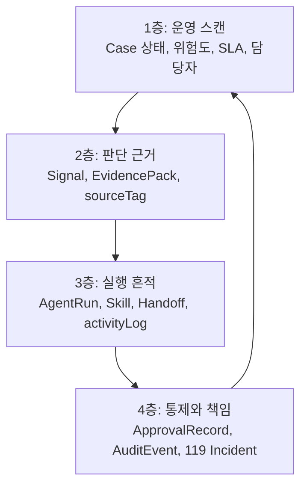
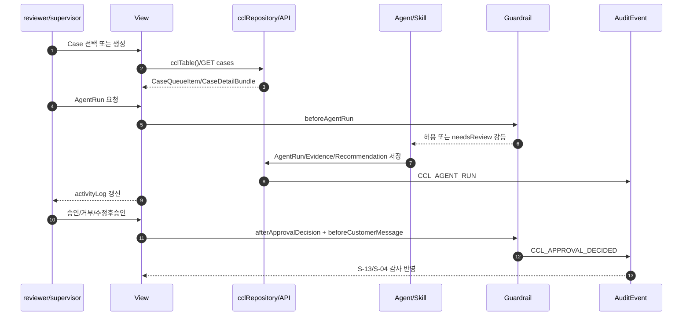
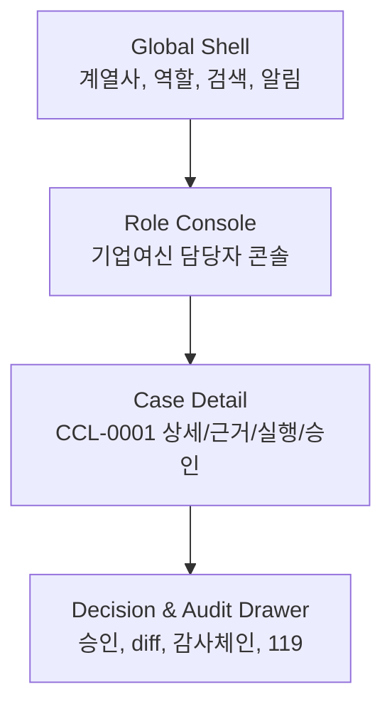

# 06 정보체계 · 뷰 · 데이터바인딩 스펙

> **목적**: 디자이너 세션 `JB금융-디자인`이 화면 정보계층, 뷰 목록, 컴포넌트 역할, 데이터 바인딩을 확정하기 위한 작업 스펙이다. 이 문서는 비주얼 디자인을 확정하지 않는다.
> **히어로**: `CCL-0001` - 전주 카페 운영자 운전자금 검토(김건우). 유지(폐기 아님) + **쇼케이스 6페르소나 확장**(2계열사=전북은행+JB우리캐피탈, [[_쇼케이스-빌드플랜]]).
> **구현 제약**: vanilla JS, 무빌드, 현재 구현 근거는 `_vendor/JB_project2/app/`의 역할축 콘솔. JBFG 토큰(`#0A31A8`, `#1C56FF`, `SUIT Variable`)은 참조만 하며 실제 시각 결정은 디자인 세션 소유.
> **분기 상태**: CaseOps 확장 개념(메모리 라우터, 119, 은행 DB 커넥터, 모델/알고리즘 레지스트리)은 정본 승격 전까지 `[분기/미확정]`이다.

## 0. 읽는 법

이 문서는 다음 질문에 답한다.

1. `Case/Signal/EvidencePack/RecommendationDraft/ApprovalRecord/AuditEvent/AgentRun/Skill`이 화면 어디에 보이는가.
2. 계열사, 역할, 케이스 축이 어떤 내비게이션과 정보 밀도를 만든다.
3. 로그인부터 119 사고 대시보드까지 핵심 뷰가 어떤 데이터와 연결된다.
4. Paperclip에서 배울 것은 무엇이고, 그대로 베끼면 안 되는 것은 무엇인가.

### 0.1 SSOT와 충돌 처리

| 항목 | 1차 근거 | 화면 설계 적용 |
|---|---|---|
| 정식 용어 | `00_vision/definitions.md` | 화면 라벨은 정식 8종 객체명을 우선한다. 코드명이 다르면 최초 1회 병기한다. |
| 도메인 상태/권한 | `05_domain-model.md` | CCL 콘솔은 `riskLevel + requiresHumanReview + supervisor` 모델을 우선한다. |
| 골든패스 | `09_flow.md` | `S-03`, `S-04`, `S-13`는 흐름 ID와 정합한다. |
| 기능 수용기준 | `08_feature-spec.md`, `01_prd/prd.md` | empty/loading/error, 승인 불변식, PII 반출 차단을 뷰 상태로 반영한다. |
| 실제 코드 | `_vendor/JB_project2/app/` | 구현된 CCL route/view/table/function을 바인딩 근거로 병기한다. |
| 디자인 토큰 | `_JBFG-디자인-레퍼런스.md`, `03_ux/design-system.md` | 색/타이포/밀도 원칙만 참조한다. 비주얼 확정은 하지 않는다. |
| Paperclip 참조 | `_vendor/paperclip-master/` | 정보구조와 상호작용 패턴만 번역한다. 시각 스타일, 레이아웃, 아이콘은 사용하지 않는다. |

### 0.2 화면ID 정합 규칙

`09_flow.md`와 `_archive/ia-screen-map.md`를 기준으로 하되, 요청 범위에 필요한 신규/드릴인 화면은 확장 ID로 둔다.

| ID | 의미 | 상태 |
|---|---|---|
| `S-00` | 로그인/역할 진입 게이트 | `[분기/미확정]` - IA 정본에는 없음, `09_flow` Step 1에만 존재 |
| `S-02` | 알림함 | 정본 IA 존재, CCL 전용 구현은 부분 |
| `S-03` | 케이스 보드/생성/상세 | 정본 IA와 CCL 구현 모두 존재 |
| `S-04` | 승인 대기/승인 상세 | 정본 IA와 CCL 구현 모두 존재 |
| `S-05` | AgentRun 실행이력 | 정본 IA 존재, CCL 구현은 `agent-harness`와 `ccl_agent_runs`로 표현 |
| `S-05-detail` | 단일 AgentRun 상세 | 드릴인 확장 ID - 실행 1건의 입력/스킬/transcript/handoff/guardrail/audit |
| `S-07/S-08` | 에이전트/조직도 | 정본 IA 존재 |
| `S-07-detail` | 에이전트 상세(탭 워크스페이스) | 드릴인 확장 ID - Paperclip `AgentDetail` 6탭 번역 |
| `S-11/S-12` | 스킬/플러그인 | 정본 IA 존재 |
| `S-11-detail`/`S-12-detail` | 스킬/플러그인 상세 | 드릴인 확장 ID - 장착 능력·금지선·소스 계약 |
| `S-13` | 활동/감사 | 정본 IA 존재, CCL 구현은 `audit-logs` |
| `S-16` | 설정 | 정본 IA 존재 |
| `S-17` | 119 사고 대시보드 | `[분기/미확정]` - CaseOps 분기 신규 제안 |

## 1. 정보 체계(Information System)

### 1.1 운영 정보의 기본 문장

JB LocalGuard OS의 화면은 다음 문장을 계속 반복해서 보여줘야 한다.

```text
Case가 들어오고,
Signal이 위험을 설명하며,
EvidencePack이 주장의 출처를 붙이고,
AgentRun이 직원처럼 작업한 흔적을 남기고,
RecommendationDraft가 다음 행동 초안을 만들며,
ApprovalRecord가 사람 결정을 기다리고,
AuditEvent가 모든 변화와 책임을 봉인한다.
Skill은 Agent가 무엇을 할 수 있고 무엇을 못 하는지 정한다.
```

이 문장이 화면의 정보 우선순위다. "AI가 답했다"가 아니라 "누가 어떤 근거로 무엇을 제안했고, 사람이 어디서 승인해야 하는가"가 먼저 보여야 한다.

### 1.2 도메인 엔티티에서 화면 정보 계층으로

| 도메인 엔티티 | CCL 구현 테이블/함수 | 화면 정보 계층 | 대표 컴포넌트 | 반드시 보일 필드 | 보이면 안 되는 것 |
|---|---|---|---|---|---|
| `Case` | `ccl_cases`, `createCorporateCreditCase()` | 모든 화면의 루트 작업 단위 | `CaseCard`, `CaseDetailHeader`, `KanbanColumn` | `caseNo`, `title`, `bizRefId`, `segment`, `loanType`, `amountBand`, `status`, `riskLevel`, `requiresHumanReview`, `dueAt`, `assignedToId` | 실명, 전화, 계좌, 사업자 원문 식별정보 |
| `Signal` | `RiskSignal` 목표 모델, CCL은 `riskLevel/repaymentBand/docsStatus`로 부분 표현 | Case 안의 위험 설명 레이어 | `SignalStack`, `RiskBreakdown`, `SourceTagBadge` | `name`, `value`, `weight`, `contribution`, `sourceTag`, `evidenceId` | 확정 승인/거절/신용등급 단정 |
| `EvidencePack` | `ccl_review_notes`, `ccl_doc_checks`, `ccl_consult_logs`, `ai_recommendations` | 판단과 초안의 근거 레이어 | `EvidenceCard`, `EvidenceDrawer`, `EvidenceGraphMini` | `id`, `kind/type`, `summary`, `status`, `createdAt`, `sourceMode`, `piiGrade` | 원문 PII, 출처 없는 추천 |
| `RecommendationDraft` | `ai_recommendations`, `ccl_memo_drafts`, `Approval.actionDraft` 목표 필드 | 승인 전 행동 초안 | `DraftPreview`, `EditableDraft`, `DiffPanel` | `title`, `summary/actionDraft`, `status`, `confidence`, `agentId`, `caseId` | 승인 전 발송 버튼 |
| `ApprovalRecord` | `approvals`, `cclDecideApproval()` | 사람 결정 게이트 | `ApprovalCard`, `GateCheckList`, `DecisionActionBar` | `id`, `caseId`, `approvalType`, `status`, `requestedById`, `approverId`, `requestedAt`, `decisionNote` | AI 자체 승인, 사유 없는 override |
| `AuditEvent` | `ccl_audit_logs`, `cclWriteAudit()`, 목표 `auditChainRecords()` | 책임과 재현성 레이어 | `AuditEventRow`, `AuditChainDrawer`, `ActivityRow` | `actorId`, `action`, `targetType`, `targetId`, `riskLevel`, `reviewRequired`, `createdAt`, `hash/previousHash` 목표 | 삭제 가능한 단순 로그처럼 보이는 표현 |
| `AgentRun` | `ccl_agent_runs`, `recordCorporateCreditAgentRun()`, `cclUpgradeFinancialRun()` | 에이전트가 일하는 장면 | `AgentRunTimeline`, `RunTranscript`, `HandoffChip` | `agentId`, `caseId`, `inputSummary`, `outputSummary`, `status`, `riskLevel`, `requiresHumanReview`, `createdAt` | `completed`로 고위험 자동 종결된 것처럼 보이는 상태 |
| `Skill` | `cclConsoleSkills`, 목표 `Skill` 엔티티 | Agent의 장착 능력과 금지선 | `SkillBadge`, `SkillCard`, `SkillConfigRow` | `key`, `label`, `agentIds`, `inputs`, `outputs`, `approvalPolicy`, `riskLevel`, `inputPiiGrade` | 권한 없는 스킬 장착/실행 |

### 1.3 화면 정보의 4층 구조



| 층 | 사용자의 질문 | 화면 반응 | 대표 뷰 |
|---|---|---|---|
| 1층 운영 스캔 | 오늘 무엇을 먼저 봐야 하나 | 보드, 카운트, 위험/SLA 정렬, 담당자 표시 | S-02, S-03 |
| 2층 판단 근거 | 왜 위험하다고 하나 | 신호 분해, 근거카드, 출처/최신성/PII 등급 | S-03 상세, S-04 |
| 3층 실행 흔적 | AI 직원이 뭘 했나 | AgentRun 타임라인, handoff, Skill badge, transcript | S-05, S-03 상세 |
| 4층 통제와 책임 | 누가 승인했고 어떻게 되돌리나 | 승인함, 감사행, 해시체인, 119 사고 대응 | S-04, S-13, S-17 |

### 1.4 복합 ViewModel

디자인 세션은 원 테이블을 그대로 화면에 뿌리지 말고 아래 ViewModel 단위로 컴포넌트를 잡는다.

| ViewModel | 조합 데이터 | 쓰는 화면 | 설계 목적 |
|---|---|---|---|
| `CaseQueueItem` | `Case + User + open Approval count + latest AgentRun status + evidenceDebt` | S-02, S-03 | 카드/행 한 줄에서 업무 우선순위 판단 |
| `CaseDetailBundle` | `Case + Signal[] + EvidencePack + AgentRun[] + ApprovalRecord[] + AuditEvent[]` | S-03 상세 | context-panel에서 요약, 근거, 실행, 승인, 감사를 한 번에 연결 |
| `AgentRunActivityItem` | `AgentRun + Agent + Skill + Handoff[] + AuditEvent` | S-05 | 에이전트가 회사 직원처럼 일하는 흐름 표현 |
| `ApprovalQueueItem` | `ApprovalRecord + Case + RecommendationDraft + EvidencePack + gateChecks` | S-04 | 승인자가 초안과 근거를 동시에 보고 결정 |
| `AuditTrailItem` | `AuditEvent + actor(User/Agent) + target(Case/Run/Approval) + hash` | S-13 | 감사 로그를 검색 가능한 내비게이션으로 사용 |
| `SourceConfigItem` | `Skill + external_connector + bank_data_contract + model_route + RBAC` | S-16 | 담당자가 어떤 소스/스킬/모델을 신뢰할지 설정 `[분기/미확정]` |
| `Incident119Item` | `Incident + affected Case[] + blocked AgentRun[] + AuditEvent[] + recoveryAction` | S-17 | Kill Switch, Quarantine, Replay, Rollback을 업무 흐름화 `[분기/미확정]` |

### 1.5 핵심 데이터 흐름



## 2. 계층 전략(Hierarchy)

### 2.1 세 축: 계열사 × 역할 × 케이스

| 축 | 예시 | 화면에서 드러나는 위치 | 데이터 키 | 우선순위 |
|---|---|---|---|---|
| 계열사 | 전북은행, JB우리캐피탈 | `org-rail`, 전역 scope, 설정 | `workspaceId`, `affiliate` | 가장 바깥 경계. 스코프 밖 데이터 노출 금지 |
| 역할 | 기업여신, FDS, 전세보호, 사후관리, 준법 | 역할 콘솔 sidebar, role dashboard, 권한 분기 | `roleKey`, `roleKeys`, `approverRole` | 사용자가 보는 화면 묶음 결정 |
| 케이스 | `CCL-0001`, `JEONSE-0001`, `FDSC-0001` | 보드 카드, 상세 context-panel, 승인 카드 | `caseId`, `caseNo`, `bizRefId` | 실제 업무 단위. Enter-first의 포커스 대상 |

**원칙**: 계열사는 데이터 경계, 역할은 화면 경계, 케이스는 작업 경계다. 화면은 이 세 축이 헷갈리지 않게 항상 현재 `workspaceId/roleKey/caseNo`를 노출해야 한다.

### 2.2 3단 정보구조



| 단계 | 포함 영역 | 핵심 사용성 | 정보 밀도 |
|---|---|---|---|
| 글로벌 | 로그인/역할 진입, org-rail, 전체 검색, 알림 badge | 내가 지금 어느 계열사/역할 권한으로 보는지 즉시 인지 | 낮음. scope와 전환만 |
| 역할 콘솔 | S-01~S-16 nav, CCL 전용 sidebar, 카운트 | 오늘 처리할 큐를 훑고 바로 들어감 | 중~높음. list/board/table 중심 |
| 케이스 상세 | context-panel, 상세 페이지, 승인 drawer | 특정 Case의 판단, 근거, 실행, 승인, 감사 연결 | 높음. 한 Case에 모든 provenance 집중 |

### 2.3 Enter-first 우선순위

Enter-first는 "버튼을 줄인다"가 아니라 "위험한 결정 전까지 반복 검토를 키보드로 빠르게 넘긴다"는 전략이다.

| 액션 단계 | 기본 입력 | 화면 원칙 | 예외 |
|---|---|---|---|
| 다음 케이스 보기 | `Space`/`↓` | 보드/큐에서 다음 검토 대상으로 이동 | 상세 편집 중에는 폼 단축키 우선 |
| 근거 열기 | `Space` 1회 | context-panel open, EvidencePack과 activityLog를 같이 노출 | 근거 없음은 자동 보류 |
| 검토 완료/다음 | `Space` 2회 | 읽은 항목을 reviewed로 표시하고 다음으로 이동 `[분기/미확정]` | high/critical은 reviewed만 가능, 승인 아님 |
| 승인 | `Enter` 또는 명시 클릭 | S-04에서만, gateChecks 통과 후 가능 | L3/L4는 마우스 확인 또는 2단 확인 강제 |
| 거부/수정 요청 | `Shift+Enter` 또는 명시 클릭 | 사유코드/메모 필수 | 사유 없으면 제출 차단 |

근거: `08_feature-spec` FR-06 엔터퍼스트(김주용·김민주 12:40~13:35 "엔터 누르면 다음") `E3`, HCI 근거 Hick/Fitts/Progressive Disclosure(`03_ux/design-system.md` §1-2) `E3`.

#### 2.3.1 키보드 뷰 이동(Ctrl 1~5)과 Tab 대체 흐름

Enter-first가 "케이스 안 반복 검토"를 빠르게 넘기는 축이라면, `Ctrl+숫자`는 "역할 콘솔의 큰 뷰 사이"를 손 안 떼고 이동하는 축이다. 두 축은 겹치지 않는다. Enter/Space는 케이스 큐 진행, `Ctrl+숫자`는 뷰 전환이다.

| 단축키 | 이동 뷰 | 화면ID | 근거 |
|---|---|---|---|
| `Ctrl+1` | 케이스보드 | `S-03` | 실무자 1차 큐 |
| `Ctrl+2` | 승인대기함 | `S-04` | 사람 결정 큐 |
| `Ctrl+3` | 에이전트/조직도 | `S-07`, `S-05` | 실행/조직 진입 |
| `Ctrl+4` | 활동/감사 | `S-13` | 책임 추적 |
| `Ctrl+5` | 설정(소스 config) | `S-16` | 운영 품질 |

- `Ctrl+숫자`는 브라우저 탭 전환과 충돌하므로 실제 바인딩은 `Alt+숫자` 또는 `g` 다음 숫자(`g 1`) 등 대안 검토 필요 `[분기/미확정]`. 디자인 세션은 단축키 힌트를 nav 항목 우측에 노출하는 자리만 확정한다.
- **Tab 대체 흐름**: `Enter`/`Space`는 마우스 없는 빠른 검토용이지만, 접근성 기본은 `Tab` 순차 포커스다. 위험한 결정(L3/L4 승인)은 `Enter` 단독으로 끝내지 않고 `Tab`으로 확인 버튼까지 포커스를 옮긴 뒤 명시적으로 활성화하게 한다. 스크린리더/키보드 전용 사용자는 모든 Enter-first 동선을 `Tab`+`Space`/`Enter`로 동일하게 완주할 수 있어야 한다(a11y 기본, 단순화 금지).
- 케이스 상세(S-03-detail) 내부 탭 이동은 `Ctrl+[` / `Ctrl+]` 또는 `Tab`으로 근거→실행→검증→감사 탭을 순환한다(§3.4).

#### 2.3.2 튜토리얼(온보딩) 뷰

담당자가 처음 콘솔에 들어올 때 Enter-first 동선, 승인 게이트, PII 반출 금지, `Ctrl+숫자` 뷰 이동을 3~5스텝 오버레이로 안내하는 온보딩 뷰. "AI가 대신 결정한다"가 아니라 "AI가 초안을 만들고 사람이 승인한다"는 운영 계약을 첫 화면에서 학습시키는 목적이다.

| 항목 | 내용 |
|---|---|
| 화면ID | `S-00-tutorial` `[분기/미확정]` |
| 목적 | 신규 담당자에게 운영 계약(초안→사람 승인), Enter-first, 키보드 뷰 이동, PII 금지선을 스텝 오버레이로 학습 |
| 구성 컴포넌트 | `TutorialOverlay`, `StepSpotlight`, `KeyHintChip`, `SkipTutorialButton`, `ReplayTutorialLink` |
| 데이터 바인딩 | 진행 상태만 저장(`users.onboardingStep` 또는 role별 localStorage `[분기/미확정]`). 도메인 데이터 write 없음 |
| 상태 | First-visit: 자동 표시. Dismissed: 설정에서 재생 가능. Done: 다시 뜨지 않음 |
| 근거 | 이승보 UX 수렴·통합 설계(`[[이승보-구현-설계-정리]]` 콘솔 3종→2종 통합·단일 진입 흐름) `E3`. 튜토리얼 뷰 자체는 회의 명시 기록 없어 `[분기/미확정]` |

### 2.4 우선순위 산정과 화면 정렬

CaseOps 분기 대화의 Priority Scoring을 화면 정렬 기준으로 번역한다. 실제 점수 엔진은 `[분기/미확정]`이다.

```text
priorityScore =
  0.35 * Risk
+ 0.25 * Urgency
+ 0.15 * CustomerVulnerability
+ 0.15 * RegulatorySensitivity
+ 0.10 * SLADelay
```

| 우선순위 필드 | 화면 표시 | 데이터 출처 | 바인딩 |
|---|---|---|---|
| `riskLevel` | 리스크 pill, 컬럼 강조 | `ccl_cases.riskLevel` | S-03, S-04, S-13 |
| `requiresHumanReview` | "사람 검토 필요" badge | `ccl_cases.requiresHumanReview` | S-02, S-03, S-04 |
| `dueAt`/SLA | SLA timer/임박순 정렬 | `ccl_cases.dueAt`, 목표 `Approval.sla` | S-02, S-03, S-04 |
| `reviewRequired` | 감사 검토 필요 flag | `ccl_audit_logs.reviewRequired` | S-13 |
| `sourceMode`/`sourceTag` | 근거 신뢰도 badge | Evidence/Signal 목표 필드 | S-03 상세, S-04 |

### 2.5 내비게이션 계층

| 내비 레벨 | 항목 | CCL 구현 대응 | 디자인 결정 포인트 |
|---|---|---|---|
| Global rail | 계열사, 역할 진입, 검색 | 공통 `activeView`, CCL `roleKey=corporate-credit` | 계열사/역할을 카드가 아니라 고정 scope indicator로 처리 |
| CCL sidebar 1 | 오늘 처리할 일 | `board`, `cases`, `doc-check`, `approval-drafts` | 실무자가 매일 쓰는 1차 큐 |
| CCL sidebar 2 | 여신 점검 | `financial-summary`, `repayment-check`, `policy-match`, `early-warning` | 전문 에이전트 결과별 큐 |
| CCL sidebar 3 | 고객 대응 | `consult-log`, `reply-drafts` | 승인 전 고객 접촉 금지 명확화 |
| CCL sidebar 4 | AI/자동화 관리 | `ai-analysis`, `agent-harness`, `audit-logs` | 실행/감사/하네스 관리 |
| System nav | 스킬, 플러그인, 활동, 설정 | 본선 IA `S-11/S-12/S-13/S-16` | 운영자/준법자만 깊게 사용 |

## 3. 전 뷰 카탈로그

### 3.0 카탈로그 요약

| # | 뷰 | 화면ID | 현재 구현/라우트 | 핵심 데이터 |
|---|---|---|---|---|
| 1 | 로그인·역할 진입 | `S-00` | `[분기/미확정]`, `onRoleEnter` 훅 | `users`, `roleKeys`, `roleKey` |
| 2 | 케이스보드(칸반) | `S-03` | `#/roles/corporate-credit/board` | `ccl_cases`, `users`, counts |
| 3 | 케이스생성 | `S-03-create` | `#/roles/corporate-credit/cases/new` | `ccl_cases`, `ccl_doc_checks`, `ccl_agent_runs`, `approvals`, `ccl_audit_logs` |
| 4 | 케이스상세 | `S-03-detail` | `#/roles/corporate-credit/cases/:caseId` | `CaseDetailBundle` |
| 5 | 에이전트실행뷰(activityLog) | `S-05`, `S-03-inline` | `agent-harness`, `ccl_agent_runs` | `AgentRun`, `Agent`, `Skill`, `Handoff`, `AuditEvent` |
| 6 | 승인대기함 | `S-04` | `approval-drafts`, 목표 `/approvals` | `approvals`, `ccl_memo_drafts`, `ai_recommendations` |
| 7 | 승인/거부/수정후승인 | `S-04-detail` | `cclDecideApproval()`, 수정후승인 `[분기/미확정]` | `ApprovalRecord`, `RecommendationDraft`, `EvidencePack`, `AuditEvent` |
| 8 | 알림 | `S-02` | 공통 `inbox`, CCL 전용 알림 `[분기/미확정]` | `NotificationRequest`, `ApprovalRecord`, `AuditEvent` |
| 9 | 관리자/감사 | `S-13`, `S-07`, `S-08` | `audit-logs`, `agent-harness` | `ccl_audit_logs`, `harness_agents`, `users` |
| 10 | 설정(담당자 소스 config) | `S-16`, `S-11`, `S-12` | 공통 `settings/skills/plugins`, CCL config `[분기/미확정]` | `Skill`, `Agent`, `BankDataConnector`, `ModelRoute`, `RBAC` |
| 11 | 119 사고 대시보드 | `S-17` | 신규 제안 `[분기/미확정]` | `Incident119`, `AuditEvent`, `AgentRun`, `RecoveryAction` |
| 12 | 에이전트 상세(탭 워크스페이스) | `S-07-detail` | `agent-harness` 카드 → 드릴인, Paperclip `AgentDetail` 6탭 | `Agent`, `AgentRun[]`, `Skill[]`, `budget/한도`, `Handoff`, `AuditEvent` |
| 13 | 조직도 | `S-07`, `S-08` | 공통 `orgchart`, Paperclip `OrgChart` | `OrgNode`(계열사→하네스→에이전트), `harness_agents`, `agent_handoffs` |
| 14 | 단일 AgentRun 상세 | `S-05-detail` | `ccl_agent_runs` 1건 드릴인, Paperclip `RunDetail` | `AgentRun`, `Skill`, transcript, `Handoff`, guardrail, `AuditEvent` |
| 15 | 스킬·플러그인 상세 | `S-11-detail`, `S-12-detail` | `cclConsoleSkills`, 목표 `plugin/connector` | `Skill`, `Agent[]`, `inputs/outputs`, `approvalPolicy`, `piiGrade` |

### 3.1 로그인·역할 진입

| 항목 | 내용 |
|---|---|
| 화면ID | `S-00` `[분기/미확정]`, `09_flow` Step 1 |
| 목적 | 사용자가 어떤 계열사와 역할 scope로 들어가는지 확정하고, 이후 모든 조회에 `roleKey/workspaceId`가 붙도록 한다. |
| 표시 정보 | 계열사, 역할, 담당 팀, 권한 요약, 최근 접속, 데모 모드 여부, 데이터 scope 경고. |
| 구성 컴포넌트 | `RoleSelector`, `AffiliateRailPreview`, `PermissionSummary`, `DemoModeBadge`, `ScopeGuardNotice`. |
| 데이터 바인딩 | `users.roleKeys`, `CCL_ROLE_KEY`, `CCL_WORKSPACE_ID`, `onRoleEnter` 훅. 목표 API: `GET /api/v1/session`, `POST /api/v1/session/role`. |
| 모델/API | 현재 구현은 멀티유저 로그인 없음. CCL 진입 시 `cclTable("ccl_cases")` scope 없는 조회가 예외를 내는지 `onRoleEnter`에서 확인한다. |
| 상태 | Empty: 사용 가능한 역할 없음. Loading: 권한/계열사 로드 중. Error: scope 확인 실패, `role scope is required` 외 예외. |
| 역할별 분기 | reviewer는 S-03으로, supervisor/준법은 S-04/S-13 카운트를 강조. 관리자 권한은 S-16 진입 가능. |
| 다음 이동 | 기본: `S-03` 케이스보드. pending approval이 있으면 `S-04` badge 강조. |

```text
[로그인/역할 선택]
  계열사: 전북은행
  역할: 기업여신 담당자
  roleKey: corporate-credit
  workspaceId: corporate-credit
  기본 진입: S-03 케이스보드
```

### 3.2 케이스보드(칸반)

| 항목 | 내용 |
|---|---|
| 화면ID | `S-03` |
| 현재 구현 | CCL `board` view, `#/roles/corporate-credit/board`, `cclViewRenderers.board()` |
| 목적 | `CCL-0001`을 포함한 여신 검토 케이스를 상태 컬럼으로 훑고, 가장 먼저 볼 케이스를 선택한다. |
| 표시 정보 | 컬럼별 Case 수, `caseNo`, `bizRefId`, `segment`, `loanType`, `amountBand`, `riskLevel`, `docsStatus`, `repaymentBand`, 담당자, SLA. |
| 구성 컴포넌트 | `LG/KanbanColumn`, `LG/CaseCard`, `RiskPill`, `StatusPill`, `SlaText`, `ScopeHeader`, `RefreshControl`, `SearchHitList`. |
| 데이터 바인딩 | `ccl_cases` read, `users` read, `getCorporateCreditSidebarCountsAsync()`, `searchCorporateCreditRecords()`. 목표 API: `GET /api/v1/cases?roleKey=corporate-credit`, `GET /api/v1/dashboard`. |
| 상태 | Empty: 컬럼별 `없음` 또는 전체 empty-state. Loading: counts skeleton. Error: "데이터를 불러오지 못했습니다" + 데모 데이터 초기화. |
| 역할별 분기 | reviewer는 자기 팀/담당 케이스 우선. supervisor는 `requiresHumanReview=true`, `riskLevel=high/critical` 우선. 준법은 L3/L4 승인 필요 케이스 우선. |
| 09_flow 정합 | Step 2: 케이스보드 조회, `cclTable()` 스코프 필터. |

#### 컬럼 정합

`05_domain-model.md`와 CCL 구현은 6개 컬럼을 사용한다. PRD/구 MVP의 5컬럼 표현은 아래처럼 접어 정렬한다.

| CCL 상태 | 표시 컬럼 | 5컬럼 PRD 대응 | 설명 |
|---|---|---|---|
| `received` | 신규 접수 | 신규 | 접수 직후 |
| `collecting` | 자료 수집 | 진행 | 서류/상담/근거 수집 |
| `aiReview` | AI 검토 | 진행 | 에이전트 실행 중/완료 후 검토 전 |
| `humanReview` | 담당자 검토 필요 | 검토 | high/critical, 서류누락, 정책금융 후보 |
| `memoDraft` | 품의 진행 | 검토/완료 전 | 품의 초안/승인 대기 |
| `doneHold` | 완료·보류 | 완료/차단 | 종결 또는 보류. 차단 세분화는 `[분기/미확정]` |

### 3.3 케이스생성

| 항목 | 내용 |
|---|---|
| 화면ID | `S-03-create` |
| 현재 구현 | CCL `cases-new` view, `#/roles/corporate-credit/cases/new`, `ccl-new-case-form` |
| 목적 | 익명 사업자 Ref와 금액대/서류/위험도만으로 새 여신 검토 Case를 만들고, intake AgentRun과 감사 로그를 자동 생성한다. |
| 표시 정보 | 여신 유형, 익명 사업자 Ref, 지역/업종, 금액대, 위험도, 서류 상태, 처리 기한, PII 입력 금지 안내. |
| 구성 컴포넌트 | `CaseCreateWizard`, `LoanTypeSelect`, `BizRefInput`, `AmountBandSelect`, `RiskLevelSelect`, `DocsStatusSelect`, `GuardrailNotice`, `SubmitActionBar`. |
| 데이터 바인딩 | Write: `createCorporateCreditCase(form)` -> `ccl_cases`, `ccl_doc_checks`, `ccl_agent_runs`, `agent_handoffs`, `approvals`, `ccl_audit_logs`. Hooks: `beforeCaseCreate`, `afterCaseCreate`, `onAuditWrite`. 목표 API: `POST /api/v1/cases`. |
| 상태 | Empty: 폼 초기. Loading: 저장 중. Error: PII/단정/스코프 훅 차단. Success: 생성 후 `S-03-detail`로 이동. |
| 역할별 분기 | reviewer만 생성 가능. supervisor/준법은 생성보다 검토 큐로 이동. 관리자 생성 권한은 없음. |
| 09_flow 정합 | Step 3: `beforeCaseCreate -> CASE_CREATED -> afterCaseCreate`. |

#### 생성 후 자동 저장 항목

| 생성 항목 | 조건 | 화면에 즉시 보이는 곳 |
|---|---|---|
| `Case` | 항상 | S-03 보드/상세 |
| `DocCheck` | `docsStatus != ready` | S-03 상세, `doc-check` |
| `AuditEvent` | 항상 `CASE_CREATED` | S-13, S-03 감사 탭 |
| `AgentRun` | 항상 `ccl-intake` | S-05, S-03 activityLog |
| `Handoff` | 재무요약, 필요 시 supervisor | S-05 handoff chips |
| `ApprovalRecord` | `requiresHumanReview=true` | S-04 승인대기함 |

### 3.4 케이스상세

| 항목 | 내용 |
|---|---|
| 화면ID | `S-03-detail` |
| 현재 구현 | `#/roles/corporate-credit/cases/:caseId`, `cclDetailPanel()` |
| 목적 | 한 Case의 상태, 근거, 실행, 승인, 감사가 끊기지 않고 보이게 한다. |
| 표시 정보 | `CaseDetailBundle`: Case 필드, 서류 체크, 재무/상환/정책 노트, 상담 요약, 회신/품의 초안, 관련 AgentRun, Approval, AuditEvent. |
| 구성 컴포넌트 | `CaseDetailHeader`, `InfoGrid`, `SignalStack`, `EvidencePackPanel`, `DocChecklist`, `ConsultSummary`, `RecommendationDraftPanel`, `AgentRunTimeline`, `ApprovalStatusStrip`, `AuditMiniTimeline`. |
| 데이터 바인딩 | Read: `ccl_cases`, `ccl_review_notes`, `ccl_doc_checks`, `ccl_consult_logs`, `ai_recommendations`, `ccl_agent_runs`, `agent_handoffs`, `approvals`, `ccl_audit_logs`. 목표 API: `GET /api/v1/cases/:id?include=evidence,agentRuns,approvals,audit`. |
| 상태 | Empty: 케이스 없음 또는 scope 밖. Loading: bundle 로드. Error: 상세 데이터를 찾을 수 없음. Stale: 데이터 기준 시각 표시. |
| 역할별 분기 | reviewer는 실행/초안 요청이 보임. supervisor는 승인/반려 CTA가 보임. 준법은 PII/규정 검증 탭 우선. |
| 09_flow 정합 | Step 4: 서류 체크리스트와 근거 드릴인. |

#### 케이스상세 와이어 텍스트

```text
S-03-detail / CCL-0001
┌ Header: CCL-0001 · 전주 카페 운영자 운전자금 검토 · high · humanReview 필요
├ 1. 운영 요약: BIZ-REF, 지역/업종, 금액대, 담당자, SLA
├ 2. 위험 신호: 상환 부담, 서류 누락, 정책금융 후보, 조기경보
├ 3. EvidencePack: 재무노트, 서류체크, 상담요약, 회신초안
├ 4. activityLog: AgentRun, handoff, live/fallback, guardrail
├ 5. Approval: pending/approved/rejected/modified
└ 6. Audit: CASE_CREATED, CCL_AGENT_RUN, MEMO_DRAFTED, CCL_APPROVAL_DECIDED
```

#### 케이스상세 구성: 탭 확정(스택 아님)

이 문서 앞부분(§1.2 감사 탭, §3.3 감사 탭, §3.9 근거 탭)과 위 와이어의 6단 세로 스택 표현이 모순이었다. **택일: 케이스상세 본문은 탭으로 구성한다.** 이유는 세로 스택이면 high/critical 케이스에서 근거·감사가 스크롤 하단에 묻혀 "위험 결정 전 근거 확인"이라는 FR-07 통합 뷰 목적이 깨지기 때문이다. 근거: FR-07 케이스 상세 = 다중 에이전트·다중 스킬·외부데이터 **통합 뷰**(김주용 13:35~14:03) `E3`, Paperclip `AgentDetail`의 `PageTabBar` 탭 전환 패턴 `E1`.

- **항상 노출(탭 위 고정)**: `CaseDetailHeader`(caseNo·제목·riskLevel·humanReview badge)와 1층 운영 요약(BIZ-REF·금액대·담당자·SLA). 위험도와 승인 필요 여부는 탭에 숨기지 않는다.
- **탭 본문**: 아래 5탭. 기본 진입 탭은 역할별로 다르다(§역할별 분기).

| 탭 | 라벨 | 담는 것 | ViewModel/데이터 | 기본 진입 역할 |
|---|---|---|---|---|
| `signals` | 위험 신호 | Signal 분해, 상환/서류/정책/조기경보, sourceTag | `Signal[]`, `RiskDecision` | reviewer |
| `evidence` | 근거 | EvidencePack: 재무노트·서류체크·상담요약·회신초안, piiGrade | `EvidencePack` | 준법(PII 검증 우선) |
| `runs` | 실행 | AgentRun 타임라인, handoff, live/fallback, guardrail | `AgentRun[]`, `Handoff[]` | reviewer |
| `verify` | 검증 | 규정/정책 인용, 금지표현 검사, PII scan, gateChecks | 목표 `PolicyCheck`, guardrail 결과 | 준법/supervisor |
| `audit` | 감사 | AuditEvent 미니 타임라인, 해시체인 링크 | `AuditEvent[]` | supervisor/감사 |

- **키보드 탭 이동**: `Ctrl+[` / `Ctrl+]` 또는 `Tab`으로 `signals → evidence → runs → verify → audit` 순환(§2.3.1). 위험 신호가 있으면 `evidence`/`verify` 탭에 badge dot을 띄워 "안 본 근거" 존재를 표시한다.
- Approval CTA는 탭이 아니라 상세 우측 고정 `ApprovalStatusStrip`에 둔다. 승인/거부/수정후승인 결정 자체는 S-04-detail(§3.7)로 이동한다 — 탭 안에서 결정 버튼을 누르게 만들지 않는다.

### 3.5 에이전트실행뷰(activityLog)

| 항목 | 내용 |
|---|---|
| 화면ID | `S-05`, `S-03-inline` |
| 현재 구현 | CCL `agent-harness`, `ccl_agent_runs`, `runCorporateCreditSample()`, `cclUpgradeFinancialRun()` |
| 목적 | AI 에이전트가 "회사 직원처럼" 어떤 입력을 받아 어떤 스킬로 실행하고 어디로 handoff했는지 보여준다. |
| 표시 정보 | Agent identity, Skill, inputSummary, outputSummary, status, riskLevel, requiresHumanReview, createdAt, handoff, guardrail/fallback, live LLM 여부. |
| 구성 컴포넌트 | `LG/AgentRunTimeline`, `AgentIdentityChip`, `SkillBadge`, `RunStatusDot`, `HandoffChip`, `TranscriptToggle(nice/raw)`, `GuardrailResult`, `RunMetricStrip`. |
| 데이터 바인딩 | Read/write: `recordCorporateCreditAgentRun()`, `ccl_agent_runs`, `agent_handoffs`, `harness_agents`, `ai_analysis_requests`, `ccl_audit_logs`. 목표 API: `POST /api/v1/cases/:id/runs`, `GET /api/v1/runs/:id`, `GET /api/v1/runs/:id/stream`. |
| 상태 | Empty: 실행 없음. Loading: queued/running. Error: LLM 실패 또는 guardrail 위반. Fallback: live output 실패 시 모의 결과 유지 + `needsReview`. |
| 역할별 분기 | reviewer는 실행 요청 가능. supervisor/준법은 실행 결과 검토와 차단 사유 확인. 관리자만 agent config 수정 가능. |
| 09_flow 정합 | Step 5: 판단 -> 행동초안 -> 검증. |

#### activityLog 항목 스키마

```typescript
type ActivityLogItem = {
  id: string
  caseId: string
  actorType: "agent" | "user" | "system"
  actorId: string
  action: "CCL_AGENT_RUN" | "HANDOFF_CREATED" | "GUARDRAIL_BLOCKED" | "LIVE_FALLBACK"
  status: "queued" | "running" | "needsReview" | "pendingApproval" | "completed" | "rejected"
  summary: string
  evidenceIds: string[]
  createdAt: string
}
```

#### Paperclip에서 번역할 실행 패턴

Paperclip의 `ActiveAgentsPanel`과 `RunTranscriptView`는 실행을 단순 로그가 아니라 "현재 일하는 동료"처럼 보여준다. 우리 화면에서는 다음만 가져온다.

| Paperclip 패턴 | 우리 번역 |
|---|---|
| live run 카드에 agent, task, transcript, active dot 동시 표시 | `AgentRunTimeline`에 agent, case, outputSummary, live/fallback, status dot 표시 |
| run detail의 timing, duration, model/provider, cost | 금융형으로 `sourceMode`, `modelRoute`, `duration`, `guardrail`만 우선. cost는 S-14 |
| nice/raw transcript toggle | `담당자용 요약`과 `원 로그/JSON` toggle |
| cancel/retry/resume | high/critical은 cancel 대신 `119 격리/재검토`로 이동 `[분기/미확정]` |

### 3.6 승인대기함

| 항목 | 내용 |
|---|---|
| 화면ID | `S-04` |
| 현재 구현 | CCL `approval-drafts`, 목표 IA `/approvals` |
| 목적 | 사람 결정이 필요한 `ApprovalRecord`를 위험도, SLA, 역할, 계열사 기준으로 정렬해 승인자가 놓치지 않게 한다. |
| 표시 정보 | 승인 건 ID, 승인 유형, 관련 Case, 요청자(agent/user), 승인자, status, requestedAt, actionDraft 요약, gateChecks 요약, evidence coverage. |
| 구성 컴포넌트 | `ApprovalQueueTabs`, `ApprovalCard`, `LLevelBadge`, `RequesterIdentity`, `SlaSort`, `GateCheckSummary`, `EvidenceCoverageBadge`. |
| 데이터 바인딩 | Read: `approvals(status=pending)`, `ccl_memo_drafts(status=pendingApproval)`, `ai_recommendations(status=pendingApproval)`, `ccl_cases`, `users`, `harness_agents`. 목표 API: `GET /api/v1/approvals?status=pending`. |
| 상태 | Empty: 검토할 승인 요청 없음. Loading: queue 로드. Error: 승인 목록 로드 실패. Stale: 데이터 기준 시각. |
| 역할별 분기 | reviewer는 본인이 요청한 승인 상태 추적 중심. supervisor/준법은 승인/거부 권한 CTA 표시. 관리자/감사자는 읽기 전용. |
| 09_flow 정합 | Step 6: `MEMO_DRAFTED -> approval pending`. |

#### 승인대기함 필터

| 필터 | 값 | 기본값 |
|---|---|---|
| 상태 | `pending`, `revisionRequested`, `approved`, `rejected`, `all` | `pending` |
| 레벨 | `L0`~`L4`, CCL `riskLevel` 잠정 매핑 | `L3/L4`는 supervisor/준법에서 상단 |
| 계열사 | 전북은행, JB우리캐피탈 | 현재 scope |
| 역할 | 기업여신, 전세보호, FDS, 사후관리 | 현재 role |
| SLA | 임박순, 생성일순, 위험도순 | 임박순 |

### 3.7 승인/거부/수정후승인

| 항목 | 내용 |
|---|---|
| 화면ID | `S-04-detail` |
| 현재 구현 | `cclDecideApproval(approvalId, "approve")`; reject와 modified UI는 목표/부분 `[분기/미확정]` |
| 목적 | 승인자가 초안, 근거, 규정검증, 감사 영향을 한 화면에서 보고 승인/거부/수정후승인을 결정한다. |
| 표시 정보 | `ApprovalRecord`, `RecommendationDraft/actionDraft`, `EvidencePack`, gateChecks, PII scan, forbidden assertion scan, model/skill/version, linked Case, linked AgentRun, decision note. |
| 구성 컴포넌트 | `ApprovalDecisionDrawer`, `DraftEditor`, `EvidenceSidecar`, `GateCheckList`, `PolicyCitationBox`, `PiiScanResult`, `DecisionNoteForm`, `DiffPreview`, `ApproveRejectModifyBar`. |
| 데이터 바인딩 | Read/write: `approvals`, `ai_recommendations`, `ccl_memo_drafts`, `ccl_review_notes`, `ccl_doc_checks`, `ccl_audit_logs`, `cclDecideApproval()`. 목표 API: `GET /api/v1/approvals/:id`, `POST /api/v1/approvals/:id/approve`, `POST /api/v1/approvals/:id/reject`, `POST /api/v1/approvals/:id/request-revision`, `POST /api/v1/approvals/:id/resubmit`. |
| 상태 | Empty: 승인 건 없음. Loading: 결재 처리 중. Error: 이미 처리됨, 권한 없음, gateCheck blocked, 승인 주체가 `USR-*`가 아님. Modified: 수정본 diff 저장. |
| 역할별 분기 | reviewer는 수정 요청 대응과 resubmit. supervisor/준법은 approve/reject/modify. 관리자/감사자는 raw payload와 감사만 읽기. |
| 09_flow 정합 | Step 7: `afterApprovalDecision -> CCL_APPROVAL_DECIDED`. |

#### 승인 상세 3분할

```text
┌ Left: ActionDraft
│  - 고객 회신/품의 초안
│  - 수정후승인 편집기
│  - 금지 표현 검사
├ Middle: Evidence & Policy
│  - EvidencePack
│  - 규정/정책 인용
│  - sourceTag, piiGrade, retrievalTime
└ Right: Gate & Decision
   - L-level/riskLevel
   - gateChecks
   - 승인/거부/수정후승인
   - decisionNote
```

### 3.8 알림

| 항목 | 내용 |
|---|---|
| 화면ID | `S-02` |
| 현재 구현 | 공통 `inbox`는 존재. CCL 전용 알림발송 큐는 `[분기/미확정]` |
| 목적 | 승인대기, 검토필요, 발송보류, guardrail 차단, 119 사고 알림을 사용자가 놓치지 않게 한다. |
| 표시 정보 | 알림 유형, 관련 Case, actor, priority, dueAt, status, nextAction, linked Approval/Audit. |
| 구성 컴포넌트 | `NotificationList`, `PriorityBadge`, `LinkedCaseChip`, `ActionRequiredButton`, `GuardrailAlert`, `SlaBadge`. |
| 데이터 바인딩 | Read: `approvals(pending)`, `ccl_audit_logs(reviewRequired=true)`, `ai_analysis_requests(queued/running)`, 목표 `notifications`. Write: 알림 dismiss/read state `[분기/미확정]`. 목표 API: `GET /api/v1/inbox`, `PATCH /api/v1/notifications/:id/read`. |
| 상태 | Empty: 처리할 알림 없음. Loading: 알림 로드. Error: 알림 로드 실패. Blocked: 승인 전 발송 시도 차단. |
| 역할별 분기 | reviewer는 본인 담당 케이스 알림. supervisor/준법은 승인/차단 알림. 관리자/감사자는 정책/119/시스템 알림. |
| 09_flow 정합 | Step 8: 고객 회신은 시스템 액터이며 승인 전 트리거 금지. |

### 3.9 관리자/감사

| 항목 | 내용 |
|---|---|
| 화면ID | `S-13` 중심, `S-07/S-08` 보조 |
| 현재 구현 | CCL `audit-logs`, `agent-harness`; 공통 `activity`, `agents`, `orgchart` |
| 목적 | 상태 변경, 승인, 차단, 에이전트 실행, 스코프 위반을 재현 가능한 감사 타임라인으로 본다. |
| 표시 정보 | AuditEvent rows, actor identity, target link, riskLevel, reviewRequired, createdAt, hash/previousHash 목표, Agent status, 조직 보고선. |
| 구성 컴포넌트 | `AuditEventRow`, `ActivityTimeline`, `ActorAvatar`, `TargetLink`, `AuditChainVerify`, `AgentRosterTable`, `OrgTree`, `RawPayloadDrawer`. |
| 데이터 바인딩 | `ccl_audit_logs`, `harness_agents`, `users`, `ccl_agent_runs`, 목표 `AuditEvent` 해시체인. 목표 API: `GET /api/v1/audit/cases/:id`, `GET /api/v1/audit/cases/:id/verify`, `GET /api/v1/companies/:id/activity`. |
| 상태 | Empty: 감사 이벤트 없음. Loading: 감사 로드. Error: hash 불일치, scope 밖 접근. Warning: `reviewRequired=true`. |
| 역할별 분기 | reviewer는 자기 Case 감사. supervisor/준법은 검토필요 감사. 3선 감사/관리자는 전체 읽기와 export. |
| 09_flow 정합 | Step 9: `onAuditWrite` append-only. |

#### 감사 행의 링크 규칙

| `targetType` | 클릭 대상 |
|---|---|
| `ccl_case` | `S-03-detail` |
| `agent_run` | `S-05` 해당 run |
| `approval` | `S-04-detail` |
| `review_note`/`doc_check` | `S-03-detail` 근거 탭 |
| `hook` | `S-13` raw payload drawer |
| `incident` | `S-17` `[분기/미확정]` |

### 3.10 설정(담당자 소스 config)

| 항목 | 내용 |
|---|---|
| 화면ID | `S-16`, 관련 `S-11/S-12` |
| 현재 구현 | 공통 `settings`, `skills`, `plugins`; CCL 전용 source config는 `[분기/미확정]` |
| 목적 | 담당자/역할이 어떤 내부 DB, 외부 API, MCP, 매뉴얼, 스킬, 모델을 근거 소스로 쓸지 설정하고 검증한다. |
| 표시 정보 | 담당자/팀/역할, enabled skills, connector status, data contract, PII grade, model route, approval policy, test result, last verified. |
| 구성 컴포넌트 | `SourceRegistryTable`, `SkillBindingCard`, `ConnectorStatusCard`, `DataContractPanel`, `ModelRouteMatrix`, `RbacMatrix`, `VerifySourceButton`, `PolicyChangeAuditNote`. |
| 데이터 바인딩 | `users`, `roleKeys`, `cclConsoleSkills`, `harness_agents`, 목표 `external_connectors`, `bank_data_contracts`, `model_routes`, `memory_policies`, `skill_registry`. 목표 API: `GET/PATCH /api/v1/settings/source-config`, `POST /api/v1/settings/source-config/:id/verify`. |
| 상태 | Empty: 연결된 소스 없음. Loading: connector test. Error: API key 없음, 권한 없음, PII 등급 미정, schema mismatch. PendingApproval: 정책 변경 승인 대기. |
| 역할별 분기 | reviewer는 읽기와 요청만. supervisor/준법은 정책 승인. 관리자만 connector/skill/model route 변경. |
| CaseOps 정합 | Bank Data Connector, Guarded Model Routing, Auto Skill Routing의 UI 진입점. 모두 `[분기/미확정]`. |

#### 담당자 소스 config 단위

```typescript
type SourceConfigItem = {
  id: string
  scope: { affiliate: string; roleKey: string; teamId?: string }
  sourceType: "bank_db" | "public_api" | "manual" | "mcp" | "skill" | "model"
  displayName: string
  ownerRole: "reviewer" | "supervisor" | "admin" | "compliance"
  piiGrade: "public" | "internal" | "confidential" | "restricted"
  allowedAgents: string[]
  requiredApprovalLevel: "L0" | "L1" | "L2" | "L3" | "L4"
  lastVerifiedAt?: string
  status: "connected" | "degraded" | "blocked" | "pendingApproval"
}
```

### 3.11 119 사고 대시보드

| 항목 | 내용 |
|---|---|
| 화면ID | `S-17` `[분기/미확정]` |
| 현재 구현 | 없음. CaseOps 분기 개념. S-13의 incident mode로 시작할 수 있음. |
| 목적 | 환각, PII 반출, 잘못된 데이터 접근, 과잉 자동화, 고위험 누락, API 장애를 감지하면 Kill Switch, Quarantine, Replay, Rollback, Hotfix를 한 흐름으로 처리한다. |
| 표시 정보 | 사고 ID, severity, trigger, affected cases, paused agents, quarantined runs, replay queue, rollback target, root cause, recovery status, audit links. |
| 구성 컴포넌트 | `IncidentOverview`, `KillSwitchPanel`, `QuarantineQueue`, `ReplaySimulator`, `RollbackActionCard`, `HotfixChecklist`, `AffectedCaseTable`, `IncidentTimeline`, `RegulatorReportDraft`. |
| 데이터 바인딩 | 목표 `incident_records`, `ccl_audit_logs`, `ccl_agent_runs`, `agent_handoffs`, `approvals`, `model_routes`, `memory_mutations`. 목표 API: `GET /api/v1/incidents`, `POST /api/v1/incidents/:id/kill-switch`, `POST /api/v1/incidents/:id/replay`, `POST /api/v1/incidents/:id/resolve`. |
| 상태 | Empty: 열린 사고 없음. Loading: 영향 범위 계산. Error: replay 실패, rollback 불가. Critical: 전체 발송/실행 차단. Resolved: 재발방지 메모리/스킬 업데이트 대기. |
| 역할별 분기 | reviewer는 자기 케이스 영향 확인. supervisor/준법은 사고 승인/보고. 관리자만 kill switch/rollback 실행. |
| 09_flow 정합 | Error sequence의 kill switch와 false block 복구를 화면화. |

#### 119 와이어 텍스트

```text
S-17 / 119 Incident
┌ 사고 요약: PII_EGRESS_BLOCKED · severity=critical · affectedCases=4
├ Kill Switch: 고객발송 차단 ON · AgentRun 자동완료 차단 ON
├ Quarantine: 격리된 runs, approvals, drafts
├ Replay: 동일 입력으로 재현, counter-evidence 확인
├ Rollback/Hotfix: 정책룰, skill prompt, connector route 수정
└ Audit/Report: 감사 이벤트, 감독 보고 초안, 재발방지 메모리 업데이트
```

### 3.12 에이전트 상세(탭 워크스페이스)

> **근거등급 범례**(§3.12~3.15 공통): `E1` 벤더 코드 직접 확인(`_vendor/`), `E3` 7/4 회의 발언, `E5` 설계 추정. 미확정은 `[분기/미확정]`.

Paperclip `AgentDetail.tsx`는 에이전트 1명을 6개 탭으로 펼친다: `Dashboard`(성과·최근 실행) / `Runs`(운영) / `Instructions`(지침) / `Skills`(스킬) / `Configuration`(설정) / `Budget`(예산). breadcrumb은 `Agents → {에이전트명} → Runs → Run {id}` 4단이다 `E1`. 우리는 이 구조를 "에이전트 = 직원 워크스페이스"로 번역한다 — 챗봇 상세가 아니라 한 직무 담당자의 성과·업무·권한·한도를 한 자리에서 보는 화면이다.

| 항목 | 내용 |
|---|---|
| 화면ID | `S-07-detail` (조직도/agent-harness 카드 → 드릴인) |
| 현재 구현 | `agent-harness` 카드(`cclViewRenderers['agent-harness']`)는 존재하나 탭 상세는 목표 `[분기/미확정]`. 데이터 근거: `harness_agents`, `cclConsoleAgents`, `cclConsoleSkills` `E1` |
| 목적 | 특정 에이전트(예: `상환능력 체크 에이전트`)의 성과, 실행 이력, 장착 스킬, 설정, 한도를 직원 워크스페이스처럼 통합해 본다. |
| 표시 정보 | displayName, 역할/직무명, status, R&R(responsibilities), 담당 도메인, allowed/blockedActions, dbReads/Writes, handoffRules, queue, 최근 AgentRun, 성과 지표, 승인 정책, 한도. |
| 탭 구성(3묶음) | **산출물**: `대시보드`(성과 지표·최근 실행·최근 처리 케이스·초안 산출물). **운영**: `실행이력`(Runs, S-05-detail로 드릴인). **관리**: `스킬`(장착 스킬·금지선) · `지침`(instructions/프롬프트, 읽기 위주) · `설정`(approvalPolicy·domain·handoffRules·RBAC) · `한도`(budget/큐/토큰·비용 상한). |
| 구성 컴포넌트 | `AgentWorkspaceHeader`, `AgentStatusDot`, `PageTabBar`, `AgentPerfCards`, `LatestRunCard`, `RecentCaseList`, `SkillBindingList`, `AgentConfigPanel`, `ApprovalPolicyRow`, `BudgetQuotaCard`, `HandoffChainCallout`. |
| 데이터 바인딩 | Read: `harness_agents`, `cclConsoleAgents`(displayName·R&R·금지선), `cclConsoleSkills`(agentIds 역참조), `ccl_agent_runs`(agentId 필터), `agent_handoffs`, 목표 `agent_budgets`. 목표 API: `GET /api/v1/agents/:id`, `GET /api/v1/agents/:id/runs`, `GET /api/v1/agents/:id/skills`. |
| breadcrumb | `조직도/에이전트 → {displayName} → 실행이력 → 실행 {runId}`. Paperclip 4단 번역 `E1`. |
| 상태 | Empty: 실행/스킬 없음 탭별 empty-state. Loading: 성과 skeleton. Error: 조직 보고선 손상 시 경고 배너("보고 체인 복구 전 실행/과업 불가") — Paperclip `invalid_org_chain` 패턴 번역 `E1`. |
| 역할별 분기 | reviewer는 대시보드/실행이력 위주. supervisor는 승인 정책·한도. 관리자만 설정·스킬 장착 변경. 준법은 금지선(blockedActions)·PII 등급 검토. |
| 가져오지 않을 것 | Paperclip `Budget`의 달러 cost 전면 노출은 지양 — 금융형은 큐/한도/토큰을 우선하고 비용은 S-14로 접는다. `Instructions` 원문 프롬프트는 관리자/준법만 펼친다. |

### 3.13 조직도

> 7/4 회의 FR-11 "조직도 = 14개 에이전트, 각자 R&R·연결 데이터, 쓸수록 피드백 학습"(김주용 23:58~24:28) `E3`. 조직도를 **메인 진입 UI 후보**로 본다 — 계열사 → 하네스(오케스트레이터) → 도메인 에이전트의 지휘 체계를 한눈에 보여주고, 카드 클릭으로 §3.12 에이전트 워크스페이스로 드릴인한다. Paperclip `OrgChart.tsx`의 forest 트리 레이아웃·pan/zoom·상태 dot·카드 클릭 드릴인 패턴을 정보구조만 번역한다 `E1`(시각 스타일 미사용).

| 항목 | 내용 |
|---|---|
| 화면ID | `S-07`, `S-08` |
| 현재 구현 | 공통 `orgchart` 뷰 존재, CCL 전용 조직도는 목표. 데이터 근거: `cclConsoleHarness.agents`(오케스트레이터 `ccl-intake` → 6 도메인 → `ccl-supervisor`) `E1` |
| 목적 | 계열사·역할·에이전트의 보고/핸드오프 체계와 각 에이전트 상태를 한 화면에서 스캔하고, 특정 에이전트로 드릴인한다. |
| 표시 정보 | 노드별 displayName, 역할/직무, status(active/running/needsReview/paused), 담당 도메인, R&R 요약, 핸드오프 경로, 큐 적체. |
| 구성 컴포넌트 | `OrgTree`(계열사→하네스→에이전트), `OrgNodeCard`, `OrgStatusDot`, `HandoffEdge`, `OrgZoomControls`, `OrgScopeHeader`, `OrgLegend`. |
| 데이터 바인딩 | Read: `harness_agents`, `cclConsoleAgents`, `agent_handoffs`(엣지), `ccl_agent_runs`(status 집계), `users`(담당 매핑). 목표 API: `GET /api/v1/companies/:id/org`, `GET /api/v1/agents?companyId=`. |
| 트리 구조 | root=계열사(전북은행/JB우리캐피탈) → 하네스/오케스트레이터(`ccl-intake` 여신 접수 분류) → 도메인 에이전트(재무요약·상환능력·서류체크·정책금융·품의초안·회신초안) → `ccl-supervisor` 감독 검토. `OrgNode = { id, name, role, status, reports[] }` `E1`. |
| 드릴인 | 노드 클릭 → `S-07-detail` 에이전트 워크스페이스. 엣지 클릭 → 해당 handoff 이력. |
| 상태 | Empty: "조직 계층 미정의". Loading: 트리 skeleton. Error: 보고 체인 손상 노드 붉은 dot + 복구 안내. Learning: FR-11 "쓸수록 학습"은 목표 상태 — 피드백 루프 미구현 `[분기/미확정]`. |
| 역할별 분기 | reviewer는 조회. supervisor는 큐 적체/고위험 노드 강조. 관리자만 보고선/핸드오프 규칙 편집. |
| 메인 UI 여부 | 조직도를 로그인 후 기본 랜딩으로 둘지(FR-11 "메인 UI") vs 케이스보드(S-03)를 기본으로 둘지 `[분기/미확정]` — 발표 킥은 조직도, 실무 효율은 보드. `E3` |

### 3.14 단일 AgentRun 상세

> Paperclip `RunDetail`은 실행 1건을 status/타이밍/duration/provider·model/토큰·cost/에러·exitCode/세션/transcript(nice·raw)/invocation(command·prompt·env, 시크릿·경로 redaction)/workspace operations/touched issues로 펼친다 `E1`. 우리는 금융형으로 번역하되 **cost·command 대신 입력요약·스킬·guardrail·근거·PII redaction**을 우선한다.

| 항목 | 내용 |
|---|---|
| 화면ID | `S-05-detail` (S-05 실행이력 또는 S-07-detail 실행탭 → 드릴인) |
| 현재 구현 | `ccl_agent_runs` 행 존재, 상세 패널은 목표. 데이터 근거: `recordCorporateCreditAgentRun()`, `cclUpgradeFinancialRun()` `E1` |
| 목적 | AI 직원이 실행 1건에서 무엇을 입력받아 어떤 스킬로 처리하고 어디로 handoff했으며 guardrail이 무엇을 막았는지, 그 결과가 어떤 감사에 봉인됐는지 재현 가능하게 본다. |
| 표시 정보 | agentId/displayName, caseId, inputSummary, 사용 Skill(key·label), outputSummary, status, riskLevel, requiresHumanReview, live/fallback, sourceMode/modelRoute, duration, handoff(from→to·reason), guardrail 결과(허용/needsReview 강등/차단), 연결 근거(evidenceIds), 연결 AuditEvent. |
| 구성 컴포넌트 | `RunSummaryCard`, `RunStatusBadge`, `SkillUsedChip`, `InputOutputPanel`, `RunTranscriptToggle(요약/raw)`, `HandoffTrace`, `GuardrailResultCard`, `EvidenceLinkList`, `AuditLinkRow`, `RunMetricStrip`. |
| 데이터 바인딩 | Read: `ccl_agent_runs`(1건), `cclConsoleSkills`(agentId 역참조), `agent_handoffs`(runId/caseId), `ccl_audit_logs`(targetType=agent_run·targetId=runId), `ccl_review_notes`(evidenceIds). 목표 API: `GET /api/v1/runs/:id`, `GET /api/v1/runs/:id/stream`. |
| transcript | `담당자용 요약`(inputSummary/outputSummary)과 `원 로그/JSON`(raw) toggle. **raw에도 실명·전화·계좌·사업자 원문은 마스킹**(Paperclip 시크릿/경로 redaction의 금융 PII 번역) `E1`. |
| 상태 | Empty: 실행 없음. Loading: queued/running(경과 타이머). Error: LLM 실패/guardrail 위반. Fallback: live 실패 시 모의 결과 유지 + `needsReview` badge. |
| 재실행 정책 | Paperclip cancel/retry/resume 대응 — high/critical은 단순 retry 대신 `119 격리/재검토`로 라우팅(§3.11) `[분기/미확정]`. low/medium은 retry 허용. |
| 역할별 분기 | reviewer는 실행 요청·재실행. supervisor/준법은 차단 사유·근거 검토. 관리자만 agent config 변경. |

### 3.15 스킬·플러그인 상세

> FR-10 "에이전트 3대 무기 = 스킬(쓸수록 정교화)·지식(벡터DB/RAG)·외부데이터(MCP/플러그인: 국가법령API·정책·지역뉴스·전세가·토지가 공공API)"(김주용 24:30~26:36) `E3`. 스킬은 Agent의 장착 능력·금지선, 플러그인은 외부 데이터/도구 커넥터다. 현 구현 스킬은 콘솔별 정적 배열(`cclConsoleSkills`)이며 레지스트리·외부API/MCP 설정 레이어는 목표 상태 `[분기/미확정]` `E1`.

| 항목 | 내용 |
|---|---|
| 화면ID | `S-11-detail`(스킬), `S-12-detail`(플러그인) |
| 현재 구현 | `cclConsoleSkills`(key·label·agentIds·inputs·outputs) 정적 배열 존재 `E1`. 플러그인/커넥터·approvalPolicy·piiGrade는 목표 필드 `[분기/미확정]` |
| 목적 | 특정 스킬/플러그인이 어떤 에이전트에 장착되고, 무엇을 입력받아 무엇을 출력하며, 어떤 승인 등급과 PII 등급·소스 계약 아래 동작하는지 확정한다. |
| 표시 정보(스킬) | key, label, 장착 Agent(agentIds), inputs, outputs, approvalPolicy(목표), riskLevel(목표), inputPiiGrade(목표), 최근 사용 실행, 금지 조건. |
| 표시 정보(플러그인) | 커넥터명, sourceType(bank_db/public_api/mcp/manual), 상태(connected/degraded/blocked), data contract, piiGrade, 허용 Agent, 필요 승인 등급, last verified. |
| 구성 컴포넌트 | `SkillDetailHeader`, `SkillIOTable`(inputs→outputs), `MountedAgentList`, `ApprovalPolicyBadge`, `PiiGradeBadge`, `SkillUsageRuns`, `ConnectorStatusCard`, `DataContractPanel`, `VerifySourceButton`. |
| 데이터 바인딩 | Read: `cclConsoleSkills`, `cclConsoleAgents`(agentIds 조인), `ccl_agent_runs`(스킬 사용 이력), 목표 `skill_registry`·`external_connectors`·`bank_data_contracts`. 목표 API: `GET /api/v1/skills/:key`, `GET /api/v1/plugins/:id`, `POST /api/v1/plugins/:id/verify`. |
| 상태 | Empty: 장착 에이전트 없음. Loading: 사용 이력/커넥터 test. Error: 권한 없음·PII 등급 미정·schema mismatch·API key 없음. PendingApproval: 활성화 정책 변경 승인 대기(§3.10). |
| 역할별 분기 | reviewer는 조회. supervisor/준법은 승인 정책·PII 등급 검증. 관리자만 스킬 장착/커넥터 활성화 변경. |
| S-16 정합 | 스킬/플러그인 상세는 설정(S-16 소스 config)의 진입점이며, 활성화는 정책 변경 ApprovalRecord를 거친다(§3.10, §5.5). |

### 3.16 메인 대시보드 상세 — 전략회의2(6:03) 확정 델타

> **출처**: `2026-07-04-전략회의2-메인대시보드-정리본`(원문 `_원문/2026-07-04-전략회의2-원본.txt`, 518줄) `E3`. 김주용 "**실제로 이렇게 구현을 할 것이다**". 이 절은 §3.1~3.15 뷰를 다시 쓰지 않고, 6:03 회의가 **확정한 build 결정과 §6 미확정 해소분**만 모은 델타다. 각 항목은 해당 뷰ID로 반영된다.

#### 확정 build 결정 (FR-16~27 → 뷰 매핑)

| 결정 | 내용 | 반영 뷰 | FR |
|---|---|---|---|
| 메인 진입 | **업무 보드가 메인 랜딩**. RM 진입 즉시 "오늘 할 일"(무엇을·몇 개). 큰 진입 버튼 | `S-03` | FR-16 |
| 단계 카운트 | 총 건수 아닌 **진행 전/중/후 카운트**(예 7건→5/1/0), 카운트 클릭→해당 단계 케이스. `S-03` 컬럼(§3.2)을 3구간(전=received/collecting, 중=aiReview/humanReview/memoDraft, 후=doneHold)으로 접어 헤더 카운트 노출 | `S-03` | FR-17 |
| 케이스 드릴인 계층 | 케이스 클릭→**위=케이스 정보 / 아래=에이전트·API 정보** 2계층(헷갈림 방지). 하위 에이전트가 아래로 배치 | `S-03-detail`(runs 탭)·`S-05` | FR-18 |
| 에이전트 실행 애니메이션 | 엔터 승인 시 해당 에이전트 **스트로크(강조)→딤드→아래로 내려가고 다음이 올라옴**. 로딩은 퍼센트 없이 스피너. 각 에이전트에 **붙는 이유(한 줄)+기대값+"엔터로 실행/승인"** | `S-05`/`S-03-inline` | FR-18·21 |
| 취합 MD | 하위 에이전트 각자 MD→**담당 에이전트가 취합한 최종 MD 1개**(RM 실행용) | `S-03-detail` 결과·`S-05` | FR-19 |
| 키보드 전용 | **마우스 금지**. 엔터/방향키/스페이스/숫자키(예 `2`로 열기). **엔터에 과한 책임 금지→2단 확인**(고위험은 §2.3 승인=명시 확인) | 전역(§2.3·§2.3.1) | FR-20 |
| 비동기·알림 | LLM 딜레이→**백그라운드 실행 중 다른 케이스 검토**, 완료 시 **알림(띠링)**→돌아가 승인. **완료 케이스=어두운 색** | `S-05` 상태·`S-02` 알림 | FR-22 |
| 결과물 뷰 | 통합본+개별 MD. 열람=사이드/탭/**플로팅 모달**(뒤 딤드, 문서만). 사용 스킬·출처 **문서 하단** | `S-03-detail` 결과 | FR-23 |
| MD 링크 시스템 | **옵시디언/노션식**: 통합 MD→개별 MD 링크로 타고 들어감, **`@에이전트`→에이전트 워크스페이스(`S-07-detail`)** 이동 | `S-03-detail`↔`S-07-detail` | FR-24 |
| 스크롤 인식 | 화면 하단 경계 **블러/딤드+화살표**로 "더 있음" 표시 | 전역 마이크로 UX | FR-25 |
| 시연 범위 | **2개 계열사만**(전북은행+JB우리캐피탈) | §2.1 계열사 축 | FR-26 |
| 우선순위 | **기준=근거**(위험·긴급도 등). 가중치 수치는 미확정(§2.4) | §2.4 | FR-27 |

#### 결과물 MD 뷰어 스키마(신규 컴포넌트)

```text
S-03-detail / 결과물
┌ 통합본 MD (담당 에이전트 취합) — 노션식 렌더, 본문에 [[개별MD]]·@에이전트 링크
├ 개별 에이전트 MD 리스트 (링크로 타고 들어감 / 플로팅 모달 / 탭)
└ 하단: 사용 스킬 badge + 출처(EvidencePack sourceTag) 목록
```
- 컴포넌트: `ResultMdViewer`(통합본), `MdLinkChip`(`[[개별MD]]`), `AgentMentionLink`(`@에이전트`→S-07-detail), `FloatingMdModal`(뒤 딤드), `SkillSourceFooter`(스킬+출처 하단).
- 폴백: 옵시디언식 링크 구현 못 하면 **통합본+개별 MD 분리 표시**(김민주 21:38) `[분기/미확정]`.

#### 이 회의로 해소된 §6 미확정

| §6 미확정 항목 | 6:03 해소 | 잔여 |
|---|---|---|
| 조직도(S-07) 메인 랜딩 여부 | **업무 보드(S-03)가 메인** 확정(FR-16). 조직도는 발표 킥/드릴인 | 조직도 별도 진입 위치만 |
| 키보드 뷰 이동 바인딩 | 키보드 전용·숫자키 열기 방향 확정 | `Ctrl vs Alt vs g숫자` 세부는 여전히 미정 |
| 케이스상세 탭 badge 규칙 | 결과물/실행 계층 노출 확정 | badge dot 기준만 |

> 잔여 미확정은 §6 표에 유지. **우선순위 가중치·결과물 열람 최종 택1·키 바인딩 세부**는 팀 확정 대기.

## 4. 데이터 ↔ 뷰 연결 매트릭스

범례: `R` 읽기, `W` 쓰기, `A` 액션/상태전이, `D` 파생/집계, `N` 알림, `G` 가드/권한, `I` 사고 대응.

| 엔티티/데이터소스 | S-00 Auth | S-03 Board | S-03 Create | S-03 Detail | S-05 Run | S-04 Queue | S-04 Decision | S-02 Alert | S-13 Admin/Audit | S-16 Config | S-17 119 |
|---|---:|---:|---:|---:|---:|---:|---:|---:|---:|---:|---:|
| `users`/RBAC | R/G | R | R | R | R | R | R/G | R | R | R/W/G | R |
| `ccl_cases` / `Case` | G | R/D | W | R | R | R | R/A | R/N | R | R | R/I |
| `Signal`/`RiskDecision` |  | D | W/D | R/D | R/D | R | R/G | N | R |  | R/I |
| `ccl_review_notes` |  | D |  | R | W/R | R | R | N | R |  | R/I |
| `ccl_doc_checks` |  | D | W | R/W | W/R | R | R/G | N | R |  | R/I |
| `ccl_consult_logs` |  |  |  | R/W | R | R | R | N | R |  | R/I |
| `EvidencePack`/`Evidence` |  | D |  | R/D | W/R | R | R/G |  | R | R | R/I |
| `ai_recommendations` / `RecommendationDraft` |  | D |  | R | W | R | R/W/A | N | R |  | R/I |
| `ccl_memo_drafts` |  | D |  | R | W | R | R/W/A | N | R |  | R/I |
| `approvals` / `ApprovalRecord` |  | D | W | R | W/R | R | R/W/A/G | N | R | R | R/I |
| `ccl_agent_runs` / `AgentRun` |  | D | W | R | R/W/A | R | R | N | R | R | R/I |
| `agent_handoffs` |  | D | W | R | R/W | R | R | N | R |  | R/I |
| `harness_agents` / `Agent` |  | D |  | R | R | R | R |  | R | R/W/G | R/I |
| `cclConsoleSkills` / `Skill` |  |  |  | R | R/D | R | R/G |  | R | R/W/G | R/I |
| `ccl_audit_logs` / `AuditEvent` |  | D | W | R | W/R | R | W/R | N | R/D/G | R | R/I |
| `activityLog` 목표 모델 |  | D | W | R | W/R | R | W/R | N | R/D | R | R/I |
| PII/Data Governance | G | G | G | R/G | G | R/G | G | N | R/G | R/W/G | I |
| Bank Data Connector |  | D | D | R | R | R | R | N | R | R/W/G | I |
| Model/Algorithm Registry |  | D | D | R | R/A | R | R/G |  | R | R/W/G | I |
| `Incident119` / RecoveryAction |  | N | G | N | I | N | I | N | R/I | R/I | R/W/A/I |

**매트릭스 메모**

- `S-03 Create`는 단일 write처럼 보이지만 실제로는 Case, DocCheck, AgentRun, Handoff, Approval, Audit을 동시에 만든다.
- `S-04 Decision`은 UI 액션이지만 최종적으로 `AuditEvent`가 없으면 성공으로 보지 않는다.
- `S-16 Config`의 `Bank Data Connector`, `Model/Algorithm Registry`, `Incident119` 바인딩은 `[분기/미확정]`이다.
- `S-17 119`는 별도 nav로 만들지 않고 `S-13`의 incident tab으로 시작하는 대안도 가능하다 `[분기/미확정]`.

## 5. Paperclip 유기적 통합에서 가져올 UX 패턴

Paperclip을 비주얼 레퍼런스로 쓰지 않는다. 가져올 것은 "데이터, 작업, 에이전트, 승인, 활동 로그가 한 운영 객체 안에서 서로 링크되는 방식"이다.

### 5.1 Work item이 화면의 지도다

| Paperclip 관찰 | 우리 번역 |
|---|---|
| `Issue` 목록은 단순 카드가 아니라 assignee, status, live run, workspace, priority, activity를 함께 품는다. | `CaseQueueItem`은 risk/SLA/담당자/active AgentRun/pending Approval/evidence debt를 한 카드에 품는다. |
| list/board 전환, 필터, 컬럼 설정이 같은 데이터셋에 붙어 있다. | S-03은 칸반과 테이블을 같은 `CaseQueueItem`에서 렌더한다. 보기 설정은 role별 localStorage 또는 profile에 저장 `[분기/미확정]`. |
| parent/child issue와 blocker가 실행 순서를 만든다. | Case 안에서 `agent_handoffs`, `ApprovalRecord`, `DocCheck`가 다음 행동 순서를 만든다. |

**디자인 지시**: 케이스 카드는 예쁜 요약 카드가 아니라 "오늘 처리 순서가 보이는 업무 행"이어야 한다. 카드 안의 모든 badge는 상세/승인/감사로 이동 가능한 링크다.

### 5.2 에이전트는 챗봇이 아니라 직원이다

| Paperclip 관찰 | 우리 번역 |
|---|---|
| `ActiveAgentsPanel`은 agent name, live dot, linked task, transcript, status를 함께 보여준다. | `AgentRunTimeline`은 agent displayName, Skill, Case, outputSummary, `requiresHumanReview`, handoff를 함께 보여준다. |
| heartbeat run은 duration, provider/model, cost, error, cancel/retry를 가진다. | 금융형 run은 duration, modelRoute, sourceMode, guardrail result, needsReview, 119 escalation을 가진다. |
| transcript에는 nice/raw toggle이 있어 요약과 원 로그를 모두 보존한다. | 담당자용 요약과 감사용 raw JSON/log를 분리하되 둘 사이가 끊기지 않게 한다. |

**디자인 지시**: "AI 답변" 영역을 만들지 말고 "업무 담당 에이전트 실행행"을 만든다. 사람 직원의 업무일지처럼 actor, time, action, evidence, next owner가 보여야 한다.

### 5.3 승인은 별도 모달이 아니라 업무 객체의 상태다

| Paperclip 관찰 | 우리 번역 |
|---|---|
| `ApprovalCard`는 requester agent, payload, status, approve/reject, detail link를 한 카드에 둔다. | `ApprovalCard`는 요청 에이전트, Case, actionDraft, EvidencePack, gateChecks, approve/reject/modify를 한 카드에 둔다. |
| `ApprovalDetail`은 raw payload를 접어서 보여주고 linked tasks와 comments를 같이 둔다. | 승인 상세는 raw payload, linked Case/AgentRun/Audit, decision note, 수정후승인 diff를 접어서 보여준다. |
| `revision_requested`가 독립 상태다. | `수정 요청`과 `수정후승인`은 단순 메모가 아니라 상태와 diff가 있는 ApprovalRecord로 표현한다 `[분기/미확정]`. |

**디자인 지시**: 승인 CTA만 큰 버튼으로 띄우면 안 된다. 초안, 근거, 정책, PII 검사, 감사 결과가 같은 화면에 있어야 한다.

### 5.4 Activity log는 로그가 아니라 내비게이션이다

| Paperclip 관찰 | 우리 번역 |
|---|---|
| `ActivityRow`는 actor avatar, verb, entity link, entity title, timeAgo를 한 줄로 만든다. | `AuditEventRow`는 actor(User/Agent/System), action, target link, risk/review flag, createdAt을 한 줄로 만든다. |
| activity mutation은 live event와 plugin event로도 퍼진다. | `AuditEvent`는 S-13뿐 아니라 S-03, S-04, S-17 badge를 갱신하는 source가 된다. |
| heartbeat run event는 agent run detail로 직행한다. | `CCL_AGENT_RUN`은 S-05 run detail로, `CCL_APPROVAL_DECIDED`는 S-04/S-13로 이동한다. |

**디자인 지시**: 감사 기록은 "아카이브"가 아니라 모든 뷰를 잇는 클릭 가능한 spine이다.

### 5.5 설정은 운영 품질을 만드는 화면이다

| Paperclip 관찰 | 우리 번역 |
|---|---|
| Agent config는 role, adapter, heartbeat, budget, skills를 한 화면에서 다룬다. | S-16은 담당자/역할별 source config, Skill, Bank DB connector, model route, PII grade를 한 화면에서 다룬다. |
| 새 agent hire는 board approval을 거친다. | 새 Skill/connector/model route 활성화는 정책 변경 ApprovalRecord를 거친다 `[분기/미확정]`. |
| settings 변경은 activity log로 남는다. | source config 변경은 `AuditEvent`와 `PolicyChange`로 남는다. |

**디자인 지시**: 설정 화면은 부록이 아니다. "왜 이 에이전트가 이 데이터를 볼 수 있는가"를 설명하는 운영 증거 화면이다.

### 5.6 복구와 사고 대응이 제품 안에 있다

| Paperclip 관찰 | 우리 번역 |
|---|---|
| run cancel/retry/resume, recovery chip, blocked notice가 실행 UI에 붙어 있다. | `119 Incident`는 별도 관제판이면서 S-05/S-13에서 바로 진입한다. |
| budget incident가 dashboard에 상단 경고로 뜬다. | PII/자동화/고위험 누락 incident는 S-02/S-13/S-17에 동시에 뜬다. |
| recovery action은 원 task로 돌아가 조치한다. | 사고 조치는 affected Case/Approval/AgentRun으로 돌아가 재검토한다. |

**디자인 지시**: 119는 "관리자 페이지"가 아니라 제품의 안전장치다. 사고 카드는 어떤 Case와 AgentRun을 멈췄는지 바로 보여야 한다.

### 5.7 가져오지 않을 것

| 금지 | 이유 |
|---|---|
| Paperclip 시각 스타일, 아이콘, 여백, 컬러 | 사용자 지시상 디자인 베끼기 금지. JBFG 토큰과 금융 업무 밀도를 우선한다. |
| 범용 `Issue/Task` 용어 | 우리 정식 객체는 `Case`다. 금융 케이스와 승인 책임을 흐리면 안 된다. |
| 개발자 중심 transcript 그대로 노출 | 담당자에게는 금융 요약과 근거가 우선. raw log는 감사/관리자용으로 접는다. |
| agent company 메타포를 그대로 표시 | 내부 표현은 참고하되 화면에서는 "여신 접수 분류 에이전트"처럼 역할/직무명으로 표현한다. |
| monorepo/React 구조 이식 | 우리 현실은 vanilla JS 무빌드. 구조와 상호작용만 번역한다. |

## 6. 미확정 목록

| 항목 | 현재 판단 | 디자인 영향 |
|---|---|---|
| `S-00` 로그인 화면 정본화 | `[분기/미확정]` | 역할 진입 게이트를 만들지, 기존 공통 역할 대시보드로 대체할지 결정 필요 |
| `S-17` 119 독립 nav 여부 | `[분기/미확정]` | 독립 화면 vs S-13 incident tab |
| CCL `riskLevel`과 L0~L4 매핑 | `[분기/미확정]` | 승인 badge 색/라벨 이중축 설계 필요 |
| 수정후승인 상태/필드 | `[분기/미확정]` | diff panel과 `modified/edited_approved` 상태명 확정 필요 |
| 담당자 소스 config 데이터 모델 | `[분기/미확정]` | S-16의 connector/skill/model route 컴포넌트 범위 결정 필요 |
| Bank Data Connector 실연동 | `[분기/미확정]` | live/sourceMode/fallback 표시 정책 필요 |
| Memory Router UI | `[분기/미확정]` | Customer/Staff/Role/Skill memory 분리 표시 여부 |
| Audit 해시체인과 CCL append-log 통합 | `[분기/미확정]` | S-13에서 hash 검증을 본선 MVP에 보일지 결정 필요 |
| 알림발송 큐 실체 | `[분기/미확정]` | S-02와 S-04 approved 후 이벤트 연결 방식 |
| 조직도(S-07) 메인 랜딩 여부 | ✅ 해소(전략회의2·§3.16) — **메인=업무보드(S-03)**, 조직도는 발표 킥/드릴인 `E3` | 조직도 별도 진입 위치만 결정 필요 |
| 에이전트 워크스페이스 탭 세트 | `[분기/미확정]` `E1` | Paperclip 6탭을 3묶음(산출물/운영/관리)으로 접을지 6탭 그대로 둘지 |
| 튜토리얼(온보딩) 뷰 실체 | `[분기/미확정]` `E3` | S-00-tutorial 오버레이 도입 여부·진행상태 저장 위치 |
| 키보드 뷰 이동 바인딩 | `[분기/미확정]` | `Ctrl+숫자`(브라우저 충돌) vs `Alt+숫자` vs `g 숫자` |
| 케이스상세 탭 badge 규칙 | `E3` 확정(탭), badge dot 미정 | "안 본 근거" dot 노출 기준(evidence/verify) 확정 필요 |

## 연결

- [[_INDEX|CaseOps 분기]]
- [[05_domain-model|도메인 모델]]
- [[09_flow|09 Flow]]
- [[00_vision/definitions|Definitions]]
- [[08_feature-spec|Feature Spec]]
- [[01_prd/prd|PRD]]
- [[_디자이너-핸드오프|디자이너 핸드오프]]
- [[_JBFG-디자인-레퍼런스|JBFG 디자인 레퍼런스]]
- [[08_본선/03_제품/_archive/ia-screen-map|IA·화면 맵]]
- [[08_본선/03_제품/03_ux/design-system|디자인 시스템]]
- [[기능요구사항-7-4회의|기능요구사항 7/4 회의(FR-01~27)]]
- [[2026-07-04-전략회의2-메인대시보드-정리본|전략회의2(6:03) 메인 대시보드 정리본]] — §3.16 델타 출처
- [[_설계도-INDEX|설계도 인덱스]] — 이 스펙을 화면별 빌드 청사진(ASCII 와이어+컴포넌트+바인딩)으로 승격한 5종
- [[구현현황-JB_project2|JB_project2 구현현황]] — 코드 SSOT 실측(설계 대비 정합)
- [[이승보-구현-설계-정리|이승보 구현 설계 정리]]
