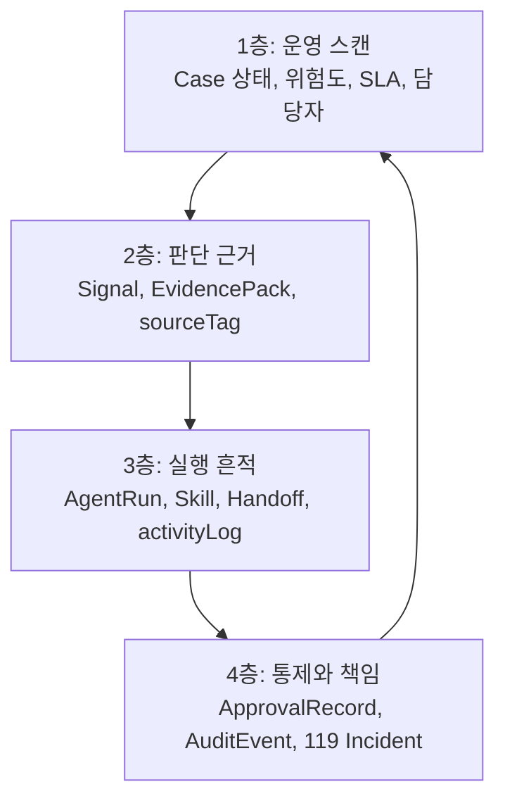
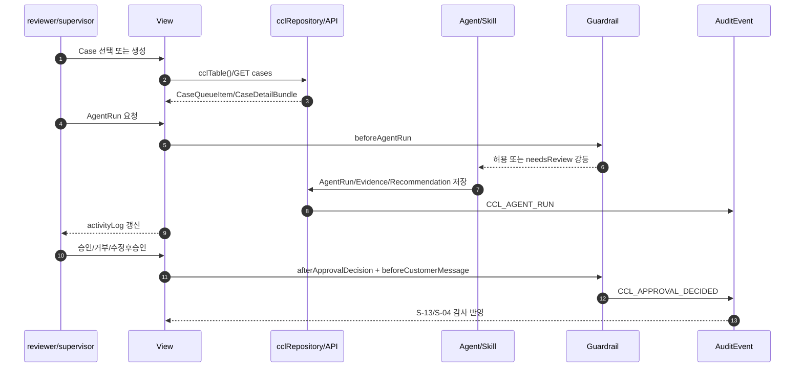
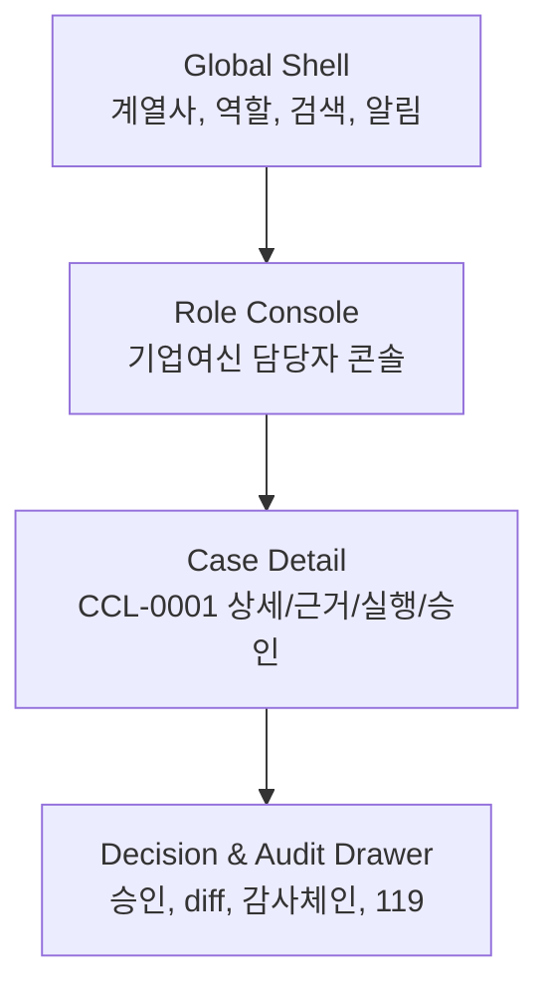

# 06 정보체계 · 뷰 · 데이터바인딩 스펙

> **목적**: 디자이너 세션 `JB금융-디자인`이 화면 정보계층, 뷰 목록, 컴포넌트 역할, 데이터 바인딩을 확정하기 위한 작업 스펙이다. 이 문서는 비주얼 디자인을 확정하지 않는다.
> **히어로**: `CCL-0001` - 전주 카페 운영자 운전자금 검토.
> **구현 제약**: vanilla JS, 무빌드, 현재 구현 근거는 `_vendor/JB_project2/app/`의 역할축 콘솔. JBFG 토큰(`#0A31A8`, `#1C56FF`, `SUIT Variable`)은 참조만 하며 실제 시각 결정은 디자인 세션 소유.
> **분기 상태**: CaseOps 확장 개념(메모리 라우터, 119, 은행 DB 커넥터, 모델/알고리즘 레지스트리)은 정본 승격 전까지 `[분기/미확정]`이다.

## 0. 읽는 법

이 문서는 다음 질문에 답한다.

1. `Case/Signal/EvidencePack/RecommendationDraft/ApprovalRecord/AuditEvent/AgentRun/Skill`이 화면 어디에 보이는가.
2. 계열사, 역할, 케이스 축이 어떤 내비게이션과 정보 밀도를 만든다.
3. 로그인부터 119 사고 대시보드까지 핵심 뷰가 어떤 데이터와 연결된다.
4. Paperclip에서 배울 것은 무엇이고, 그대로 베끼면 안 되는 것은 무엇인가.

### 0.1 SSOT와 충돌 처리

| 항목 | 1차 근거 | 화면 설계 적용 |
|---|---|---|
| 정식 용어 | `00_vision/definitions.md` | 화면 라벨은 정식 8종 객체명을 우선한다. 코드명이 다르면 최초 1회 병기한다. |
| 도메인 상태/권한 | `05_domain-model.md` | CCL 콘솔은 `riskLevel + requiresHumanReview + supervisor` 모델을 우선한다. |
| 골든패스 | `09_flow.md` | `S-03`, `S-04`, `S-13`는 흐름 ID와 정합한다. |
| 기능 수용기준 | `08_feature-spec.md`, `01_prd/prd.md` | empty/loading/error, 승인 불변식, PII 반출 차단을 뷰 상태로 반영한다. |
| 실제 코드 | `_vendor/JB_project2/app/` | 구현된 CCL route/view/table/function을 바인딩 근거로 병기한다. |
| 디자인 토큰 | `_JBFG-디자인-레퍼런스.md`, `03_ux/design-system.md` | 색/타이포/밀도 원칙만 참조한다. 비주얼 확정은 하지 않는다. |
| Paperclip 참조 | `_vendor/paperclip-master/` | 정보구조와 상호작용 패턴만 번역한다. 시각 스타일, 레이아웃, 아이콘은 사용하지 않는다. |

### 0.2 화면ID 정합 규칙

`09_flow.md`와 `_archive/ia-screen-map.md`를 기준으로 하되, 요청 범위에 필요한 신규/드릴인 화면은 확장 ID로 둔다.

| ID | 의미 | 상태 |
|---|---|---|
| `S-00` | 로그인/역할 진입 게이트 | `[분기/미확정]` - IA 정본에는 없음, `09_flow` Step 1에만 존재 |
| `S-02` | 알림함 | 정본 IA 존재, CCL 전용 구현은 부분 |
| `S-03` | 케이스 보드/생성/상세 | 정본 IA와 CCL 구현 모두 존재 |
| `S-04` | 승인 대기/승인 상세 | 정본 IA와 CCL 구현 모두 존재 |
| `S-05` | AgentRun 실행이력 | 정본 IA 존재, CCL 구현은 `agent-harness`와 `ccl_agent_runs`로 표현 |
| `S-07/S-08` | 에이전트/조직도 | 정본 IA 존재 |
| `S-11/S-12` | 스킬/플러그인 | 정본 IA 존재 |
| `S-13` | 활동/감사 | 정본 IA 존재, CCL 구현은 `audit-logs` |
| `S-16` | 설정 | 정본 IA 존재 |
| `S-17` | 119 사고 대시보드 | `[분기/미확정]` - CaseOps 분기 신규 제안 |

## 1. 정보 체계(Information System)

### 1.1 운영 정보의 기본 문장

JB LocalGuard OS의 화면은 다음 문장을 계속 반복해서 보여줘야 한다.

```text
Case가 들어오고,
Signal이 위험을 설명하며,
EvidencePack이 주장의 출처를 붙이고,
AgentRun이 직원처럼 작업한 흔적을 남기고,
RecommendationDraft가 다음 행동 초안을 만들며,
ApprovalRecord가 사람 결정을 기다리고,
AuditEvent가 모든 변화와 책임을 봉인한다.
Skill은 Agent가 무엇을 할 수 있고 무엇을 못 하는지 정한다.
```

이 문장이 화면의 정보 우선순위다. "AI가 답했다"가 아니라 "누가 어떤 근거로 무엇을 제안했고, 사람이 어디서 승인해야 하는가"가 먼저 보여야 한다.

### 1.2 도메인 엔티티에서 화면 정보 계층으로

| 도메인 엔티티 | CCL 구현 테이블/함수 | 화면 정보 계층 | 대표 컴포넌트 | 반드시 보일 필드 | 보이면 안 되는 것 |
|---|---|---|---|---|---|
| `Case` | `ccl_cases`, `createCorporateCreditCase()` | 모든 화면의 루트 작업 단위 | `CaseCard`, `CaseDetailHeader`, `KanbanColumn` | `caseNo`, `title`, `bizRefId`, `segment`, `loanType`, `amountBand`, `status`, `riskLevel`, `requiresHumanReview`, `dueAt`, `assignedToId` | 실명, 전화, 계좌, 사업자 원문 식별정보 |
| `Signal` | `RiskSignal` 목표 모델, CCL은 `riskLevel/repaymentBand/docsStatus`로 부분 표현 | Case 안의 위험 설명 레이어 | `SignalStack`, `RiskBreakdown`, `SourceTagBadge` | `name`, `value`, `weight`, `contribution`, `sourceTag`, `evidenceId` | 확정 승인/거절/신용등급 단정 |
| `EvidencePack` | `ccl_review_notes`, `ccl_doc_checks`, `ccl_consult_logs`, `ai_recommendations` | 판단과 초안의 근거 레이어 | `EvidenceCard`, `EvidenceDrawer`, `EvidenceGraphMini` | `id`, `kind/type`, `summary`, `status`, `createdAt`, `sourceMode`, `piiGrade` | 원문 PII, 출처 없는 추천 |
| `RecommendationDraft` | `ai_recommendations`, `ccl_memo_drafts`, `Approval.actionDraft` 목표 필드 | 승인 전 행동 초안 | `DraftPreview`, `EditableDraft`, `DiffPanel` | `title`, `summary/actionDraft`, `status`, `confidence`, `agentId`, `caseId` | 승인 전 발송 버튼 |
| `ApprovalRecord` | `approvals`, `cclDecideApproval()` | 사람 결정 게이트 | `ApprovalCard`, `GateCheckList`, `DecisionActionBar` | `id`, `caseId`, `approvalType`, `status`, `requestedById`, `approverId`, `requestedAt`, `decisionNote` | AI 자체 승인, 사유 없는 override |
| `AuditEvent` | `ccl_audit_logs`, `cclWriteAudit()`, 목표 `auditChainRecords()` | 책임과 재현성 레이어 | `AuditEventRow`, `AuditChainDrawer`, `ActivityRow` | `actorId`, `action`, `targetType`, `targetId`, `riskLevel`, `reviewRequired`, `createdAt`, `hash/previousHash` 목표 | 삭제 가능한 단순 로그처럼 보이는 표현 |
| `AgentRun` | `ccl_agent_runs`, `recordCorporateCreditAgentRun()`, `cclUpgradeFinancialRun()` | 에이전트가 일하는 장면 | `AgentRunTimeline`, `RunTranscript`, `HandoffChip` | `agentId`, `caseId`, `inputSummary`, `outputSummary`, `status`, `riskLevel`, `requiresHumanReview`, `createdAt` | `completed`로 고위험 자동 종결된 것처럼 보이는 상태 |
| `Skill` | `cclConsoleSkills`, 목표 `Skill` 엔티티 | Agent의 장착 능력과 금지선 | `SkillBadge`, `SkillCard`, `SkillConfigRow` | `key`, `label`, `agentIds`, `inputs`, `outputs`, `approvalPolicy`, `riskLevel`, `inputPiiGrade` | 권한 없는 스킬 장착/실행 |

### 1.3 화면 정보의 4층 구조



| 층 | 사용자의 질문 | 화면 반응 | 대표 뷰 |
|---|---|---|---|
| 1층 운영 스캔 | 오늘 무엇을 먼저 봐야 하나 | 보드, 카운트, 위험/SLA 정렬, 담당자 표시 | S-02, S-03 |
| 2층 판단 근거 | 왜 위험하다고 하나 | 신호 분해, 근거카드, 출처/최신성/PII 등급 | S-03 상세, S-04 |
| 3층 실행 흔적 | AI 직원이 뭘 했나 | AgentRun 타임라인, handoff, Skill badge, transcript | S-05, S-03 상세 |
| 4층 통제와 책임 | 누가 승인했고 어떻게 되돌리나 | 승인함, 감사행, 해시체인, 119 사고 대응 | S-04, S-13, S-17 |

### 1.4 복합 ViewModel

디자인 세션은 원 테이블을 그대로 화면에 뿌리지 말고 아래 ViewModel 단위로 컴포넌트를 잡는다.

| ViewModel | 조합 데이터 | 쓰는 화면 | 설계 목적 |
|---|---|---|---|
| `CaseQueueItem` | `Case + User + open Approval count + latest AgentRun status + evidenceDebt` | S-02, S-03 | 카드/행 한 줄에서 업무 우선순위 판단 |
| `CaseDetailBundle` | `Case + Signal[] + EvidencePack + AgentRun[] + ApprovalRecord[] + AuditEvent[]` | S-03 상세 | context-panel에서 요약, 근거, 실행, 승인, 감사를 한 번에 연결 |
| `AgentRunActivityItem` | `AgentRun + Agent + Skill + Handoff[] + AuditEvent` | S-05 | 에이전트가 회사 직원처럼 일하는 흐름 표현 |
| `ApprovalQueueItem` | `ApprovalRecord + Case + RecommendationDraft + EvidencePack + gateChecks` | S-04 | 승인자가 초안과 근거를 동시에 보고 결정 |
| `AuditTrailItem` | `AuditEvent + actor(User/Agent) + target(Case/Run/Approval) + hash` | S-13 | 감사 로그를 검색 가능한 내비게이션으로 사용 |
| `SourceConfigItem` | `Skill + external_connector + bank_data_contract + model_route + RBAC` | S-16 | 담당자가 어떤 소스/스킬/모델을 신뢰할지 설정 `[분기/미확정]` |
| `Incident119Item` | `Incident + affected Case[] + blocked AgentRun[] + AuditEvent[] + recoveryAction` | S-17 | Kill Switch, Quarantine, Replay, Rollback을 업무 흐름화 `[분기/미확정]` |

### 1.5 핵심 데이터 흐름



## 2. 계층 전략(Hierarchy)

### 2.1 세 축: 계열사 × 역할 × 케이스

| 축 | 예시 | 화면에서 드러나는 위치 | 데이터 키 | 우선순위 |
|---|---|---|---|---|
| 계열사 | 전북은행, JB우리캐피탈 | `org-rail`, 전역 scope, 설정 | `workspaceId`, `affiliate` | 가장 바깥 경계. 스코프 밖 데이터 노출 금지 |
| 역할 | 기업여신, FDS, 전세보호, 사후관리, 준법 | 역할 콘솔 sidebar, role dashboard, 권한 분기 | `roleKey`, `roleKeys`, `approverRole` | 사용자가 보는 화면 묶음 결정 |
| 케이스 | `CCL-0001`, `JEONSE-0001`, `FDSC-0001` | 보드 카드, 상세 context-panel, 승인 카드 | `caseId`, `caseNo`, `bizRefId` | 실제 업무 단위. Enter-first의 포커스 대상 |

**원칙**: 계열사는 데이터 경계, 역할은 화면 경계, 케이스는 작업 경계다. 화면은 이 세 축이 헷갈리지 않게 항상 현재 `workspaceId/roleKey/caseNo`를 노출해야 한다.

### 2.2 3단 정보구조



| 단계 | 포함 영역 | 핵심 사용성 | 정보 밀도 |
|---|---|---|---|
| 글로벌 | 로그인/역할 진입, org-rail, 전체 검색, 알림 badge | 내가 지금 어느 계열사/역할 권한으로 보는지 즉시 인지 | 낮음. scope와 전환만 |
| 역할 콘솔 | S-01~S-16 nav, CCL 전용 sidebar, 카운트 | 오늘 처리할 큐를 훑고 바로 들어감 | 중~높음. list/board/table 중심 |
| 케이스 상세 | context-panel, 상세 페이지, 승인 drawer | 특정 Case의 판단, 근거, 실행, 승인, 감사 연결 | 높음. 한 Case에 모든 provenance 집중 |

### 2.3 Enter-first 우선순위

Enter-first는 "버튼을 줄인다"가 아니라 "위험한 결정 전까지 반복 검토를 키보드로 빠르게 넘긴다"는 전략이다.

| 액션 단계 | 기본 입력 | 화면 원칙 | 예외 |
|---|---|---|---|
| 다음 케이스 보기 | `Space`/`↓` | 보드/큐에서 다음 검토 대상으로 이동 | 상세 편집 중에는 폼 단축키 우선 |
| 근거 열기 | `Space` 1회 | context-panel open, EvidencePack과 activityLog를 같이 노출 | 근거 없음은 자동 보류 |
| 검토 완료/다음 | `Space` 2회 | 읽은 항목을 reviewed로 표시하고 다음으로 이동 `[분기/미확정]` | high/critical은 reviewed만 가능, 승인 아님 |
| 승인 | `Enter` 또는 명시 클릭 | S-04에서만, gateChecks 통과 후 가능 | L3/L4는 마우스 확인 또는 2단 확인 강제 |
| 거부/수정 요청 | `Shift+Enter` 또는 명시 클릭 | 사유코드/메모 필수 | 사유 없으면 제출 차단 |

### 2.4 우선순위 산정과 화면 정렬

CaseOps 분기 대화의 Priority Scoring을 화면 정렬 기준으로 번역한다. 실제 점수 엔진은 `[분기/미확정]`이다.

```text
priorityScore =
  0.35 * Risk
+ 0.25 * Urgency
+ 0.15 * CustomerVulnerability
+ 0.15 * RegulatorySensitivity
+ 0.10 * SLADelay
```

| 우선순위 필드 | 화면 표시 | 데이터 출처 | 바인딩 |
|---|---|---|---|
| `riskLevel` | 리스크 pill, 컬럼 강조 | `ccl_cases.riskLevel` | S-03, S-04, S-13 |
| `requiresHumanReview` | "사람 검토 필요" badge | `ccl_cases.requiresHumanReview` | S-02, S-03, S-04 |
| `dueAt`/SLA | SLA timer/임박순 정렬 | `ccl_cases.dueAt`, 목표 `Approval.sla` | S-02, S-03, S-04 |
| `reviewRequired` | 감사 검토 필요 flag | `ccl_audit_logs.reviewRequired` | S-13 |
| `sourceMode`/`sourceTag` | 근거 신뢰도 badge | Evidence/Signal 목표 필드 | S-03 상세, S-04 |

### 2.5 내비게이션 계층

| 내비 레벨 | 항목 | CCL 구현 대응 | 디자인 결정 포인트 |
|---|---|---|---|
| Global rail | 계열사, 역할 진입, 검색 | 공통 `activeView`, CCL `roleKey=corporate-credit` | 계열사/역할을 카드가 아니라 고정 scope indicator로 처리 |
| CCL sidebar 1 | 오늘 처리할 일 | `board`, `cases`, `doc-check`, `approval-drafts` | 실무자가 매일 쓰는 1차 큐 |
| CCL sidebar 2 | 여신 점검 | `financial-summary`, `repayment-check`, `policy-match`, `early-warning` | 전문 에이전트 결과별 큐 |
| CCL sidebar 3 | 고객 대응 | `consult-log`, `reply-drafts` | 승인 전 고객 접촉 금지 명확화 |
| CCL sidebar 4 | AI/자동화 관리 | `ai-analysis`, `agent-harness`, `audit-logs` | 실행/감사/하네스 관리 |
| System nav | 스킬, 플러그인, 활동, 설정 | 본선 IA `S-11/S-12/S-13/S-16` | 운영자/준법자만 깊게 사용 |

## 3. 전 뷰 카탈로그

### 3.0 카탈로그 요약

| # | 뷰 | 화면ID | 현재 구현/라우트 | 핵심 데이터 |
|---|---|---|---|---|
| 1 | 로그인·역할 진입 | `S-00` | `[분기/미확정]`, `onRoleEnter` 훅 | `users`, `roleKeys`, `roleKey` |
| 2 | 케이스보드(칸반) | `S-03` | `#/roles/corporate-credit/board` | `ccl_cases`, `users`, counts |
| 3 | 케이스생성 | `S-03-create` | `#/roles/corporate-credit/cases/new` | `ccl_cases`, `ccl_doc_checks`, `ccl_agent_runs`, `approvals`, `ccl_audit_logs` |
| 4 | 케이스상세 | `S-03-detail` | `#/roles/corporate-credit/cases/:caseId` | `CaseDetailBundle` |
| 5 | 에이전트실행뷰(activityLog) | `S-05`, `S-03-inline` | `agent-harness`, `ccl_agent_runs` | `AgentRun`, `Agent`, `Skill`, `Handoff`, `AuditEvent` |
| 6 | 승인대기함 | `S-04` | `approval-drafts`, 목표 `/approvals` | `approvals`, `ccl_memo_drafts`, `ai_recommendations` |
| 7 | 승인/거부/수정후승인 | `S-04-detail` | `cclDecideApproval()`, 수정후승인 `[분기/미확정]` | `ApprovalRecord`, `RecommendationDraft`, `EvidencePack`, `AuditEvent` |
| 8 | 알림 | `S-02` | 공통 `inbox`, CCL 전용 알림 `[분기/미확정]` | `NotificationRequest`, `ApprovalRecord`, `AuditEvent` |
| 9 | 관리자/감사 | `S-13`, `S-07`, `S-08` | `audit-logs`, `agent-harness` | `ccl_audit_logs`, `harness_agents`, `users` |
| 10 | 설정(담당자 소스 config) | `S-16`, `S-11`, `S-12` | 공통 `settings/skills/plugins`, CCL config `[분기/미확정]` | `Skill`, `Agent`, `BankDataConnector`, `ModelRoute`, `RBAC` |
| 11 | 119 사고 대시보드 | `S-17` | 신규 제안 `[분기/미확정]` | `Incident119`, `AuditEvent`, `AgentRun`, `RecoveryAction` |

### 3.1 로그인·역할 진입

| 항목 | 내용 |
|---|---|
| 화면ID | `S-00` `[분기/미확정]`, `09_flow` Step 1 |
| 목적 | 사용자가 어떤 계열사와 역할 scope로 들어가는지 확정하고, 이후 모든 조회에 `roleKey/workspaceId`가 붙도록 한다. |
| 표시 정보 | 계열사, 역할, 담당 팀, 권한 요약, 최근 접속, 데모 모드 여부, 데이터 scope 경고. |
| 구성 컴포넌트 | `RoleSelector`, `AffiliateRailPreview`, `PermissionSummary`, `DemoModeBadge`, `ScopeGuardNotice`. |
| 데이터 바인딩 | `users.roleKeys`, `CCL_ROLE_KEY`, `CCL_WORKSPACE_ID`, `onRoleEnter` 훅. 목표 API: `GET /api/v1/session`, `POST /api/v1/session/role`. |
| 모델/API | 현재 구현은 멀티유저 로그인 없음. CCL 진입 시 `cclTable("ccl_cases")` scope 없는 조회가 예외를 내는지 `onRoleEnter`에서 확인한다. |
| 상태 | Empty: 사용 가능한 역할 없음. Loading: 권한/계열사 로드 중. Error: scope 확인 실패, `role scope is required` 외 예외. |
| 역할별 분기 | reviewer는 S-03으로, supervisor/준법은 S-04/S-13 카운트를 강조. 관리자 권한은 S-16 진입 가능. |
| 다음 이동 | 기본: `S-03` 케이스보드. pending approval이 있으면 `S-04` badge 강조. |

```text
[로그인/역할 선택]
  계열사: 전북은행
  역할: 기업여신 담당자
  roleKey: corporate-credit
  workspaceId: corporate-credit
  기본 진입: S-03 케이스보드
```

### 3.2 케이스보드(칸반)

| 항목 | 내용 |
|---|---|
| 화면ID | `S-03` |
| 현재 구현 | CCL `board` view, `#/roles/corporate-credit/board`, `cclViewRenderers.board()` |
| 목적 | `CCL-0001`을 포함한 여신 검토 케이스를 상태 컬럼으로 훑고, 가장 먼저 볼 케이스를 선택한다. |
| 표시 정보 | 컬럼별 Case 수, `caseNo`, `bizRefId`, `segment`, `loanType`, `amountBand`, `riskLevel`, `docsStatus`, `repaymentBand`, 담당자, SLA. |
| 구성 컴포넌트 | `LG/KanbanColumn`, `LG/CaseCard`, `RiskPill`, `StatusPill`, `SlaText`, `ScopeHeader`, `RefreshControl`, `SearchHitList`. |
| 데이터 바인딩 | `ccl_cases` read, `users` read, `getCorporateCreditSidebarCountsAsync()`, `searchCorporateCreditRecords()`. 목표 API: `GET /api/v1/cases?roleKey=corporate-credit`, `GET /api/v1/dashboard`. |
| 상태 | Empty: 컬럼별 `없음` 또는 전체 empty-state. Loading: counts skeleton. Error: "데이터를 불러오지 못했습니다" + 데모 데이터 초기화. |
| 역할별 분기 | reviewer는 자기 팀/담당 케이스 우선. supervisor는 `requiresHumanReview=true`, `riskLevel=high/critical` 우선. 준법은 L3/L4 승인 필요 케이스 우선. |
| 09_flow 정합 | Step 2: 케이스보드 조회, `cclTable()` 스코프 필터. |

#### 컬럼 정합

`05_domain-model.md`와 CCL 구현은 6개 컬럼을 사용한다. PRD/구 MVP의 5컬럼 표현은 아래처럼 접어 정렬한다.

| CCL 상태 | 표시 컬럼 | 5컬럼 PRD 대응 | 설명 |
|---|---|---|---|
| `received` | 신규 접수 | 신규 | 접수 직후 |
| `collecting` | 자료 수집 | 진행 | 서류/상담/근거 수집 |
| `aiReview` | AI 검토 | 진행 | 에이전트 실행 중/완료 후 검토 전 |
| `humanReview` | 담당자 검토 필요 | 검토 | high/critical, 서류누락, 정책금융 후보 |
| `memoDraft` | 품의 진행 | 검토/완료 전 | 품의 초안/승인 대기 |
| `doneHold` | 완료·보류 | 완료/차단 | 종결 또는 보류. 차단 세분화는 `[분기/미확정]` |

### 3.3 케이스생성

| 항목 | 내용 |
|---|---|
| 화면ID | `S-03-create` |
| 현재 구현 | CCL `cases-new` view, `#/roles/corporate-credit/cases/new`, `ccl-new-case-form` |
| 목적 | 익명 사업자 Ref와 금액대/서류/위험도만으로 새 여신 검토 Case를 만들고, intake AgentRun과 감사 로그를 자동 생성한다. |
| 표시 정보 | 여신 유형, 익명 사업자 Ref, 지역/업종, 금액대, 위험도, 서류 상태, 처리 기한, PII 입력 금지 안내. |
| 구성 컴포넌트 | `CaseCreateWizard`, `LoanTypeSelect`, `BizRefInput`, `AmountBandSelect`, `RiskLevelSelect`, `DocsStatusSelect`, `GuardrailNotice`, `SubmitActionBar`. |
| 데이터 바인딩 | Write: `createCorporateCreditCase(form)` -> `ccl_cases`, `ccl_doc_checks`, `ccl_agent_runs`, `agent_handoffs`, `approvals`, `ccl_audit_logs`. Hooks: `beforeCaseCreate`, `afterCaseCreate`, `onAuditWrite`. 목표 API: `POST /api/v1/cases`. |
| 상태 | Empty: 폼 초기. Loading: 저장 중. Error: PII/단정/스코프 훅 차단. Success: 생성 후 `S-03-detail`로 이동. |
| 역할별 분기 | reviewer만 생성 가능. supervisor/준법은 생성보다 검토 큐로 이동. 관리자 생성 권한은 없음. |
| 09_flow 정합 | Step 3: `beforeCaseCreate -> CASE_CREATED -> afterCaseCreate`. |

#### 생성 후 자동 저장 항목

| 생성 항목 | 조건 | 화면에 즉시 보이는 곳 |
|---|---|---|
| `Case` | 항상 | S-03 보드/상세 |
| `DocCheck` | `docsStatus != ready` | S-03 상세, `doc-check` |
| `AuditEvent` | 항상 `CASE_CREATED` | S-13, S-03 감사 탭 |
| `AgentRun` | 항상 `ccl-intake` | S-05, S-03 activityLog |
| `Handoff` | 재무요약, 필요 시 supervisor | S-05 handoff chips |
| `ApprovalRecord` | `requiresHumanReview=true` | S-04 승인대기함 |

### 3.4 케이스상세

| 항목 | 내용 |
|---|---|
| 화면ID | `S-03-detail` |
| 현재 구현 | `#/roles/corporate-credit/cases/:caseId`, `cclDetailPanel()` |
| 목적 | 한 Case의 상태, 근거, 실행, 승인, 감사가 끊기지 않고 보이게 한다. |
| 표시 정보 | `CaseDetailBundle`: Case 필드, 서류 체크, 재무/상환/정책 노트, 상담 요약, 회신/품의 초안, 관련 AgentRun, Approval, AuditEvent. |
| 구성 컴포넌트 | `CaseDetailHeader`, `InfoGrid`, `SignalStack`, `EvidencePackPanel`, `DocChecklist`, `ConsultSummary`, `RecommendationDraftPanel`, `AgentRunTimeline`, `ApprovalStatusStrip`, `AuditMiniTimeline`. |
| 데이터 바인딩 | Read: `ccl_cases`, `ccl_review_notes`, `ccl_doc_checks`, `ccl_consult_logs`, `ai_recommendations`, `ccl_agent_runs`, `agent_handoffs`, `approvals`, `ccl_audit_logs`. 목표 API: `GET /api/v1/cases/:id?include=evidence,agentRuns,approvals,audit`. |
| 상태 | Empty: 케이스 없음 또는 scope 밖. Loading: bundle 로드. Error: 상세 데이터를 찾을 수 없음. Stale: 데이터 기준 시각 표시. |
| 역할별 분기 | reviewer는 실행/초안 요청이 보임. supervisor는 승인/반려 CTA가 보임. 준법은 PII/규정 검증 탭 우선. |
| 09_flow 정합 | Step 4: 서류 체크리스트와 근거 드릴인. |

#### 케이스상세 와이어 텍스트

```text
S-03-detail / CCL-0001
┌ Header: CCL-0001 · 전주 카페 운영자 운전자금 검토 · high · humanReview 필요
├ 1. 운영 요약: BIZ-REF, 지역/업종, 금액대, 담당자, SLA
├ 2. 위험 신호: 상환 부담, 서류 누락, 정책금융 후보, 조기경보
├ 3. EvidencePack: 재무노트, 서류체크, 상담요약, 회신초안
├ 4. activityLog: AgentRun, handoff, live/fallback, guardrail
├ 5. Approval: pending/approved/rejected/modified
└ 6. Audit: CASE_CREATED, CCL_AGENT_RUN, MEMO_DRAFTED, CCL_APPROVAL_DECIDED
```

### 3.5 에이전트실행뷰(activityLog)

| 항목 | 내용 |
|---|---|
| 화면ID | `S-05`, `S-03-inline` |
| 현재 구현 | CCL `agent-harness`, `ccl_agent_runs`, `runCorporateCreditSample()`, `cclUpgradeFinancialRun()` |
| 목적 | AI 에이전트가 "회사 직원처럼" 어떤 입력을 받아 어떤 스킬로 실행하고 어디로 handoff했는지 보여준다. |
| 표시 정보 | Agent identity, Skill, inputSummary, outputSummary, status, riskLevel, requiresHumanReview, createdAt, handoff, guardrail/fallback, live LLM 여부. |
| 구성 컴포넌트 | `LG/AgentRunTimeline`, `AgentIdentityChip`, `SkillBadge`, `RunStatusDot`, `HandoffChip`, `TranscriptToggle(nice/raw)`, `GuardrailResult`, `RunMetricStrip`. |
| 데이터 바인딩 | Read/write: `recordCorporateCreditAgentRun()`, `ccl_agent_runs`, `agent_handoffs`, `harness_agents`, `ai_analysis_requests`, `ccl_audit_logs`. 목표 API: `POST /api/v1/cases/:id/runs`, `GET /api/v1/runs/:id`, `GET /api/v1/runs/:id/stream`. |
| 상태 | Empty: 실행 없음. Loading: queued/running. Error: LLM 실패 또는 guardrail 위반. Fallback: live output 실패 시 모의 결과 유지 + `needsReview`. |
| 역할별 분기 | reviewer는 실행 요청 가능. supervisor/준법은 실행 결과 검토와 차단 사유 확인. 관리자만 agent config 수정 가능. |
| 09_flow 정합 | Step 5: 판단 -> 행동초안 -> 검증. |

#### activityLog 항목 스키마

```typescript
type ActivityLogItem = {
  id: string
  caseId: string
  actorType: "agent" | "user" | "system"
  actorId: string
  action: "CCL_AGENT_RUN" | "HANDOFF_CREATED" | "GUARDRAIL_BLOCKED" | "LIVE_FALLBACK"
  status: "queued" | "running" | "needsReview" | "pendingApproval" | "completed" | "rejected"
  summary: string
  evidenceIds: string[]
  createdAt: string
}
```

#### Paperclip에서 번역할 실행 패턴

Paperclip의 `ActiveAgentsPanel`과 `RunTranscriptView`는 실행을 단순 로그가 아니라 "현재 일하는 동료"처럼 보여준다. 우리 화면에서는 다음만 가져온다.

| Paperclip 패턴 | 우리 번역 |
|---|---|
| live run 카드에 agent, task, transcript, active dot 동시 표시 | `AgentRunTimeline`에 agent, case, outputSummary, live/fallback, status dot 표시 |
| run detail의 timing, duration, model/provider, cost | 금융형으로 `sourceMode`, `modelRoute`, `duration`, `guardrail`만 우선. cost는 S-14 |
| nice/raw transcript toggle | `담당자용 요약`과 `원 로그/JSON` toggle |
| cancel/retry/resume | high/critical은 cancel 대신 `119 격리/재검토`로 이동 `[분기/미확정]` |

### 3.6 승인대기함

| 항목 | 내용 |
|---|---|
| 화면ID | `S-04` |
| 현재 구현 | CCL `approval-drafts`, 목표 IA `/approvals` |
| 목적 | 사람 결정이 필요한 `ApprovalRecord`를 위험도, SLA, 역할, 계열사 기준으로 정렬해 승인자가 놓치지 않게 한다. |
| 표시 정보 | 승인 건 ID, 승인 유형, 관련 Case, 요청자(agent/user), 승인자, status, requestedAt, actionDraft 요약, gateChecks 요약, evidence coverage. |
| 구성 컴포넌트 | `ApprovalQueueTabs`, `ApprovalCard`, `LLevelBadge`, `RequesterIdentity`, `SlaSort`, `GateCheckSummary`, `EvidenceCoverageBadge`. |
| 데이터 바인딩 | Read: `approvals(status=pending)`, `ccl_memo_drafts(status=pendingApproval)`, `ai_recommendations(status=pendingApproval)`, `ccl_cases`, `users`, `harness_agents`. 목표 API: `GET /api/v1/approvals?status=pending`. |
| 상태 | Empty: 검토할 승인 요청 없음. Loading: queue 로드. Error: 승인 목록 로드 실패. Stale: 데이터 기준 시각. |
| 역할별 분기 | reviewer는 본인이 요청한 승인 상태 추적 중심. supervisor/준법은 승인/거부 권한 CTA 표시. 관리자/감사자는 읽기 전용. |
| 09_flow 정합 | Step 6: `MEMO_DRAFTED -> approval pending`. |

#### 승인대기함 필터

| 필터 | 값 | 기본값 |
|---|---|---|
| 상태 | `pending`, `revisionRequested`, `approved`, `rejected`, `all` | `pending` |
| 레벨 | `L0`~`L4`, CCL `riskLevel` 잠정 매핑 | `L3/L4`는 supervisor/준법에서 상단 |
| 계열사 | 전북은행, JB우리캐피탈 | 현재 scope |
| 역할 | 기업여신, 전세보호, FDS, 사후관리 | 현재 role |
| SLA | 임박순, 생성일순, 위험도순 | 임박순 |

### 3.7 승인/거부/수정후승인

| 항목 | 내용 |
|---|---|
| 화면ID | `S-04-detail` |
| 현재 구현 | `cclDecideApproval(approvalId, "approve")`; reject와 modified UI는 목표/부분 `[분기/미확정]` |
| 목적 | 승인자가 초안, 근거, 규정검증, 감사 영향을 한 화면에서 보고 승인/거부/수정후승인을 결정한다. |
| 표시 정보 | `ApprovalRecord`, `RecommendationDraft/actionDraft`, `EvidencePack`, gateChecks, PII scan, forbidden assertion scan, model/skill/version, linked Case, linked AgentRun, decision note. |
| 구성 컴포넌트 | `ApprovalDecisionDrawer`, `DraftEditor`, `EvidenceSidecar`, `GateCheckList`, `PolicyCitationBox`, `PiiScanResult`, `DecisionNoteForm`, `DiffPreview`, `ApproveRejectModifyBar`. |
| 데이터 바인딩 | Read/write: `approvals`, `ai_recommendations`, `ccl_memo_drafts`, `ccl_review_notes`, `ccl_doc_checks`, `ccl_audit_logs`, `cclDecideApproval()`. 목표 API: `GET /api/v1/approvals/:id`, `POST /api/v1/approvals/:id/approve`, `POST /api/v1/approvals/:id/reject`, `POST /api/v1/approvals/:id/request-revision`, `POST /api/v1/approvals/:id/resubmit`. |
| 상태 | Empty: 승인 건 없음. Loading: 결재 처리 중. Error: 이미 처리됨, 권한 없음, gateCheck blocked, 승인 주체가 `USR-*`가 아님. Modified: 수정본 diff 저장. |
| 역할별 분기 | reviewer는 수정 요청 대응과 resubmit. supervisor/준법은 approve/reject/modify. 관리자/감사자는 raw payload와 감사만 읽기. |
| 09_flow 정합 | Step 7: `afterApprovalDecision -> CCL_APPROVAL_DECIDED`. |

#### 승인 상세 3분할

```text
┌ Left: ActionDraft
│  - 고객 회신/품의 초안
│  - 수정후승인 편집기
│  - 금지 표현 검사
├ Middle: Evidence & Policy
│  - EvidencePack
│  - 규정/정책 인용
│  - sourceTag, piiGrade, retrievalTime
└ Right: Gate & Decision
   - L-level/riskLevel
   - gateChecks
   - 승인/거부/수정후승인
   - decisionNote
```

### 3.8 알림

| 항목 | 내용 |
|---|---|
| 화면ID | `S-02` |
| 현재 구현 | 공통 `inbox`는 존재. CCL 전용 알림발송 큐는 `[분기/미확정]` |
| 목적 | 승인대기, 검토필요, 발송보류, guardrail 차단, 119 사고 알림을 사용자가 놓치지 않게 한다. |
| 표시 정보 | 알림 유형, 관련 Case, actor, priority, dueAt, status, nextAction, linked Approval/Audit. |
| 구성 컴포넌트 | `NotificationList`, `PriorityBadge`, `LinkedCaseChip`, `ActionRequiredButton`, `GuardrailAlert`, `SlaBadge`. |
| 데이터 바인딩 | Read: `approvals(pending)`, `ccl_audit_logs(reviewRequired=true)`, `ai_analysis_requests(queued/running)`, 목표 `notifications`. Write: 알림 dismiss/read state `[분기/미확정]`. 목표 API: `GET /api/v1/inbox`, `PATCH /api/v1/notifications/:id/read`. |
| 상태 | Empty: 처리할 알림 없음. Loading: 알림 로드. Error: 알림 로드 실패. Blocked: 승인 전 발송 시도 차단. |
| 역할별 분기 | reviewer는 본인 담당 케이스 알림. supervisor/준법은 승인/차단 알림. 관리자/감사자는 정책/119/시스템 알림. |
| 09_flow 정합 | Step 8: 고객 회신은 시스템 액터이며 승인 전 트리거 금지. |

### 3.9 관리자/감사

| 항목 | 내용 |
|---|---|
| 화면ID | `S-13` 중심, `S-07/S-08` 보조 |
| 현재 구현 | CCL `audit-logs`, `agent-harness`; 공통 `activity`, `agents`, `orgchart` |
| 목적 | 상태 변경, 승인, 차단, 에이전트 실행, 스코프 위반을 재현 가능한 감사 타임라인으로 본다. |
| 표시 정보 | AuditEvent rows, actor identity, target link, riskLevel, reviewRequired, createdAt, hash/previousHash 목표, Agent status, 조직 보고선. |
| 구성 컴포넌트 | `AuditEventRow`, `ActivityTimeline`, `ActorAvatar`, `TargetLink`, `AuditChainVerify`, `AgentRosterTable`, `OrgTree`, `RawPayloadDrawer`. |
| 데이터 바인딩 | `ccl_audit_logs`, `harness_agents`, `users`, `ccl_agent_runs`, 목표 `AuditEvent` 해시체인. 목표 API: `GET /api/v1/audit/cases/:id`, `GET /api/v1/audit/cases/:id/verify`, `GET /api/v1/companies/:id/activity`. |
| 상태 | Empty: 감사 이벤트 없음. Loading: 감사 로드. Error: hash 불일치, scope 밖 접근. Warning: `reviewRequired=true`. |
| 역할별 분기 | reviewer는 자기 Case 감사. supervisor/준법은 검토필요 감사. 3선 감사/관리자는 전체 읽기와 export. |
| 09_flow 정합 | Step 9: `onAuditWrite` append-only. |

#### 감사 행의 링크 규칙

| `targetType` | 클릭 대상 |
|---|---|
| `ccl_case` | `S-03-detail` |
| `agent_run` | `S-05` 해당 run |
| `approval` | `S-04-detail` |
| `review_note`/`doc_check` | `S-03-detail` 근거 탭 |
| `hook` | `S-13` raw payload drawer |
| `incident` | `S-17` `[분기/미확정]` |

### 3.10 설정(담당자 소스 config)

| 항목 | 내용 |
|---|---|
| 화면ID | `S-16`, 관련 `S-11/S-12` |
| 현재 구현 | 공통 `settings`, `skills`, `plugins`; CCL 전용 source config는 `[분기/미확정]` |
| 목적 | 담당자/역할이 어떤 내부 DB, 외부 API, MCP, 매뉴얼, 스킬, 모델을 근거 소스로 쓸지 설정하고 검증한다. |
| 표시 정보 | 담당자/팀/역할, enabled skills, connector status, data contract, PII grade, model route, approval policy, test result, last verified. |
| 구성 컴포넌트 | `SourceRegistryTable`, `SkillBindingCard`, `ConnectorStatusCard`, `DataContractPanel`, `ModelRouteMatrix`, `RbacMatrix`, `VerifySourceButton`, `PolicyChangeAuditNote`. |
| 데이터 바인딩 | `users`, `roleKeys`, `cclConsoleSkills`, `harness_agents`, 목표 `external_connectors`, `bank_data_contracts`, `model_routes`, `memory_policies`, `skill_registry`. 목표 API: `GET/PATCH /api/v1/settings/source-config`, `POST /api/v1/settings/source-config/:id/verify`. |
| 상태 | Empty: 연결된 소스 없음. Loading: connector test. Error: API key 없음, 권한 없음, PII 등급 미정, schema mismatch. PendingApproval: 정책 변경 승인 대기. |
| 역할별 분기 | reviewer는 읽기와 요청만. supervisor/준법은 정책 승인. 관리자만 connector/skill/model route 변경. |
| CaseOps 정합 | Bank Data Connector, Guarded Model Routing, Auto Skill Routing의 UI 진입점. 모두 `[분기/미확정]`. |

#### 담당자 소스 config 단위

```typescript
type SourceConfigItem = {
  id: string
  scope: { affiliate: string; roleKey: string; teamId?: string }
  sourceType: "bank_db" | "public_api" | "manual" | "mcp" | "skill" | "model"
  displayName: string
  ownerRole: "reviewer" | "supervisor" | "admin" | "compliance"
  piiGrade: "public" | "internal" | "confidential" | "restricted"
  allowedAgents: string[]
  requiredApprovalLevel: "L0" | "L1" | "L2" | "L3" | "L4"
  lastVerifiedAt?: string
  status: "connected" | "degraded" | "blocked" | "pendingApproval"
}
```

### 3.11 119 사고 대시보드

| 항목 | 내용 |
|---|---|
| 화면ID | `S-17` `[분기/미확정]` |
| 현재 구현 | 없음. CaseOps 분기 개념. S-13의 incident mode로 시작할 수 있음. |
| 목적 | 환각, PII 반출, 잘못된 데이터 접근, 과잉 자동화, 고위험 누락, API 장애를 감지하면 Kill Switch, Quarantine, Replay, Rollback, Hotfix를 한 흐름으로 처리한다. |
| 표시 정보 | 사고 ID, severity, trigger, affected cases, paused agents, quarantined runs, replay queue, rollback target, root cause, recovery status, audit links. |
| 구성 컴포넌트 | `IncidentOverview`, `KillSwitchPanel`, `QuarantineQueue`, `ReplaySimulator`, `RollbackActionCard`, `HotfixChecklist`, `AffectedCaseTable`, `IncidentTimeline`, `RegulatorReportDraft`. |
| 데이터 바인딩 | 목표 `incident_records`, `ccl_audit_logs`, `ccl_agent_runs`, `agent_handoffs`, `approvals`, `model_routes`, `memory_mutations`. 목표 API: `GET /api/v1/incidents`, `POST /api/v1/incidents/:id/kill-switch`, `POST /api/v1/incidents/:id/replay`, `POST /api/v1/incidents/:id/resolve`. |
| 상태 | Empty: 열린 사고 없음. Loading: 영향 범위 계산. Error: replay 실패, rollback 불가. Critical: 전체 발송/실행 차단. Resolved: 재발방지 메모리/스킬 업데이트 대기. |
| 역할별 분기 | reviewer는 자기 케이스 영향 확인. supervisor/준법은 사고 승인/보고. 관리자만 kill switch/rollback 실행. |
| 09_flow 정합 | Error sequence의 kill switch와 false block 복구를 화면화. |

#### 119 와이어 텍스트

```text
S-17 / 119 Incident
┌ 사고 요약: PII_EGRESS_BLOCKED · severity=critical · affectedCases=4
├ Kill Switch: 고객발송 차단 ON · AgentRun 자동완료 차단 ON
├ Quarantine: 격리된 runs, approvals, drafts
├ Replay: 동일 입력으로 재현, counter-evidence 확인
├ Rollback/Hotfix: 정책룰, skill prompt, connector route 수정
└ Audit/Report: 감사 이벤트, 감독 보고 초안, 재발방지 메모리 업데이트
```

## 4. 데이터 ↔ 뷰 연결 매트릭스

범례: `R` 읽기, `W` 쓰기, `A` 액션/상태전이, `D` 파생/집계, `N` 알림, `G` 가드/권한, `I` 사고 대응.

| 엔티티/데이터소스 | S-00 Auth | S-03 Board | S-03 Create | S-03 Detail | S-05 Run | S-04 Queue | S-04 Decision | S-02 Alert | S-13 Admin/Audit | S-16 Config | S-17 119 |
|---|---:|---:|---:|---:|---:|---:|---:|---:|---:|---:|---:|
| `users`/RBAC | R/G | R | R | R | R | R | R/G | R | R | R/W/G | R |
| `ccl_cases` / `Case` | G | R/D | W | R | R | R | R/A | R/N | R | R | R/I |
| `Signal`/`RiskDecision` |  | D | W/D | R/D | R/D | R | R/G | N | R |  | R/I |
| `ccl_review_notes` |  | D |  | R | W/R | R | R | N | R |  | R/I |
| `ccl_doc_checks` |  | D | W | R/W | W/R | R | R/G | N | R |  | R/I |
| `ccl_consult_logs` |  |  |  | R/W | R | R | R | N | R |  | R/I |
| `EvidencePack`/`Evidence` |  | D |  | R/D | W/R | R | R/G |  | R | R | R/I |
| `ai_recommendations` / `RecommendationDraft` |  | D |  | R | W | R | R/W/A | N | R |  | R/I |
| `ccl_memo_drafts` |  | D |  | R | W | R | R/W/A | N | R |  | R/I |
| `approvals` / `ApprovalRecord` |  | D | W | R | W/R | R | R/W/A/G | N | R | R | R/I |
| `ccl_agent_runs` / `AgentRun` |  | D | W | R | R/W/A | R | R | N | R | R | R/I |
| `agent_handoffs` |  | D | W | R | R/W | R | R | N | R |  | R/I |
| `harness_agents` / `Agent` |  | D |  | R | R | R | R |  | R | R/W/G | R/I |
| `cclConsoleSkills` / `Skill` |  |  |  | R | R/D | R | R/G |  | R | R/W/G | R/I |
| `ccl_audit_logs` / `AuditEvent` |  | D | W | R | W/R | R | W/R | N | R/D/G | R | R/I |
| `activityLog` 목표 모델 |  | D | W | R | W/R | R | W/R | N | R/D | R | R/I |
| PII/Data Governance | G | G | G | R/G | G | R/G | G | N | R/G | R/W/G | I |
| Bank Data Connector |  | D | D | R | R | R | R | N | R | R/W/G | I |
| Model/Algorithm Registry |  | D | D | R | R/A | R | R/G |  | R | R/W/G | I |
| `Incident119` / RecoveryAction |  | N | G | N | I | N | I | N | R/I | R/I | R/W/A/I |

**매트릭스 메모**

- `S-03 Create`는 단일 write처럼 보이지만 실제로는 Case, DocCheck, AgentRun, Handoff, Approval, Audit을 동시에 만든다.
- `S-04 Decision`은 UI 액션이지만 최종적으로 `AuditEvent`가 없으면 성공으로 보지 않는다.
- `S-16 Config`의 `Bank Data Connector`, `Model/Algorithm Registry`, `Incident119` 바인딩은 `[분기/미확정]`이다.
- `S-17 119`는 별도 nav로 만들지 않고 `S-13`의 incident tab으로 시작하는 대안도 가능하다 `[분기/미확정]`.

## 5. Paperclip 유기적 통합에서 가져올 UX 패턴

Paperclip을 비주얼 레퍼런스로 쓰지 않는다. 가져올 것은 "데이터, 작업, 에이전트, 승인, 활동 로그가 한 운영 객체 안에서 서로 링크되는 방식"이다.

### 5.1 Work item이 화면의 지도다

| Paperclip 관찰 | 우리 번역 |
|---|---|
| `Issue` 목록은 단순 카드가 아니라 assignee, status, live run, workspace, priority, activity를 함께 품는다. | `CaseQueueItem`은 risk/SLA/담당자/active AgentRun/pending Approval/evidence debt를 한 카드에 품는다. |
| list/board 전환, 필터, 컬럼 설정이 같은 데이터셋에 붙어 있다. | S-03은 칸반과 테이블을 같은 `CaseQueueItem`에서 렌더한다. 보기 설정은 role별 localStorage 또는 profile에 저장 `[분기/미확정]`. |
| parent/child issue와 blocker가 실행 순서를 만든다. | Case 안에서 `agent_handoffs`, `ApprovalRecord`, `DocCheck`가 다음 행동 순서를 만든다. |

**디자인 지시**: 케이스 카드는 예쁜 요약 카드가 아니라 "오늘 처리 순서가 보이는 업무 행"이어야 한다. 카드 안의 모든 badge는 상세/승인/감사로 이동 가능한 링크다.

### 5.2 에이전트는 챗봇이 아니라 직원이다

| Paperclip 관찰 | 우리 번역 |
|---|---|
| `ActiveAgentsPanel`은 agent name, live dot, linked task, transcript, status를 함께 보여준다. | `AgentRunTimeline`은 agent displayName, Skill, Case, outputSummary, `requiresHumanReview`, handoff를 함께 보여준다. |
| heartbeat run은 duration, provider/model, cost, error, cancel/retry를 가진다. | 금융형 run은 duration, modelRoute, sourceMode, guardrail result, needsReview, 119 escalation을 가진다. |
| transcript에는 nice/raw toggle이 있어 요약과 원 로그를 모두 보존한다. | 담당자용 요약과 감사용 raw JSON/log를 분리하되 둘 사이가 끊기지 않게 한다. |

**디자인 지시**: "AI 답변" 영역을 만들지 말고 "업무 담당 에이전트 실행행"을 만든다. 사람 직원의 업무일지처럼 actor, time, action, evidence, next owner가 보여야 한다.

### 5.3 승인은 별도 모달이 아니라 업무 객체의 상태다

| Paperclip 관찰 | 우리 번역 |
|---|---|
| `ApprovalCard`는 requester agent, payload, status, approve/reject, detail link를 한 카드에 둔다. | `ApprovalCard`는 요청 에이전트, Case, actionDraft, EvidencePack, gateChecks, approve/reject/modify를 한 카드에 둔다. |
| `ApprovalDetail`은 raw payload를 접어서 보여주고 linked tasks와 comments를 같이 둔다. | 승인 상세는 raw payload, linked Case/AgentRun/Audit, decision note, 수정후승인 diff를 접어서 보여준다. |
| `revision_requested`가 독립 상태다. | `수정 요청`과 `수정후승인`은 단순 메모가 아니라 상태와 diff가 있는 ApprovalRecord로 표현한다 `[분기/미확정]`. |

**디자인 지시**: 승인 CTA만 큰 버튼으로 띄우면 안 된다. 초안, 근거, 정책, PII 검사, 감사 결과가 같은 화면에 있어야 한다.

### 5.4 Activity log는 로그가 아니라 내비게이션이다

| Paperclip 관찰 | 우리 번역 |
|---|---|
| `ActivityRow`는 actor avatar, verb, entity link, entity title, timeAgo를 한 줄로 만든다. | `AuditEventRow`는 actor(User/Agent/System), action, target link, risk/review flag, createdAt을 한 줄로 만든다. |
| activity mutation은 live event와 plugin event로도 퍼진다. | `AuditEvent`는 S-13뿐 아니라 S-03, S-04, S-17 badge를 갱신하는 source가 된다. |
| heartbeat run event는 agent run detail로 직행한다. | `CCL_AGENT_RUN`은 S-05 run detail로, `CCL_APPROVAL_DECIDED`는 S-04/S-13로 이동한다. |

**디자인 지시**: 감사 기록은 "아카이브"가 아니라 모든 뷰를 잇는 클릭 가능한 spine이다.

### 5.5 설정은 운영 품질을 만드는 화면이다

| Paperclip 관찰 | 우리 번역 |
|---|---|
| Agent config는 role, adapter, heartbeat, budget, skills를 한 화면에서 다룬다. | S-16은 담당자/역할별 source config, Skill, Bank DB connector, model route, PII grade를 한 화면에서 다룬다. |
| 새 agent hire는 board approval을 거친다. | 새 Skill/connector/model route 활성화는 정책 변경 ApprovalRecord를 거친다 `[분기/미확정]`. |
| settings 변경은 activity log로 남는다. | source config 변경은 `AuditEvent`와 `PolicyChange`로 남는다. |

**디자인 지시**: 설정 화면은 부록이 아니다. "왜 이 에이전트가 이 데이터를 볼 수 있는가"를 설명하는 운영 증거 화면이다.

### 5.6 복구와 사고 대응이 제품 안에 있다

| Paperclip 관찰 | 우리 번역 |
|---|---|
| run cancel/retry/resume, recovery chip, blocked notice가 실행 UI에 붙어 있다. | `119 Incident`는 별도 관제판이면서 S-05/S-13에서 바로 진입한다. |
| budget incident가 dashboard에 상단 경고로 뜬다. | PII/자동화/고위험 누락 incident는 S-02/S-13/S-17에 동시에 뜬다. |
| recovery action은 원 task로 돌아가 조치한다. | 사고 조치는 affected Case/Approval/AgentRun으로 돌아가 재검토한다. |

**디자인 지시**: 119는 "관리자 페이지"가 아니라 제품의 안전장치다. 사고 카드는 어떤 Case와 AgentRun을 멈췄는지 바로 보여야 한다.

### 5.7 가져오지 않을 것

| 금지 | 이유 |
|---|---|
| Paperclip 시각 스타일, 아이콘, 여백, 컬러 | 사용자 지시상 디자인 베끼기 금지. JBFG 토큰과 금융 업무 밀도를 우선한다. |
| 범용 `Issue/Task` 용어 | 우리 정식 객체는 `Case`다. 금융 케이스와 승인 책임을 흐리면 안 된다. |
| 개발자 중심 transcript 그대로 노출 | 담당자에게는 금융 요약과 근거가 우선. raw log는 감사/관리자용으로 접는다. |
| agent company 메타포를 그대로 표시 | 내부 표현은 참고하되 화면에서는 "여신 접수 분류 에이전트"처럼 역할/직무명으로 표현한다. |
| monorepo/React 구조 이식 | 우리 현실은 vanilla JS 무빌드. 구조와 상호작용만 번역한다. |

## 6. 미확정 목록

| 항목 | 현재 판단 | 디자인 영향 |
|---|---|---|
| `S-00` 로그인 화면 정본화 | `[분기/미확정]` | 역할 진입 게이트를 만들지, 기존 공통 역할 대시보드로 대체할지 결정 필요 |
| `S-17` 119 독립 nav 여부 | `[분기/미확정]` | 독립 화면 vs S-13 incident tab |
| CCL `riskLevel`과 L0~L4 매핑 | `[분기/미확정]` | 승인 badge 색/라벨 이중축 설계 필요 |
| 수정후승인 상태/필드 | `[분기/미확정]` | diff panel과 `modified/edited_approved` 상태명 확정 필요 |
| 담당자 소스 config 데이터 모델 | `[분기/미확정]` | S-16의 connector/skill/model route 컴포넌트 범위 결정 필요 |
| Bank Data Connector 실연동 | `[분기/미확정]` | live/sourceMode/fallback 표시 정책 필요 |
| Memory Router UI | `[분기/미확정]` | Customer/Staff/Role/Skill memory 분리 표시 여부 |
| Audit 해시체인과 CCL append-log 통합 | `[분기/미확정]` | S-13에서 hash 검증을 본선 MVP에 보일지 결정 필요 |
| 알림발송 큐 실체 | `[분기/미확정]` | S-02와 S-04 approved 후 이벤트 연결 방식 |

## 연결

- [[_INDEX|CaseOps 분기]]
- [[05_domain-model|도메인 모델]]
- [[09_flow|09 Flow]]
- [[00_vision/definitions|Definitions]]
- [[08_feature-spec|Feature Spec]]
- [[01_prd/prd|PRD]]
- [[_디자이너-핸드오프|디자이너 핸드오프]]
- [[_JBFG-디자인-레퍼런스|JBFG 디자인 레퍼런스]]
- [[08_본선/03_제품/_archive/ia-screen-map|IA·화면 맵]]
- [[08_본선/03_제품/03_ux/design-system|디자인 시스템]]
