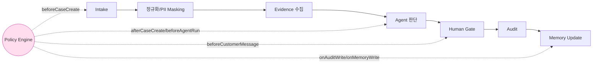

---
tags:
  - area/product
  - type/spec
  - status/active
date: 2026-07-04
up: "[[_INDEX|CaseOps 분기 인덱스]]"
aliases:
  - Policy Engine
  - 금지선-승인선-강제
---
# 07 · Policy Engine — 금지선·승인선 강제 규칙 통합

> **구간**: ① MVP 구현대상 — 5종 guardrail은 `_vendor/JB_project2`(e57b826) `harnessCore.js`로 **실동작(E4 강제)**, 확장 규칙은 `[설계]`.
> **한 줄**: **"LLM은 판단을 돕고, Policy Engine은 금지선·승인선을 강제한다."** 에이전트가 똑똑한 것보다 **무엇을 하면 안 되는지** 아는 것이 금융권 신뢰의 조건이다(2차 원문 §Policy Engine).
> **출처**: [[_원문-ChatGPT-CaseOps대화-2차-정합성]] §6(MVP/아키텍처/로드맵 경계) + 정합성 감사 F결론 + 코드 SSOT `harnessCore.js` guardrail 6종·`<role>Rules.js` hook 배선. **근거등급**: E4(코드 실증)·E2(설계).

---

## 1. 위치 — Case Lifecycle의 강제 게이트

Policy Engine은 신규 기능이 아니라 **모든 상태 전이를 감싸는 정합성 장치**다. Case가 한 단계에서 다음으로 넘어갈 때마다 해당 hook의 guardrail을 통과해야 한다.



에이전트/LLM은 **판단·행동 초안**을 만든다. Policy Engine은 그 초안이 **① 금지선(hard block)** 을 넘었는지, **② 승인선(require approval / escalate)** 에 걸리는지를 결정한다. LLM은 우회할 수 없다 — guardrail은 코드 hook에서 실행되고 위반은 `harnessStore.hookLog`에 적재된다.

## 2. 결정표 — 5 영역 · 12 규칙

결정값: `allow`(통과) · `block`(금지선, 하드 차단) · `require_approval`(승인선, 사람 승인 대기) · `escalate`(상위 검토 라우팅).

| # | 영역 | 조건 | 결정 | 강제 지점 | 등급 |
|---|---|---|---|---|---|
| P1 | 데이터 접근 | 조회/생성 payload에 scope(roleKey·affiliateId) 미지정·불일치 | `block` | `harnessGuardCheckScope` (afterCaseCreate·afterAgentRun·afterApprovalDecision·onAuditWrite) | **E4 강제** |
| P2 | 데이터 접근 | Data Contract 밖 필드·쓰기 접근 (read-only adapter 위반) | `block` | Data Contract adapter | [설계] |
| P3 | 외부 LLM 전송 | 전송 텍스트에 PII 패턴(주민번호·전화·계좌형 숫자열) 검출 | `block` | `harnessGuardCheckPII` (beforeCaseCreate·afterAgentRun·beforeCustomerMessage) | **E4 강제** |
| P4 | 외부 LLM 전송 | 고위험+PII 케이스 → 외부 API 금지, 내부·로컬 모델로 라우팅 | `block`(외부)→내부 | Cost/Latency Router | [설계] |
| P5 | 사람 승인 | 고객 대상(customerFacing) 문안이 approval `pending` 없이 진행 | `require_approval` | `harnessGuardCheckApprovalRequired` (beforeCustomerMessage) | **E4 강제** |
| P6 | 사람 승인 | 승인 결정 주체가 사람 담당자(`USR-`) 아님 | `block` | afterApprovalDecision inline check | **E4 강제** |
| P7 | 상위 검토 | high/critical 케이스를 자동 종결(completed·closed) 시도 | `block` | `harnessGuardCheckAutoClose` (afterCaseCreate·beforeAgentRun) | **E4 강제** |
| P8 | 상위 검토 | 고위험·준법위험·근거부족 → 준법 상위검토(L3~L4) 에스컬레이션 | `escalate` | 승인단계 라우팅(L0~L4) | [설계] |
| P9 | 판단 표현 | 확정 단정 표현(금지 assertion 목록) 사용 | `block` | `harnessGuardCheckAssertions` (beforeCaseCreate·beforeAgentRun·beforeCustomerMessage) | **E4 강제** |
| P10 | 판단 표현 | 근거카드(Evidence) 미연결 추천 발행 | `block` | Evidence Graph 연결 검사 | [설계] |
| P11 | 메모리 저장 | `memory_policy` 목적·등급 초과 저장 (목적 제한 위반) | `block` | Memory Router 정책 검사 | [설계] |
| P12 | 메모리 저장 | 외부 참조 open 직렬화 payload에 PII 포함 | `block` | `harnessGuardCheckPII` (beforeExternalReferenceOpen) | **E4 강제** |

**합계 12 규칙 = E4 강제 7 (P1·P3·P5·P6·P7·P9·P12) + [설계] 5 (P2·P4·P8·P10·P11).**

## 3. 의사코드

```js
// Policy Engine — Case Lifecycle hook에서 호출. LLM 출력은 여기를 우회 못 함.
function policyEvaluate(action, ctx) {
  const violations = [];      // 금지선(block)
  const gates = [];           // 승인선(require_approval / escalate)

  // ── 데이터 접근 ──
  if (checkScope(action.payload, ctx.scopeKey, ctx.scopeValue))  // P1
    violations.push({ rule: "P1", reason: "scope 누락/불일치" });

  // ── 외부 LLM 전송(PII) ──
  if (action.target === "external_llm" && checkPII(action.text)) // P3
    violations.push({ rule: "P3", reason: "PII 원문 외부 전송 금지" });
  if (action.target === "external_llm" && ctx.riskLevel === "high" && action.hasPII)
    violations.push({ rule: "P4", reason: "고위험+PII → 내부/로컬 라우팅" }); // [설계]

  // ── 판단 표현 ──
  if (checkAssertions(action.text, ctx.forbiddenAssertions))     // P9
    violations.push({ rule: "P9", reason: "확정 단정 표현 금지" });

  // ── 상위 검토(고위험) ──
  if (checkAutoClose(ctx.riskLevel, action.nextStatus))          // P7
    violations.push({ rule: "P7", reason: "high/critical 자동 종결 차단" });
  if (["high", "critical"].includes(ctx.riskLevel) || ctx.complianceFlag || !ctx.hasEvidence)
    gates.push({ rule: "P8", kind: "escalate", level: "L3~L4(준법)" }); // [설계]

  // ── 사람 승인(고객 대상) ──
  if (action.customerFacing && action.approvalStatus !== "pending")  // P5
    gates.push({ rule: "P5", kind: "require_approval" });
  if (action.kind === "approval" && !String(action.decidedBy).startsWith("USR-")) // P6
    violations.push({ rule: "P6", reason: "승인 주체가 사람 담당자 아님" });

  // ── 메모리 저장(목적 제한) ──
  if (action.kind === "memory_write" && !withinPurpose(action, ctx.memoryPolicy)) // P11 [설계]
    violations.push({ rule: "P11", reason: "memory_policy 목적/등급 초과" });

  if (violations.length) return { decision: "block", violations };
  if (gates.length)      return { decision: gates[0].kind, gates };
  return { decision: "allow" };
}
```

> MVP 구현체는 위 5종(`checkScope`/`checkPII`/`checkAssertions`/`checkAutoClose`/`checkApprovalRequired`)이 `harnessCore.js`에 **이미 존재**하며 `<role>Rules.js`의 hook 배열에서 호출된다. `policyEvaluate`는 이들을 **하나의 결정 함수로 명시화**한 것 — 발표·기능명세에서 "Policy Engine"이라는 단일 계약으로 승격하기 위한 표면이다.

## 4. rules/ ↔ harnessCore.js guardrail 매핑

CaseOps 개념상 규칙은 3개 rule pack으로 조직된다. 코드 SSOT에서는 `<role>Rules.js`(예: `jeonseProtectionRules.js`)의 hook 배열 + `harnessCore.js` 공통 유틸로 구현됨.

| rule pack | 담당 규칙 | harnessCore.js guardrail | 상태 |
|---|---|---|---|
| **rules/data** | P1·P2·P3·P4·P11·P12 (접근·PII·메모리) | `harnessGuardCheckScope` · `harnessGuardCheckPII` | P1·P3·P12 **강제** / P2·P4·P11 [설계] |
| **rules/compliance** | P5·P6·P7·P8 (승인·상위검토) | `harnessGuardCheckApprovalRequired` · `harnessGuardCheckAutoClose` · afterApprovalDecision `USR-` check | P5·P6·P7 **강제** / P8 [설계] |
| **rules/agent** | P9·P10 (판단 표현·근거) | `harnessGuardCheckAssertions` | P9 **강제** / P10 [설계] |

hook 배선(전 하네스 공통 — jeonse·wooricap·ccl·fdr 4종에 동일 적용, E4):

| hook | 실행 guardrail | 대응 규칙 |
|---|---|---|
| `beforeCaseCreate` | PII · Assertions | P3·P9 |
| `afterCaseCreate` | Scope · AutoClose | P1·P7 |
| `beforeAgentRun` | AutoClose · Assertions | P7·P9 |
| `afterAgentRun` | Scope · PII | P1·P3 |
| `beforeCustomerMessage` | PII · Assertions · ApprovalRequired | P3·P9·P5 |
| `beforeExternalReferenceOpen` | PII | P12 |
| `afterApprovalDecision` | Scope · 사람(USR-) 주체 | P1·P6 |
| `onAuditWrite` | Scope | P1 |

**무엇이 이미 강제되나**: P1·P3·P5·P6·P7·P9·P12 — 4개 하네스의 lifecycle hook에서 실행되고, 위반 시 `harnessStore.hookLog`에 적재되어 `harnessVerification.js`가 DOM PII 스캔까지 재검(E4).
**무엇이 [설계]인가**: P2(Data Contract adapter)·P4(Cost/Latency Router 내부라우팅)·P8(L3~L4 준법 에스컬레이션 라우팅)·P10(Evidence 연결 강제)·P11(Memory Router 목적제한) — 구조는 정의됐으나 코드 강제는 아키텍처 구간(②). "구현 완료" 표현 금지.

## 5. 발표 프레이밍

- 심사 대응(모델·알고리즘·데이터 처리 로직 축): "우리는 LLM 위에 **규칙 엔진(Policy Engine)** 을 얹어, 판단은 AI가·금지선은 코드가 강제하도록 분리했습니다. 12개 규칙 중 7개는 프로토타입에서 실제 실행됩니다."
- 과장 방지: 데모에서는 P1·P3·P5·P6·P7·P9·P12 위반을 **실제로 차단되는 장면**으로 보여주고, P2·P4·P8·P10·P11은 "은행 적용 시 확장(아키텍처 구간)"으로 명시.

## 연결
[[_INDEX|CaseOps 분기]] · [[_원문-ChatGPT-CaseOps대화-2차-정합성]] · [[02-CaseOps-Engine-7알고리즘]] · [[01-메모리-거버넌스]] · [[03-119-사고대응-에이전트]]
