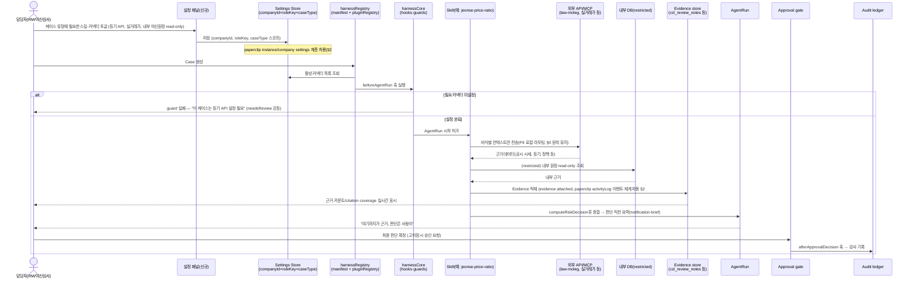

# paperclip 통합 블루프린트 — 구조·메커니즘 이식 설계

> **이 문서는 분석/설계 블루프린트다. 구현이 아니다.** 코드 수정 없음, 읽기 전용 조사 기반. 구현은 이 문서 확정 후 별도 트랙(§6)에서 착수한다.
>
> **관련 선행 문서**: [[agents-v2-paperclip기반-재설계]](에이전트 조직·hiring·domain pack 재설계 — 로스터·조직축 담당), [[skills-스킬·플러그인·외부 플러그인·데이터 구상]](스킬·커넥터·데이터 카탈로그 담당). 이 문서는 그 둘이 다루지 않은 **스택 간극·프리미티브 매핑·디자인 분리·이식 시퀀스·실행 태스크 분해**를 담당한다. 중복 시 이 문서가 아니라 위 두 문서가 로스터/카탈로그 SSOT다.
>
> **코드 SSOT**: `_vendor/JB_project2/app/`(harnessCore.js·harnessRegistry.js·cclConsole.*·modules.js·llmClient.js). paperclip 원본: `_vendor/paperclip-master/`(pnpm 모노레포, 3267파일, 구조 샘플링 기반 — 전체 정독 아님).

---

## §1. paperclip 스택

paperclip은 **pnpm 모노레포 + TypeScript 전용**이다. `type: "module"`, Node ≥20 (`package.json`).

| 레이어 | 스택 | 근거 파일 |
|---|---|---|
| 서버 | Express 5, `better-auth`(인증), `ws`(실시간), `pino`(로깅) | `server/package.json` |
| DB | Drizzle ORM + `embedded-postgres`(내장 postgres 프로세스) + `postgres`(pg driver), 스키마 95개 파일, 마이그레이션 128개 | `packages/db/package.json`, `packages/db/src/schema/*.ts`, `packages/db/src/migrations/` |
| UI | React 19.2, Vite 6, React Router 7, Tailwind 4, `@assistant-ui/react` | `ui/package.json` |
| CLI | commander 기반, 어댑터 패키지 workspace 의존 | `cli/package.json` |
| LLM 런루프 | **API를 직접 호출하지 않고 CLI 어댑터를 서브프로세스로 구동**. `claude_local`, `codex_local` 등 타입별로 `npm install -g @anthropic-ai/claude-code` 같은 CLI를 실행해 그 프로세스의 stdout/stderr를 계약으로 삼음 | `packages/adapters/claude-local/src/index.ts` |
| 실행 모델 | 상시 실행 프로세스가 아니라 **heartbeat**(트리거 시 짧게 깨어나 일하고 종료) | `server/src/services/heartbeat.ts`(12,530줄, 최대 파일), `packages/shared/src/types/heartbeat.ts`(`HeartbeatRunStatusPhase`: `git_sync→config_sync→adapter_startup→restore→export→finalize`), `skills/paperclip/SKILL.md`("You run in heartbeats... wake up, do something useful, and exit") |
| 실제 설치 인스턴스 | `db/`가 embedded-postgres 데이터 디렉터리 그 자체(`PG_VERSION`, `pg_wal`), `companies/<id>/agents/<id>/`가 에이전트별 작업 디렉터리, 설정은 파일이 아니라 DB(jsonb) 안에 저장 | `_vendor/paperclip-installed/instances/default/` |

**핵심 관찰**: paperclip은 "LLM API 클라이언트"가 아니라 "이미 설치된 코딩 에이전트 CLI(Claude Code, Codex 등)를 오케스트레이션하는 제어 평면"이다. 이는 JB_project2의 `llmClient.js`(Anthropic Messages API 직접 호출 또는 로컬 Ollama HTTP 호출, 20초 타임아웃 + mock fallback)와 **런루프 철학 자체가 다르다** — 우리는 자체 LLM 호출 seam을 갖고 있고 paperclip은 외부 CLI 프로세스에 위임한다. 이 차이는 §5에서 이식 범위를 좁히는 핵심 근거다.

---

## §2. 재사용할 프리미티브

| # | 프리미티브 | paperclip 위치 | 하는 일 | 우리 매핑(JB_project2) | 판정 |
|---|---|---|---|---|---|
| 1 | Heartbeat run loop | `server/src/services/heartbeat.ts`, `packages/shared/src/types/heartbeat.ts` | 트리거 시 깨어나 실행→종료, phase별 상태 기록 | `harnessCore.js`의 `harnessRunHooks` + `cclConsole.data.js`의 `recordCorporateCreditAgentRun`(AgentRun은 이미 있으나 "프로세스가 깨어난다"는 개념 자체는 없음 — 정적 MVP는 즉시 실행-완료) | **재구현(가볍게)**: phase 이름 체계만 AgentRun 상태값에 차용. 실제 워커/프로세스 스폰은 불필요(서버가 없는 vanilla JS 프론트라서) |
| 2 | activityLog | `packages/db/src/schema/activity_log.ts`(`actorType/action/entityType/entityId/agentId/runId/details jsonb`), `server/src/services/activity-log.ts` | 범용 감사 이벤트 스트림 | `cclWriteAudit()` → `ccl_audit_logs`, `harnessCore.js`의 `hookLog` | **이미 대응**: 그대로 가져올 필요 없음. 필드 셰이프만 참고해 우리 audit row에 `agentId/runId` 필드 누락 있으면 보강 |
| 3 | Plugin/adapter registry | `server/src/adapters/registry.ts`(`registerServerAdapter/unregisterServerAdapter/requireServerAdapter`), `adapter-plugin.md`(phase1 리팩터 작업 로그) | 코드 수정 없이 외부 어댑터 타입을 런타임 등록 | `modules.js`의 `pluginRegistry`(정적 배열, `usedBy` 필드) | **재구현**: 정적 배열 → `registerPlugin/requirePlugin` 런타임 함수로 승격. "담당자가 설정 화면에서 커넥터를 켠다"는 실차별성의 전제 조건 |
| 4 | Plugin worker/RPC 격리 | `packages/plugins/sdk/src/`(`define-plugin.ts`, `protocol.ts`, `worker-rpc-host.ts`) | 플러그인을 워커 프로세스로 격리, RPC 통신 | 없음(브라우저 `fetch`만) | **스킵**: 서버가 없어 프로세스 격리 자체가 불필요(YAGNI). 서버 트랙이 생긴 뒤 재검토 |
| 5 | MCP server 노출 | `packages/mcp-server/`(`stdio.ts`, `tools.ts`, `client.ts`, bin `paperclip-mcp-server`) | paperclip 자신을 MCP 서버로 노출 | 없음 | **재구현(미래 트랙)**: 본선 이후 우리 `harnessCore` 함수를 MCP tool로 노출하면 "외부 담당자 도구가 우리 케이스에 접근"하는 방향과 맞음. 본선 범위 밖 |
| 6 | Hiring 승인 게이트 | `server/src/routes/agents.ts`(`POST /companies/:id/agent-hires`, `requireBoardApprovalForNewAgents` 플래그, 직접 생성 라우트 차단), `packages/db/src/schema/approvals.ts` | 신규 에이전트는 `pending_approval`로 먼저 생성, board 승인 후 `idle` | `harnessVerification.js`의 금지 alias 검사 | **재구현**: 설계는 이미 [[agents-v2-paperclip기반-재설계]] §4에 "도메인팩 hiring 절차"로 문서화됨 — 코드화만 남음. `harnessRegistry.js`에 manifest 등록 시 `status: pending_approval` 상태를 추가 |
| 7 | Settings 계층(instance/company/user) | `packages/db/src/schema/instance_settings.ts`, `companies.ts`, `plugin_company_settings.ts`, `user_sidebar_preferences.ts` | 전역/회사/사용자 3단 설정 스코프 | 없음(정적 seed만) | **재구현**: "담당자가 스킬+커넥터를 설정"하려면 최소 2단(계열사×직군 스코프 + 담당자 개인 스코프) 설정 저장소 필요. `localStorage` 키를 `companyId/roleKey/userId`로 네임스페이스 |
| 8 | Secrets 관리 | `company_secrets.ts`, `company_secret_versions.ts`, `company_secret_bindings.ts` | 버전관리되는 비밀값 + 어댑터별 바인딩 | `llmClient.js`의 `RUNTIME_CONFIG`(런타임 주입, 코드 하드코딩 없음) | **부분 차용**: 버저닝은 오버킬(YAGNI). "어떤 secret이 어떤 커넥터에 바인딩되는가" 개념만 참고 |
| 9 | Per-agent evals bundle | `evals/promptfoo/*`(4개 모델, promptfoo), `doc/plans/2026-03-13-agent-evals-framework.md`(Layer1 deterministic → Layer4 efficiency) | adapter+model+skill version을 bundle로 평가 | `harnessVerification.js`의 `runHarnessSelfTest`(6개 검증기, deterministic) | **부분 이식**: Layer1(hard-fail) 개념은 이미 구현됨과 대응. Layer2~4(rubric/e2e/efficiency)는 대회 범위 밖(스킵) |
| 10 | Company-scoped 경계 | 전 테이블 `companyId` FK | `harnessRegistry.js` manifest의 `scopeKey/scopeValue` | **이미 대응**: 그대로 유지 |
| 11 | Skill catalog packaging | `packages/skills-catalog/`(`catalog-builder.ts`, bundled/optional), `skills/paperclip/SKILL.md`(markdown-first 이식 가능 패키지) | 회사 단위로 설치·버전관리되는 스킬 | `modules.js`의 `skillContent`/`skillBody`(정적 텍스트) | **재구현(가볍게)**: "도메인팩 = AGENTS+SKILL+TASK+EVAL+APPROVAL 묶음" 설계는 이미 [[agents-v2-paperclip기반-재설계]]에 있음. 코드에서는 skillRack 항목에 `domainPack` 소속 필드만 추가하면 충분 |
| 12 | Agent routing | 미발견 — paperclip에도 별도 라우팅 엔진은 없음(`plugin-tool-dispatcher.ts`는 플러그인 툴 디스패치일 뿐) | 작업 배정은 heartbeat 시 issue checkout/assignment로 처리, 전용 라우터 없음 | `harnessRegistry.js`의 scope 매치(`scopeKey/scopeValue`)가 사실상 라우팅 역할 | **가져올 게 없음** — 우리 harnessRegistry가 이미 paperclip보다 명시적인 라우팅을 갖고 있음. DB adapter도 동일(paperclip은 postgres 하드코딩, 추상화 없음) — 여기는 오히려 우리가 새로 설계해야 할 영역(내부 DB 커넥터별 접근권한) |

---

## §3. "담당자 설정 → 근거 상향 → 판단 직전 보조" 시퀀스

실차별성은 **담당자(RM/여신심사/준법)가 케이스 유형별로 스킬·외부 API·내부 DB 접근을 설정하면, 그 설정이 Evidence 수집 범위를 넓혀 판단 직전까지 근거를 쌓아주는 것**이다. §2의 프리미티브 #3(plugin registry)·#7(settings 계층)·#6(hiring 게이트 패턴)을 우리 하네스(harnessRegistry/harnessCore/cclConsole.data.js)에 얹으면 다음 시퀀스가 된다.

핵심은 **"신규 도메인팩/커넥터 추가" 자체도 §2 #6 hiring 게이트 패턴을 따른다는 것**이다. 담당자가 설정 패널에서 새 커넥터를 켜는 시점에 즉시 활성화하지 않고, 준법 승인자가 검토해야 하는 커넥터(`restricted` 등급, [[skills-스킬·플러그인·외부 플러그인·데이터 구상]] §4 표 참고)는 `pending_approval` 상태로 조직도에만 노출한 뒤 승인 후 활성화한다.

---

## §4. 디자인 분리 전략 — 구조는 paperclip, 표현은 JBFG

**원칙**: 구조/레이아웃 아이디어는 저작권 보호가 약하고(정보 배치·컴포넌트 계층은 "아이디어"), 표현(색상·아이콘·컴포넌트 소스·문구 톤)은 강하게 보호된다. paperclip에서 가져오는 건 전자만이다.

| 가져올 것(구조) | 재작성해야 할 것(표현) |
|---|---|
| 조직도(사이드바) + 케이스보드(중앙) + 상세패널(우측) + activity feed(하단/탭)의 4분할 레이아웃 정보 계층 | React 컴포넌트 소스(`.tsx` 전체), Tailwind 클래스 조합, `@assistant-ui/react` 컴포넌트 |
| 상태 배지 의미체계(idle/running/approval_pending/error) — **개념**만 | 배지 색상·아이콘(lucide 등) — JBFG 팔레트로 재정의 |
| activityLog 이벤트 타입 명명 규칙(`entity.action` 패턴) | 실제 문구·톤(`ui/src/lib/ceo-instructions.ts` 같은 카피) |
| plugin/settings 화면의 "토글 목록 + 스코프 selector" 정보구조 | 로고·워드마크·전체 색상 시스템 |

**무엇을 재작성해야 베낀 게 아닌가**: 이미 [[디자인-토큰-업그레이드-설계안]]과 `jbfg-디자인/jbfg-design-tokens.css`, `jbfg-design-system-guide.md`가 JBFG 전용 토큰 세트를 갖고 있다. §3 시퀀스에서 나온 "설정 패널", "근거 카운트 배지", "activity feed" 3개 신규 UI 요소는 **paperclip 화면을 참고 스크린샷으로도 보지 않고, 정보 요구사항(무엇을 보여줘야 하는가)만 이 문서 §2/§3에서 뽑아 JBFG 토큰으로 처음부터 그린다.** 코드 SSOT는 여전히 vanilla JS string-template(`cclConsole.app.js` 패턴)이며 React 컴포넌트를 옮겨오지 않는다.

---

## §5. 스택 간극과 이식 전략

| | paperclip | JB_project2 |
|---|---|---|
| 언어/빌드 | TS, pnpm workspace, Vite/esbuild | vanilla JS, 무번들, `<script>` 로드 |
| 서버 | Express 5 + Drizzle + embedded-postgres | 없음(정적, `localStorage`) |
| 실행 검증 | vitest, playwright, promptfoo | `verify_static.py`(string-presence 계약) + Playwright E2E |
| LLM 런루프 | 외부 CLI 프로세스 서브프로세스 실행 | `llmClient.js` 직접 API/Ollama HTTP 호출 |

**간극은 크고, 좁힐 필요도 없다.** 권장은 **점진 이식이 아니라 "구조만 재작성"**이다. 근거:

1. §4에서 이미 확정했듯 UI는 어차피 컴포넌트째 재작성해야 한다(베끼지 않기 위해) — 그러면 React/Tailwind를 그대로 들여올 이유가 없다.
2. 본선 무빌드 전제(`verify_static.py`가 `node --check`만 보장)를 지금 깨면 제출 리스크가 커진다. pnpm/Vite 도입은 이 계약과 정면 충돌.
3. 재사용 가치가 있는 건 §2 표의 "스키마 셰이프"와 "패턴 이름"이지 실행 가능한 TS 코드가 아니다 — 타입/스키마를 읽고 그 모양을 vanilla JS 객체 리터럴·함수 계약으로 옮기는 것으로 충분하며, pnpm workspace 전체를 이해·유지보수할 필요가 없다.
4. paperclip의 스택은 "이미 설치된 코딩 에이전트 CLI를 제어"하는 데 최적화돼 있고(§1), 우리는 "금융 도메인 판단 보조 + PII 로컬 라우팅"에 최적화해야 한다 — 런루프 철학이 달라 애초에 이식 대상이 아니다.

**본선 이후(실제 제품 트랙)**: 서버가 필요해지는 시점에 pnpm 모노레포 전체를 채택하지 말고, Express(또는 그 이하)+Drizzle+SQLite/Postgres 정도의 경량 스택을 새로 잡되, `activity_log`/`approvals`/`plugin_config`/`instance_settings` 4개 테이블의 **필드 셰이프만** paperclip 스키마에서 참고한다. 플러그인 워커 격리(§2 #4)·MCP 서버 노출(§2 #5)은 외부 플러그인 작성자가 실제로 여럿 생기기 전까지 스킵.

---

## §6. 단계별 실행안 (문서 확정 후 착수, Codex 위임 가능 단위)

| # | Task | 대상 파일 | 의존성 |
|---|---|---|---|
| 1 | `harnessRegistry.js` manifest에 `settings` 필드 추가(스킬/커넥터 on-off 스키마 + `status: pending_approval\|active`) | `JB_project2/app/harnessRegistry.js` | 없음 |
| 2 | `modules.js`의 `pluginRegistry`(정적 배열)를 `registerPlugin/requirePlugin` 런타임 API로 리팩터 | `JB_project2/app/modules.js` | Task 1 |
| 3 | 담당자 설정 UI 패널 신설(계열사×직군×케이스유형 스코프 selector + 커넥터 토글 목록, JBFG 토큰만 사용) | `JB_project2/app/cclConsole.app.js`(신규 뷰) | Task 1, 2 |
| 4 | AgentRun 훅에 "필요 커넥터 활성 여부" guard 추가 | `JB_project2/app/harnessCore.js`(신규 `harnessGuardCheckConnectorEnabled`) | Task 1 |
| 5 | Evidence 카운트/근거 커버리지 표시 + activity feed 이벤트 타입 체계(§2 #2, §3) | `JB_project2/app/cclConsole.data.js` | Task 3, 4 |
| 6 | 신규 도메인팩/커넥터 hiring 플로우(§2 #6) — `pending_approval` 상태 등록·승인·활성화 | `JB_project2/app/harnessRegistry.js`, `harnessVerification.js` | Task 1 |
| 7 | (코드 아님, 문서) `04_tech/api-spec.md`에 §3 시퀀스의 서버 API 초안 반영 — 본선 이후 서버 트랙 대비 | `08_본선/03_제품/04_tech/api-spec.md` | 이 블루프린트 승인 |

각 Task는 독립적으로 Codex에 위임 가능하도록 파일 단위로 쪼갰다. Task 3(UI)만 §4 디자인 분리 원칙 위반 여부를 사람이 리뷰해야 한다(구조 참고 vs 표현 복제 경계).
