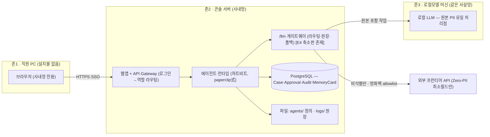

# 배포 토폴로지·운영 기획서 — "웹으로 접속, 회사 서버에 설치"의 실체

> **상태**: [분기/미확정] 기획서. 배포 확정은 팀 결정 사항. 07_architecture §12(배포 전제)·§6(저장소)·§7(인증)를 승계하고, 7/2 스프린트 회의("은행 서버에서 에이전트가 돌아가고 담당자가 로그인해 연결", "몇 명이 얼마나 쓸 수 있는가 준비돼 있어야")의 방향과 정합. 데모 URL 전략은 [[Q8-배포 + 도메인 URL]](하이브리드 권장) 소관 — 이 문서는 **실제 은행 도입 시 운영 배포**를 다룬다.

## 0. 요구 프롬프트 원문 (재사용용)

> 너는 지방은행 전산팀에 AI 에이전트 콘솔(JB LocalGuard OS)을 도입하는 배포 설계자다. 전제: ① 담당 직원은 **웹 브라우저로만 접속**한다(개인 PC에 설치 없음) ② 시스템은 **은행 사내망 서버에 설치**된다 ③ 운영계약 `Case→AgentRun→Agent→Skill→Evidence→Approval→Audit`과 PII 비반출(원본은 로컬모델만, 외부 프런티어는 Zero-PII 최소필드) 원칙은 불변이다.
> 답하라: (a) 서버에 설치되는 실체는 무엇인가 — 무엇이 폴더/파일이고 무엇이 DB인가, AI 비전문가 전산 담당자가 이해할 수 있게 (b) 직원 PC→서버→로컬모델→외부 API의 네트워크 경로와 각 경계의 통제 (c) 동시 사용자 N명일 때 병목과 자원 계획 (d) 이를 위해 필요한 기획 문서 세트 — 이미 있는 문서와 새로 쓸 문서를 구분하라. 근거 없는 수치는 `[가정]`, 미확정은 [분기/미확정] 표기.

## 1. 정직한 답 — "폴더와 여러 파일 형태로 되겠지? 진짜 그러한가?"

**반은 맞고 반은 아니다.** 롤모델 paperclip의 실제 설치본(`_vendor/paperclip-installed/instances/default/`)이 실증한다:

| 서버 안의 실체 | 형태 | 실증 (paperclip 설치본) |
|---|---|---|
| 애플리케이션 코드(웹 화면·API·오케스트레이터) | **폴더+파일** — 설치·업데이트 단위 | 앱 디렉토리 |
| 에이전트 정의(agent.yaml·SOUL.md·tools.json·memory.md) | **폴더+파일** — 콘솔에서 열람되는 그 파일들, 사람은 편집 안 함([[11-메모리-3계층-자동진화-설계도]]) | `.agents/` 구조 |
| 운영 로그(LLM 원장 `llm-runs.jsonl`·서버 로그) | **파일(append-only)** → 운영 승격 시 DB 병행 | `logs/`, `telemetry/` |
| **업무 데이터(케이스·고객·승인·감사)** | **DB — 파일 아님** | `db/` = **내장 PostgreSQL 실물**(PG_VERSION·pg_wal 확인) |
| 로컬모델 가중치 | 파일(수 GB~수십 GB) | models/ 상당 |

파일로 두면 안 되는 이유(전산팀 언어로): 동시 접속 잠금·트랜잭션·권한 행 단위 통제·감사 추적이 파일시스템에는 없다. 반대로 에이전트 정의를 DB에 넣지 않는 이유: 버전 관리(diff·승인·롤백)가 파일이 자연스럽다. **"코드와 정의는 파일, 기록과 데이터는 DB"** — 한 문장이 답이다.

**현행 노트(2026-07-05, HEAD 8c274b5)**: `_vendor/JB_project2`에 데모용 `server/` 백엔드가 신설됐다 — 업무 데이터 저장을 파일 JSON(`JsonRepository`, 기본값)과 Supabase(`JB_DB_DRIVER=supabase`, 키는 env 전용) 중 선택하는 옵션이 생겨, 위 "코드·정의=파일 / 기록·데이터=DB" 원칙의 실증 1단계로 볼 수 있다. 단 프런트(`app/`)는 아직 이 백엔드에 자동 연동되지 않고 기본은 여전히 브라우저 `localStorage`다(구현현황-JB_project2 §10).

직원 쪽에는 **아무것도 설치되지 않는다.** 브라우저 → 사내망 URL(`https://localguard.jb.내부망`) 접속·로그인이 전부다. 설치·업데이트는 서버 1곳에서만 일어난다.

## 2. 배포 토폴로지 — 3존 구조 (07 §12 승계)

- 회의록 정합(7/2): "실제 일을 하는 건 에이전트… **은행 서버에서 에이전트가 돌아가고**, 담당자가 로그인해 연결" — 존2가 그 문장의 구현이다.
- 경계 통제: 존1→존2 SSO+역할 스코프(07 §7 `roleKey` [E4]) / 존2→존3 사설망 내부 / 존2→외부 **allowlist 단일 관문**(/llm 게이트웨이) — PII 비반출을 네트워크 지점 하나로 물리화. 데모의 `api-proxy.mjs`(:8020)가 이 관문의 축소 재현 [E4].
- **Ollama 탑재 가능 [E4, 2026-07-04]**: 게이트웨이에 `ollama` 엔진 추가 구현 — `OLLAMA_BASE`(Docker 분리 시 `http://pii-zone:11434`)·`OLLAMA_MODEL`로 존3 로컬모델을 지정. 미기동 시 폴백 사다리 실검증됨(`ollama:engine_missing→claude` 원장 기록). 단 Mac Docker는 GPU 미지원 → 데모는 소형 모델(0.5B~1B급) [가정], 실배포 GPU 서빙은 07 §5 로드맵.

## 3. 컴퓨팅·자원 — "몇 명이 얼마나 쓸 수 있는가" (7/2 회의 지적 대응)

- 가벼운 것: 웹 화면·API·DB — 일반 서버 1대로 수백 명 규모 [가정, 통상치].
- 무거운 것: **LLM 추론 = 유일한 병목.** RM N명 동시 요청 → /llm 게이트웨이가 큐잉·우선순위(긴급 케이스 우선)·seat당 예산 상한으로 통제 [설계]. 실측 근거는 Cost Sentinel 원장([[Q13-토큰비용-유닛이코노믹스]]: 케이스당 ~$0.12 실측, RM 월 환산 계기판 [E4]).
- 확장 경로: RM 116석(초기)→GPU 1~2대 로컬모델 서빙 [가정] → 부족 시 야간 배치 분리·티어 하향(분류·요약=소형모델). GPU TCO 논거는 07 §5 비용 메시지 승계 [미검증 수치 주의].
- 답변 자세: "우리 컴퓨터로 돌릴게요"가 아니라 **큐·예산·계기판이 이미 설계에 있다**로 답한다.

## 4. 필요한 기획 파일 세트 — 있는 것 / 새로 쓸 것

원칙: **신규 최소화.** 기존 문서 보강으로 7할을 덮고, 신규는 2건만.

| # | 기획 파일 | 상태 | 위치 |
|---|---|---|---|
| 1 | 배포 아키텍처(존·경계·포트) | ✅ 있음 — 본 문서 §2 + 07_architecture §12 | 본 문서 |
| 2 | 데이터 저장 설계(파일 vs DB 구분) | ✅ 있음 — 본 문서 §1 + 07 §6 + 04_tech/data-model | 기존 |
| 3 | 계정·권한·로그인→역할 라우팅 | 🔶 부분 — 07 §7 [E4] + FR(로그인 코드→역할). OAuth/OIDC 상세는 [[Q7-로컬모델+API+OAuth 구동]] `(근거 필요)` 유지 | 기존 보강 |
| 4 | 네트워크·보안 구성(망분리·allowlist·반출 통제) | 🔶 부분 — 07 §4 Trust Boundary + [[적법성-근거팩]]. 구성도 1장 필요 | 기존 보강 |
| 5 | **설치·운영 런북**(전산팀용: 설치 절차·백업·복구·업데이트·롤백) | ⬜ **신규 필요** — 도입 제안 시 전산팀이 가장 먼저 찾는 문서 | 신규(로드맵) |
| 6 | **용량·성능 산정표**(동시사용자→GPU·큐 정책) | ⬜ **신규 필요** — §3을 표로 정량화, Cost Sentinel 실측이 입력 | 신규(로드맵) |
| 7 | 사고 대응·BCP | 🔶 부분 — failure-modes(FM-D1~D4) + [[03-119-사고대응-에이전트]] | 기존 |
| 8 | 데모 배포(URL·합성 데이터) | ✅ 있음 — [[Q8-배포 + 도메인 URL]] 하이브리드안 | 기존 |

신규 2건(5·6)은 본선 제출 필수가 아니므로 [로드맵] — 발표에서는 본 문서 §1~§3으로 "구상돼 있다"를 답하면 충분하다.

## 5. 발표용 30초 답변

"직원 PC에는 아무것도 설치하지 않습니다. 은행 사내망 서버에 한 번 설치되는 웹 콘솔이고, 직원은 브라우저로 로그인하면 자기 역할의 대시보드가 뜹니다. 서버 안은 단순합니다 — 코드와 에이전트 정의는 파일, 케이스·승인·감사 기록은 DB입니다. AI 연산만 분리돼 있는데, 원본 고객정보를 다루는 로컬모델은 같은 사설망 안에 있고, 외부 AI로는 비식별 최소필드만 방화벽의 단일 관문을 통해 나갑니다. 그 관문이 저희 데모에서 이미 돌아가는 /llm 게이트웨이고, 몇 명이 얼마나 쓰는지는 토큰 계기판으로 실측하고 있습니다."

## 연결
[[Q8-배포 + 도메인 URL]] · [[Q7-로컬모델+API+OAuth 구동]] · [[Q13-토큰비용-유닛이코노믹스]] · [[08_본선/03_제품/docs/07_architecture|07_architecture §4·§6·§7·§12]] · [[11-메모리-3계층-자동진화-설계도]] · 회의록: [[2026-07-02-스프린트회의-정리본]]
