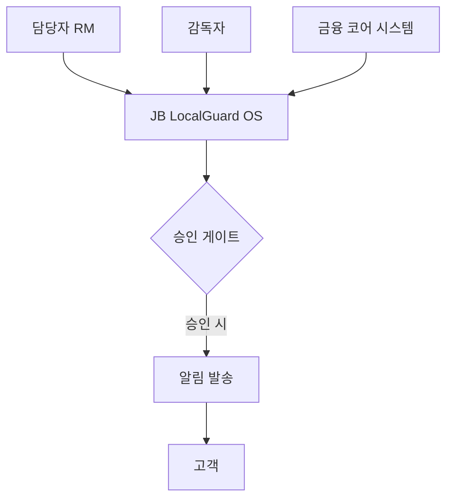

---
tags:
  - area/product
  - type/stub
  - status/draft
date: 2026-06-26
up: "[[08_본선/03_제품/INDEX|제품 인덱스]]"
---

# 시스템 컨텍스트 다이어그램 (C4 L1)

> 역엔지니어링/브레인스토밍으로 채울 예정

---

## 목적

C4 모델 Level 1 — 시스템이 외부 액터·시스템과 어떻게 연결되는지 보여줌.

---

## 씨앗 포인트

- **씨앗**: 외부 시스템 — 금융 코어 시스템 (계정·거래 DB), 금융 규정 DB, 알림 발송 시스템
- **씨앗**: 외부 액터 — 담당자(RM), 감독자, 관리자, 고객(수신만)
- **씨앗**: JB LocalGuard OS는 중간에서 신호를 수집·처리·판단 초안 생성 후 승인 게이트를 통해서만 외부 발송

---

## 다이어그램

> 작성 예정 — Excalidraw 또는 Mermaid로 작성

---

## 참조

- [[08_본선/03_제품/05_diagrams/99_comprehensive-architecture|종합 아키텍처]]
- `assets/excalidraw/` — Excalidraw 원본 파일
