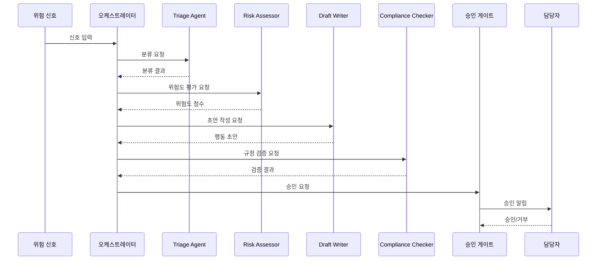

---
tags:
  - area/product
  - type/stub
  - status/draft
date: 2026-06-26
up: "[[08_본선/03_제품/INDEX|제품 인덱스]]"
---

# 에이전트 흐름 다이어그램

> 역엔지니어링/브레인스토밍으로 채울 예정

---

## 목적

위험 신호 입력부터 승인 게이트까지 에이전트 실행 시퀀스를 시각화.

---

## 씨앗 포인트

- **씨앗**: 오케스트레이터가 서브에이전트를 순차/병렬로 조율
- **씨앗**: 각 에이전트 실행은 AuditEvent로 기록
- **씨앗**: 에이전트 실행 결과는 케이스 상세에서 실시간 스트리밍으로 표시

---

## 시퀀스 다이어그램

> 작성 예정

---

## 참조

- [[08_본선/03_제품/02_agent-design/agent-roster|에이전트 로스터]]
- [[08_본선/03_제품/02_agent-design/orchestrator|오케스트레이터]]
