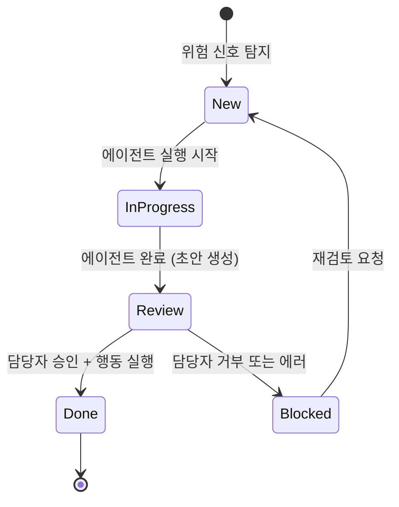

---
tags:
  - area/product
  - type/stub
  - status/draft
date: 2026-06-26
up: "[[08_본선/03_제품/INDEX|제품 인덱스]]"
---

# 케이스 생명주기 (FSM)

> 역엔지니어링/브레인스토밍으로 채울 예정

---

## 목적

Case 엔티티의 FSM(유한 상태 머신) 5단 상태 전환을 시각화.

---

## 씨앗 포인트

- **씨앗**: FSM 5단 상태 — New → 진행중 → 검토 → 완료 (승인 후 행동) / 차단 (거부 또는 에러)
- **씨앗**: 5컬럼 칸반이 이 상태 모델과 1:1 대응
- **씨앗**: 각 상태 전환은 AuditEvent로 기록

---

## 상태 전환 다이어그램

> 작성 예정

---

## 상태별 허용 행동

| 상태 | 허용 행동 | 금지 행동 |
|-----|---------|---------|
| New | 에이전트 실행 시작 | 고객 발송 |
| InProgress | 실행 모니터링 | 고객 발송 |
| Review | 승인/거부/수정 | 고객 발송 |
| Done | 감사 로그 확인 | 재수정 |
| Blocked | 재검토 요청 | 고객 발송 |

---

## 참조

- [[08_본선/03_제품/04_tech/data-model|데이터 모델]]
- [[08_본선/03_제품/05_diagrams/03_approval-gate|승인 게이트]]
