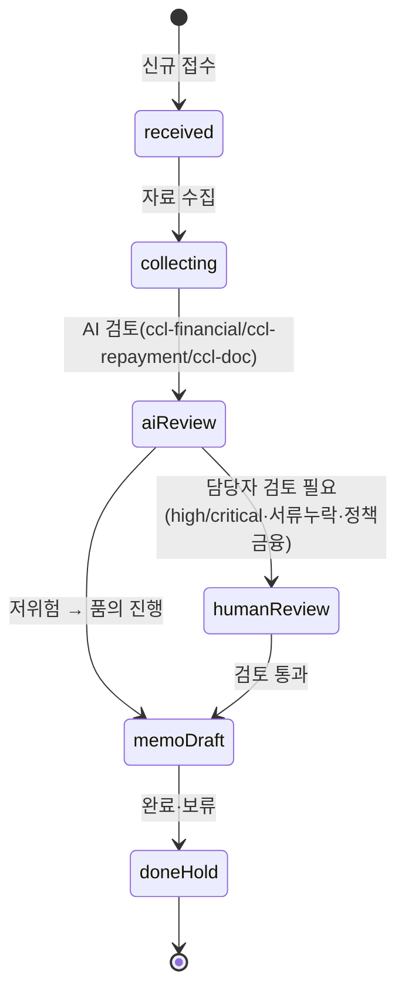
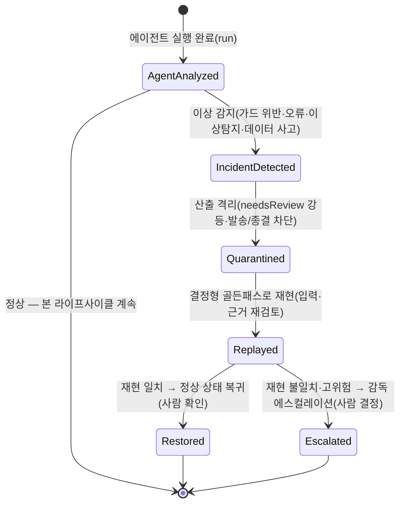

---
tags:
  - area/product
  - type/diagram
  - status/active
date: 2026-07-04
up: "[[INDEX|제품 인덱스]]"
---

# 케이스 생명주기 (FSM) — 기업여신 콘솔(CCL)

> **정합 기준**: [[08_본선/03_제품/05_domain-model|05_domain-model]] §3(루트 정본). 코드 SSOT: `_vendor/JB_project2/app/cclConsole.core.js` `CCL_BOARD_COLUMNS`(e57b826). 히어로 = **CCL-0001**(전주 카페 운영자 운전자금) — 현재 상태 `aiReview`, `riskLevel: high`, `requiresHumanReview: true`.

---

## 목적

Case 엔티티의 실제 보드 컬럼 = 상태 전환을 시각화한다. (구 스텁의 `New/InProgress/Review/Done/Blocked` 5단은 실제 코드 상태명과 불일치했음 — 아래로 대체.)

---

## 상태 전환 다이어그램 (실제 `CCL_BOARD_COLUMNS`)

- **활성 상태**(`CCL_ACTIVE_STATUSES`): `received·collecting·aiReview·humanReview·memoDraft` — `doneHold`만 비활성 [E4].
- 은행 실무 `상담→심사→승인→약정·실행→사후관리` 흐름 중 **심사~품의 구간**에 해당. 약정·기표·회수·EOD는 이 콘솔 범위 밖 [E2].

---

## 인시던트 대응 분기 (119) — [분기/미확정]

> **미확정 [분기/미확정]**: 아래는 에이전트 실행 중 이상(오류·이상탐지·가드 위반·데이터 사고)이 감지됐을 때의 **대응·복구 서브플로**로, 코드 SSOT(`CCL_BOARD_COLUMNS` 등 4콘솔 board)에는 아직 없는 **설계 제안**이다. 정식 상태로 승격 전이며, 명칭·전이 조건·소유 엔티티(AgentRun vs Case)는 7/4 이후 확정 필요. "119"=긴급 대응 은유(자동 종결 금지·사람 에스컬레이션 원칙과 정합).
>
> 근거 훅: 실행 중 `harnessGuardCheckAutoClose`(high/critical 자동완료 차단)·`beforeAgentRun`/`afterAgentRun` 스코프·단정 가드가 위반을 잡으면 run을 `needsReview`로 강등한다 [E4]. 아래 분기는 그 강등을 **격리→재현→복구/에스컬레이션**의 명시 상태기계로 확장한 것 [E1, 미검증].

- **격리(Quarantined)**: 인시던트 감지 시 해당 산출은 고객 발송·자동 종결 경로에서 즉시 배제 — `beforeCustomerMessage`/자동종결 가드와 동일 원칙 [E4].
- **재현(Replayed)**: 라이브 LLM 장애·비결정성 대비, 결정형 골든패스로 동일 입력을 재실행해 산출 일치 여부를 확인(F-2.1.1 폴백과 연동) [E1].
- **복구(Restored)/에스컬레이션(Escalated)**: 복구·종결 주체는 항상 사람(`USR-*`) — high/critical은 감독 에스컬레이션 강제 [E4 원칙, 상태 신설은 미확정].
- 이 분기는 4개 역할 콘솔(CCL·FDS·전세보호·JB우리캐피탈) **공통 서브플로**로 설계하되, 콘솔별 board 컬럼 편입 여부는 [분기/미확정].

---

## 상태별 허용 행동

| 상태 | 허용 행동 | 금지 행동 |
|---|---|---|
| `received` | intake 분류, 서류 체크리스트 생성 | 고객 발송, 승인 확정 |
| `collecting` | 재무·상환 자료 수집, AI 요약 요청 | 고객 발송 |
| `aiReview` | AI 요약/체크/초안 생성(ccl-financial·ccl-repayment·ccl-doc) | 확정 판단(승인/거절·금리·신용등급) |
| `humanReview` | 담당자 검토, 감독 핸드오프(고위험 시 escalated) | 사람 검토 없이 자동 진행 |
| `memoDraft` | 품의 초안 확정, 승인 등록(Approval pending) | 자체 결재 |
| `doneHold` | 감사 로그 확인 | 재수정(재검토는 신규 케이스 또는 handoff로 재상정) |

---

## 다른 엔티티 상태 (동일 케이스 라이프사이클에 연동)

| 엔티티 | 상태 집합 | 종결 규칙 |
|---|---|---|
| AgentRun | `queued → running → needsReview / pendingApproval → completed` | high/critical은 `completed` 자동전이 차단(`needsReview` 강제) |
| Approval | `pending → approved / rejected` | 결정 주체는 사람(`USR-*`)만 |
| DocCheck | `missing → ready`(→ verified) | `missing`은 보완요청 초안 트리거 |
| Handoff | `open`·`escalated` | high/critical 핸드오프는 `escalated` 자동 |

---

## 참조

- [[08_본선/03_제품/05_domain-model|05_domain-model — 도메인 모델(정합 대상)]]
- [[08_본선/03_제품/04_tech/data-model|04_tech/data-model — 필드 SSOT]]
- [[08_본선/03_제품/05_diagrams/03_approval-gate|승인 게이트]]
