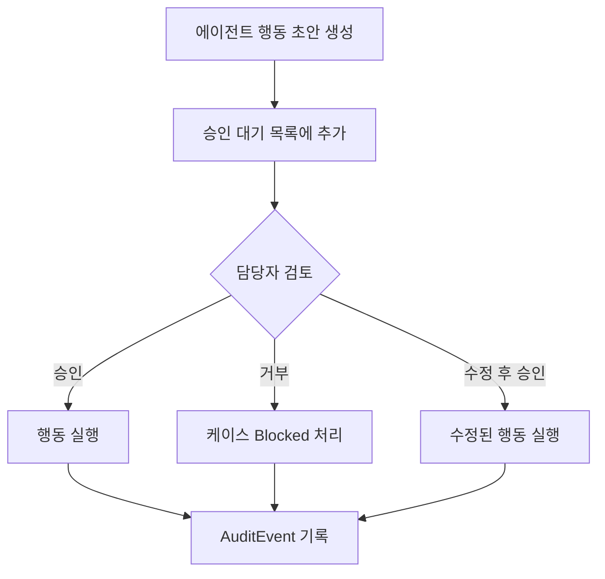

---
tags:
  - area/product
  - type/stub
  - status/draft
date: 2026-06-26
up: "[[08_본선/03_제품/INDEX|제품 인덱스]]"
---

# 승인 게이트 (Human-in-the-Loop)

> 역엔지니어링/브레인스토밍으로 채울 예정

---

## 핵심 원칙

> **"AI가 결정하지 않는다. 사람이 결정한다."**
>
> 고객 대상 모든 행동은 담당자 또는 감독자의 명시적 승인 없이는 절대 실행되지 않는다.

---

## 씨앗 포인트

- **씨앗**: 승인 게이트 = JB LocalGuard OS의 핵심 차별화 포인트 (금융권 AI 신뢰 문제 해결)
- **씨앗**: Approval 엔티티 — pending → approved / rejected / modified 상태 전환
- **씨앗**: 담당자가 "승인/거부/수정" 3가지 선택 가능

---

## 승인 플로우

> 작성 예정

---

## 승인 UI 요소 (작성 예정)

- 행동 초안 전체 표시
- 에이전트 판단 근거 (인용 포함)
- 규정 검증 결과
- 승인/거부/수정 버튼

---

## 참조

- [[08_본선/03_제품/05_diagrams/02_case-lifecycle|케이스 생명주기]]
- [[08_본선/03_제품/04_tech/data-model|데이터 모델 — Approval 엔티티]]
