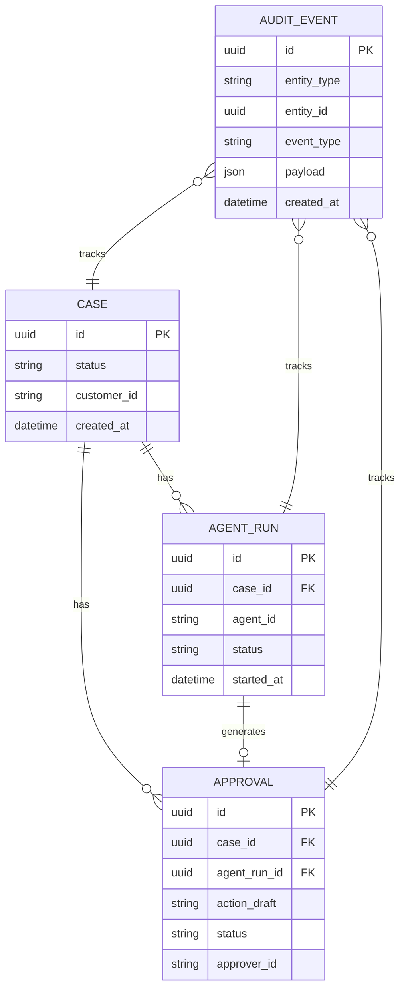

---
tags:
  - area/product
  - type/stub
  - status/draft
date: 2026-06-26
up: "[[08_본선/03_제품/INDEX|제품 인덱스]]"
---

# ERD — 엔티티 관계 다이어그램

> 역엔지니어링/브레인스토밍으로 채울 예정

---

## 씨앗 포인트

- **씨앗**: Case / AgentRun / Approval / AuditEvent — 4개 엔티티 독립 분리
- **씨앗**: 순환 의존 없음 — Case가 루트, AgentRun·Approval은 Case를 참조, AuditEvent는 모든 엔티티를 참조

---

## ERD 다이어그램

> 작성 예정

---

## 참조

- [[08_본선/03_제품/04_tech/data-model|데이터 모델 — 엔티티 상세]]
