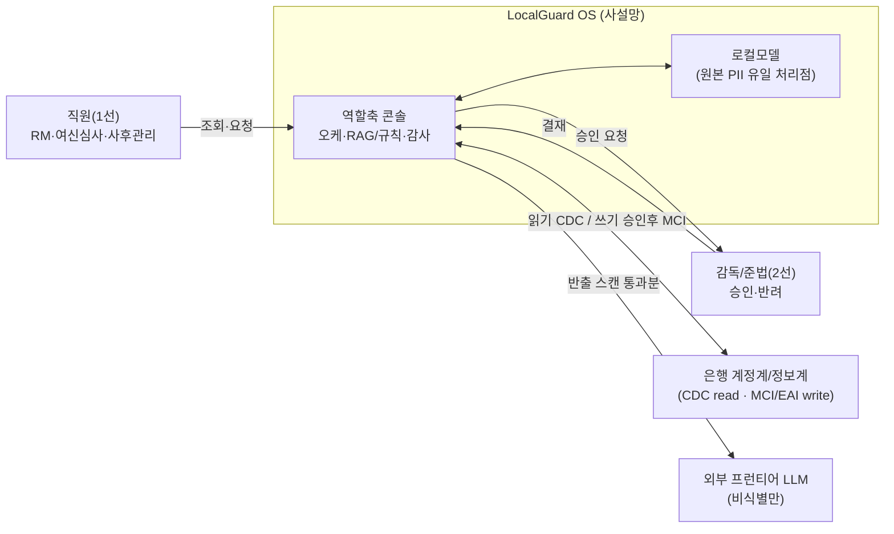
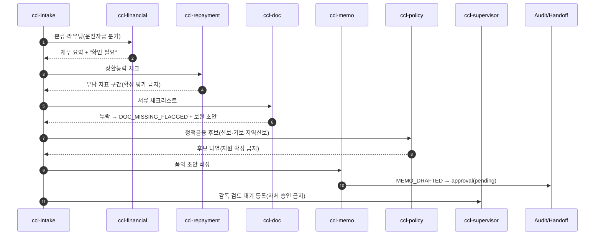

---
tags:
  - area/product
  - type/submission
  - status/active
date: 2026-07-04
up: "[[INDEX|제품 인덱스]]"
aliases: [기능명세서, Function Specification]
---

# 기능명세서 — JB LocalGuard OS

> **제출용 정본(Submission SSOT)**. 대회 제출 필수 형태(기능명세서) 문서로, 분산된 제품 문서를 **취합**한 것이며 창작·신규 사실을 더하지 않는다. 필드·기능이 어긋나면 취합 원천 문서와 `_canon.md`가, 코드가 어긋나면 `_vendor/JB_project2` 소스가 이긴다.
> **취합 원천**: [[08_본선/03_제품/docs/08_feature-spec|Feature Spec]] · [[08_본선/03_제품/docs/07_architecture|Architecture]] · [[08_본선/03_제품/docs/09_flow|09 Flow]] · [[08_본선/03_제품/06_build-roadmap/_빌드-로드맵-MOC|빌드 로드맵 MOC]] · [[08_본선/03_제품/docs/11_change-log|11 Change Log]] · [[08_본선/03_제품/docs/04_definitions|정의서]].
> **근거등급(E0~E5)**: E5 법령·감독규정 원문 · E4 코드/데모 실동작 · E3 다수 외부출처·절차검증 · E2 단일 외부출처·리서치 근거층 · E1 내부 설계원칙 · E0 가정/추정. 목표선: 핵심 주장 E2+, 데모가능 기능 E4.
> **신뢰마커**: **[확정]** = 코드/canon 직접 확인 · **[조건부]** = 본선 설계 제안(미검증) · **[목표/7-4]** = 개발 목표(현재 미완) · `[미결/7-4]` = 팀 결정 대기.
> **코드 SSOT**: `_vendor/JB_project2/app/cclConsole.core.js`·`cclConsole.data.js`. 히어로 = **CCL-0001**(전주 카페 운영자 운전자금, `BIZ-REF-0001`). 전체 코드 실측 인벤토리(파일·뷰·함수·데이터 총정리)는 [[08_본선/03_제품/구현현황-JB_project2|구현현황-JB_project2]] 참조 — 이하 [실측] 표기는 이 문서 기준(2026-07-04). **[정정 2026-07-05 #2, HEAD 8c274b5]**: `cclConsole.*`는 이후 커밋에서 `corporateCredit.*`(CCR, 15파일)로 대체돼 코드 SSOT가 아니다 — 실라이브 파일은 `corporateCredit.config.js`·`corporateCreditAgents.registry.js` 등(구현현황-JB_project2 §12).

---

## Part 1. Service (서비스 개요)

**JB LocalGuard OS**는 전북은행·JB우리캐피탈 두 계열사의 담당 직군(RM·여신심사·사후관리·준법·AML)이 매일 다루는 위험 신호를 `Case → AgentRun → Agent → Skill → Evidence → Approval → Audit` 단일 운영 계약으로 묶어, AI는 판단·행동 초안까지만 만들고 사람이 승인 게이트(L0~L4)를 통과시켜야 고객 대상 행동이 나가는 금융 AI Agent 운영 콘솔이다(canon §8, [E4]).

| 축                        | 정의                                                                                                                                                                                                                                                                         | 근거                                     |                                  |
| ------------------------ | -------------------------------------------------------------------------------------------------------------------------------------------------------------------------------------------------------------------------------------------------------------------------- | -------------------------------------- | -------------------------------- |
| 사용자(User)                | RM·여신심사·사후관리·준법·AML 5개 직군. 승인 게이트는 **RM·준법 2역할**로 라우팅                                                                                                                                                                                                                      | definitions A1 [E2+]                   |                                  |
| 고객(Customer)             | JB금융그룹(1차 전북은행, 확장 JB우리캐피탈) — 구매자                                                                                                                                                                                                                                          | business-model §고객↔사용자 [E2]            |                                  |
| 수혜자(Beneficiary)         | 소상공인 차주(히어로 전주 카페)·전세 임차인·피싱 잠재 피해자                                                                                                                                                                                                                                        | definitions A2 [E1]                    |                                  |
| 콘솔 축                     | 계열사 × 담당 직군. 도메인(여신·전세보호·피싱·사후관리)은 그 직군이 처리하는 케이스                                                                                                                                                                                                                          | 키스톤-확정 [E4]                            |                                  |
| 히어로 콘솔                   | corporate-credit ~~8 에이전트~~ **[정정 2026-07-05 #2] 15 에이전트**(코드 교체: `cclConsole.*`→`corporateCredit.*`, CCR — `ccr-triage`/`ccr-financial-quality`/`ccr-collateral`/`ccr-memo`/`ccr-compliance` 등), 케이스당 활성 3~5                                                                                                                                                                  | 승보-프로토타입 §7.5 [E4]                     |                                  |
| 콘솔 구성 [실측 2026-07-04]    | "4개 역할 콘솔"은 실제로는 **6개 진입점**(base app + rm-dashboard 단일뷰 + CCL/FDR/JPO/JBWC 4콘솔), 총 **91개 해시라우트 뷰**(CCL13·FDR15·JPO25·JBWC22·base15·rm-dashboard1). 43파일/24,667줄. **[델타 재검증 2026-07-05]** 이후 RM 역할 콘솔(rm-officer 하네스 — 16뷰·전용 에이전트 레지스트리·키보드 퍼스트, 레거시 rm-dashboard 단일뷰와 별개·재유입 가드 존재) 신설(+3,650줄) — **역할 콘솔 총 5종**, 진입점·뷰 수 재실측 진행 중. **[델타 재검증 2026-07-05 #2, 8c274b5]** `app/` 75파일/35,915줄. 기업여신 콘솔 코드가 `cclConsole.*`(죽은 코드)→`corporateCredit.*`(25뷰·15에이전트)로 전면 교체됐고, `harnessRegistry.js` 이중등록 버그로 `fds-response` 훅 가드레일이 상시 무력화됨(과장 금지 — FDS 콘솔 화면 자체는 정상 렌더, 훅만 무력화) | [[08_본선/03_제품/reports/구현현황-JB_project2 | 구현현황-JB_project2]] §0·§1·§2·§12 [E4] |
| 코드 정본 최신 상태 [2026-07-04] | PR `LSB-afk/JB_project2#1`(ccl-financial 실동작 슬라이스)·`#2`(`memoryCards.js` 3계층 메모리 증류 + `llm-gateway.mjs` claude/codex/ollama 게이트웨이, 수용기준 4/4 브라우저 실검증) — **둘 다 제출·검증 완료, 머지 대기(OPEN, 미머지)**                                                                                 | [[08_본선/03_제품/reports/구현현황-JB_project2 | 구현현황-JB_project2]] §9 [E4]       |

**핵심 차별점**: ① 경험 재구성(업무를 기능이 아니라 경험 흐름으로 재해석 → 역할 기반 AI Agent 게이트, [E1]) · ② PII 4중 방어(원본 PII 외부 LLM 비반출을 실동작 증명, [E4]).

---

## Part 2. Architecture (아키텍처)

**5레이어 구성**(07_architecture §2)

| 레이어 | 책임 | PII 방어축 | E |
|---|---|---|---|
| ① 콘솔 UI(3열 셸) | 사람의 유일 접점 — org-rail·워크벤치(큐·칸반·승인함)·컨텍스트 패널. 승인 전 자동발송 UI 미노출 | — | E4/E3 |
| ② API Gateway | 인증·역할 검사 + 아웃바운드 단일 관문(DLP 반출 스캔·토큰화 프록시) | ② 토큰화 · ④ 반출 스캔 | E3/E1 |
| ③ 에이전트 오케스트레이션 | 케이스 라우팅 → 전문 에이전트에 Skill 부착 실행, 승인 게이트 통과분만 고객 대상 행동 허용 | ③ 모델 라우팅 | E4/E3 |
| ④ RAG + 규칙엔진 | 판단에 근거 부착 — RAG는 Evidence 검색, 규칙엔진은 신호 계산 → 승인 레벨 라우팅 | ① 데이터 등급제 | E2/E4 |
| ⑤ 데이터·감사 | 7단 계약 영속 + Audit append-only 원장 | ④ 반출 결과·태그 이력 기록 | E4/E3 |

**신뢰 경계(Trust Boundary) 3구획**: A. 사설망 내부(원본 PII 허용, 로컬모델/벡터스토어/콘솔·감사원장) → B. 아웃바운드 게이트(토큰화 프록시 + 반출 스캔 DLP) → C. 외부(비식별만, 프런티어 LLM·공공 오픈API). 원본 반출 자체가 국외이전이라 금지(07_architecture §4, [E2/E3]).

**하이브리드 모델 라우팅(4층)**: 로컬(EXAONE 3.5 / Qwen2.5-14B, restricted/confidential) → 국산(HyperCLOVA X SEED / Solar) → 오픈웨이트(Llama/Qwen/DeepSeek) → 외부 premium(Claude/OpenAI, 비식별·비신용만). 승격 기준은 데이터 등급(07_architecture §5, [E2]).

**LLM 역할 고정**: LLM은 의도 분류 → 근거 범주 결정 → 도구 호출 → 결과 요약만 맡고, 신용/여신은 특화모델(XGBoost·LightGBM), FDS는 규칙엔진+GNN, 문서 IE는 LayoutLMv3·Donut에 라우팅한다. 하네스(컨텍스트 배치·승인 게이트·툴 계약·재시도·로깅)가 차별점(07_architecture §2·§5, D20, [E2]).

**4함수 계약 → 서버 API 승격**: `computeRiskDecision`→`POST /api/cases/:id/risk-decision` · `buildDashboardData`→`GET /api/dashboard` · `auditChainRecords`→`GET /api/audit` · `moveCaseToColumn`→`PATCH /api/cases/:id`(07_architecture §5, [E3]).

> **미검증 주의**: 서버 레이어(②~⑤)는 현재 브라우저 `localStorage` 재현이며 서버 승격은 `[TBD/E1]`. MCI/EAI 전문 스키마·Nexacro WebView 임베딩은 `[미검증]`(비공개 규격). 에이전트 수 **[실측 2026-07-04]**: CCL 8·FDR 8·JPO 11·JBWC 13 = 총 **40 에이전트**(스킬 28) — canon 메인 14 로스터와는 별개 레이어([[08_본선/03_제품/구현현황-JB_project2|구현현황-JB_project2]] §6). canon 14종과의 통합 명명은 여전히 `[Open Question]`. LLM 실호출은 코드 전체에서 0건 — `fetch()` 2건(전세 `?live=1` data.go.kr 조회)뿐이며, 40개 에이전트의 "산출물"은 전부 JS 템플릿 문자열(MOCKED) — 발표에서 "AI가 실제로 판단·작성"이라는 표현은 히어로 결정형 로직(`computeRiskDecision`)에 한정하고 나머지는 `[목표/7-4]`로 표기.

---

## Part 3. Feature Specification (기능 명세)

> 세부 필드·수용기준은 [[08_본선/03_제품/docs/08_feature-spec|Feature Spec]] §2 · [[08_본선/03_제품/docs/06_prd|PRD]] 기능군 1~7(+8·9 확장). Feature ID는 PRD 기능군 번호(x.y.z)를 승계. 데모등급: ✅ 실동작 / 🟡 부분 / ⛔ 비데모.

### 기능군 1 — 케이스 생성·생명주기 FSM
| ID | 기능 | 데모 | E | 코드 |
|---|---|---|---|---|
| 1.1.1 | 위험신호 표준스키마 `RiskSignal`(name/value/weight/contribution/sourceTag/evidenceId 6필드) | ✅ | E4 | `computeRiskDecision` |
| 1.1.2 | 케이스 기본속성·연결정보 저장(계열사·직군·코드·owner·evidenceIds) | ✅ | E4 | data-model §1 |
| 1.2.1 | 상태별 허용행동 제약 FSM(신규/진행/검토/완료/차단) | ✅ | E4 | `moveCaseToColumn` |
| 1.2.2 | 5컬럼 칸반 렌더(리스크 배지 L0~L4) | ✅ | E4 | S-03 |
| 1.3.1 | AuditEvent 공통필드·해시체인(previousHash) | ✅(base app 한정)* | E4/base·E2/역할콘솔 | `auditChainRecords` |
| 1.3.2 | 이벤트타입 목록(최소 7종) | ✅ | E4 | agent-roster §5 |

> \* **[실측 2026-07-04]** 해시체인(`auditChainRecords`+`simpleHash` FNV-1a)은 **base app에만 구현**됨. 히어로 데모 경로인 CCL(corporate-credit) 콘솔을 포함해 CCL/FDR/JPO/JBWC 4개 역할 콘솔의 `*_audit_logs` 테이블은 해시체인 없이 **평문 리스트**로만 렌더링된다(예: `cclConsole.app.js:193-199`). "탬퍼-에비던트 감사체인 전 콘솔 적용"은 **미충족** — 발표·문서에서 base app 시연 범위로 한정해 표기한다([[08_본선/03_제품/구현현황-JB_project2|구현현황-JB_project2]] §4·§8).

### 기능군 2 — 에이전트 오케스트레이션
| ID | 기능 | 데모 | E | 코드 |
|---|---|---|---|---|
| 2.1.1 | 실행시퀀스 템플릿(판단→행동초안→검증), trigger 4분류 | ✅ 결정형 / 🟡 라이브 | E4/E2 | orchestrator |
| 2.2.1 | AgentRun 상태모델·불변 `decisionSnapshot` | ✅ | E4 | `startAgentRun` |
| 2.2.2 | 실패 처리정책(안전 강등 needsReview, 자동종결 금지) | 🟡 | E2 | 승보 SECURITY_GUARDRAILS |
| 2.3.1 | 실시간 스트리밍뷰(단계별) | 🟡 | E2 | 로컬 EXAONE 3.5 [목표/7-4] |

### 기능군 3 — 승인게이트 HITL
| ID | 기능 | 데모 | E | 코드 |
|---|---|---|---|---|
| 3.1.1 | Approval 엔티티·상태전환(L0~L4, pending→approved/rejected/edited-approved) | ✅ | E4 | `approvalLevelMatrix` |
| 3.1.2 | 승인대기함 필터/정렬(SLA 임박순) | ✅ | E3 | S-04 |
| 3.2.1 | 초안·근거·규정검증 동시표시 | ✅ | E4 | context-panel |
| 3.2.2 | 수정후승인 편집기·원본/수정본 diff 감사 | 🟡 | E2 | — |
| 3.3.1 | 발송트리거(승인 전이 이벤트만) | ✅ | E4 | — |
| 3.3.2 | 거부/오류 차단·전환(Approval safety 100%) | ✅ | E4 | — |

### 기능군 4 — 규정준수·PII 비반출
| ID | 기능 | 데모 | E | 코드 |
|---|---|---|---|---|
| 4.1.1 | 규정조회·인용생성(RAG/규정DB, 신용정보법 §40조의2 등) | 🟡 | E2 | canon §4 인용형식 |
| 4.2.1 | 데이터등급제·모델 라우팅(restricted/confidential/internal/public 4단계) | ✅ | E4 | `dataGovernance.tiers` |
| 4.2.2 | 토큰매핑 보관·복원 제한(권한+AuditEvent 동반) | 🟡 | E2 | — |
| 4.3.1 | 반출스캔 차단/경고(restricted hard-fail) | ✅ | E3→E4 목표 | 승보 `verifyNoPIILeakage` |
| 4.3.2 | 보안이벤트 감사로그(append-only 해시체인) | ✅ | E4 | — |

### 기능군 5 — 외부시스템연동
| ID | 기능 | 데모 | E | 코드 |
|---|---|---|---|---|
| 5.1.1 | 코어 위험신호 커넥터·재시도 | ⛔ | E1 | mock 커넥터 |
| 5.2.1 | 규정DB/검색 API 계약 | ⛔ | E1 | api-spec |
| 5.3.1 | 알림발송 요청·결과수집(mock 종단) | 🟡 | E2 | — |
| 5.3.2 | 발송실패 재시도금지·idempotency key | ⛔ | E1 | — |

### 기능군 6 — 케이스 협업·저장형태 (7/4 회의 신규 FR) [설계/미구현]
> 7/4 전략회의 신규 요구 2건의 정식화 — 현재 설계 단계, 발표에서는 로드맵 항목으로만 제시.

| ID | 기능 | 데모 | E | 코드 |
|---|---|---|---|---|
| 6.1.1 | 케이스 = 마크다운 파일(옵션적 저장 형태, FR-08) | ⛔ | E1 | 현 케이스=상태객체/localStorage |
| 6.2.1 | 케이스 코멘트/메모 담당자 피드백(FR-09) | ⛔ | E1 | 신규 엔티티(미구현) |

### 기능군 7 — 운영 관측(LLM 게이트웨이·원가·감사 실효성) [2026-07-04 구현]
> 심사 공격질문 3축(비용·오류·감사)을 문서가 아니라 작동으로 답하는 기능군. `02_제품/app` + `api-proxy.mjs` 구현. 상세는 [[08_본선/03_제품/docs/08_feature-spec|Feature Spec]] §1 기능군7.

| ID | 기능 | 데모 | E | 코드 |
|---|---|---|---|---|
| 7.1.1 | LLM 게이트웨이 `POST /llm` — claude/codex/ollama 3엔진 라우팅 + 폴백 사다리 + 시도별 JSONL 원장 | ✅(프록시 기동 시) | E4 | `api-proxy.mjs handleLlm()` |
| 7.1.2 | 토큰 실측 패널 — 케이스 단가·티어별·RM 1인 월 환산(`GET /llm/usage`) | ✅(`?live=1` 한정) | E4 | `modules.js liveLlmBlock()` |
| 7.1.3 | 감사 레코드 소비자 용도 태그(당국 증적/분쟁 재생/운영 점검/원가 정산) | ✅(base app) | E4 | `app.js auditPurpose()` |
| 7.1.4 | 엔진룸 — 최근 LLM 호출 타임라인(5초 폴링, 폴백·격상 표시) | ✅(`?live=1` 한정) | E4 | `modules.js engineRoomRows()` |
| 7.1.5 | 운영계약 온톨로지 그래프 — 케이스 실데이터 관계 렌더(cytoscape, 17노드/16엣지 실측) | ✅(base app) | E4 | `modules.js initCaseOntology()` |

> **실측 근거**: 1차 실측(2026-07-04) = claude 엔진 2.9초·$0.115/케이스, codex 6.6초. ollama는 폴백 사다리 동작까지 이 레포에서 실검증됐고 실구동 자체는 팀 머신(승보) 확인(2차 출처). Docker 물리분리 시연(`02_제품/deploy/시연-런북-백엔드분리.md`)으로 PII존이 외부 인터넷에 물리적으로 나갈 수 없음을 30초 안에 증명 — 킬러컷은 `pii-zone` 컨테이너에서 외부 curl이 타임아웃되는 장면. 30초 구두 답변은 [[08_본선/03_제품/_archive/Q13-토큰비용-유닛이코노믹스|Q13]]·[[08_본선/03_제품/_archive/Q14-오류로깅-폴백사다리|Q14]]·[[08_본선/03_제품/_archive/Q15-감사로그-실효성|Q15]] 참조.
>
> **[델타 2026-07-05 #2, 별도 코드베이스]** `_vendor/JB_project2`(승보 프로토타입, 이 기능군과 별개 레포)에 자체 Ollama 실연동 프록시(`scripts/ollama-agent-proxy.mjs`, :8030, 금지패턴 3종 필터)와 `server/`(파일DB/Supabase 옵션 백엔드)가 신설됐다 — 이 문서의 `/llm` 게이트웨이(:8022)와는 병존하는 별개 구현이며, JB_project2 쪽도 주 판단·초안 루프는 여전히 mock이고 Ollama는 하네스 뷰의 "샘플 요청" 버튼에서만 opt-in 실행된다(과장 금지).

### 기능군 8 — 메모리 3계층 (PR#2 제출·머지 대기) [2026-07-04 구현·검증]
> 고객/에이전트/직원 메모리 카드 — 사람 결정만 규칙 증류("기본값은 기억하지 않는다"). fork 브랜치 수용기준 4/4 실검증, 머지 전 조건부 데모.

| ID | 기능 | 데모 | E | 코드 |
|---|---|---|---|---|
| 8.1.1 | MemoryCard 저장·증류(승인/반려→3계층, 3회→confirmed, PII 거부, staff 교차주입 금지) | 🟡(PR#2 브랜치) | E4/fork | `memoryCards.js` |
| 8.1.2 | 메모리 카드 읽기 전용 뷰(provenance·관측 횟수 표시) | 🟡(PR#2 브랜치) | E4/fork | `cclMemoryCardsPanel()` |

### 기능군 9 — 운영 순찰 에이전트 3종 [설계]
> 관측 원장을 순찰해 제안만 하는 운영 레이어(실행 권한 없음). 설계도: casesops-분기 08~10.

| ID | 기능 | 데모 | E | 코드 |
|---|---|---|---|---|
| 9.1.1 | Cost Sentinel — 원가 순찰·break-even 감시 | ⛔ | E1 | 설계도 08 |
| 9.1.2 | 119 라우팅 관측 확장 — 임계 사고 승격 | ⛔ | E1 | 설계도 09 |
| 9.1.3 | Ledger Curator — 로그 소비자 검사·메모리 승격 심사 | ⛔ | E1 | 설계도 10 |

**데모-크리티컬(E4) 상세 대표 — F-3.1.1 · Approval 게이트 L0~L4**
- **Input**: `Approval`(level L0~L4, approverRole, gateChecks[], actionDraft). score 기반 레벨 산정.
- **Logic**: `approvalLevelMatrix` — L0 내부기록만 ~ L4 발송보류/차단. L3(80~89) = **RM+준법 공동** 결재. 고객 행동은 approved/edited-approved 전이 이벤트만 발송 트리거.
- **Acceptance**: ① 상태는 pending→approved/rejected/edited-approved만 허용, 그 외 hard fail. ② rejected 케이스 고객향 행동 **100% 차단**. ③ 승인 카드 클릭 시 초안·근거·규정검증(법령 인용) 동시 노출. ④ critical flow 승인 불변식 위반 0건(범위·분모 명시).
- **Evidence**: `approvalLevelMatrix` + e2e 승인/거부/우회차단 시나리오(feature-spec F-3.1.1, [E4]).

> **미검증 주의**: 라이브 LLM 스트리밍(2.3.1)·히어로 라이브 추론(2.1.1)은 `[목표/7-4]`(로컬모델·API 미연결, 폴백=결정형). PII 반출스캔 E4 격상(4.3.1)은 canary 자동 스캔 e2e 미완. 절대 KPI는 "N건 평가셋 0 위반 관측"으로 서술하고 보편 보장 금지.

---

## Part 4. Flow (흐름·시퀀스)

**골든패스 9스텝**(CCL-0001): 로그인 → 케이스보드 → 케이스 생성(`received`) → 상세(`collecting`) → 에이전트 실행뷰(`aiReview`) → 승인대기함(`humanReview`) → 승인/거부/수정후승인 → 알림(3중 게이트) → 감사 봉인(`doneHold`)(09_flow §0, [E4]). **[실측 2026-07-04]** 이 경로는 CCL 콘솔(`ccl_audit_logs`)을 지나며, 감사 봉인 단계는 base app의 해시체인이 아니라 **평문 감사로그**로 남는다 — "감사 봉인"을 해시체인 무결성 시연으로 표현하려면 base app 화면으로 별도 전환해야 한다([[08_본선/03_제품/구현현황-JB_project2|구현현황-JB_project2]] §4).

**에이전트 시퀀스(판단→행동초안→검증)**: 8종 CCL 에이전트가 3단계 handoff — 판단(financial·repayment) → 행동초안(doc·memo·reply) → 검증(policy·supervisor).

**에이전트 불변식**: 공통 금지(대출 승인/거절 확정, 금리/한도·신용등급 확정, 실제 거래 실행, 식별정보 원문 저장/출력, 고객 자동 발송, high/critical 자동 종결 — `CCL_COMMON_BLOCKED_ACTIONS`). 각 AgentRun은 판정 시점 스냅샷을 `needsReview`/`pendingApproval`로 강등 보유(hard fail·자동종결 없음). 전결 금액·상환 산식은 절대값 하드코딩이 아니라 규칙엔진·구간(band) 구조(09_flow §3, [E4/E2]).

**승인 시퀀스**: `pending → approved`(이유코드 강제) / `rejected`(사유 서술 강제) / `edited_approved`(원본/수정본 diff 감사)만 허용, 그 외 hard fail. 승인 카드에 초안·근거링크·규정검증(법령 인용)·모델/버전·정책충돌을 한 화면에. "승인 안전"은 성능이 아니라 시스템 불변식 — 승인 토큰 없이는 발송이 절대 일어나지 않음을 e2e로 봉인(09_flow §5, [E4/E2]).

**에러·차단 시퀀스**: `beforeCaseCreate` 위반(PII·단정·스코프) → 생성 차단 · `beforeCustomerMessage` 위반(미승인·PII·단정) → 발송 보류 · high/critical 자동완료 시도 → needsReview 강제(`harnessGuardCheckAutoClose`). false block 복구(부분 제한·임시 해제·5영업일 SLA)·kill switch는 설계·정책 문서화 우선(장애주입 데모는 `[조건부]`)(09_flow §6, [E4/E2]).

**데모 규칙**: 골든패스만 넣지 말고 차단·보류 케이스를 의도적으로 노출(체리피킹 방어) — 애매 케이스 `추가 확인 필요`, 미승인 `승인 전 발송 불가`. KPI마다 대응 테스트 1:1 매핑을 백업 슬라이드에(09_flow §7, D13, [E2]).

> **미검증 주의**: 반출 스캐너·kill switch·RAG/규칙엔진·로컬 LLM 실연동 `[TBD]`. L0~L4 ↔ `riskLevel/requiresHumanReview` 정합 매핑·L4 실 승인 주체 `[Open Question]`. JB_project2 Playwright e2e 실제 시나리오 수·커버리지 `[TBD/미검증]`.

---

## Part 5. Future Work (향후 과제 — 빌드 로드맵)

빌드 로드맵은 잠정(provisional) — 제품 정의·11블록·미결 결정이 확정되면 페이즈 범위·산출물을 갱신한다(빌드-로드맵-MOC).

| 페이즈 | 범위 | 의존 |
|---|---|---|
| P0 정의-합의 | 정의서·11블록·미결 결정 합의 | (루트) |
| P1 데이터-연동기반 | 공공/내부 데이터·API·라이선스·코어뱅킹 연동 설계 | P0 |
| P2 에이전트-스킬-메모리 | 판단→행동→검증 로스터·Case/AgentRun·정책엔진·고객메모리·시뮬 | P1 |
| P3 보안-거버넌스 | PII 비반출·토큰화·반출스캔·망분리·승인루프·감사 | P1 |
| P4 UI-조직도-콘솔 | 조직도 메인 UI·JB 웹 디자인 차용·RM 콘솔·신뢰보정 UX | P0 |
| P5 통합-로컬모델-시연 | 로컬모델 시연·골든패스 3종·e2e·OSS 스택 | P2·P3·P4 |
| P6 본선-리허설 | 발표·시연 완주·폴백·리허설 | P5 |

**실행 슬라이스**: 히어로 실동작 데모(국토부 실거래가 라이브 + 로컬모델 판단 + 감사체인 노출 + 폴백), `RUNTIME_CONFIG` opt-in seam으로 `verify_static` 보존(빌드플랜-히어로-실동작-데모, P1·P3·P5).

**서버 승격 대상**(07_architecture §6·§13): 7단 엔티티에 `company_id` 부착(멀티테넌시), 벡터스토어(sqlite-vec/Chroma vs pgvector), 토큰↔원본 키 저장소(HSM), 로컬모델 실서빙(Ollama/llama.cpp), 관측(OTel)·하네스 벤치·레드팀 evals 서버 이관. 계열사 확장 = 새 레이어 아님(org-rail 노드 1개 추가 + 계열사 전용 서브에이전트, 오케스트레이터·승인 게이트 구조 불변).

> **미검증 주의**: 전 항목 `[TBD/조건부]`. "3케이스 실동작"은 완성이 아니라 개발 목표 — 최소 히어로(CCL-0001) 1개 실 LLM 동작 지향, 발표·문서에서 `[목표/조건부]`로 정직 표기(키스톤-확정 §정직한 전제).

---

## Part 6. Appendix (부록)

### A. 기능 변경이력 (예선 → 본선) — 제출 필수 항목

> ⚠️ **대회 제출 필수 항목(미기재 = 실격, [[심사기준]]·decision-log 2026-07-03 정정③)**. 1차 원장·전체 표는 [[08_본선/03_제품/docs/11_change-log|11 Change Log §A]]. 아래는 취합 요약이다. 케이스 ID 표기 규약: `CCL-0001 (구 JBG-104)` — 동일 히어로(전주 카페 소상공인 여신)를 가리키나 코드·데이터·에이전트 세트가 다르며 단일화는 `[Open Question / 7-4]`.

| # | 기능/영역 | 예선(v0) | 본선(v1) | 유형 | E |
|---|---|---|---|---|---|
| F-01 | 콘솔 구조 | 단일 메인 대시보드(역할 구분 없음) | 계열사×담당 직군 역할별 대시보드 + 로그인 코드→역할 라우팅 | 신규 구조 | E4 |
| F-02 | 히어로 케이스 | `JBG-104`(메인 14-에이전트 레이어) | `CCL-0001`(corporate-credit 콘솔, 8-에이전트 별도 레이어) | 심화·코드 분기 | E4 |
| F-03 | 계열사 범위 | 전북은행 단일 콘솔 | 2트랙 — 전북은행 콘솔 + JB우리캐피탈 운영지원 포털 | 확장 | E4 |
| F-04 | 에이전트 세트 | canon §2 메인 14종 | 메인 14 + 확장 하네스별 자체 세트(corporate-credit 8 + 전세보호 11 + FDS 8 + JBWC 13 = **40** 신규 id, 스킬 28 — [실측 2026-07-04, 구현현황-JB_project2 §6, 정정: 이전 표기 "39/전세보호10"는 오기) | 레이어 추가 | E4 |
| F-05 | 인터랙션 모델 | 마우스 중심 | 키보드 퍼스트 Enter Flow(`Enter`=진행 · `Enter Enter`=예외 · `Click`=최종 승인) | 신규 UX | E1(설계)·데모 E4 목표 |
| F-06 | 모델 구동 | 정적 데모(localStorage, LLM 미연동) | 하이브리드 — 웹=승인 UI + Claude/Codex API / 로컬=EXAONE 3.5 7.8B(PII 업무) | 실동작 전환 | [조건부/7-4] 히어로 1케이스 실 LLM |
| F-07 | 승인 게이트 | 승인 개념 존재(단순) | 승인레벨 매트릭스 L0~L4 정식화(준법 L3~L4), 위험액션 blockedActions 자동차단 | 정식화·강화 | E4 |
| F-08 | 도메인 폭 | 여신(SME) 단일 | 다도메인 — 은행: 여신·전세보호·피싱 / 캐피탈: 여신심사·사후관리(EWS) | 확장 | E1·전세/피싱 실동작 [조건부/7-4] |
| F-09 | 운영계약 | (암묵) | `Case→AgentRun→Agent→Skill→Evidence→Approval→Audit` 명시적 커널 + 4함수계약 | 정식화 | E4 |
| F-10 | 코드 실측 정합(2026-07-04) | 설계문서 추정치(콘솔4·에이전트~14·컴포넌트~481·토큰~118) | **[실측]** 43파일/24,667줄, 6진입점(base+rm-dashboard+CCL/FDR/JPO/JBWC), 98개 뷰(CCL14·FDR15·JPO29·JBWC24·base15·rm-dashboard1), 에이전트 40(8+8+11+13)·스킬28, CSS 컴포넌트 클래스 537(484+53)·커스텀프로퍼티 121(110+11), 감사해시체인=base app 전용(4콘솔 미적용), LLM 실호출 0건(전세 `?live=1` fetch 2건 제외), Case=순수 JS 객체(localStorage, 마크다운 아님, FR-08 §6.1.1 미구현), localStorage 키 드리프트(`02_제품/app`=`jb-localguard-os-state-v2` vs `_vendor/JB_project2` base=`jb-finance-support-state-v4`, 두 코드베이스는 미러가 아니라 별개 스키마) | 실측 정합 | E4 |
| F-11 | 운영 관측 기능군(비용·오류·감사) | (예선 없음) | **신규** — `/llm` 게이트웨이(claude 2.9초·$0.115/케이스, codex 6.6초 1차 실측; ollama는 폴백 사다리 실검증·실구동은 팀 머신 확인) + 토큰 실측 패널 + 감사 용도 태그(`auditPurpose()`) + 엔진룸 타임라인 + 온톨로지 그래프(17노드/16엣지). PR `LSB-afk/JB_project2#2` — 제출·검증 완료(수용기준 4/4), 머지 대기(OPEN) | 신규 기능군 | E4 |

> ⚠️ **미반영·충돌 주의**: F-08 "사후관리(EWS)"는 승보 프로토타입 코드에 아직 도메인 없음(편입 시 12번째 도메인 신규 필요) `[미구현]`. F-01/F-08 "전세보호"는 코드상 별도 role 하네스 → 키스톤 교정("전세=기존 직군의 도메인")과 직접 충돌 → 7/4 팀 결정 대기.
> **F-10 정정 사유(2026-07-04)**: [[08_본선/03_제품/구현현황-JB_project2|구현현황-JB_project2]](코드 실측 인벤토리)와 대조해 콘솔·뷰·에이전트·토큰·컴포넌트 수치 및 감사체인 적용범위를 정정. 사유: **코드 실측 정합**. 비전/목표 서술(로드맵·서버승격안 등)은 삭제하지 않고 그대로 유지하며, 위 실측치를 병기한다.

### B. Open Questions (7/4 팀 게이트, change-log §C)

| ID | 미결 사안 | 게이트 |
|---|---|---|
| C-1 | 히어로 ID 단일화(`CCL-0001` vs `JBG-104`) + 케이스코드 네이밍 잠금 | 7/4 팀 `[미검증]` |
| C-2 | 전세보호 = 역할 vs 도메인(프로토타입 유지 vs 리팩터) | 7/4 팀 |
| C-3 | 사후관리(EWS) 캐피탈 편입 + 규제 적용성(여신금융협회 소관 확인) | 영욱 GPT딥리서치 `[가정]` |
| C-4 | 에이전트 수 표현("메인 14 + 확장 하네스별 자체 세트") | 문서 갱신 |
| C-5 | 데모 실동작 범위(히어로 실 LLM 확정, 전세·피싱 개수 미정) | 7/4 팀 |
| C-6 | 제출 repo 정본(`LSB-afk/JB_project2` vs fork) | 승보 도착 시 |

### C. 용어(Definitions) — 정식 8종

> 상세·명명규칙은 [[08_본선/03_제품/docs/04_definitions|정의서]]. 문서·발표·eval 전체에서 아래 정식 객체명만 쓴다(Anti-Synonyms 금지).

`Case` · `Signal(코드명 RiskSignal)` · `EvidencePack(원소 Evidence)` · `RecommendationDraft(코드 Approval.actionDraft)` · `ApprovalRecord(코드 Approval, L0~L4)` · `AuditEvent(GENESIS 해시체인)` · `AgentRun(decisionSnapshot 불변)` · `Skill(approvalPolicy·riskLevel·inputPiiGrade)`. **Approval Gate(관문·메커니즘) ≠ ApprovalRecord(승인 기록·데이터)** — 항상 구분.

### D. 근거·규제 앵커

- 법령: 신용정보법 §40조의2(①②⑥⑦⑧, 가명처리·분리보관·재식별금지) · §36조의2(자동화평가 설명요구권) · 개인정보보호법 §28조의4·5 · 전자금융감독규정 §15조(망분리) · AI기본법 §34(고영향 AI 사람관리·감독) · 금융위 2026 「금융분야 AI 가이드라인」(보조수단성·RACI). 근거 표현은 `_canon.md` §4 형식을 그대로 인용(재식별 위반 5년 이하 징역 또는 5천만원 이하 벌금, [E5/E2]).
- 근거등급 규약: [[08_본선/03_제품/_문서생성-스킬-DDBM-Harness-SDD|DDBM-Harness-SDD 스킬]] Evidence Levels(E0~E5).

---

## 연결

- [[08_본선/03_제품/07_발표-제출/MVP제안서|MVP 제안서(제출용 정본)]]
- [[08_본선/03_제품/docs/08_feature-spec|Feature Spec]] · [[08_본선/03_제품/docs/07_architecture|Architecture]] · [[08_본선/03_제품/docs/09_flow|09 Flow]]
- [[08_본선/03_제품/reports/구현현황-JB_project2|구현현황-JB_project2]] (코드 SSOT §9)
