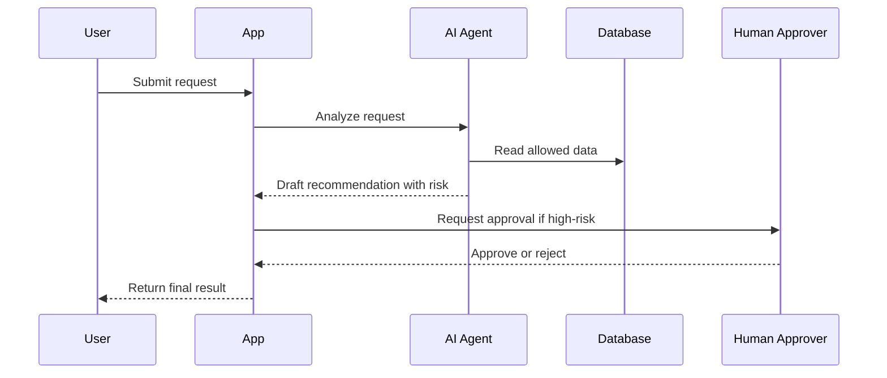

> **볼트 안착 노트(2026-07-04)**: 이 파일은 `docs/개발 워크플로/harness-engineering-skills/`의 방법론 원본을 본선 볼트에 이식한 **문서생성 방법 SSOT**다. 우리 폴더 매핑·갭·우선순위·데모 파이프라인은 [[_문서생성-마스터플랜]]가 관장한다. 여기(스킬)=규격(무엇을 어떤 순서로 어떤 기준으로), 마스터플랜=배치(우리 폴더 어디에·누가·언제). 충돌 시 규격은 이 문서, 배치는 마스터플랜이 정본.

# 대회용 DDBM-Harness-SDD 통합 문서 작성 스킬

이 문서는 개발팩 설치 여부와 무관하게, AI에게 대회 제출용 문서를 일괄 작성시키기 위한 단일 스킬 문서다. 목표는 아이디어, 회의록, 자료, 기존 하네스 문서, 개발팩 템플릿을 입력으로 받아서 **사업성, 제품성, 구현성, 검증성, 발표 설득력**을 모두 갖춘 문서 세트를 만드는 것이다.

개발팩은 템플릿과 AI 맥락 보강에 사용한다. 이 스킬은 대회 프로젝트에서 AI에게 “어떤 순서로, 어떤 기준으로, 어떤 문서를 작성해야 하는지”를 지시하는 운영 규칙이다.

## When To Use

Use when:

- 대회, 공모전, 해커톤, 창업 경진대회, 금융/AI/데이터 제품 제안서를 준비한다.
- 아이디어는 있지만 사업 모델, 제품 명세, 구현 계획, 평가 기준, 발표 자료가 흩어져 있다.
- DDBM, Harness Engineering, SDD를 하나의 제출 흐름으로 통합하고 싶다.
- AI에게 단순 요약이 아니라 심사위원이 볼 수 있는 증거 기반 문서 세트를 만들게 하고 싶다.
- 기존 프로젝트 폴더를 갈아엎지 않고 빠진 문서만 추가하고 싶다.

Do not use when:

- 단순 블로그 글, 회고, 개인 메모만 작성하면 된다.
- 실제 제품/서비스 구현이나 대회 제출과 무관하다.
- 검증 없이 멋진 기획서 문장만 필요한 상황이다.

## Core Principle

이 스킬의 핵심 원칙은 다음이다.

```text
Idea -> DDBM -> Harness -> SDD -> Evidence -> Demo -> Pitch
```

역할 구분:

| Layer | Role | Main Question |
|---|---|---|
| DDBM | 사업성, 데이터 가치, 수익성, 사회적/관계적 가치 정의 | 이 아이디어가 왜 사업이 되는가? |
| Harness | 제품 구조, 리스크, 규칙, 평가, 인수인계 정의 | 이 제품이 왜 신뢰 가능한가? |
| SDD | 기능 단위 구현 계획과 작동 MVP 정의 | 이 서비스가 실제로 어떻게 작동하는가? |
| Evidence | 데이터, 테스트, 검증, 리스크 대응 증거화 | 주장에 근거가 있는가? |
| Demo/Pitch | 심사위원 설득 구조화 | 왜 이 팀/제품이 이겨야 하는가? |

## Output Contract

AI는 최종적으로 아래 문서 세트를 작성하거나, 이미 있는 문서는 업데이트해야 한다. 기존 파일이 있다면 덮어쓰기 전에 변경 요약을 먼저 제시한다.

### Required Core Documents

```text
docs/00_source-log.md
docs/01_business-model.md
docs/01_meeting-log.md
docs/02_cps.md
docs/03_principles.md
docs/04_definitions.md
docs/05_domain-model.md
docs/06_prd.md
docs/07_architecture.md
docs/08_feature-spec.md
docs/09_flow.md
docs/10_eval-plan.md
docs/11_change-log.md
docs/12_handoff.md
```

### Required Extension Documents

선택 확장이지만, 대회 제출 프로젝트에서는 모두 작성한다.

```text
docs/13_ssd-implementation.md
docs/14_demo-script.md
docs/15_pitch-outline.md
docs/16_judge-qna.md
docs/17_business-metrics.md
docs/18_data-strategy.md
docs/19_risk-impact-register.md
docs/20_competition-submission-checklist.md
```

### Required Rule Documents

```text
rules/agent-rules.md
rules/compliance-rules.md
rules/data-rules.md
rules/import-export-rules.md
rules/naming-rules.md
rules/ui-rules.md
```

### Required Evaluation Documents

```text
evals/rubric.md
evals/golden-cases.md
evals/failure-modes.md
```

### Required Project-Level Documents

```text
harness.yaml
CLAUDE.md
README.md
validation-report.md
```

## Input Requirements

문서 작성 전 AI는 다음 입력을 수집한다. 사용자가 자료를 모두 주지 않아도 진행하되, 불명확한 부분은 추정하지 말고 `Open Question` 또는 `TBD`로 표시한다.

### Minimum Inputs

- 대회명, 주최기관, 제출 마감일, 평가 기준
- 제품/서비스 아이디어 1~3문장
- 핵심 사용자와 고객
- 해결하려는 문제
- 사용할 데이터 또는 확보 가능한 데이터
- 구현 가능한 MVP 범위
- 팀 구성과 역할
- 발표 시간, 제출 형식, 데모 가능 여부

### Recommended Inputs

- 대회 공고문
- 심사 기준표
- 기존 회의록
- 시장 조사 자료
- 경쟁사 자료
- 데이터 샘플
- API 문서
- 규제/법률 제약
- 기존 코드 또는 프로토타입
- 발표 자료 초안

## Global Writing Rules

AI는 모든 문서에서 다음 규칙을 지킨다.

1. 한국어로 작성한다. 단, 파일명, 명령어, API, 코드, 경로, 에러 메시지는 English로 둔다.
2. 심사위원이 보는 문서는 주장보다 증거를 우선한다.
3. 모르는 내용은 만들지 않는다. `TBD`, `Assumption`, `Open Question`, `Needs Evidence`로 표시한다.
4. 모든 주요 주장은 최소 하나의 근거 유형을 붙인다.
5. 금융, 개인정보, 자동 의사결정, 추천, 신용, 투자, 보험, 의료와 관련되면 리스크/승인/감사 로그를 필수로 둔다.
6. 기술 기능은 “가능하다”가 아니라 “어떤 입력으로 어떤 출력을 내며 어떻게 검증하는지”로 쓴다.
7. 사업 모델은 감성적 가치 제안만 쓰지 말고 비용, 수익, 단위경제, 데이터 확보 전략을 포함한다.
8. 발표 문서는 멋진 문장보다 심사 기준 대응력을 우선한다.
9. 기존 문서와 충돌하면 충돌 목록을 먼저 만들고, 어느 문서를 기준으로 삼을지 제안한다.
10. 최종 결과에는 빠진 문서, 약한 근거, 구현 전제, 발표 리스크를 명시한다.

## Evidence Levels

각 문서의 핵심 주장에는 아래 등급 중 하나를 붙인다.

| Level | Meaning | Example |
|---|---|---|
| E0 | 아이디어/가설 | 사용자들이 이런 문제를 겪을 것이다 |
| E1 | 내부 관찰/회의 근거 | 팀 인터뷰, 회의록, 수업 자료 |
| E2 | 외부 자료 근거 | 공공 데이터, 기사, 보고서, 통계 |
| E3 | 사용자 검증 | 설문, 인터뷰, 테스트 결과 |
| E4 | 작동 검증 | 프로토타입, 로그, 실험 결과 |
| E5 | 운영 검증 | 실제 사용자, 반복 사용, 비용/수익 데이터 |

대회 문서는 최소한 핵심 문제, 데이터 전략, MVP 작동 방식, 수익 모델, 리스크 대응에 대해 `E2` 이상을 목표로 한다. 데모 가능한 기능은 `E4`를 목표로 한다.

## Full Workflow

### Phase 0. Repository And Context Scan

목표: 기존 폴더를 갈아엎지 않고 현재 상태를 파악한다.

AI는 먼저 다음을 확인한다.

```text
current project root
existing docs/
existing rules/
existing evals/
existing README.md
existing harness.yaml
existing code or prototype
existing pitch or submission files
```

결과는 `docs/00_source-log.md`에 기록한다.

필수 작성 내용:

- 입력 자료 목록
- 각 자료의 출처
- 작성에 사용한 자료와 제외한 자료
- 신뢰도
- 업데이트 날짜
- 핵심 인용 또는 요약
- 아직 없는 자료

Completion criteria:

- 모든 입력 자료가 추적 가능하다.
- 출처 없는 주장이 별도 표시되어 있다.
- 대회 공고와 심사 기준이 최상위 출처로 등록되어 있다.

### Phase 1. DDBM Business Model

목표: 아이디어를 데이터 기반 비즈니스 모델로 바꾼다.

Output:

```text
docs/01_business-model.md
docs/17_business-metrics.md
docs/18_data-strategy.md
docs/19_risk-impact-register.md
```

`docs/01_business-model.md`는 반드시 DDBM 11블럭을 포함한다.

#### DDBM 11 Blocks

| Block | Required Content |
|---|---|
| Mission | 제품이 충족하는 기본 니즈, 사회적/관계적 목적, 대회 주제와의 연결 |
| Key Partners | 데이터 제공자, 금융/산업 파트너, 유통 채널, 운영 협력자, 검증 기관 |
| Key Activities | 데이터 수집, 정제, 분석, 추천, 승인, 모니터링, 고객 지원, 영업 활동 |
| Key Data | 데이터 종류, 출처, 권한, 품질, 갱신 주기, 비용, 민감도, 대체 가능성 |
| Key Enablers | AI 모델, API, 자동화, 클라우드, 보안, 인증, 대시보드, 운영 도구 |
| Key Barriers | 데이터 접근성, 규제, 신뢰, 네트워크 효과, 파트너십, 초기 사용자 확보 |
| Value Proposition | 누구의 어떤 문제를 어떤 데이터/AI로 더 낫게 해결하는지 |
| Benefits | 사용자, 고객, 파트너, 사회가 얻는 정량/정성 효과 |
| Negative Impacts | 개인정보 침해, 편향, 오판, 의존성, 낙인, 보안 사고, 운영 실패 |
| Costs | 개발, 데이터/API, 인프라, 보안/법률, 마케팅, 운영, 고객 지원 비용 |
| Revenues | 구독, 수수료, SaaS, API, B2B 라이선스, 제휴, 성과 기반 과금 |

#### Business Sharpness Rules

AI는 각 블럭을 작성할 때 다음을 반드시 확인한다.

- 고객과 사용자가 다르면 둘을 분리한다.
- 돈을 내는 사람과 혜택을 받는 사람이 다르면 구매 동기를 별도로 쓴다.
- `Key Data`는 “있으면 좋음”이 아니라 제품 성능을 좌우하는 핵심 자산으로 쓴다.
- `Key Barriers`는 단순 어려움이 아니라 경쟁자가 따라 하기 어려운 이유로 쓴다.
- `Negative Impacts`는 별도 문서 `docs/19_risk-impact-register.md`와 연결한다.
- `Costs`와 `Revenues`에는 최소한 단위경제 가설을 넣는다.
- 대회용으로는 “사회적 가치”와 “실행 가능성”을 동시에 보여준다.

#### Required Metrics

`docs/17_business-metrics.md`에는 다음을 포함한다.

| Category | Examples |
|---|---|
| Adoption | 가입자 수, 활성 사용자 수, 기관 도입 수 |
| Activation | 첫 성공 경험 비율, 첫 분석 완료율, 첫 추천 수락률 |
| Retention | 재방문율, 반복 사용률, 월간 활성 고객 |
| Revenue | ARPU, MRR, 수수료 매출, B2B 계약 단가 |
| Cost | API 호출당 원가, 고객 획득 비용, 운영 인력 비용 |
| Unit Economics | CAC, LTV, gross margin, payback period |
| Impact | 절감 시간, 비용 절감, 리스크 감소, 접근성 개선 |
| Trust | 승인율, 오탐/미탐, 사용자 이의제기율, 감사 로그 완결성 |

Completion criteria:

- 11개 블럭이 모두 채워져 있다.
- 각 블럭에 최소 하나의 증거 수준이 표시되어 있다.
- 수익 모델과 비용 구조가 숫자 가설을 포함한다.
- 리스크가 별도 register로 연결되어 있다.

### Phase 2. Harness Core

목표: 사업 모델을 제품 문제, 원칙, 정의, 도메인 구조로 고정한다.

Output:

```text
docs/02_cps.md
docs/03_principles.md
docs/04_definitions.md
docs/05_domain-model.md
```

#### `docs/02_cps.md`

CPS는 Core Problem Statement다. 다음을 포함한다.

- Problem
- Customer
- User
- Current workaround
- Why now
- Why data/AI is necessary
- Non-goals
- Success definition
- Failure definition
- Assumptions
- Open questions

좋은 CPS 형식:

```text
For [specific user/customer],
who struggles with [specific high-cost problem],
our product provides [specific outcome],
using [key data/AI capability],
so that [measurable benefit].
```

#### `docs/03_principles.md`

제품 원칙을 정한다.

필수 원칙:

- User value first
- Evidence over claims
- Human approval for high-risk actions
- Fail closed on uncertainty
- Data minimization
- Auditability
- Explainability where decisions affect users
- Demo-critical path first

#### `docs/04_definitions.md`

용어 정의를 통일한다.

포함할 것:

- 핵심 사용자
- 고객
- 파트너
- 데이터 항목
- AI 판단
- 추천
- 승인
- 고위험 행동
- 성공 이벤트
- 실패 이벤트
- MVP
- Demo-ready

#### `docs/05_domain-model.md`

도메인 모델을 정의한다.

포함할 것:

- Actors
- Entities
- Relationships
- Permissions
- States
- Events
- Data lifecycle
- Audit lifecycle
- External systems

Completion criteria:

- DDBM의 고객/사용자/데이터/리스크가 Harness 문서로 이어진다.
- 정의가 PRD와 평가 문서에서 재사용 가능하다.
- 모호한 용어가 남아 있지 않다.

### Phase 3. Product Specification

목표: 제품을 구현 가능한 범위로 만든다.

Output:

```text
docs/06_prd.md
docs/07_architecture.md
docs/08_feature-spec.md
docs/09_flow.md
```

#### `docs/06_prd.md`

포함할 것:

- Product summary
- Target users
- Jobs to be done
- MVP scope
- Out of scope
- User stories
- Functional requirements
- Non-functional requirements
- Data requirements
- AI requirements
- Admin/operation requirements
- Acceptance criteria
- Launch criteria

PRD는 발표용 문장이 아니라 개발/검증 가능한 문장으로 쓴다.

Bad:

```text
사용자에게 맞춤형 경험을 제공한다.
```

Good:

```text
사용자가 `profile`, `goal`, `constraint`를 입력하면 시스템은 3개 이하의 추천안을 생성하고, 각 추천안에 `reason`, `risk`, `next_action`을 함께 제공한다.
```

#### `docs/07_architecture.md`

포함할 것:

- System context
- Components
- Data flow
- Model/API usage
- Storage
- Auth
- Logging
- Monitoring
- Human approval points
- Failure handling
- Deployment assumption

#### `docs/08_feature-spec.md`

기능별로 작성한다.

필수 필드:

| Field | Description |
|---|---|
| Feature ID | Stable ID |
| User story | Who wants what and why |
| Input | Required data |
| Output | Visible result |
| Logic | Rules, model, workflow |
| Edge cases | Empty, invalid, risky, conflicting cases |
| Acceptance criteria | Testable criteria |
| Evidence | How to prove it works |

#### `docs/09_flow.md`

포함할 것:

- User journey
- System sequence
- Agent sequence
- Data sequence
- Approval sequence
- Error sequence
- Demo sequence

가능하면 Mermaid를 사용한다.



Completion criteria:

- PRD가 MVP 범위를 명확히 제한한다.
- Architecture가 실제 구현 가능한 구조다.
- Feature spec은 테스트 가능한 문장으로 되어 있다.
- Flow는 사용자, 시스템, AI, 데이터, 승인 흐름을 모두 보여준다.

### Phase 4. Rules And Controls

목표: AI/서비스가 지켜야 할 규칙을 명시한다.

Output:

```text
rules/agent-rules.md
rules/compliance-rules.md
rules/data-rules.md
rules/import-export-rules.md
rules/naming-rules.md
rules/ui-rules.md
docs/19_risk-impact-register.md
```

#### `rules/agent-rules.md`

포함할 것:

- Agent role
- Allowed actions
- Disallowed actions
- Human approval triggers
- Uncertainty handling
- Tool usage boundaries
- Logging requirements
- User-facing explanation requirements

#### `rules/compliance-rules.md`

포함할 것:

- Applicable regulations or policy assumptions
- Personal data handling
- Financial/medical/legal advice boundaries, if relevant
- Consent requirements
- Audit requirements
- Retention/deletion policy
- Incident response

#### `rules/data-rules.md`

포함할 것:

- Data source
- Collection method
- Legal basis or permission
- Consent basis
- Data quality checks
- Freshness requirement
- Sensitive fields
- De-identification
- Access control

#### `rules/import-export-rules.md`

포함할 것:

- Accepted input format
- Rejected input format
- Export format
- CSV/JSON schema
- File naming
- Encoding
- Error messages

#### `rules/naming-rules.md`

포함할 것:

- File naming
- Feature ID naming
- Data field naming
- API naming
- Event naming
- Test naming

#### `rules/ui-rules.md`

포함할 것:

- Primary user flows
- Required states
- Empty/error/loading states
- Risk disclosure
- Approval UI
- Accessibility basics
- Demo screen priorities

#### `docs/19_risk-impact-register.md`

리스크 register는 DDBM `Negative Impacts`와 연결한다.

필수 컬럼:

| Risk ID | Source | Risk | Impact | Likelihood | Severity | Mitigation | Owner | Evidence | Status |
|---|---|---|---|---|---|---|---|---|---|

Completion criteria:

- 고위험 행동은 사람이 승인한다.
- 데이터와 개인정보 처리 규칙이 명확하다.
- 리스크가 추상 문장이 아니라 추적 가능한 register로 관리된다.

### Phase 5. Evaluation Plan

목표: 심사위원에게 “작동하고 검증했다”는 증거를 만든다.

Output:

```text
docs/10_eval-plan.md
evals/rubric.md
evals/golden-cases.md
evals/failure-modes.md
validation-report.md
```

#### `docs/10_eval-plan.md`

포함할 것:

- Evaluation goal
- Judge criteria mapping
- Product success metrics
- Technical success metrics
- Business success metrics
- Risk/control success metrics
- Test data
- Test procedure
- Pass/fail criteria
- Evidence collection method

#### `evals/rubric.md`

대회 심사 기준을 제품 내부 평가 기준으로 변환한다.

필수 컬럼:

| Judge Criterion | Internal Metric | Evidence | Current Status | Target |
|---|---|---|---|---|

#### `evals/golden-cases.md`

성공해야 하는 대표 케이스를 작성한다.

필수 필드:

- Case ID
- User scenario
- Input
- Expected output
- Required explanation
- Risk level
- Pass criteria
- Demo relevance

#### `evals/failure-modes.md`

실패 가능성을 먼저 정의한다.

필수 필드:

- Failure ID
- Trigger
- Bad outcome
- Detection method
- Required fallback
- User message
- Owner

#### `validation-report.md`

최종 검증 보고서다.

포함할 것:

- Documents completed
- Missing documents
- Tests run
- Tests not run
- Evidence level summary
- Known risks
- Demo readiness
- Pitch readiness
- Final recommendation

Completion criteria:

- 대회 심사 기준과 내부 평가 기준이 연결되어 있다.
- 성공 케이스와 실패 케이스가 모두 있다.
- 검증하지 않은 부분이 숨겨져 있지 않다.

### Phase 6. SDD Implementation

목표: 문서를 실제 작동 MVP 구현 작업으로 변환한다.

Output:

```text
docs/13_ssd-implementation.md
```

SSD는 다음 순서로 쓴다.

```text
Specify -> Clarify -> Plan -> Tasks -> Implement -> Verify -> Demo
```

#### Specify

작성할 것:

- MVP goal
- Demo-critical path
- Primary user scenario
- Required inputs
- Required outputs
- Constraints
- Non-goals

#### Clarify

질문을 작성한다.

카테고리:

- Business
- User
- Data
- AI/model
- Risk/compliance
- Technical
- Demo
- Submission

각 질문은 다음 형식으로 쓴다.

```text
Question:
Why it matters:
Default assumption if unanswered:
Risk if wrong:
```

#### Plan

구현 계획을 쓴다.

포함할 것:

- Stack
- File structure
- Components
- API routes
- Data schema
- Model calls
- State management
- Logging
- Deployment assumption
- Test strategy

#### Tasks

작업 단위로 쪼갠다.

필수 컬럼:

| Task ID | Task | Output | Depends On | Completion Criteria | Test |
|---|---|---|---|---|---|

#### Implement

구현 순서는 다음을 따른다.

1. Demo-critical path
2. Data input/output
3. Core AI or rules logic
4. Risk/approval/audit
5. UI states
6. Evaluation cases
7. Polish only after verification

#### Verify

포함할 것:

- Lint
- Typecheck
- Unit test
- Smoke test
- Golden case test
- Failure mode test
- Manual demo rehearsal

#### Demo

구현 결과를 발표 시나리오로 연결한다.

포함할 것:

- Demo route
- Demo data
- Expected screen
- Narration
- Failure fallback
- Time limit

Completion criteria:

- 문서가 실제 작업 목록으로 변환되어 있다.
- 각 작업은 완료 기준과 테스트가 있다.
- 데모 경로가 구현 우선순위를 결정한다.

### Phase 7. Demo And Pitch

목표: 심사위원에게 제품 가치를 짧고 강하게 전달한다.

Output:

```text
docs/14_demo-script.md
docs/15_pitch-outline.md
docs/16_judge-qna.md
docs/20_competition-submission-checklist.md
docs/12_handoff.md
README.md
```

#### `docs/14_demo-script.md`

포함할 것:

- Demo objective
- Demo persona
- Demo data
- Step-by-step script
- Screen-by-screen narration
- What to emphasize
- What not to click
- Fallback if demo fails
- Time budget

Demo script 형식:

| Time | Screen/Action | Speaker Script | Evidence Shown | Risk |
|---|---|---|---|---|

#### `docs/15_pitch-outline.md`

발표 구조는 다음을 기본으로 한다.

```text
1. Opening: one-line problem
2. Why now
3. Target user/customer
4. DDBM business model
5. Key data advantage
6. Product demo
7. AI/system architecture
8. Evidence and validation
9. Business model and growth
10. Risk controls
11. Team and execution plan
12. Ask / closing
```

각 슬라이드는 다음 기준을 따른다.

| Slide | Purpose | Must Prove | Evidence |
|---|---|---|---|

발표 문장은 다음 패턴을 선호한다.

```text
문제는 크다.
기존 방식은 느리거나 불완전하다.
우리는 데이터와 AI로 의사결정 비용을 낮춘다.
MVP는 이미 이 핵심 흐름을 작동시킨다.
리스크는 승인, 감사, 평가 체계로 통제한다.
사업 모델은 반복 사용과 B2B 확장이 가능하다.
```

#### `docs/16_judge-qna.md`

예상 질문과 답변을 준비한다.

카테고리:

- Problem validity
- Customer willingness to pay
- Data availability
- Data legality
- AI accuracy
- Bias and fairness
- Privacy
- Competition
- Differentiation
- Revenue model
- Go-to-market
- Technical feasibility
- Demo limitations
- Team capability
- Expansion strategy

답변 형식:

```text
Question:
Short answer:
Evidence:
Limitation:
Next step:
```

#### `docs/20_competition-submission-checklist.md`

제출 체크리스트다.

포함할 것:

- Required documents
- Required files
- Presentation deck
- Demo URL or video
- Source code URL, if required
- Data disclosure
- Team profile
- Consent/license notes
- Final validation status
- Submission deadline

#### `docs/12_handoff.md`

인수인계 문서다.

포함할 것:

- Project summary
- How to run
- How to demo
- How to validate
- Known limitations
- Key decisions
- Open questions
- Next milestone

Completion criteria:

- 발표, 데모, Q&A가 같은 논리를 공유한다.
- 심사 기준별 대응 근거가 있다.
- 데모 실패 시 대체 설명이 준비되어 있다.

## Command-Style Operating Flow

AI에게 작업을 시킬 때는 아래 흐름으로 요청한다. 실제 slash command가 아니어도, 단계 이름을 그대로 사용하면 된다.

```text
/competition:init
/competition:source-log
/competition:ddbm
/competition:harness-core
/competition:product-spec
/competition:rules
/competition:evaluation
/competition:ssd
/competition:demo
/competition:pitch
/competition:qna
/competition:validate
/competition:finalize
```

각 단계의 역할:

| Step | Output |
|---|---|
| `/competition:init` | 폴더 구조 확인, 기존 문서 목록화, 누락 문서 목록 |
| `/competition:source-log` | `docs/00_source-log.md` |
| `/competition:ddbm` | `docs/01_business-model.md`, `17`, `18`, `19` |
| `/competition:harness-core` | `docs/02` to `05` |
| `/competition:product-spec` | `docs/06` to `09` |
| `/competition:rules` | `rules/*`, risk register 보강 |
| `/competition:evaluation` | `docs/10`, `evals/*` |
| `/competition:ssd` | `docs/13_ssd-implementation.md` |
| `/competition:demo` | `docs/14_demo-script.md` |
| `/competition:pitch` | `docs/15_pitch-outline.md` |
| `/competition:qna` | `docs/16_judge-qna.md` |
| `/competition:validate` | `validation-report.md` |
| `/competition:finalize` | `README.md`, `docs/12_handoff.md`, `docs/20_competition-submission-checklist.md` |

## Prompt Template For AI

아래 프롬프트를 AI에게 붙여 넣고, 프로젝트 자료를 함께 제공한다.

```text
너는 대회용 AI 제품 문서 작성 오케스트레이터다.

목표:
내 아이디어와 자료를 바탕으로 DDBM, Harness Engineering, SDD를 통합한 대회 제출용 문서 세트를 작성한다.

반드시 지킬 것:
1. 기존 폴더와 문서를 갈아엎지 말고, 누락 문서를 추가하거나 필요한 부분만 업데이트하라.
2. 모르는 내용은 지어내지 말고 TBD, Assumption, Open Question, Needs Evidence로 표시하라.
3. 모든 핵심 주장은 evidence level E0~E5 중 하나를 붙여라.
4. DDBM 11블럭을 모두 작성하라.
5. 사업 모델은 비용, 수익, 단위경제, 데이터 확보 전략까지 포함하라.
6. Harness 문서는 문제, 원칙, 정의, 도메인, PRD, 아키텍처, 기능 명세, 플로우, 평가, 인수인계를 연결하라.
7. SDD 문서는 Specify, Clarify, Plan, Tasks, Implement, Verify, Demo 순서로 작성하라.
8. 대회 제출용으로 demo script, pitch outline, judge Q&A, submission checklist까지 작성하라.
9. 금융, 개인정보, AI 판단, 추천, 자동화 액션이 있으면 approval, audit, fail-closed, human review를 기본값으로 두라.
10. 마지막에 누락 문서, 약한 근거, 검증하지 못한 부분, 다음 액션을 요약하라.

작성할 문서:
- docs/00_source-log.md
- docs/01_business-model.md
- docs/01_meeting-log.md
- docs/02_cps.md
- docs/03_principles.md
- docs/04_definitions.md
- docs/05_domain-model.md
- docs/06_prd.md
- docs/07_architecture.md
- docs/08_feature-spec.md
- docs/09_flow.md
- docs/10_eval-plan.md
- docs/11_change-log.md
- docs/12_handoff.md
- docs/13_ssd-implementation.md
- docs/14_demo-script.md
- docs/15_pitch-outline.md
- docs/16_judge-qna.md
- docs/17_business-metrics.md
- docs/18_data-strategy.md
- docs/19_risk-impact-register.md
- docs/20_competition-submission-checklist.md
- rules/agent-rules.md
- rules/compliance-rules.md
- rules/data-rules.md
- rules/import-export-rules.md
- rules/naming-rules.md
- rules/ui-rules.md
- evals/rubric.md
- evals/golden-cases.md
- evals/failure-modes.md
- harness.yaml
- README.md
- validation-report.md

진행 방식:
먼저 현재 자료와 기존 문서를 읽고 누락 목록을 제시하라.
그다음 DDBM -> Harness -> SDD -> Evaluation -> Demo -> Pitch 순서로 작성하라.
한 번에 완성하려 하지 말고, 각 단계마다 assumption과 open question을 남겨라.
```

## Document Quality Bar

최종 문서 세트는 아래 기준을 통과해야 한다.

### Business Quality

- 문제의 비용이 명확하다.
- 고객과 사용자가 구분되어 있다.
- 지불 의사가 설명되어 있다.
- 수익 모델이 최소 2개 이상 검토되어 있다.
- 비용 구조가 빠지지 않았다.
- 단위경제 가설이 있다.
- 데이터가 경쟁 우위와 연결되어 있다.

### Product Quality

- MVP 범위가 좁고 명확하다.
- 핵심 사용자 흐름이 1개 이상 완결되어 있다.
- 기능 명세가 테스트 가능하다.
- 실패/예외 흐름이 있다.
- 사용자가 받는 결과물이 명확하다.

### Technical Quality

- 아키텍처가 실제 구현 가능한 수준이다.
- 데이터 흐름이 설명되어 있다.
- AI/model 호출 위치가 명확하다.
- 로그와 감사 추적이 있다.
- 검증 가능한 테스트 계획이 있다.

### Risk Quality

- 개인정보와 민감 데이터 처리가 설명되어 있다.
- 고위험 판단에 human approval이 있다.
- 모델 오류, 편향, 오판에 대한 fallback이 있다.
- 부정적 영향이 DDBM과 risk register 양쪽에서 추적된다.

### Pitch Quality

- 1분 안에 문제와 해법이 설명된다.
- 데모가 심사 기준과 연결된다.
- 사업성, 기술성, 실현 가능성, 파급 효과가 모두 보인다.
- 예상 질문에 대한 답변이 준비되어 있다.

## Missing Document Check

AI는 마지막에 아래 표를 채운다.

| Area | Required Files | Status | Weakness | Next Action |
|---|---|---|---|---|
| Source | `docs/00_source-log.md` |  |  |  |
| DDBM | `docs/01_business-model.md`, `17`, `18`, `19` |  |  |  |
| Harness Core | `docs/02` to `05` |  |  |  |
| Product Spec | `docs/06` to `09` |  |  |  |
| Evaluation | `docs/10`, `evals/*`, `validation-report.md` |  |  |  |
| SDD | `docs/13_ssd-implementation.md` |  |  |  |
| Demo/Pitch | `docs/14`, `15`, `16`, `20` |  |  |  |
| Rules | `rules/*` |  |  |  |
| Handoff | `docs/12_handoff.md`, `README.md` |  |  |  |

## Final Response Format

AI가 작업을 마친 뒤에는 다음 형식으로 보고한다.

```text
완료:
- 작성/수정한 문서

핵심 결정:
- 사업 모델
- MVP 범위
- 데이터 전략
- 리스크 통제
- 데모 흐름

남은 질문:
- Open Question 목록

약한 근거:
- E0/E1에 머문 주장

다음 액션:
- 리서치
- 구현
- 검증
- 발표 준비
```

## Practical Recommendation For River

River의 대회 프로젝트에서는 다음 순서로 쓰는 것이 가장 적합하다.

```text
1. docs/00_source-log.md
2. docs/01_business-model.md
3. docs/02_cps.md
4. docs/06_prd.md
5. docs/13_ssd-implementation.md
6. docs/10_eval-plan.md
7. docs/14_demo-script.md
8. docs/15_pitch-outline.md
9. docs/16_judge-qna.md
10. validation-report.md
```

전체 문서 세트는 모두 만들되, 실제 시간 배분은 다음에 집중한다.

| Priority | Document | Why |
|---|---|---|
| 1 | `docs/01_business-model.md` | 1억원 대회에서 사업성의 중심 |
| 2 | `docs/13_ssd-implementation.md` | 실제 작동 서비스로 내려가는 다리 |
| 3 | `docs/10_eval-plan.md` | 주장과 검증을 연결 |
| 4 | `docs/14_demo-script.md` | 심사장에서 체감되는 결과 |
| 5 | `docs/15_pitch-outline.md` | 사업성과 기술성을 설득 구조로 변환 |

최종 목표는 문서를 많이 만드는 것이 아니다. 최종 목표는 심사위원이 다음 네 가지를 동시에 믿게 만드는 것이다.

```text
이 문제는 크다.
이 팀의 접근은 데이터와 AI 때문에 다르다.
이 서비스는 실제로 작동한다.
이 사업은 확장 가능하고 리스크를 통제할 수 있다.
```
