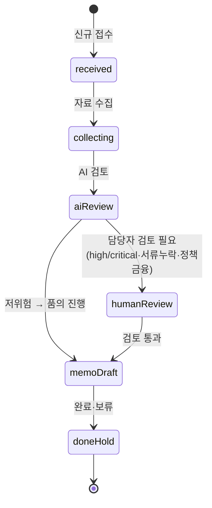

---
tags:
  - area/product
  - type/domain
  - status/active
date: 2026-07-04
up: "[[INDEX|제품 인덱스]]"
---

# 도메인 모델 — 역할축 콘솔 4종 (CCL·FDS·전세보호·JB우리캐피탈)

> §1~9 = CCL(기업여신) 정본. **§10 = FDS·전세보호·JB우리캐피탈 콘솔 확장**(콘솔별 Actors·States·Tables·Permissions 차이점).

> **정합 대상**: [[08_본선/03_제품/04_tech/data-model|04_tech/data-model]](엔티티 필드 상세)·[[08_본선/03_제품/05_diagrams/04_erd|05_diagrams/04_erd]](ERD). 이 문서는 그 둘을 **읽어** 도메인 층(Actors·States·Events·Permissions·Data/Audit lifecycle·External systems)으로 정식화한 것이며, 두 원본을 덮어쓰지 않는다. 필드 세부가 어긋나면 04_tech/data-model이 필드 SSOT, 코드가 어긋나면 JB_project2 소스가 최종 SSOT다.
>
> **코드 SSOT**: `_vendor/JB_project2/app/cclConsole.core.js`·`cclConsole.data.js`(기업여신 CCL 콘솔). 히어로 케이스 = **CCL-0001**(전주 카페 운영자 운전자금, `BIZ-REF-0001`). 운영 계약: `Case → AgentRun → Agent → Skill → Evidence → Approval → Audit`.
>
> **근거등급**: E4=코드/데모 직접확인, E3=백본 SSOT 문서, E2=리서치 근거층, E1=설계의도(미검증), [TBD]/[Open Question]=미정. 아래 표의 `E?` 열 참조.

이 콘솔의 도메인은 **기업여신·소상공인 대출 검토**다. AI는 요약·체크·초안만 만들고, 결정(승인/거절·금리·한도·신용등급)은 항상 사람 담당자가 한다 [E4, `cclConsole.core.js:1-3`]. 차별성 척추의 4관점 중 **직원(EX)·조직(조직도/감독)·고객(BIZ-REF 비식별 대응)·그룹(계열사 스코프 격리)**이 모두 이 도메인 안에서 엔티티로 드러난다.

> **서버 백엔드 신설(각주) [E4, 8c274b5]**: `server/lib/seed.mjs`/`repository.mjs`가 다루는 상태는 위 localStorage 테이블과 별개 스키마다 — `roles`(콘솔별 역할 5종)·`cases`·`agentRuns`·`deliverables`·`auditLogs`·`files` 6개 컬렉션을 JSON 파일(`JsonRepository`) 또는 Supabase(`SupabaseRepository`, `server/sql/supabase-api-state.sql`)로 영속화한다. 브라우저 앱과의 데이터 연동은 아직 배선되지 않았다 [미검증].

---

## 1. Actors

| Actor | 종류 | 코드 근거 | 권한 요약 | E? |
|---|---|---|---|---|
| 소상공인/기업여신 담당자(`reviewer`) | 사람(1선 현업) | `USR-CCL-SME-01/02`, `USR-CCL-CORP-01` [E4] | 케이스 조회·AI 요청·초안 작성 요청. 승인권 없음 | E4 |
| 여신감독(`supervisor`) | 사람(2선 통제) | `USR-CCL-SUP-01` [E4] | 승인/반려 결정권. `approvals` 최종 결재 주체 | E4 |
| 운영 에이전트(AI) | AI(1선 보좌) | `cclConsoleAgents` 8종 [E4] | 요약·체크·초안·라우팅·핸드오프. 결재·발송·확정 금지 | E4 |
| 오케스트레이터 | 시스템 | `ccl-intake`(접수 분류·라우팅) [E4] | 접수 분류·상태 산정·핸드오프 생성 | E4 |
| 고객(차주) | 외부(비식별) | `BIZ-REF-000X` — 원문 PII 없음 [E4] | 상담·회신 대상. 식별정보 원문 저장/출력 금지 | E4 |

**에이전트 로스터 8종** [E4, `cclConsole.core.js:111-159`] — 표면 5 + 감독·내부 3. (사이드바 copy는 "표면 5·내부 8"로 표기 — 라벨 정합 [미검증].)

| id | 표시명 | domain | 성격 | 허용 | 금지(공통 + 전용) |
|---|---|---|---|---|---|
| `ccl-intake` | 여신 접수 분류 에이전트 | orchestration | 표면 | 분류·라우팅·감사기록 | 자동 종결 |
| `ccl-financial` | 재무자료 요약 에이전트 | financialSummary | 표면 | 요약·확인필요 표시 | 재무 건전성 확정 평가 |
| `ccl-repayment` | 상환능력 체크 에이전트 | repaymentCheck | 표면 | 부담 지표 **구간** 표시 | 상환 가능/불가 확정 |
| `ccl-doc` | 서류 체크리스트 에이전트 | docCheck | 표면 | 체크리스트·보완 초안 | — |
| `ccl-memo` | 승인 품의 초안 에이전트 | approvalDrafts | 표면 | 초안·승인 요청 등록 | 자체 결재 |
| `ccl-policy` | 정책금융 후보 에이전트 | policyMatch | 내부 | 후보 나열 | 지원 가능 확정 |
| `ccl-reply` | 고객 회신 초안 에이전트 | replyDrafts | 내부 | 초안 작성 | 자동 발송 |
| `ccl-supervisor` | 여신 감독 검토 에이전트 | governance | 내부 | 검토 대기 등록 | 자체 승인 |

> **공통 금지(모든 에이전트)** [E4, `CCL_COMMON_BLOCKED_ACTIONS`]: 대출 승인/거절 확정, 금리/한도 산정, 신용등급 확정, 실제 거래 실행, 식별정보 원문 저장/출력, 고객 자동 발송, high/critical 자동 종결.
> **왜 사람 승인 게이트인가**: 여신 승인·금리·계약 집행을 한 주체가 독점하면 이해상충·금융사고 위험이 커진다. 은행은 1선 현업 / 2선 통제 / 3선 감사로 굴러가고, 고위험은 강제 에스컬레이션한다 [E2, D4]. FDS(사기)만 예외로 실시간 선차단(사람 승인 전) — 본 CCL 도메인 밖(전세·FDS 콘솔 소관).

---

## 2. Entities (도메인 정식화)

운영 계약 7단계를 JB_project2 실제 테이블에 매핑한다 [E4, `cclSeedData()`]. 필드 상세는 04_tech/data-model, 여기서는 도메인 역할·PII·상태소유만 정식화한다.

| 운영계약 단계 | JB_project2 테이블 | 도메인 역할(D11 메모리 유형) | 핵심 식별자 | PII/비식별 | E? |
|---|---|---|---|---|---|
| **Case** | `ccl_cases` | 루트·작업기억 상태 | `CCL-000X` / `BIZ-REF-000X` | 비식별(구간값만) | E4 |
| **AgentRun** | `ccl_agent_runs` | 일화기억(실행 이력) | `CCL-RUN-000X` | input/outputSummary | E4 |
| **Agent** | `harness_agents`(← `cclConsoleAgents`) | 행위자 레지스트리 | `ccl-*` slug | — | E4 |
| **Skill** | `cclConsoleSkills` | 절차기억 | `credit-intake-triage` 등 6종 | — | E4 |
| **Evidence** | `ccl_review_notes`·`ccl_doc_checks`·`ccl_consult_logs`·`ai_recommendations` | provenance 붙은 의미기억 | `CCL-NOTE/DOC/CON/REC-*` | 요약·구간(원문 금지) | E4 |
| **Approval** | `approvals` | CBR Revise 제도화 | `APR-CCL-000X` | — | E4 |
| **Audit** | `ccl_audit_logs` | CBR Retain 제도화·감사추적 | `AUD-CCL-000X` | — | E4 |
| (멀티에이전트 층) | `agent_handoffs` | 에이전트 간 위임·에스컬레이션 | `HND-CCL-000X` | — | E4 |
| (부가) | `ai_analysis_requests`·`users`·`ccl_memo_drafts` | 요청 큐·행위자·품의 초안 | — | — | E4 |

> **왜 Case/Run/Skill/Evidence/Approval/Audit로 나누나**: 메모리는 한 저장소가 아니다 — 작업기억·일화기억·의미기억·절차기억을 분리해야 재사용성과 거버넌스가 같이 선다. Evidence에 provenance(출처·생성자·시각·버전)가 없으면 장기지식이 아니라 **비감사성 캐시**로 떨어진다 [E2, D11]. Approval=CBR Revise, Audit=CBR Retain의 제도화.

### 2.1 Case(`ccl_cases`) 도메인 필드 하이라이트 [E4]

| 필드 | 값 예시 | 도메인 의미 | PII |
|---|---|---|---|
| `loanType` | `smeWorking`·`smeFacility`·`corpGeneral`·`refinance`·`policyFund` | 신청 단계에서 **운전자금/시설자금 강제 분기** [E2, D2] | internal |
| `amountBand` | `5천만~1억` 등 구간 | 절대 금액 하드코딩 아님 — 구간값만 | confidential(구간화됨) |
| `repaymentBand` | `부담 확인 필요`·`보통`·`여유` | 상환 부담 **구간**(확정 평가 금지) | confidential |
| `riskLevel` | `low`·`medium`·`high`·`critical` | 승인 라우팅 입력 | internal |
| `requiresHumanReview` | bool | high/critical·서류누락·정책금융 시 강제 true | internal |
| `status` | §3 상태 참조 | lifecycle 컬럼 | internal |
| `roleKey`/`workspaceId` | `corporate-credit` | **계열사·역할 스코프 격리 키**(§4) | internal |
| `bizRefId` | `BIZ-REF-0001` | 익명 참조 — 실제 사업자 식별정보 없음 | 비식별 |

> **왜 amountBand·repaymentBand가 "구간"인가**: 은행별 전결 금액표·유효담보가·상환지표 산식은 비공개 내부규정이라, 절대값 하드코딩이 아니라 규칙엔진·설정값·구간 구조로 가야 한다 [E2, D2·D4]. 동시에 원본 PII를 외부 LLM에 반출하지 않는 비식별 설계와도 맞물린다 [E3, 백본].

### 2.2 Relationships (엔티티 관계)

> 정합 대상: [[08_본선/03_제품/docs/04_definitions|definitions §2 Concept Hierarchy]](관계 트리 원본, "재료" 관점). 이 절은 그 트리를 §2 위 엔티티 표의 카디널리티·테이블 근거로 재정식화한 것이며 원본을 덮어쓰지 않는다.

| 관계 | 카디널리티 | 코드 근거 | E? |
|---|---|---|---|
| Case → AgentRun | 1:N(한 케이스에 다건, 시간순) | `ccl_cases` ↔ `ccl_agent_runs` | E4 |
| AgentRun → Evidence | 1:N(ReviewNote·DocCheck·ConsultLog·Recommendation 등 근거 다건 인용) | `ccl_review_notes`·`ccl_doc_checks`·`ccl_consult_logs`·`ai_recommendations` | E4 |
| AgentRun → RecommendationDraft | 1:1(판정 시점 스냅샷 하나가 초안 하나로 귀결) | `ai_recommendations`(코드명 `Approval.actionDraft`) | E4 |
| RecommendationDraft → Approval | 1:1(Approval Gate 통과 필요) | `approvals` | E4 |
| Case → Approval | 1:N(케이스 생애주기 동안 다건 승인 가능 — 품의·수정후승인 등) | `approvals` | E4 |
| Approval/Case/AgentRun → Audit | 1:N(모든 상태 변화마다 감사 이벤트 append) | `ccl_audit_logs` | E4 |
| Agent ↔ Skill | N:N(`skillRack` 장착) | `harness_agents`(← `cclConsoleAgents`) ↔ `cclConsoleSkills` | E4 |
| Agent → AgentRun | 1:N(한 에이전트가 다건 실행) | `harness_agents` ↔ `ccl_agent_runs` | E4 |
| AgentRun ↔ Handoff | N:N(에이전트 간 위임·에스컬레이션) | `agent_handoffs` | E4 |

> 재료(무엇으로 만들어지는가) 관점의 전체 트리는 [[08_본선/03_제품/docs/04_definitions|definitions §2]] 참조 — `Case └ AgentRun ├ Signal ├ EvidencePack └ RecommendationDraft └ Approval └ AuditEvent[]`.

---

## 3. States (상태 정의)

### 3.1 Case lifecycle (보드 컬럼 = 상태) [E4, `CCL_BOARD_COLUMNS`]

- **활성 상태**(`CCL_ACTIVE_STATUSES`): `received·collecting·aiReview·humanReview·memoDraft` — `doneHold`만 비활성 [E4].
- 은행 실무의 `상담→심사→승인→약정·실행→사후관리` 흐름의 **심사~품의 구간**에 해당 [E2, D2]. 약정·기표·회수·EOD는 [TBD, 콘솔 범위 밖].

### 3.2 다른 엔티티 상태 [E4, `CCL_STATUS_LABELS`]

| 엔티티 | 상태 집합 | 종결 규칙 |
|---|---|---|
| AgentRun | `queued → running → needsReview / pendingApproval → completed` | high/critical은 `completed` 자동전이 차단(`needsReview` 강제) |
| Approval | `pending → approved / rejected` | 결정 주체는 `USR-*`(사람)만 |
| ReviewNote | `open`(→ resolved [TBD]) | 감사 카운트 대상 |
| DocCheck | `missing → ready`(→ verified) | `missing`은 보완요청 초안 트리거 |
| Recommendation | `proposed → pendingApproval → approved` | 고객 회신은 항상 pendingApproval 경유 |
| Handoff | `open`·`escalated` | high/critical 핸드오프는 `escalated` 자동 |

> **정합 노트 [미검증]**: 04_tech/data-model은 승인 라우팅을 **L0~L4 매트릭스**(L3~L4=준법)로 기술한다(02_제품/app 기반). JB_project2 CCL은 `riskLevel(low/medium/high/critical) + requiresHumanReview + supervisor 결재`로 구현한다. 잠정 매핑 — low→L0/L1, medium→L2, high→L3, critical→L4 [E1, 미검증]. L4 실 승인 주체("상위 검토")는 정본 미지정 [Open Question].

---

## 4. Permissions (권한·게이트)

| 권한 축 | 규칙 | 코드 근거 | E? |
|---|---|---|---|
| **역할·계열사 스코프** | 모든 테이블 조회는 `roleKey` 스코프 필수 — 없으면 예외(`role scope is required`) | `cclTable()`, `onRoleEnter` 훅 [E4] | E4 |
| **격리 검증** | `CCL-OTHER-0001`(타 역할 스코프) 행이 CCL 조회에서 제외됨 | seed 격리행 [E4] | E4 |
| **사람 결재 강제** | 승인 결정자는 `USR-`로 시작해야 통과 | `afterApprovalDecision` 훅 [E4] | E4 |
| **고객 발송 게이트** | 회신 초안은 PII 체크·단정 표현 체크·승인 필요 3중 게이트 후에만 | `beforeCustomerMessage` 훅 [E4] | E4 |
| **자동 종결 차단** | high/critical 상태의 AI run 자동 완료 금지 | `harnessGuardCheckAutoClose` [E4] | E4 |
| **에이전트 권한 경계** | 에이전트별 `allowedActions`/`blockedActions`, `dbReads`/`dbWrites` 화이트리스트 | `cclAgent()` [E4] | E4 |
| **금지 단정** | 대출 승인/금리/신용등급 단정 정규식 차단 | `CCL_FORBIDDEN_ASSERTIONS` [E4] | E4 |

> **왜 규칙 게이트가 최종인가**: 결정형 결과(적격성·차단·승인)는 규칙/정책 엔진이 최종 게이트를 맡고 LLM은 요약·추출·추천으로 제한하는 것이 금융형 RAG의 표준 패턴이다 [E2, D9]. 승인 hold는 LangGraph `interrupt`·Agent Framework `tool approval` 등으로 기술적으로 구현 가능 [E2, D9] — JB_project2는 이를 `approvals(pending)` + 훅으로 재현.

---

## 5. Events (도메인 이벤트)

감사 로그의 `action`과 훅 트리거로 관측되는 이벤트 [E4, `cclConsole.data.js`·`cclConsoleHooks`]:

| 이벤트 | 트리거 | 발행 위치 | 후속 |
|---|---|---|---|
| `CASE_CREATED` | 케이스 생성 | `createCorporateCreditCase` | intake run + 서류 체크리스트 + (검토필요 시)승인 등록 |
| `CCL_AGENT_RUN` | 에이전트 실행 기록 | `recordCorporateCreditAgentRun` | 핸드오프 생성 + 감사 |
| `EARLY_WARNING_FLAGGED` | 조기경보 신호 | seed/repayment | 감독 핸드오프(escalated) |
| `MEMO_DRAFTED` | 품의 초안 작성 | `ccl-memo` | 승인 pending 등록 |
| `DOC_MISSING_FLAGGED` | 서류 누락 | `ccl-doc` | 보완 요청 초안 |
| `CCL_APPROVAL_DECIDED` | 승인/반려 | `cclDecideApproval` | 상태 확정 + 감사 |
| `CCL_HOOK_BLOCKED_CASE_CREATE` | 가드 위반 차단 | `beforeCaseCreate` 실패 | reviewRequired 감사 |
| (고객 메시지 차단) | 미승인·PII·단정 위반 | `beforeCustomerMessage` 실패 | 발송 보류 |

**훅 파이프라인** [E4]: `onRoleEnter → beforeCaseCreate → afterCaseCreate → beforeAgentRun → afterAgentRun → beforeCustomerMessage → afterApprovalDecision → onAuditWrite`. 각 훅은 PII·단정·스코프·자동종결·승인필요를 검사한다.

---

## 6. Data lifecycle (데이터 수명주기)

D11 메모리 수명주기 `write → retrieve → update → consolidation → retention/forgetting`을 매핑 [E2, D11]:

| 단계 | JB_project2 구현 | 비고 | E? |
|---|---|---|---|
| write | `cclInsert()` → 스코프 태깅(`cclScoped`) | 모든 행에 `roleKey`/`workspaceId` 부착 | E4 |
| retrieve | `cclTable()` 스코프 필터 조회 | 스코프 없으면 예외 | E4 |
| update | 상태 전이(`status` 변경)·노트 append | 원본 이벤트와 정제 요약 분리 저장(D11 원칙) | E4 |
| consolidation | AgentRun 요약 → ReviewNote/Recommendation | 실패 케이스·반례도 저장(확증편향 방지) | E1(부분구현) |
| retention/forgetting | localStorage 영속(`ccl-ops-db-v1`) | 서버 이관 시 삭제·정정·재산출 IF 필요 | [TBD] |

**PII 취급** [E4/E3]: 실제 개인·기업 식별정보 **원문 저장/출력 금지** — 익명 `BIZ-REF`와 구간(band) 지표만. `restricted`(직접 식별정보)는 외부 LLM 반출 금지, on-prem/로컬 모델만 [E3, 백본]. 정제 요약과 실행 로그 원본을 분리 저장해야 provenance가 감사 가능해진다 [E2, D11]. 장기 메모리에 삭제·정정 인터페이스가 없으면 프라이버시 리스크가 누적된다 [E2, D11] → 서버 이관 필수 항목 [TBD].

---

## 7. Audit lifecycle (감사 수명주기)

모든 상태변경은 `ccl_audit_logs`로 귀결된다 [E4].

- **작성**: `cclWriteAudit()` → `onAuditWrite` 훅으로 스코프 검증 후 append. 필드: `actorId·action·targetType·targetId·riskLevel·reviewRequired·createdAt` [E4].
- **검토 게이트**: `reviewRequired=true` 레코드만 감독의 "감사 기록" 뷰 카운트에 집계 [E4, `auditLogs` 카운트].
- **행위자 기록**: 사람(`USR-*`)·에이전트(`ccl-*`)를 `actorId`로 **직접 식별** — CBR Retain 제도화 [E2, D11].

> **정합 노트 [미검증]**: 04_tech/data-model은 감사를 **GENESIS 해시체인**(FNV-1a→서버 SHA-256)으로 기술한다(02_제품/app 기반). JB_project2 CCL은 스코프 태깅된 **append-only 로그 + `reviewRequired` 플래그**로 구현하며 해시체인은 미구현 [E4]. 두 표현의 통합(해시체인을 CCL 로그에 적용할지)은 [Open Question] — 발표에서는 04_tech의 해시체인을 "무결성 목표", CCL 로그를 "현 데모 구현"으로 구분해 제시 권장 [E1].

---

## 8. External systems (외부 연동)

| 외부 시스템 | 용도 | 현 상태 | E? |
|---|---|---|---|
| 코어뱅킹 고객 마스터 | `Case.customerId` 실연결(현 `BIZ-REF` 익명) | [TBD] 미연동 | E1 |
| 보증기관(신보·기보·지역신보) | 담보 부족 차주 신용보강 매칭 | 정책금융 후보 note(`kind:policy`)로 표현, 실연동 [TBD] | E2, D2 |
| 정책금융 프로그램 DB | `ccl-policy` 후보 정리 | seed 데이터, 실연동 [TBD] | E1 |
| on-prem/로컬 LLM(예: EXAONE) | `restricted`/`confidential` 처리 | `llmClient.js` 추상화, 실모델 [TBD] | E1 |
| 외부 프런티어 LLM | 토큰화·비식별 후 요약·추론 | 게이트 후에만 | E3, 백본 |
| RAG 인덱스 + BRMS/규칙엔진 | 규정·약관 hybrid 검색 + 결정 게이트 | 설계 방향(classic RAG→hybrid/rerank/citation) | E2, D9 |
| 관측(OpenTelemetry/OpenInference) | prompt/model/agent 버전·trace | [TBD] 서버 이관 시 | E2, D9 |

> **왜 하이브리드 검색·키워드 병행인가**: 규정·약관·심사자료는 pure vector만 쓰지 말고 키워드 검색을 병행해야 한다 — 조항 번호·날짜·상품 코드는 exact match가 강하다 [E2, D9]. 내부 모델과 외부 프런티어 모델 혼용은 금융 문서에서 반복되는 표준 선택지 [E2, D9].

---

## 9. 남은 TBD / Open Question

- L0~L4 ↔ `riskLevel/requiresHumanReview` 정합 매핑 확정, L4 실 승인 주체 정의 [Open Question]
- 감사 해시체인(04_tech)과 CCL append-log(JB_project2) 통합 여부 [Open Question]
- 코어뱅킹·보증기관·정책금융·로컬 LLM 실연동 [TBD]
- 장기 메모리 삭제·정정·재산출 인터페이스(프라이버시) [TBD]
- ReviewNote `resolved` 상태·consolidation/forgetting 정책 [TBD]
- 사이드바 "표면 5·내부 8" 라벨 ↔ 실제 8 에이전트 정합 [미검증]

---

## 10. 콘솔별 도메인 확장 — FDS·전세보호·JB우리캐피탈

> §1~9는 **CCL(기업여신)** 도메인을 정식화한다. 본 콘솔은 **동일 운영 계약(`Case → AgentRun → Agent → Skill → Evidence → Approval → Audit`)** 을 role/affiliate 하네스로 복제해 3개 도메인을 더 굴린다. 각 하네스는 서로 business 로직을 alias하지 않고 **독립 registry**로 등록된다 [E4, `harnessRegistry.js`]. 아래는 §1~9의 축(Actors·States·Tables·Permissions·External)을 콘솔별로 **차이점 중심**으로 압축한 것 — CCL과 같은 원칙(사람 승인 게이트·PII 비반출·자동종결 금지)은 반복하지 않는다.
>
> **하네스 매니페스트 요약** [E4, `harnessRegistry.js`]:
>
> | 하네스 id | kind | 스코프 키 | 케이스 테이블 | 에이전트 | 훅 강제 | DB 키 |
> |---|---|---|---|---|---|---|
> | `corporate-credit`(CCL, §1~9) | role | `roleKey` | `ccl_cases` | 8 | O | `ccl-ops-db-v1` |
> | `fds-response`(FDR) | role | `roleKey` | `fdr_cases` | 8 | O | `fdr-*` |
> | `jeonse-protection`(JPO) | role | `roleKey` | `jeonse_cases` | 11 | O | `jpo-ops-db-v2` |
> | `jb-woori-capital`(JBWC) | affiliate | `affiliateId` | `ops_cases` | 13 | ✗(다음 단계 TODO) | `jbwc-ops-db-v3` |

### 10.1 FDS·보이스피싱 콘솔 (`fds-response` / `fdr_cases`) [E4]

- **도메인**: 이상거래 탐지·보이스피싱 의심 대응. 케이스=고위험 이체·고령 고객 이상거래 경보. **CCL과의 핵심 차이**: 여신 심사가 아니라 **실시간 경보 처리**이며, 종결(`closedByHuman`)·지급정지·차단은 **항상 사람** — AI는 신호 요약·확인 스크립트·차단 권고까지만 [E4, `fdrConsole.core.js:99-107`].
- **Actors·에이전트 로스터 8종** [E4, `fdrConsoleAgents`] — 표면 5(`FDR_SURFACE_AGENT_IDS`) + 내부 3:

| id | 표시명 | domain | 성격 | 전용 금지 |
|---|---|---|---|---|
| `fdr-intake` | 경보 접수 분류 에이전트 | orchestration | 표면 | 자동 종결 |
| `fdr-signal` | 이상거래 신호 요약 에이전트 | anomalySignals | 표면 | 사기 여부 확정 |
| `fdr-elder` | 고령 고객 보호 에이전트 | elderGuard | 표면 | — |
| `fdr-contact` | 고객 확인 스크립트 에이전트 | contactScripts | 표면 | 자동 발신 |
| `fdr-block` | 차단·보류 검토 에이전트 | blockReview | 표면 | 차단/보류 실행 |
| `fdr-pattern` | 거래 패턴 요약 에이전트 | patternSummary | 내부 | — |
| `fdr-report` | 외부 신고 안내 에이전트 | paymentHoldGuide | 내부 | 신고 대행 |
| `fdr-supervisor` | FDS 감독 검토 에이전트 | governance | 내부 | 자체 종결 |

- **States (보드 컬럼 = 상태)** [E4, `FDR_BOARD_COLUMNS`]: `received(신규 경보) → analyzing(신호 분석) → humanReview(담당자 검토 필요) → contacting(고객 확인 중) → decision(차단·보류 결정 대기) → closedByHuman(종결·사람)`. 활성=`closedByHuman` 제외 5. **CCL과 달리 "고객 확인" 상태가 명시** — 송금 전 콜백 확인이 도메인 고유 단계.
- **Tables**: `fdr_cases`·`fdr_signals`·`fdr_block_reviews`·`fdr_agent_runs`·`fdr_audit_logs` + 공용 `approvals`·`ai_recommendations`·`agent_handoffs` [E4, `fdrConsole.data.js`]. 알림유형 6종(`FDR_ALERT_TYPES`: 고액이체·고령이상거래·원격제어앱·대출빙자·신규기기다회이체·휴면후고액), 신호유형 8종(`FDR_SIGNAL_TYPES`).
- **Permissions·가드**: 훅 강제(`beforeCaseCreate`·`beforeAgentRun`·`beforeCustomerMessage`) [E4]. `closedByHuman`은 `decidedBy`가 `USR-`로 시작해야만 설정 가능 [E4, `beforeAgentRun` 훅]. 금지 단정 정규식(`FDR_FORBIDDEN_ASSERTIONS`): "보이스피싱/사기입니다·확정", "차단/지급정지 실행 완료" 차단.
- **External/PII**: 실제 지급정지·계좌 차단·신고는 **미실행**(권고·안내 후보만) — 112/1332 등 외부 신고 절차는 `fdr-report`가 "안내 후보"로만 정리. 개인정보 원문 저장/출력 금지.

### 10.2 전세보호 콘솔 (`jeonse-protection` / `jeonse_cases`) [E4]

- **도메인**: 전세사기 위험·피해 지원 검토(시세·권리·보증·경공매·피해자 지원). **CCL과의 핵심 차이**: (1) **실 공공데이터 엔진**을 갖는 유일한 콘솔 — 국토부/서울 실거래 API로 전세가율·과다 신호를 산출, (2) **생성/검증 분리** 전담 에이전트(`jpo-evaluator`) 보유.
- **Actors·에이전트 로스터 11종** [E4, `jeonseProtectionAgents`] — 표면 6(`JPO_SURFACE_AGENT_IDS`) + 내부 5. (사이드바 copy "표면 6·내부 10"은 라벨 표기 — 실제 11종과 정합 [미검증].)

| id | 표시명 | domain | 성격 |
|---|---|---|---|
| `jpo-intake` | 전세 접수 분류 에이전트 | orchestration | 표면 |
| `jpo-price` | 시세·유사거래 에이전트 | priceRisk | 표면 |
| `jpo-registry` | 등기부 체크리스트 에이전트 | registryCheck | 표면 |
| `jpo-guarantee` | 보증·HUG 체크리스트 에이전트 | guaranteeCheck | 표면 |
| `jpo-auction` | 경·공매 기한 감시 에이전트 | urgentAuction | 표면 |
| `jpo-victim` | 피해자 신청 안내 에이전트 | victimApplication | 표면 |
| `jpo-legal` | 법률지원 연계 에이전트 | supportReferral | 내부 |
| `jpo-comms` | 임차인 상담 요약 에이전트 | communication | 내부 |
| `jpo-dataquality` | 데이터 품질·증적 에이전트 | dataQuality | 내부 |
| `jpo-supervisor` | 감독자 검토 에이전트 | governance | 내부 |
| `jpo-evaluator` | 루프 검증 에이전트 | evaluation | 내부 |

- **States (보드 컬럼 = 상태) 7종** [E4, `JPO_BOARD_COLUMNS`]: `received(신규 접수) → enriching(데이터 보강 중) → riskReview(위험 신호 검토) → humanReview(담당자 검토 필요) → externalLinked(외부기관 연계) → guidanceDone(지원 안내 완료) / onHold(보류·추가자료 요청)`. 활성=`guidanceDone` 제외 6(`JPO_ACTIVE_CASE_STATUSES`). **CCL과 달리 "데이터 보강"·"외부기관 연계" 상태가 도메인 고유**.
- **Tables**: `jeonse_cases`·`jeonse_price_snapshots`·`jeonse_risk_signals`·`jeonse_registry_checks`·`jeonse_guarantee_checks`·`jeonse_support_referrals`·`jeonse_evidence`·`jeonse_agent_runs`·`jeonse_audit_logs`·`external_connectors` + 공용 `approvals`·`ai_analysis_requests`·`ai_recommendations`·`agent_handoffs` [E4, `jeonseProtection-db.js`].
- **`sourceMode`(real/synthetic) — 데이터 출처 정직 표기** [E4, `jeonsePublicData.adapters.js`·`jeonsePriceRisk.service.js`]: 시세 보강은 항상 `sourceMode`를 부착해 반환한다.

| sourceMode | 성격(real/synthetic) | 의미 | 신뢰(confidence) |
|---|---|---|---|
| `live_api` | **real** | `?live=1` + 로컬 프록시 정상 시 국토부/서울 실거래 API 응답 | high |
| `snapshot` | synthetic | 익명 지역 스냅샷(모의 중앙값) — "샘플/스냅샷 기준"으로 항상 표시 | medium |
| `fallback` | synthetic | API 미연결·호출 실패 — **낮게 확정 금지, "데이터 부족으로 담당자 확인 필요"** + 최소 medium 승격 | low |
| `manualRequired` | synthetic | HUG·등기부 등 수동 확인 채널(`iros.go.kr`·`khug.or.kr`) | — |

- **`jeonsePublicData` 국토부 실 API** [E4, `JPO_DATASET_LABELS`]: 국토부 아파트/연립다세대/단독·다가구/오피스텔 **매매·전월세 실거래가**(`data.go.kr`) + 서울시 전월세·공동주택 정보(`data.seoul.go.kr`). **API 키는 브라우저에 없다** — 로컬 프록시(`scripts/api-proxy.mjs`)가 환경변수로만 읽고, `?live=1`일 때만 `live_api`. 공시가격은 매매 중앙값 70% **추정**('추정' 표기 필수) [E4, `jpoEstimateOfficialPrice`].
- **위험 산출**: 전세가율 ≥90%→high·≥80%→medium, 공시가 초과·인근 중앙값 1.2배 초과·표본<5(판단 유보)·등기/보증 미확인(각 medium)·경공매 D-14 이하→critical [E4, `computeJeonseRiskAssessment`]. **전세사기 여부·피해자 결정·보증가입·법률 판단은 확정 금지 — 위험 신호로만** [E4, `JPO_COMMON_BLOCKED_ACTIONS`].
- **생성/검증 분리**: `jpo-evaluator`는 생성 에이전트와 **다른 함수**로 확정표현·근거부족·PII노출·자동완료를 점검하고 `EVALUATOR_CHECKED` 감사를 남긴다 — CCL에 없는 이 콘솔 고유의 루프 검증 계층 [E4].

### 10.3 JB우리캐피탈 콘솔 (`jb-woori-capital` / `ops_cases`) [E4]

- **도메인**: 캐피탈 운영(개인금융·자동차금융·담보·기업금융·고객관리·문서/전자약정·차량·소비자보호·FDS·민원·내부통제·지표). **CCL과의 핵심 차이**: (1) **유일한 계열사(affiliate) 하네스** — 스코프 키가 `roleKey`가 아니라 `affiliateId` [E4], (2) 도메인 폭이 가장 넓어 **13 에이전트**로 다도메인 라우팅, (3) **훅 미강제**(`enforceHooks:false`) — manifest 구조만 우선 통일, 훅 연결은 다음 단계 TODO [E4, `harnessRegistry.js:64`].
- **Actors·에이전트 로스터 13종** [E4, `jbWooriCapitalAgents`]:

| id | 표시명 | domain |
|---|---|---|
| `jbwc-orchestrator` | JB 분류 오케스트레이터 | orchestration |
| `jbwc-personal` | 개인금융 운영 에이전트 | personalFinance |
| `jbwc-auto` | 자동차금융 운영 에이전트 | autoFinance |
| `jbwc-mortgage` | 담보금융 운영 에이전트 | mortgageSecured |
| `jbwc-enterprise` | 기업금융 운영 에이전트 | enterpriseFinance |
| `jbwc-care` | 고객관리 운영 에이전트 | customerManagement |
| `jbwc-doc` | 문서·전자약정 에이전트 | documentContract |
| `jbwc-vehicle` | 차량관리 에이전트 | vehicleLifecycle |
| `jbwc-protect` | 소비자보호 에이전트 | consumerProtection |
| `jbwc-fds` | FDS·보이스피싱 대응 에이전트 | fdsVoicePhishing |
| `jbwc-complaint` | 민원·고객센터 에이전트 | complaintContactCenter |
| `jbwc-compliance` | 내부통제 에이전트 | complianceInternalControl |
| `jbwc-metrics` | 운영 지표·QA 에이전트 | metrics |

- **States**: 라우팅 결과 상태(`routeJbWooriCapitalCase`) — `triaged` 기본, 도메인별 `waitingDocuments`·`waitingVehicleTask`·`pendingCustomerProtectionReview`·`pendingFdsEscalation`·`pendingApproval` [E4]. high/critical·소비자보호·FDS는 `requiresHumanReview` 강제, FDS/보이스피싱은 `escalationRequired` + 자동완료 금지.
- **Tables**: `ops_cases`·`ops_tasks`·`document_cases`·`vehicle_lifecycle_tasks`·`consumer_protection_reviews`·`customer_support_cases`·`fds_alerts`·`kpi_snapshots`·`privacy_permission_checks`·`role_assignments` + 공용 `approvals`·`audit_logs`·`ai_recommendations`·`ai_analysis_requests`·`agent_runs`·`agent_handoffs` [E4, `wooricap-db.js`].
- **Permissions·가드**: 스코프 예외 계약은 `affiliateId scope is required`(role이 아님) [E4, `jbwcTable`]. 공통 금지(`JBWC_COMMON_BLOCKED_ACTIONS`): 실제 대출 승인/거절·금리/한도·신용평가·계좌/결제/자동이체 변경·전자약정 체결·FDS 고위험 자동종결 금지. **훅 가드는 아직 미연결**(구조만) — CCL/FDR/JPO와 달리 verification `enforceHooks:false` [E4, 정합 리스크].
- **External/PII**: 차량(정비·리콜·과태료·반환), 문서/전자약정, 소비자 권리구제(청약철회·금리인하요구·위법계약해지)까지 다루나 **실행은 전부 mock/운영 참고용** — 실차 처분·실계약 변경·실신용조회 금지.

> **정합 노트 [미검증]**: 4콘솔은 `harness_agents` 통합 레지스트리 + 공용 `approvals`/`agent_handoffs`로 묶이지만, ① CCL의 L0~L4 매트릭스(§3.2)와 각 콘솔의 `riskLevel + requiresHumanReview` 매핑, ② JBWC 훅 미강제 구간의 가드 공백, ③ 사이드바 "표면 N·내부 M" 라벨과 실제 에이전트 수 정합은 모두 [Open Question]으로 §9에 준한다. 발표 시 CCL을 **정합 기준 콘솔**, 나머지 3종을 **동일 계약의 도메인 복제**로 제시 권장 [E1].

---

## 연결

- [[08_본선/03_제품/04_tech/data-model|04_tech/data-model — 엔티티 필드 SSOT]]
- [[08_본선/03_제품/05_diagrams/04_erd|05_diagrams/04_erd — ERD]]
- [[08_본선/03_제품/docs/04_definitions|04_definitions — 용어 정의]]
- [[08_본선/03_제품/01_결정-준비/키스톤-역할축-검증|키스톤 역할축 검증]]
- [[08_본선/03_제품/docs/01_business-model|비즈니스 모델]]
- [[08_본선/03_제품/00_vision/차별성-경험레이어-서사|차별성 경험레이어 서사]]
