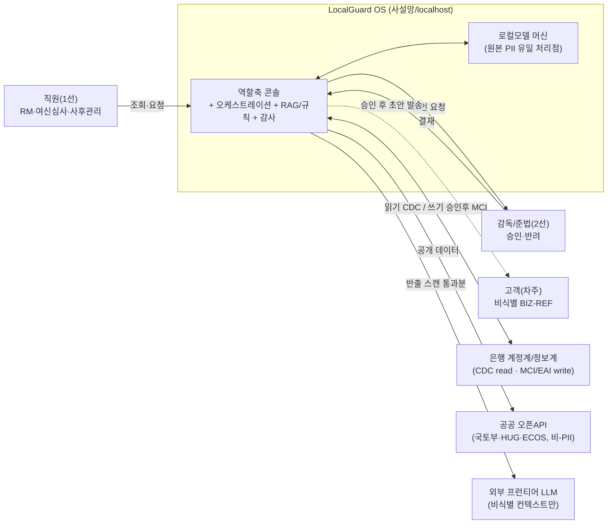
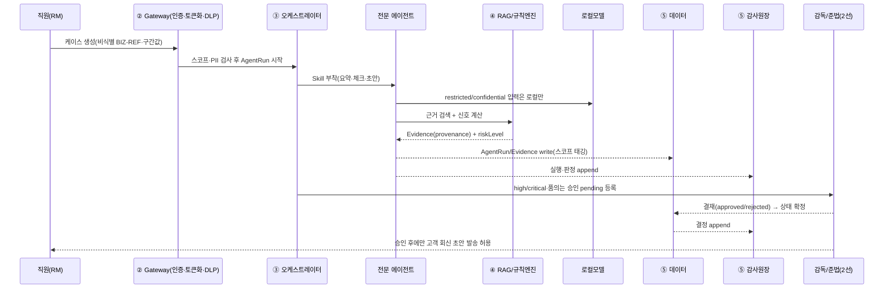
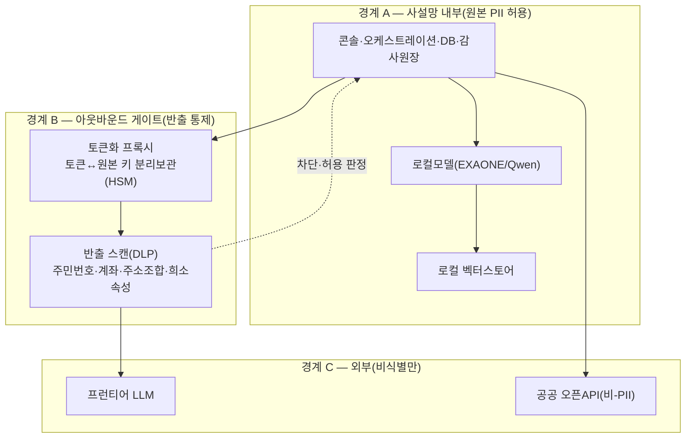
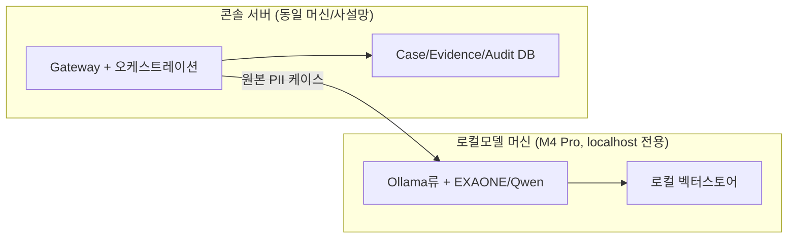

---
tags:
  - area/product
  - type/architecture
  - status/active
date: 2026-07-04
up: "[[INDEX|제품 인덱스]]"
---

# 아키텍처 — 역할축 여신 콘솔(LocalGuard OS)

> **정합 대상**: [[08_본선/03_제품/04_tech/architecture|04_tech/architecture]](레이어·스택·PII 4중방어 원안)·[[08_본선/03_제품/04_tech/api-spec|04_tech/api-spec]]·[[08_본선/03_제품/04_tech/rag-rule-engine|04_tech/rag-rule-engine]]·[[08_본선/03_제품/04_tech/data-model|04_tech/data-model]]. 이 문서는 그 넷을 **읽어** 스키마(System context·Components·Data flow·Model/API·Storage·Auth·Logging·Monitoring·Human approval·Failure handling·Deployment + Trust boundary)로 정식화한 것이며 **원본을 덮어쓰지 않는다**. 스택·레이어 세부가 어긋나면 04_tech가 SSOT, 코드가 어긋나면 JB_project2 소스가 최종 SSOT다.
>
> **코드 SSOT**: `_vendor/JB_project2/app/cclConsole.core.js`·`cclConsole.data.js`(기업여신 CCL 콘솔). 히어로 케이스 = **CCL-0001**(전주 카페 운영자 운전자금, `BIZ-REF-0001`). 운영 계약: `Case → AgentRun → Agent → Skill → Evidence → Approval → Audit`.
>
> **근거등급**: E4=코드/데모 직접확인 · E3=백본 SSOT 문서 · E2=리서치 근거층 · E1=설계의도(미검증) · [TBD]/[Open Question]=미정.

이 콘솔은 예선 라이브 MVP(`02_제품/app/`, 브라우저 `localStorage` 7단 계약 재현)와 본선 역할축 프로토타입(JB_project2)을 **서버 아키텍처로 승격**하는 대상이다 [E3, 04_tech §0]. 새로 짜는 것이 아니라, 함수 계약(`computeRiskDecision`·`buildDashboardData`·`auditChainRecords`·`moveCaseToColumn`)과 CCL 훅 파이프라인을 서버 API로 1:1 승격하고 그 위에 RAG·규칙엔진·멀티에이전트 오케스트레이션을 얹는다 [E3, 04_tech §0]. 차별성 척추(업무를 '경험'으로 → 역할 기반 AI Agent 게이트, 4관점)의 **직원·조직·그룹·고객**이 이 구조 안에서 레이어·경계·게이트로 드러난다.

---

## 1. System context (시스템 맥락)

| 외부 액터/시스템 | 관계 | 경계 규칙 | E? |
|---|---|---|---|
| 직원(1선: RM·여신심사·사후관리) | 케이스 조회·AI 요청·초안 요청, **승인권 없음** | 역할·계열사 스코프(`roleKey`) 필수 | E4 |
| 감독/준법(2선) | 승인/반려 결정, 고객 발송 최종 게이트 | 결정자 `USR-*`만 통과 | E4 |
| 고객(차주) | 상담·회신 대상, **원문 PII 미보관** | `BIZ-REF` 익명 참조·구간값만 | E4 |
| 은행 계정계/정보계 | 읽기=CDC(Debezium식 로그), 쓰기=승인 후 MCI/EAI 전문 | AI 직접 원장 조회·직접 Write 금지 | E2, D6 [미검증] |
| 공공 오픈API(국토부·HUG·ECOS) | 시세·통계 조회 | 그 자체 비-PII → 반출 스캔 비대상 | E3, 04_tech §4 |
| 외부 프런티어 LLM | 비식별 요약·추론 | 반출 스캔 통과분만, 원본 PII 국외이전 금지 | E3, D5a |

> **왜 계정계를 직접 안 붙이나** [E2, D6]: 한국 은행은 계정계·정보계·채널계가 분리돼 있고, AI 콘솔의 원장 직접 조회는 OLTP 부하·원장 가용성 위험이 크다. 읽기는 로그 기반 CDC, 쓰기는 RM 승인 후 기존 MCI/EAI 채널 경유가 현실 경로. **전북은행·광주은행은 공동 전산센터 계획이 철회돼 연동을 이원화**해야 한다 [E2, D6]. 실제 MCI/EAI 전문 스키마·Nexacro WebView 임베딩은 [미검증](비공개 규격).

---

## 2. Components (구성요소 — 5 레이어)

04_tech §1의 5레이어를 책임·인터페이스·PII 방어축으로 정식화. 상세 다이어그램은 원본 유지.

| 레이어 | 책임 | 인터페이스(In→Out) | 담당 PII 방어축 | E? |
|---|---|---|---|---|
| ① 콘솔 UI(3열 셸) | 사람의 유일 접점 — org-rail(계열사/조직)·워크벤치(큐·칸반·승인함)·컨텍스트 패널(근거·리스크·감사). **승인 전 자동발송 UI 미노출** | 사용자 ↔ REST + SSE(`GET /api/runs/:id/stream`) | — | E4(UI 마운트)/E3 |
| ② API Gateway | 인증·역할 검사 + **아웃바운드 단일 관문**(DLP 반출 스캔·토큰화 프록시) | ①→내부 오케스트레이션 트리거 | ②토큰화 · ④반출 스캔 | E3/E1(서버) |
| ③ 에이전트 오케스트레이션 | 오케스트레이터가 케이스 라우팅→전문 에이전트에 Skill 부착 실행, 승인 게이트 통과분만 고객 대상 행동 허용 | ②→③, ③→④, ③→⑤(AgentRun/Evidence write) | ③모델 라우팅 | E4(훅·에이전트 8종)/E3 |
| ④ RAG + 규칙엔진 | 판단에 근거 부착 — RAG는 근거 검색→Evidence, 규칙엔진은 신호 계산→승인 레벨 라우팅 | ③→벡터스토어+규칙테이블→③ | ①데이터 등급제(수집 시 태깅) | E2(설계)/E4(computeRiskDecision) |
| ⑤ 데이터·감사 | 7단 계약 영속 + Audit append-only 원장 | 전 레이어 write 수신, ①에 조회 전용 | ④반출 결과·태그 이력 기록 | E4/E3 |

**에이전트 로스터**: JB_project2 CCL은 **8종**(표면 5 + 감독·내부 3)으로 구현됨 [E4, `cclConsole.core.js:111-159`]. 04_tech §1은 canon 기준 "14 에이전트(오케스트레이터+12전문+2사람승인자)"로 기술 — **두 수치는 서로 다른 계열**(CCL 도메인 8 vs 전체 콘솔 14 목표)이며 통합 명명은 [Open Question]. 도메인 모델과 정합: [[08_본선/03_제품/docs/05_domain-model|05_domain-model §1]].

> **왜 LLM을 판단 엔진으로 안 쓰나** [E2, D20]: 금융 AX의 주 모델은 LLM이 아니라 특화모델·규칙엔진·레거시 어댑터를 묶는 하네스다. LLM은 **의도 분류 → 근거 범주 결정 → 도구 호출 → 결과 요약**만 맡고, 신용평가·여신심사 점수는 XGBoost/LightGBM류, FDS는 규칙엔진+GNN에 라우팅한다. 같은 모델도 scaffolding에 따라 성능이 크게 갈리므로 **하네스(컨텍스트 배치·승인 게이트·툴 계약·재시도·로깅)가 차별점** [E2, D20]. → JB_project2의 규칙 게이트(`CCL_FORBIDDEN_ASSERTIONS`·`harnessGuardCheckAutoClose`)가 이 원칙의 코드 구현 [E4].

**Policy Engine**: 위 규칙 게이트들을 하나로 묶는 이름 — "LLM은 판단을 돕고, Policy Engine은 금지선·승인선을 강제한다." **가드레일 5종은 `harnessCore.js`에 실동작(E4)**, 5영역·12규칙 통합 결정표(allow/block/require_approval/escalate)는 **[설계]** 통합안 — [[08_본선/03_제품/01_결정-준비/casesops-분기/07-policy-engine|07-Policy-Engine 설계도]] 참조.

**메모리(Memory)**: 에이전트 판단·승인 이력을 세션 로그 전량이 아니라 Customer/Agent/Staff 3계층 카드로 증류해 축적하는 설계는 [[08_본선/03_제품/01_결정-준비/casesops-분기/11-메모리-3계층-자동진화-설계도|11-메모리-3계층 설계도]] 참조([분기/미확정] — PR `LSB-afk/JB_project2#2`의 `memoryCards.js`가 CCL 콘솔 한정 첫 구현으로 제출·수용기준 4/4 검증 완료, **머지 대기(OPEN)**).

**온톨로지 그래프**: 케이스·에이전트·근거·승인의 실데이터 관계를 그래프로 렌더하는 운영계약 시각화(17노드/16엣지 실측, cytoscape 로컬 벤더링) — `modules.js initCaseOntology()` [E4, feature-spec 기능군7 F-7.1.5].

**오픈소스 롤모델(참고, 런타임 미차용)** [E2, B1]:

| 계약 | 롤모델 | 차용 범위 |
|---|---|---|
| Approval 상태기계 | **StackStorm** `core.ask` 승인 게이트 | `paused/pending/approved/rejected/expired` 상태 + JSON schema 응답 shape만 |
| AgentRun 계약 | **Temporal** signal/event history | `signals/approve` + append-only `events` + 우측 타임라인 shape만 (클러스터·워커 미도입) |
| 프론트 IA·토큰 | **paperclip**(MIT) 1차, Carbon·Tremor 보조 | Case/Agent/Approval/Audit IA + 토큰·테이블 밀도. React/TS 런타임 미차용 |

---

## 3. Data flow (데이터 흐름)

케이스 1건의 정상 경로(히어로 CCL-0001 기준):

**핵심 흐름 규칙**:
- 원본 PII는 **② 토큰화 이후 시스템 내부에 들어오지 않는다** — 콘솔은 토큰 ID + 위험 피처만 받는다 [E2, D6/D5a].
- `restricted`/`confidential` 입력은 로컬모델 경로로만, 반출 스캔 통과한 `비식별` 컨텍스트만 외부 LLM으로 [E3/E2, D22·D5b]. 라우팅 상세 §5.
- 훅 파이프라인(코드 강제) [E4]: `onRoleEnter → beforeCaseCreate → afterCaseCreate → beforeAgentRun → afterAgentRun → beforeCustomerMessage → afterApprovalDecision → onAuditWrite`.

---

## 4. Trust Boundary (신뢰 경계 — 망분리·PII 게이트)

가장 중요한 축. 04_tech §3(PII 4중방어) + 리서치(D5a·D5b·D10·D22)를 경계 관점으로 정식화.

| 경계 | 통제 | 근거 | E? |
|---|---|---|---|
| **A. 망분리 원칙** | 기본은 여전히 망분리. 외부 생성형 AI는 **SaaS 예외·혁신금융·R&D 예외** 트랙으로만 | D5b | E2 |
| **A. 로컬 PII 처리점** | 원본 개인신용정보·상담기록·내부규정은 로컬모델/RAG만 통과, 로컬모델 머신이 원본 PII 유일 처리점 | D22 / 04_tech §4 | E3(정책)/E1(실서빙 TBD) |
| **B. 토큰화 게이트** | 원본↔토큰 키 분리보관, 가명정보 취급자·추가정보 접근권 분리. 주민번호·계좌=deterministic/FPE 토큰, 이름·주소·자유서술=룩업형 불투명 토큰 | D5a / D10 | E2 |
| **B. 반출 스캔(egress)** | 외부 호출 직전 DLP: 주민번호·계좌식별자·주소조합·희소속성 조합 스캔, 위반 시 차단·Audit 기록. 단일 egress 프록시 | D5a / D10 | E2 |
| **C. 외부=비식별만** | 외부 프롬프트·로그·툴콜에서 고객명·주민번호·계좌·개인신용정보 전부 제거. 원본 반출 자체가 국외이전이라 금지 | D5b / 04_tech §2 | E3 |

**법령 근거(근거팩 표현 그대로)** [E3, canon §4]: 신용정보법 §40조의2(①②⑥⑦⑧)가 1차 근거, 개인정보보호법 §28조의4·5가 보충 근거. 재식별 위반은 5년 이하 징역 또는 5천만원 이하 벌금까지, 과징금 중첩 가능 [E2, D5a]. 신용정보법이 특별법으로 우선, PIPA는 보충 적용 [E2, D5a].

> **왜 토큰화만으로 부족한가** [E2, D5a/D10]: 토큰화만 하면 적법이 자동 성립하지 않는다 — 추가정보 분리보관·외부 사업자 재결합 불가·출력 재식별 차단·위탁 구조(목적외 금지·재위탁 통제·학습/재판매 금지)가 함께 있어야 한다. 프롬프트 인젝션은 0으로 못 막으므로(OWASP), 해법은 모델 신뢰가 아니라 **권한·반출량 축소(브로커 통제)** [E2, D10].

---

## 5. Model/API usage (하이브리드 모델 라우팅)

**4층 라우팅 + 데이터 등급 기준** [E2, D22/D5a]. 승격 기준은 난이도가 아니라 **데이터 등급** — 민감정보가 섞이면 로컬로 강등.

| 계층 | 모델 | 용도 | 데이터 등급 게이트 | E? |
|---|---|---|---|---|
| 1 | 8B~32B 로컬 내재화(EXAONE 3.5 / Qwen2.5-14B) | 원본 PII 처리·규정 QA·요약·분류 | `restricted`/`confidential` 허용 | E1(서빙 TBD) |
| 2 | 국산 우선 평가(HyperCLOVA X SEED / Solar) | 온프레·전용클라우드 후보 | 내부망 | E2, D22 [미검증] |
| 3 | 오픈웨이트(Llama 3.1/Qwen3/DeepSeek distill) | 셀프호스팅 대안 | 내부망 | E2, D22 |
| 4 | 외부 premium API(Claude/OpenAI) | 비식별 요약·고난도 추론 | **비식별·비신용만** 승격 | E3(정책)/E1(사업자 TBD) |

**5단계 데이터 등급** [E2, D5a]: `원본 개인신용정보 → 가명정보 → 익명정보 → AI 입력 불가 → AI 입력 가능`. JB_project2 코드는 `public/internal/confidential/restricted` 4등급으로 태깅([[08_본선/03_제품/docs/05_domain-model|domain §2.1]], `jb-db` 커넥터 `govTier:"restricted"`) [E4] — 5단계 법적 등급 ↔ 4등급 코드 태그 정합 매핑은 [Open Question].

> **LLM 역할 고정** [E2, D20]: LLM은 점수화·예측·탐지를 직접 맡지 않는다. 신용/여신은 특화모델(XGBoost·LightGBM·RF), FDS는 규칙엔진+GNN, 문서 IE는 LayoutLMv3·Donut. **비용 메시지** [E2, D22, 일부 추정]: 4xH100 70B가 GPT-4.1 mini보다 싸지려면 월 ~97억 토큰, GPT-5.5 대비 break-even은 70/30 기준 ~5.9억 토큰. TCO 변수는 전기료(4xH100 월 ~26.6만원)가 아니라 GPU 감가상각·활용률. GPU 정가·EXAONE 실서비스 적합성은 [미검증].

**API 승격 매핑** [E3, 04_tech §5]: `computeRiskDecision`→`POST /api/cases/:id/risk-decision`(api-spec 갭), `buildDashboardData`→`GET /api/dashboard`, `auditChainRecords`→`GET /api/audit`, `moveCaseToColumn`→`PATCH /api/cases/:id`(AgentRun 트리거 훅 동반).

**데모 LLM 게이트웨이 [E4, 2026-07-04 구현]**: 데모 런타임은 Ollama가 아니라 **claude/codex CLI 라우팅(paperclip式)** — `02_제품/scripts/api-proxy.mjs`의 `POST /llm`. 폴백 사다리(요청 엔진→반대 엔진 재시도→사람 큐 `escalated`) 내장, 모든 시도를 `llm-runs.jsonl`에 구조화 기록, 스폰 cwd 중립화로 내부 문서 컨텍스트 유입 차단. 실측 케이스당 ~$0.12(1회, [[Q13-토큰비용-유닛이코노믹스]]). 위 4층 라우팅 표는 실배포 목표이고, 게이트웨이의 tier 라벨(local/frontier)이 그 축소 재현이다.

**JB_project2 로컬 Ollama 실연동 [E4, 8c274b5]**: 위 게이트웨이와 별개로 `_vendor/JB_project2`에는 `scripts/ollama-agent-proxy.mjs`(:8030, 금지패턴 4종 내장)와 `app/agentModelSettings.js`(mock↔ollama 런타임 토글 UI, localStorage 저장)가 신설됐다. 우리 쪽 `02_제품/scripts/api-proxy.mjs`(:8022, PR `LSB-afk/JB_project2#2`)와는 포트·소유 경로가 다른 별도 구현이며 현재 통합되어 있지 않다 — 관계 정리는 [[08_본선/03_제품/reports/구현현황-JB_project2|구현현황-JB_project2]] 참조.

---

## 6. Storage (저장소)

| 대상 | 현 구현(JB_project2) | 승격 후보 | E? |
|---|---|---|---|
| 7단 계약 엔티티 | `localStorage`(`ccl-ops-db-v1`), 모든 행 `roleKey`/`workspaceId` 스코프 태깅 | PostgreSQL(permissive) 후보 vs 로컬 유지 — [[08_본선/03_제품/06_build-roadmap/P0-정의-합의|P0]] 옵션 A/B/C 미확정 | E4/E1 |
| 서버 승격 후보(신규) | (미사용, localStorage가 여전히 기본 경로) | **opt-in 구현 시작됨 [E4, 8c274b5]** — `server/index.mjs` + `JB_DB_DRIVER` 환경변수로 `json`(파일 DB, 기본값)·`supabase`(키는 env 전용) 3단 스토리지 선택. P0 "사실상 옵션A 고정" 판정 재개방 근거 | E4 |
| 감사 원장 | append-only 로그 + `reviewRequired` 플래그 | append-only 테이블 또는 immutable log store(옵션과 무관하게 고정 요건) | E4/E3 |
| 벡터스토어 | (미구현) | 로컬 임베딩 우선(sqlite-vec/Chroma vs pgvector) — 외부 임베딩 API 미사용 | E1 [TBD] |
| 토큰↔원본 키 | (미구현) | HSM 또는 별도 암호화 저장소, 취급자 분리 | E2, D5a [TBD] |

> **정합 노트 [미검증]**: 04_tech/data-model은 감사를 **GENESIS 해시체인**(FNV-1a→SHA-256)으로 기술(02_제품/app 기반), JB_project2 CCL은 **append-only + reviewRequired 플래그**로 구현(해시체인 미구현) [E4]. 발표에서는 해시체인=무결성 목표, CCL 로그=현 데모 구현으로 구분 권장 [E1] — [[08_본선/03_제품/docs/05_domain-model|domain §7]]과 동일 입장.

---

## 7. Auth (인증·권한)

| 축 | 규칙 | 코드 근거 | E? |
|---|---|---|---|
| 인증 | API Gateway 단일 관문에서 인증·역할(RM/여신심사/사후관리/준법·AML) 검사 | 04_tech §1 ② | E1(서버 TBD) |
| 역할·계열사 스코프 | 모든 조회 `roleKey` 필수, 없으면 예외(`role scope is required`). 타 스코프 행(`CCL-OTHER-0001`) 격리 | `cclTable()`·`onRoleEnter` [E4] | E4 |
| 사람 결재 강제 | 승인 결정자는 `USR-*`만 통과 | `afterApprovalDecision` [E4] | E4 |
| 에이전트 권한 경계 | 에이전트별 `allowedActions`/`blockedActions` + `dbReads`/`dbWrites` 화이트리스트 | `cclAgent()` [E4] | E4 |
| 도구 최소권한 | 서비스계정 분리·최소 scope·allow-list 파라미터·rate limit·kill switch | D10(설계원칙) | E2 [미구현] |

> **왜 MCP만으로 안 되나** [E2, D20]: MCP는 연결 표준이고 authorization은 optional이다. 사내 하네스가 SSO/OAuth·allowlist·sandbox·감사로그를 강제해야 한다. 승인 hold는 LangGraph `interrupt`·Agent Framework `tool approval`로 구현 가능하며 [E2], JB_project2는 `approvals(pending)` + 훅으로 재현 [E4].

---

## 8. Logging (로깅·감사)

모든 상태변경은 `ccl_audit_logs`로 귀결 [E4]. 필드: `actorId·action·targetType·targetId·riskLevel·reviewRequired·createdAt`.

**최소 감사 필드**(외부 LLM 경유 시) [E2, D5a/D10/B1]: 사용자·서비스 ID · 토큰화된 요청 요약 · 정책 결정 이유 · 모델/버전 · 툴 호출 · 승인 여부 · DLP 스캔 결과 · **이전 로그 해시 또는 서명**(tamper-evident) · 가명처리 규칙 · 처리 목적·일시. **3년 이상 보존**(신용정보법 통제) [E2, D5a].

- 행위자(사람 `USR-*`·에이전트 `ccl-*`)를 `actorId`로 직접 식별 [E4].
- `reviewRequired=true` 레코드만 감독 "감사 기록" 뷰 카운트에 집계 [E4].
- Temporal식 append-only event history + StackStorm식 승인 스냅샷(`triggered_by`·`input/output/approval_snapshot`) shape 차용 [E2, B1].
- **LLM 호출 원장 [E4, 2026-07-04]**: `llm-runs.jsonl` — `runId·caseId·engine·tier·latencyMs·tokensIn/Out·costUsd·errorClass·retry·fallbackPath·escalated`. 서버 이관 시 그대로 테이블 DDL([[Q14-오류로깅-폴백사다리]]).
- **감사 용도 태그 [E4]**: 감사 레코드에 소비자 태그(당국 증적/분쟁 재생/운영 점검/원가 정산, `auditPurpose()`) — "소비자 없는 로그는 남기지 않는다" 원칙([[Q15-감사로그-실효성]], 큐레이션은 [[10-Ledger-Curator-에이전트-설계도]] [분기/미확정]).

---

## 9. Monitoring (관측)

| 대상 | 방법 | 상태 | E? |
|---|---|---|---|
| prompt/model/agent 버전·trace | OpenTelemetry / OpenInference / OpenAI Agents SDK tracing식 | 서버 이관 시 [TBD] | E2, D9/D20 |
| 하네스 성능 지표(설득용) | 하네스 전후 pass rate · tool success rate · approval burden · time-to-resolution · legacy error rate 비교 | 벤치 설계 [TBD] | E2, D20 |
| 반출 스캔 히트율·오탐 | DLP 로그 집계 | [TBD] | E2, D10 |
| LLM 라우팅 오류·비용 | `GET /llm/usage` 집계(성공·오류·격상·티어별 토큰) + 토큰 패널 실측 블록(케이스 단가·RM 월 환산) | **구현**(`?live=1`) | E4 |

> 상시 순찰은 운영 에이전트 3종이 담당(설계): [[08-Cost-Sentinel-에이전트-설계도]](비용)·[[09-119-라우팅관측-확장-설계도]](오류)·[[10-Ledger-Curator-에이전트-설계도]](감사) [분기/미확정].

> 벤더 "N배 개선"·"정확도 99%"류는 핵심 근거로 쓰지 않는다 [E2, D20]. 한국 은행 FDS·신용평가 운영 수치는 대부분 비공개 [미검증].

---

## 10. Human approval points (사람 승인 지점)

차별성 척추의 핵심 게이트. AI는 요약·체크·초안만, 결정은 항상 사람 [E4].

| 게이트 | 트리거 | 통제 | 코드 근거 | E? |
|---|---|---|---|---|
| 승인 결재 | high/critical·서류누락·정책금융·품의 → `requiresHumanReview=true` | 감독/준법(`USR-*`)만 결재, high/critical AgentRun 자동완료 차단 | `harnessGuardCheckAutoClose`·`afterApprovalDecision` [E4] | E4 |
| 고객 발송 | 회신 초안 발송 시도 | PII 체크·단정표현 체크·승인 3중 게이트 후에만 | `beforeCustomerMessage` [E4] | E4 |
| 금지 단정 | 승인/금리/신용등급 단정 문구 | 정규식 차단(`CCL_FORBIDDEN_ASSERTIONS`) | [E4] | E4 |
| 외부 반출 승인 | 민감정보 섞인 외부 호출 | 정책엔진 차단 또는 승인 대기, 고위험은 이중승인 | D22/D10(설계) | E2 [미구현] |

> **예외**: FDS(사기) 실시간 선차단만 사람 승인 전 허용 — 본 CCL 여신 도메인 밖(피싱 콘솔 소관) [E2, domain §1]. **승인 레벨** [미검증]: 04_tech는 L0~L4(L3~L4=준법), JB_project2는 `riskLevel + requiresHumanReview + supervisor 결재`. 잠정 매핑 low→L0/L1·medium→L2·high→L3·critical→L4, L4 실 승인 주체 [Open Question] — [[08_본선/03_제품/docs/05_domain-model|domain §3]].

---

## 11. Failure handling (실패 처리 — fail closed)

원칙: 불확실하면 **닫는다**(fail closed) [E3, 03_principles].

| 실패 유형 | 처리 | 근거 | E? |
|---|---|---|---|
| 스코프 누락 | 조회 예외 발생(`role scope is required`) — 데이터 노출 안 함 | `cclTable()` [E4] | E4 |
| 가드 위반(PII·단정·자동종결) | 차단 + `reviewRequired` 감사 기록 | `beforeCaseCreate`/`beforeCustomerMessage` 실패 [E4] | E4 |
| DLP 반출 위반 | 외부 호출 차단, Audit 기록 | D10 | E2 [미구현] |
| 프롬프트 인젝션 | 0 방어 불가 전제 → 권한·반출량 축소로 피해 한정, 출력 스키마 검증·context-aware encoding 후에만 downstream | D10 | E2 |
| 외부 출력 그대로 실행 | 금지 — HTML/SQL/path/command/tool param은 스키마 검증 뒤에만 | D10 | E2 |
| 레거시 쓰기 실패 | AI 직접 Write 안 함 → 승인 후 MCI/EAI 비동기 작업체인·상태 대시보드로 재시도 | D6/D20 | E2 [미검증] |
| 로컬모델 다운 | 승격 게이트가 외부로 자동 강등하지 않음(데이터 등급 우선) → 대기/사람 처리 | D22(강등금지 원칙) | E1 |
| LLM 엔진 실패(데모 게이트웨이) | 폴백 사다리: 요청 엔진→반대 엔진 재시도→사람 큐 격상(`escalated:true`) — AI가 조용히 사라지지 않고 반드시 사람 앞에 도착. 오류 6분류(`timeout/engine_missing/nonzero_exit/parse_error/empty_output/all_engines_failed`) | `handleLlm()` [E4] | E4 |

> **레드팀 테스트셋** [E2, D10]: 직접·간접 prompt injection · hidden instruction · tool call injection · PII echo · SQL/HTML payload · excessive agency 시나리오를 배포 전후 반복 측정 — evals로 이관 [TBD].

---

## 12. Deployment assumption (배포 전제)

- 로컬모델 머신이 원본 PII 유일 처리점, 콘솔 서버와 같은 사설망(localhost) — **최종 검증은 이승보 PC 기준** [E3, 04_tech §4].
- **배포 토폴로지(3존 구조) [E4, 2026-07-04 구현]**: 위 그림은 개념도이고, 실제 Docker 물리분리 구성은 존1(edge, 정적 UI+API 프록시)·존2(console, 프런티어 LLM 접근)·존3(pii-zone, `internal:true` 네트워크·Ollama만) 3존으로 실장됐다 — `02_제품/deploy/docker-compose.yml` + [[08_본선/03_제품/01_결정-준비/배포-토폴로지-운영-기획서|배포-토폴로지-운영-기획서]] §2. 시연은 `02_제품/deploy/시연-런북-백엔드분리.md`(pii-zone 외부 curl 타임아웃 킬러컷).
- 계열사 확장 = 새 레이어 아님: ①7단 엔티티에 `company_id` 부착(멀티테넌시 스키마) ②org-rail 노드 1개 추가 ③필요 시 계열사 전용 서브에이전트 추가, **오케스트레이터·승인 게이트 구조 불변** [E3, 04_tech §6].
- **확장 서사(키스톤 정합)** [E3, 키스톤-확정]: "동일 운영계약·PII 4중방어 위에 계열사별로 직군·도메인이 다르게 구성 = 모듈식 확장." 전북은행(여신·전세·피싱·사후관리) + JB우리캐피탈(오토/개인/기업 여신·EWS, **전세 없음**) — "3도메인 그대로 복제"보다 강한 확장 논거.

**정직한 전제** [E3, 키스톤-확정]: 로컬모델(Ollama)·Claude API는 서버 실연동 [TBD/조건부]. "3케이스 실동작"은 현재 완성이 아니라 개발 목표 — 최소 히어로(CCL-0001) 1개는 실 LLM 동작 지향. 발표·문서에서 [목표/조건부]로 정직 표기.

---

## 13. 남은 TBD / Open Question

- 에이전트 수 정합: CCL 도메인 8종 ↔ 전체 콘솔 14 목표 통합 명명 [Open Question]
- 5단계 법적 데이터 등급 ↔ 4등급 코드 태그 매핑 [Open Question]
- 승인 L0~L4 ↔ `riskLevel/requiresHumanReview` 정합, L4 실 승인 주체 [Open Question]
- 감사 해시체인(04_tech) ↔ CCL append-log(JB_project2) 통합 [Open Question]
- DB 범위(P0 옵션 A/B/C), 벡터스토어·토큰화 키 저장소·로컬모델 실서빙 [TBD]
- MCI/EAI 전문 스키마·Nexacro WebView 임베딩(비공개 규격) [미검증]
- 관측(OTel)·하네스 벤치·레드팀 evals 서버 이관 [TBD]
- 국산 모델(HyperCLOVA X/Solar) 후보 평가, GPU TCO 수치 재검증 [미검증]

---

## 연결

- [[08_본선/03_제품/04_tech/architecture|04_tech/architecture — 레이어·스택 원안(정합 대상)]]
- [[08_본선/03_제품/docs/05_domain-model|05_domain-model — 도메인 모델(정합)]]
- [[08_본선/03_제품/01_결정-준비/키스톤-확정|키스톤 — 콘솔 조직 축]]
- [[08_본선/03_제품/reports/구현현황-JB_project2|구현현황-JB_project2]] (코드 SSOT §9)
