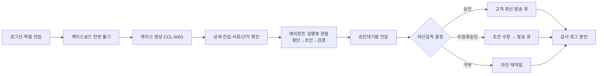
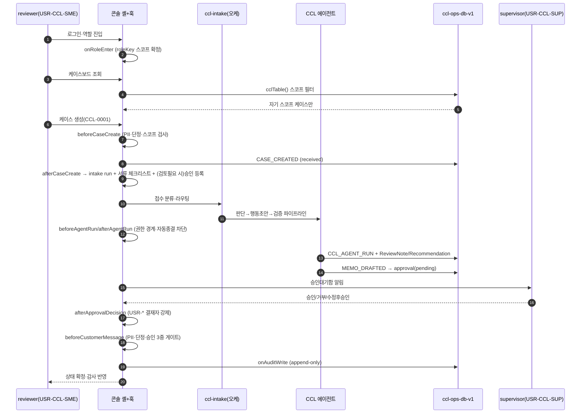
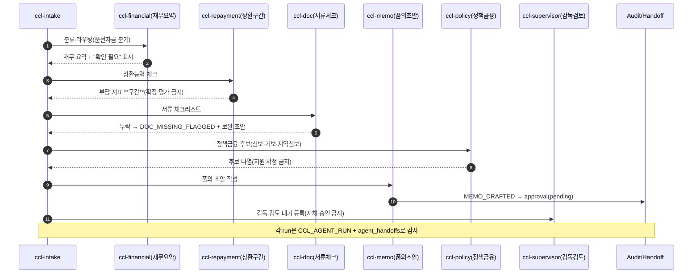
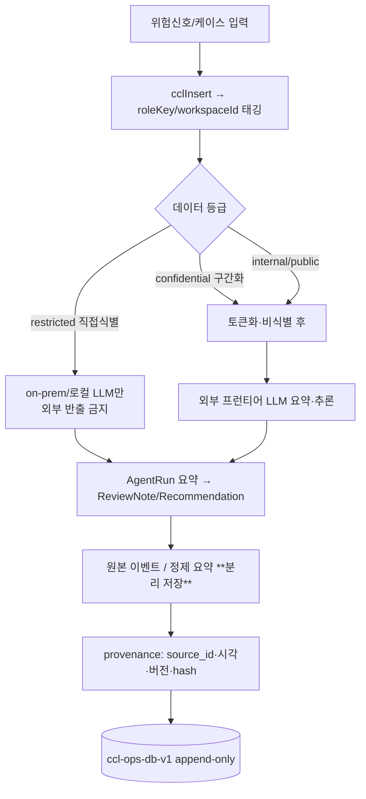
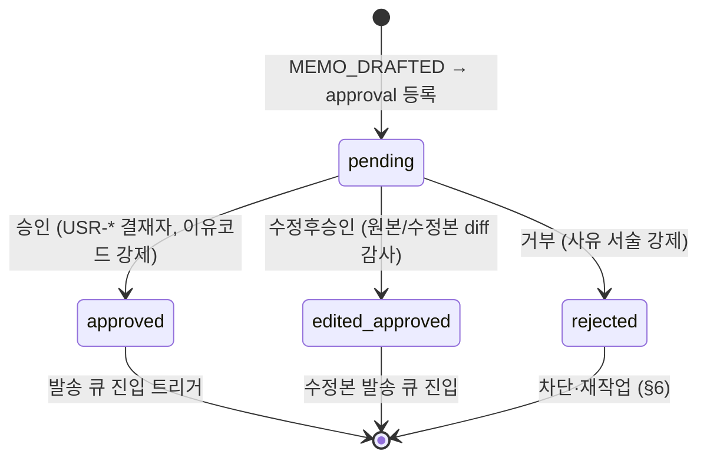
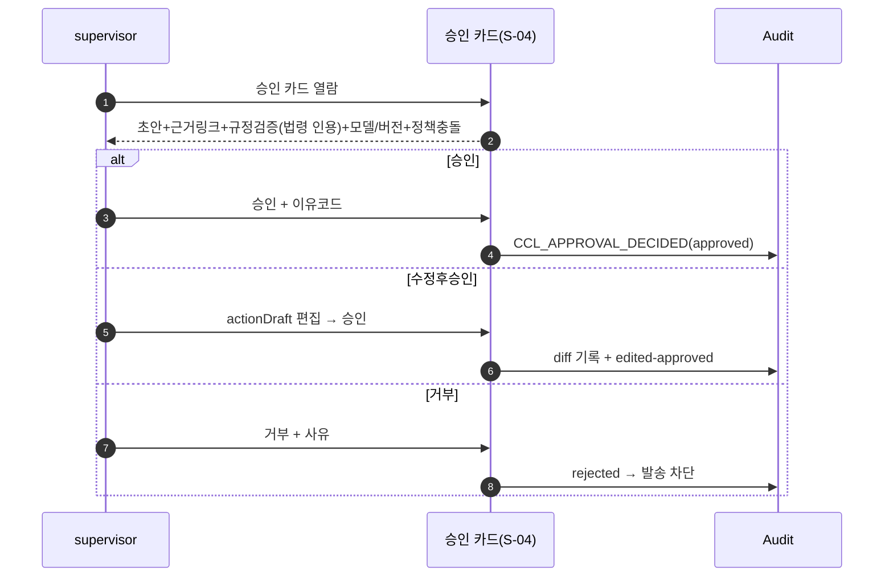
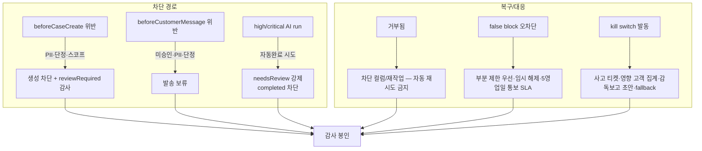
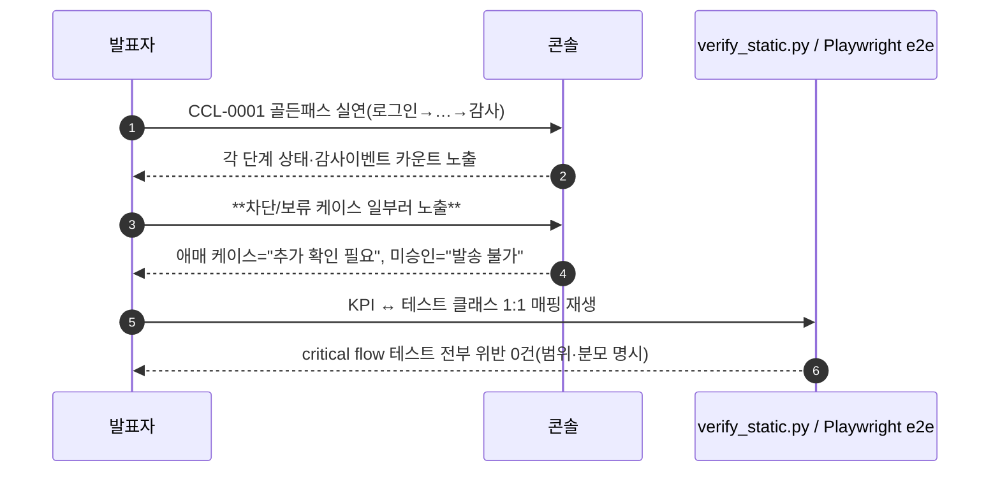

---
tags:
  - area/product
  - type/flow
  - status/active
date: 2026-07-04
up: "[[INDEX|제품 인덱스]]"
aliases: [Flow, CCL-0001 골든패스]
---

# 09 Flow — 흐름·시퀀스 명세 (CCL-0001 골든패스)

> **스키마 출처**: `_문서생성-스킬-DDBM-Harness-SDD.md` §Phase 3 `docs/09_flow.md` — User journey / System / Agent / Data / Approval / Error / Demo 시퀀스를 Mermaid로 제시.
> **정합 SSOT**: [[08_본선/03_제품/docs/05_domain-model|05_domain-model]](Actors·States·Events·Permissions·Hooks) · [[08_본선/03_제품/docs/06_prd|01_prd]](Surfaces·Features) · [[08_본선/03_제품/04_tech/data-model|04_tech/data-model]](필드·훅) · [[08_본선/03_제품/03_ux/design-system|03_ux/design-system]](3열 셸·화면). 필드가 어긋나면 04_tech, 코드가 어긋나면 `_vendor/JB_project2` 소스가 최종 SSOT.
> **코드 근거**: `_vendor/JB_project2/app/cclConsole.core.js`·`cclConsole.data.js`. 히어로 = **CCL-0001**(전주 카페 운영자 운전자금, `BIZ-REF-0001`).
> **근거등급**: E4=코드/데모 직접확인, E3=백본 SSOT 문서, E2=리서치 근거층, E1=설계의도(미검증), [TBD]/[Open Question]=미정.

---

## 0. 골든패스 개요

**한 문장**: RM(담당자)이 로그인해 위험 케이스 CCL-0001을 만들면, 8종 CCL 에이전트가 판단→행동초안→검증을 수행해 품의 초안을 올리고, 여신감독이 승인 게이트에서 근거·규정검증을 보고 승인/거부/수정후승인을 결정한 **뒤에만** 고객 회신이 나가며, 전 단계가 감사 로그로 봉인된다 [E4].

**골든패스 9스텝(과제 지정)** — 화면(S-xx)은 [[08_본선/03_제품/03_ux/design-system|design-system]] 3열 셸 기준, 상태는 [[08_본선/03_제품/docs/05_domain-model|domain-model]] §3 CCL lifecycle 기준.

| # | 스텝 | 화면(surface) | Case 상태 | 관측 이벤트/훅 | E? |
|---|---|---|---|---|---|
| 1 | 로그인·역할 진입 | (로그인) → 셸 진입 | — | `onRoleEnter`(roleKey 스코프 확정) | E4 |
| 2 | 케이스보드(칸반) | S-03 케이스(칸반) | 전체 컬럼 조회 | `cclTable()` 스코프 필터 | E4 |
| 3 | 케이스 생성 | S-03 케이스 생성 | `received` | `beforeCaseCreate`→`CASE_CREATED`→`afterCaseCreate` | E4 |
| 4 | 케이스 상세 | S-03 상세(context-panel) | `collecting` | 서류 체크리스트·근거 드릴인 | E4 |
| 5 | 에이전트 실행뷰 | 상세 인라인 라이브런 | `aiReview` | `beforeAgentRun`→`CCL_AGENT_RUN`→`afterAgentRun` | E4 |
| 6 | 승인대기함 | S-04 승인 | `humanReview`/`memoDraft` | `MEMO_DRAFTED`→approval `pending` | E4 |
| 7 | 승인/거부/수정후승인 | S-04 승인 카드 | (결정) | `afterApprovalDecision`→`CCL_APPROVAL_DECIDED` | E4 |
| 8 | 알림(고객 회신) | 발송(시스템 액터) | — | `beforeCustomerMessage`(PII·단정·승인 3중 게이트) | E4 |
| 9 | 감사 | S-13 활동/감사체인 | `memoDraft`→`doneHold` | `onAuditWrite`(append-only) | E4 |

> **정합 주의 [미검증]**: 승인 축은 두 표현이 병존한다 — 04_tech/PRD는 **L0~L4**(L3~L4=준법), JB_project2 CCL은 **`riskLevel(low/medium/high/critical)` + `requiresHumanReview` + supervisor 결재**. domain-model §3.2 잠정 매핑(low→L0/L1 … critical→L4)을 그대로 따르되, 본 문서는 CCL 구현 용어를 1차로 쓴다. L4 실 승인 주체는 [Open Question].

**Actors(액터 레인)** [E4, domain-model §1]

- **U** = reviewer(소상공인/기업여신 담당자, `USR-CCL-SME-*`) — 조회·AI 요청·초안 요청. 승인권 없음.
- **App** = 콘솔 셸 + 훅 파이프라인(시스템).
- **O** = 오케스트레이터(`ccl-intake`) — 분류·라우팅·핸드오프.
- **AI** = CCL 에이전트 8종 — 요약·체크·초안. 결재·발송·확정 금지.
- **DB** = `ccl-ops-db-v1`(localStorage 영속, 스코프 태깅).
- **S** = supervisor(여신감독, `USR-CCL-SUP-01`) — 승인/반려 결정권.

---

## 1. User journey (사용자 여정)

- **경험 원칙**(design-system §1): recognition-over-recall(요약→근거→원문 progressive disclosure), 키보드 퍼스트(반복 진행), **책임 있는 최종 승인만 마우스 클릭 강제** — 고위험 케이스는 Enter만으로 진행 불가 [E3, design-system §1-2]. "AI는 직원이 사람답게 판단할 여유를 만든다"(차별성 척추)를 이 여정으로 실증.
- **왜 담당자와 감독을 분리하나**: 은행은 1선 현업 / 2선 통제로 굴러가고 고위험은 강제 에스컬레이션한다 [E2, D2·D4]. 초안 작성자와 결재자를 같은 사람으로 두면 이해상충·rubber-stamping 위험 [E2, D15].

---

## 2. System sequence (시스템 시퀀스 — 훅 파이프라인)

케이스 생성부터 감사까지 훅 파이프라인 관측 [E4, domain-model §5 `cclConsoleHooks`].

**수용기준** [E4]

- [ ] 모든 조회는 `roleKey` 스코프 필수 — 없으면 `role scope is required` 예외 [E4, `cclTable()`].
- [ ] 케이스 1건당 최소 4개 이벤트타입이 감사에 기록(성공지표 "케이스당 감사이벤트 4건 이상" 연동) [E3, prd §6].
- [ ] `USR-`로 시작하지 않는 결재자는 `afterApprovalDecision`에서 차단 [E4].

> **RM 하네스 확장(참고) [E4, 8c274b5]**: `rmOfficer.*` 콘솔은 위 CCL 골든패스와 별도로 케이스 실행뷰에 "모의 실행 / Ollama 로컬 모델 실행" 토글(`agentModelSettings.js`)을 추가했다 — ollama 선택 시 `runAgentModelRequest`가 로컬 프록시(:8030)를 호출하고 실패하면 사람 검토로 안전 강등한다. 산출물은 CCL과 동일하게 서버 미배선 상태로 `localStorage`에만 남으며, 서버 저장 옵션은 [[08_본선/03_제품/docs/07_architecture|07_architecture §6 Storage]] 참조.

---

## 3. Agent sequence (에이전트 시퀀스 — 판단→행동초안→검증)

8종 CCL 에이전트가 3단계로 handoff [E4, domain-model §1]. 판단(financial·repayment)→행동초안(doc·memo·reply)→검증(policy·supervisor).

**에이전트 불변식** [E4]

- 공통 금지: 대출 승인/거절 확정, 금리/한도·신용등급 확정, 실제 거래 실행, 식별정보 원문 저장/출력, 고객 자동 발송, **high/critical 자동 종결** [E4, `CCL_COMMON_BLOCKED_ACTIONS`].
- 판정 시점 스냅샷 불변: 각 AgentRun은 입력/출력 요약을 `needsReview`/`pendingApproval`로 강등 보유(hard fail·자동종결 없음) [E4, domain-model §3.2].
- **왜 구간(band)만 쓰나**: 전결 금액·유효담보가·상환 산식은 비공개 내부규정이라 절대값 하드코딩이 아니라 규칙엔진·구간 구조로 가야 한다 [E2, D2].

---

## 4. Data sequence (데이터 시퀀스 — PII 게이트·수명주기)

D11 메모리 수명주기 `write→retrieve→update→consolidation→retention`에 PII 게이트를 얹는다 [E4/E2, domain-model §6].

**PII 취급 규칙** [E4/E3]

- 실제 개인·기업 식별정보 **원문 저장/출력 금지** — 익명 `BIZ-REF-0001`과 구간(band) 지표만 [E4].
- `restricted`(직접 식별정보)는 외부 LLM 반출 금지, 로컬 모델(예: EXAONE)만 [E3, 백본]. 외부 전송 시 반출 스캔 재검증 [E1, 미검증 — 실 스캐너 [TBD]].
- 정제 요약과 실행 로그 원본을 분리 저장해야 provenance가 감사 가능 [E2, D11]. 각 근거 claim에 `source_id, doc_snippet, retrieval_time, hash, policy_rule_id` 부착 목표 [E2, D13].
- **왜 하이브리드 검색인가**: 규정·약관은 pure vector만 쓰지 말고 키워드 병행 — 조항 번호·상품 코드는 exact match가 강함. 결정 게이트는 규칙엔진이 최종 [E2, D9]. (RAG/규칙엔진 실연동 [TBD].)

---

## 5. Approval sequence (승인 시퀀스 — 승인/거부/수정후승인)

승인 게이트는 `Approve/Reject` 2버튼으로 끝내지 않는다 — 모델 출력·입력 스냅샷·규칙/프롬프트/모델 버전·데이터 출처·정책 충돌을 한 화면에 [E2, D15].

**수용기준** [E4/E2]

- [ ] 상태는 `pending → approved / rejected / edited-approved`만 허용, 그 외 전이 hard fail [E4, prd 3.1.1].
- [ ] 승인 카드 클릭 시 초안·근거·규정검증(canon §4 형식 법령 인용 ≥1건)이 한 화면에 동시 노출 [E4/조건부, prd 3.2.1].
- [ ] 승인/거부에 이유 코드+자유서술 근거 강제, 고위험은 이중승인·직무분리 경로 제공 [E2, D15]. (이중승인 UI는 [조건부].)
- [ ] "승인 안전"은 성능이 아니라 **시스템 불변식** — 승인 토큰 없이는 고객 알림·발송이 절대 일어나지 않음을 e2e로 봉인 [E2, D13].

---

## 6. Error sequence (에러·차단 시퀀스)

`승인 먼저` 만으로는 안전하지 않다 — rubber-stamping 방지·false block 복구·kill switch·immutable evidence까지 구조로 강제해야 한다 [E2, D15].

**수용기준** [E4/E2]

- [ ] high/critical 상태 AI run은 `completed`로 자동 전이 안 됨(`harnessGuardCheckAutoClose`) [E4].
- [ ] rejected 케이스의 고객향 행동 100% 차단, 오류 시 자동 재시도 없이 사람 알림 [E4, prd 3.3.2].
- [ ] false block 복구 플로우(부분 제한·임시 해제·SLA)와 kill switch(실채널·큐까지 차단, 사고 리포트 자동 생성) 문서화 [E2, D15]. (kill switch 실연동 [TBD].)
- **미검증 주의**: kill switch·false-block SLA·이중승인은 현재 **설계·정책 문서화 우선**이며 장애주입 데모는 [조건부] [E1].
- **경계 근거**: Knight Capital 45분간 400만+ 오류주문 4.6억달러 손실, Wells Fargo 자동필터 100만+ 계좌 동결 — 승인·kill switch 미연결의 실패 사례 [E2, D15].

---

## 7. Demo sequence (데모 시퀀스 — 심사 재현)

발표 MVP는 "좋은 답"이 아니라 "**상태 변화와 감사로그를 검증**"으로 보여준다. 세 시나리오를 `입력→근거→승인게이트→상태변화→감사로그` 프레임으로 통일 [E2, D13].

**데모 규칙** [E2, D13]

- 골든패스만 넣지 말고 **차단·보류 케이스를 의도적으로 노출**(체리피킹 방어) — 애매 케이스는 `추가 확인 필요`, 미승인은 `승인 전 발송 불가`.
- 절대값 KPI는 보장 문장 금지 → "critical flow N개 테스트 전부 위반 0건", "평가셋 M건에서 FN 0 관측"처럼 **범위·분모** 동반.
- `verify_static.py` + Playwright e2e를 검증 증거물로 승격, KPI마다 대응 테스트 1:1 매핑을 백업 슬라이드에 [E2, D13]. (JB_project2 e2e 커버리지 실측치 [TBD/미검증].)
- LLM-as-a-judge는 보조 자동채점기로만, 최종 acceptance는 정책룰·정답셋·인간 감사 샘플로 닫음 [E2, D13].
- **데모 시나리오 3종**: CCL-0001(여신 골든, 히어로) + 전세보호 + 피싱/FDS(후자 둘은 CCL 콘솔 밖 — 별 도메인팩, 데모 연동 [조건부]).

---

## 8. 흐름 완결성 수용기준(문서 릴리스 게이트)

- [ ] 7종 시퀀스(User·System·Agent·Data·Approval·Error·Demo)가 모두 Mermaid로 존재 [스키마 §Phase 3].
- [ ] 각 시퀀스가 사용자·시스템·AI·데이터·승인 흐름을 빠짐없이 보여줌 [스키마 Completion criteria].
- [ ] 골든패스 9스텝이 화면(S-xx)·Case 상태·훅에 1:1 매핑됨(§0).
- [ ] 모든 핵심 주장에 근거등급 표기, 약근거/미검증/가정 명시.

---

## 9. TBD / Open Question

- L0~L4 ↔ `riskLevel/requiresHumanReview` 정합 매핑 확정, L4 실 승인 주체 [Open Question, domain-model §9].
- 반출 스캐너·kill switch·RAG/규칙엔진·로컬 LLM 실연동 [TBD].
- JB_project2 Playwright e2e 실제 시나리오 수·커버리지 실측 [TBD/미검증].
- false-block SLA·이중승인·장애주입 데모 데모가능 등급(현 [조건부]) 확정 [Open Question].
- 전세보호·피싱 도메인팩의 데모 연동 범위 [조건부].

---

## 연결

- [[08_본선/03_제품/docs/05_domain-model|05_domain-model — Actors·States·Events·Hooks]]
- [[08_본선/03_제품/docs/06_prd|01_prd — Surfaces·Features]]
- [[08_본선/03_제품/04_tech/data-model|04_tech/data-model — 필드·훅 SSOT]]
- [[08_본선/03_제품/03_ux/design-system|03_ux/design-system — 3열 셸·화면·경험원칙]]
- [[08_본선/03_제품/05_diagrams/03_approval-gate|05_diagrams/03_approval-gate]]
- [[08_본선/03_제품/05_diagrams/01_agent-flow|05_diagrams/01_agent-flow]]
- [[08_본선/03_제품/00_vision/차별성-경험레이어-서사|차별성 경험레이어 서사]]
