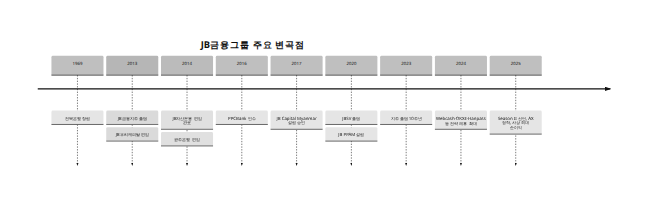

> 원본 파일: `D3e. gpt5.5 xhigh. 20260630_JB금융그룹과_계열사_심층_프로필.docx`
> 회수 2026-06-30 · ⚠️ 대외비 · 사용 모델: GPT-5.5 xhigh (Deep Research)

---

# JB금융그룹과 계열사 심층 프로필

## 핵심 요약

JB금융그룹은 2013년 전북은행을 모태로 지주회사 체제로 출범한 뒤, JB우리캐피탈과 JB자산운용을 2013~2014년에 편입하고, 2014년 광주은행을 인수해 호남 기반의 양대 지방은행 체제를 완성한 금융그룹이다. 이후 2016년 캄보디아 PPCBank 인수, 2017년 JB Capital Myanmar 설립, 2020년 베트남 증권사 JBSV 출범, 2020년 캄보디아 JB PPAM 설립으로 해외 네트워크를 확장하면서 국내 지방은행 중심 포트폴리오를 “은행+캐피탈+자산운용+벤처투자+해외” 구조로 다각화했다. JB금융은 공식적으로 전북은행·광주은행·JB우리캐피탈·JB자산운용·JB인베스트먼트와 해외 PPCBank·JBSV·JBCM·JB PPAM을 현재 핵심 계열로 제시하고 있으며, 본 보고서도 그 범위를 따른다. 사용자의 요청에 따라 Finnq는 JB 계열로 표기하지 않았다. [\[1\]](https://kind.krx.co.kr/external/2024/06/28/000623/20240628001483/2023%20JB%EA%B8%88%EC%9C%B5%EA%B7%B8%EB%A3%B9%20%ED%86%B5%ED%95%A9%EC%97%B0%EC%B0%A8%EB%B3%B4%EA%B3%A0%EC%84%9C%28%EA%B5%AD%EB%AC%B8%29.pdf)

그룹 차원에서 보면, 2021년 지배지분순이익 5,066억원에서 2024년 6,775억원, 2025년 7,104억원으로 이익 체력이 한 단계 더 상승했다. 2024년 연결총자산은 66.7조원, 2025년 말 총자산은 73.1조원으로 공식 재무정보상 확인되며, 수익성 지표도 2021년 ROE 12.8%·ROA 0.96%, 2022년 ROE 13.9%·ROA 1.05%, 2023년 ROE 12.1%·ROA 0.99%, 2024년 ROE 13.0%·ROA 1.06%로 업종 상위 수준을 유지했다. 2025년에는 총자본비율 14.71%, CET1 12.58%를 공시했고, 2026년 초 회사는 “최근 PBR 1배 돌파”를 대외적으로 언급했다. [\[2\]](https://www.jbfg.com/ko/prcenter/press/detail/922.do)

파트너 소개 관점에서 JB금융의 핵심 포인트는 세 가지다. 첫째, 전북은행과 광주은행이 호남 기반이지만 수도권·충청권·외국인 금융·지역 SME 금융에서 차별화된 지위를 갖고 있다는 점이다. 둘째, JB우리캐피탈이 자동차금융·기업금융·구조화금융에서 그룹 내 비은행 축의 실질적 성장엔진으로 자리 잡았다는 점이다. 셋째, PPCBank·JBSV·JBCM·JB PPAM으로 이어지는 동남아 플랫폼이 단순 지점 설치가 아니라 현지 자회사 중심 운영이라는 점이다. 특히 2025년에는 JB우리캐피탈이 2,815억원으로 그룹 내 최대 이익 기여 계열사로 부상했다. [\[3\]](https://www.jbfg.com/ko/about/network.do)

## 그룹 개관과 성장 축

JB금융그룹은 공식 소개에서 2024년 말 기준 임직원 4,650명, 연결총자산 66.7조원 규모의 종합금융그룹이라고 밝히고 있다. 2024년 말 기준 국내·해외 합산 영업거점은 278개이며, 이 가운데 국내 228개, 해외 50개다. 국내에서는 JB금융지주 2, 전북은행 83, 광주은행 119, JB우리캐피탈 17, JB자산운용 2, JB인베스트먼트 2의 거점을 보유하고, 해외에서는 PPCBank 25, JB PPAM 1, JBCM 23, JBSV 1의 거점을 운영한다. 이는 지방금융지주 가운데 상대적으로 넓은 해외 실물 네트워크를 의미한다. [\[4\]](https://www.jbfg.com/ko/about/group.do)

### 지주 출범 이후의 변곡점

공식 연혁상 JB금융은 2013년 7월 전북은행의 포괄적 주식이전을 통해 출범했고, 같은 해 11월 JB우리캐피탈을 편입했다. 2014년 3월 JB자산운용 자회사 편입을 완료했고, 2014년 10월 광주은행을 편입해 그룹의 외형과 수익구조를 한 단계 확장했다. 2016년에는 PPCBank를 인수했고, 2017년에는 JB Capital Myanmar 설립 승인을 받았다. 2020년에는 베트남의 Morgan Stanley Gateway Securities를 인수·리브랜딩해 JBSV를 출범시켰고, 같은 시기 캄보디아에 JB PPAM을 설립했다. 2023년은 지주 출범 10주년이었고, 2024년 이후에는 Webcash·OKXE·Hanpass 등과의 전략적 제휴, 2025년 ‘Season II’와 AX 정착 메시지 등으로 성장전략의 무게중심이 “양적 확장”에서 “수익성 기반 질적 고도화”로 이동하고 있다. [\[5\]](https://www.jbfg.com/ko/about/history.do)

|  |
|:--:|
|  |

### 그룹 포트폴리오와 수익구조 변화

JB금융은 여전히 전북은행·광주은행의 은행축이 그룹의 신용도와 자본구조를 지탱하지만, 실적 드라이버는 시간이 갈수록 비은행 쪽으로 이동했다. 2021년 상반기 공식 보도자료에서 회사는 “은행 성장, 비은행 약진”을 직접 강조했고, 2022년 이후 JB우리캐피탈의 기여도가 꾸준히 상승했다. 2025년에는 JB우리캐피탈이 2,815억원의 순이익을 내며 전북은행과 광주은행을 제치고 그룹 내 최대 이익 기여 계열사로 자리 잡았다. 이는 JB금융이 전통적인 지방은행 지주에서 “고수익 캐피탈을 보유한 지역기반 종합금융그룹”으로 성격이 바뀌었음을 보여준다. [\[6\]](https://www.jbfg.com/ko/prcenter/press/detail/893.do)

### 그룹 시계열

\<table\> \<thead\> \<tr\> \<th\>연도\</th\> \<th\>총자산\</th\> \<th\>대출채권\</th\> \<th\>예수금\</th\> \<th\>순이익\</th\> \<th\>ROE\</th\> \<th\>ROA\</th\> \<th\>NIM\</th\> \<th\>BIS/CET1\</th\> \<th\>연체율\</th\> \<th\>NPL\</th\> \<th\>비고\</th\> \</tr\> \</thead\> \<tbody\> \<tr\> \<td\>2021\</td\> \<td\>56.39조원\</td\> \<td\>미공시\</td\> \<td\>미공시\</td\> \<td\>5,066억원\</td\> \<td\>12.8%\</td\> \<td\>0.96%\</td\> \<td\>미공시\</td\> \<td\>CET1 10.30%\</td\> \<td\>미공시\</td\> \<td\>미공시\</td\> \<td\>1차 확인범위 기준\</td\> \</tr\> \<tr\> \<td\>2022\</td\> \<td\>59.83조원\</td\> \<td\>47.15조원\</td\> \<td\>미공시\</td\> \<td\>6,010억원\</td\> \<td\>13.9%\</td\> \<td\>1.05%\</td\> \<td\>미공시\</td\> \<td\>CET1 11.39%\</td\> \<td\>0.58%\</td\> \<td\>0.59%\</td\> \<td\>대출채권은 공시 Balance Sheet 기준\</td\> \</tr\> \<tr\> \<td\>2023\</td\> \<td\>63.40조원\</td\> \<td\>49.27조원\</td\> \<td\>미공시\</td\> \<td\>5,860억원\</td\> \<td\>12.1%\</td\> \<td\>0.99%\</td\> \<td\>미공시\</td\> \<td\>CET1 12.17%\</td\> \<td\>미공시\</td\> \<td\>미공시\</td\> \<td\>대출채권은 공시 Balance Sheet 기준\</td\> \</tr\> \<tr\> \<td\>2024\</td\> \<td\>66.72조원\</td\> \<td\>52.12조원\</td\> \<td\>미공시\</td\> \<td\>6,775억원\</td\> \<td\>13.0%\</td\> \<td\>1.06%\</td\> \<td\>미공시\</td\> \<td\>CET1 12.20%\</td\> \<td\>미공시\</td\> \<td\>미공시\</td\> \<td\>홈페이지 Highlight와 공시 병기\</td\> \</tr\> \<tr\> \<td\>2025\</td\> \<td\>73.12조원\</td\> \<td\>56.46조원\</td\> \<td\>미공시\</td\> \<td\>7,104억원\</td\> \<td\>미공시\</td\> \<td\>미공시\</td\> \<td\>미공시\</td\> \<td\>BIS 14.71% / CET1 12.58%\</td\> \<td\>미공시\</td\> \<td\>미공시\</td\> \<td\>2026년 공시 기준 2025년 말\</td\> \</tr\> \</tbody\> \</table\>

자료원:\
`https://www.jbfg.com/ko/prcenter/press/detail/922.do` (2022-02-11, 1차),\
`https://www.jbfg.com/ko/prcenter/press/detail/996.do` (2023-02-09, 1차),\
`https://www.jbfg.com/ko/prcenter/press/detail/1074.do` (2024-02-06, 1차),\
`https://www.jbfg.com/ko/prcenter/press/detail/1177.do` (2025-02-06, 1차),\
`https://www.jbfg.com/ko/prcenter/press/detail/20.do` (2026-02-05, 1차),\
`https://www.jbfg.com/en/ir/finance/balance.do` 또는 공식 IR 미러 `https://ir.gsifn.io/jbfg/fn2_balance.html?koreng=2` (검색상 확인, 1차),\
`https://kind.krx.co.kr/common/disclsviewer.do?acptno=20260325001141&docno=&method=search&viewerhost=` (2026-03-25, 1차),\
`https://www.jbfg.com/ko/about/group.do` (2026년 현재 노출 페이지, 1차). 수치는 웹 가시성 범위에서만 기입했으며, 미공시·비가시 항목은 “미공시”로 표기했다. [\[7\]](https://www.jbfg.com/ko/prcenter/press/detail/922.do)

### 지주 주가와 주주 관련 지표

공식 주가정보 페이지에서 2026년 6월 30일 15:04 기준 JB금융지주 주가는 24,750원, 시가총액은 4조6,593억원, 외국인지분율은 34.12%로 확인된다. 2026년 3월과 5월 회사 보도자료에서는 “최근 PBR 1배 돌파” 및 가치제고 계획의 연속 이행을 강조했다. 다만 2021~2025년 말 기준 연도별 종가·시가총액·PBR·외국인지분율의 완전한 시계열은 공식 웹페이지에서 기계판독 가능한 형태로 전량 확보되지 않아, 본 보고서는 1차 원칙을 지키기 위해 검증 가능한 시점만 기입하고 나머지는 미기재했다. [\[8\]](https://ir.gsifn.io/jbfg/ir2_current.html?koreng=1)

\<table\> \<thead\> \<tr\> \<th\>항목\</th\> \<th\>공식 확인치\</th\> \<th\>출처 URL / 발행일 / 신뢰도\</th\> \</tr\> \</thead\> \<tbody\> \<tr\> \<td\>주가\</td\> \<td\>24,750원\</td\> \<td\>\<code\>https://ir.gsifn.io/jbfg/ir2_current.html?koreng=1\</code\>\<br\>2026-06-30 기준 페이지 / 1차\</td\> \</tr\> \<tr\> \<td\>시가총액\</td\> \<td\>4조6,593억원\</td\> \<td\>\<code\>https://ir.gsifn.io/jbfg/ir2_current.html?koreng=1\</code\>\<br\>2026-06-30 기준 페이지 / 1차\</td\> \</tr\> \<tr\> \<td\>외국인지분율\</td\> \<td\>34.12%\</td\> \<td\>\<code\>https://ir.gsifn.io/jbfg/ir2_current.html?koreng=1\</code\>\<br\>2026-06-30 기준 페이지 / 1차\</td\> \</tr\> \<tr\> \<td\>PBR\</td\> \<td\>정확 수치 미가시 / “최근 1배 돌파” 확인\</td\> \<td\>\<code\>https://www.jbfg.com/ko/prcenter/press/detail/24.do\</code\>\<br\>2026-03-05 / 1차\</td\> \</tr\> \</tbody\> \</table\>

## 국내 은행 축

### 전북은행

전북은행은 1969년 창립된 JB금융의 모태 회사다. 그룹 공식 연혁상 2013년 JB금융지주가 전북은행의 포괄적 주식이전 방식으로 출범했고, 전북은행은 핵심 은행 자회사로 재편되었다. 2014년에는 광주은행 편입 이전까지 그룹의 사실상 단독 모은행 역할을 수행했으며, 이후에도 전북 지역 기반을 넘어 서울·수도권과 대전·세종권까지 영업권을 확장해 왔다. 2024년 사업보고서에서는 2021년 저축은행중앙회 연계대출 협약, 마이데이터 본허가 획득, 네이버파이낸셜과의 디지털 협력 등 디지털 확장을 주요 이력으로 제시한다. [\[9\]](https://www.jbfg.com/ko/about/group.do)

사업 구조는 전형적인 지방은행이지만, 상품 포트폴리오는 보다 넓다. 공식 홈페이지 기준으로 예금·적금, 신용·담보대출, 외환, 해외송금, 외화예금, 연금·신탁, 펀드, 방카슈랑스까지 폭넓게 제공한다. 특히 외국인 전용 대출상담 라인, 캄보디아 실시간 송금, Wing 송금, 글로벌 자동송금 등은 지방은행 평균 대비 전북은행의 외국인·해외송금 특화 이미지를 보여준다. 실제로 JB금융그룹은 외국인 금융을 그룹 차원의 미래성장 축으로 제시하고 있다. [\[10\]](https://www.jbbank.co.kr/ibmanagements.act)

시장지위 측면에서 전북은행의 가장 큰 강점은 “지역은행이지만 지역에만 갇히지 않았다”는 점이다. 공식 경영현황 공개보고서 검색 스니펫에 따르면 2025년 말 총임직원 수는 1,439명이며, 영업점은 국내 82개와 해외 거점으로 구성된다. 그룹 홈 기준으로는 총 83개 거점으로 집계된다. 2025년 말 총자산은 24조4,877억원으로 제시된다. 지방은행 가운데 상대적으로 높은 NIM을 유지해 온 점은 한국신용평가 자료에서도 반복적으로 지적된다. [\[11\]](https://m.kfb.or.kr/include/download.php?enc_para=zf6bobgSfc2vx2XiqHLAI%2ADU3SPrRez5Y%2FtzuSJh0WsLvxqEpQ5DxEne)

전북은행의 차별화 포인트는 세 가지로 정리된다. 첫째, 호남 기반이지만 서울·수도권과 충청권까지 확장한 다지역 영업망이다. 둘째, 외국인 금융과 해외송금 경험이다. 셋째, 중·저신용자와 SME 영역에서 높은 마진을 확보하는 구조다. KIS Rating은 전북은행이 지방은행 평균 대비 높은 NIM과 ROA를 유지해 왔다고 평가했다. 다만 2024~2025년에는 금리 하락 기조와 대환대출 경쟁, 지역 부동산·중소기업 경기 영향으로 건전성 부담도 함께 커졌다. [\[12\]](https://m.kisrating.com/fileDown.do?fileName=rs20241230-31.pdf&gubun=2&menuCd=R8)

\<table\> \<thead\> \<tr\> \<th\>전북은행\</th\> \<th\>2021\</th\> \<th\>2022\</th\> \<th\>2023\</th\> \<th\>2024\</th\> \<th\>2025\</th\> \</tr\> \</thead\> \<tbody\> \<tr\>\<td\>총자산\</td\>\<td\>미공시\</td\>\<td\>미공시\</td\>\<td\>22.83조원\<br\>별도\</td\>\<td\>23.53조원\<br\>별도\</td\>\<td\>24.49조원\</td\>\</tr\> \<tr\>\<td\>여신\</td\>\<td\>미공시\</td\>\<td\>16.9조원\</td\>\<td\>17.2조원\</td\>\<td\>미공시\</td\>\<td\>미공시\</td\>\</tr\> \<tr\>\<td\>예수금\</td\>\<td\>미공시\</td\>\<td\>미공시\</td\>\<td\>미공시\</td\>\<td\>미공시\</td\>\<td\>미공시\</td\>\</tr\> \<tr\>\<td\>순이익\</td\>\<td\>미공시\</td\>\<td\>\[추정\] 1,770억원\</td\>\<td\>1,726억원\</td\>\<td\>1,834억원\</td\>\<td\>2,287억원\</td\>\</tr\> \<tr\>\<td\>ROE\</td\>\<td\>미공시\</td\>\<td\>미공시\</td\>\<td\>미공시\</td\>\<td\>미공시\</td\>\<td\>미공시\</td\>\</tr\> \<tr\>\<td\>ROA\</td\>\<td\>미공시\</td\>\<td\>미공시\</td\>\<td\>미공시\</td\>\<td\>미공시\</td\>\<td\>미공시\</td\>\</tr\> \<tr\>\<td\>NIM\</td\>\<td\>미공시\</td\>\<td\>미공시\</td\>\<td\>2.77%\</td\>\<td\>미공시\</td\>\<td\>미공시\</td\>\</tr\> \<tr\>\<td\>BIS\</td\>\<td\>미공시\</td\>\<td\>미공시\</td\>\<td\>미공시\</td\>\<td\>15.11%\</td\>\<td\>16.0%\</td\>\</tr\> \<tr\>\<td\>연체율\</td\>\<td\>미공시\</td\>\<td\>미공시\</td\>\<td\>미공시\</td\>\<td\>\[추정\] 1.09%\</td\>\<td\>1.46%\</td\>\</tr\> \<tr\>\<td\>NPL\</td\>\<td\>미공시\</td\>\<td\>미공시\</td\>\<td\>미공시\</td\>\<td\>미공시\</td\>\<td\>1.12%\</td\>\</tr\> \</tbody\> \</table\>

자료원:\
`https://kind.krx.co.kr/common/disclsviewer.do?acptno=20250311000987&docno=&method=search&viewerhost=` (2025-03-14, 1차; 2024·2023 별도자산 및 2024 순이익),\
`https://www.jbfg.com/ko/prcenter/press/detail/20.do` (2026-02-05, 1차; 2025 순이익),\
`https://m.kfb.or.kr/include/download.php?enc_para=zf6bobgSfc2vx2XiqHLAI%2ADU3SPrRez5Y%2FtzuSJh0WsLvxqEpQ5DxEne` (검색 스니펫 기준, 2026-05-29 접수, 1차; 2025 총자산·임직원수),\
`https://kind.krx.co.kr/external/2024/06/28/000623/20240628001483/2023%20JB금융그룹%20통합연차보고서(국문).pdf` (2024-06-27, 1차; 2023 여신·순이익),\
`https://kind.krx.co.kr/external/2023/07/27/000861/20230727001547/2022%20JB금융그룹%20통합연차보고서(국문).pdf` (2023-07-27, 1차; 2022 여신),\
`https://m.kisrating.com/fileDown.do?fileName=rs20241230-31.pdf&gubun=2&menuCd=R8` (2024-12-30, 2차; 2023 NIM),\
`https://m.kisrating.com/fileDown.do?fileName=rs20260430-24.pdf&gubun=2&menuCd=R8` (2026-04-30, 2차; 2025 BIS),\
`https://kind.krx.co.kr/external/2026/06/04/000755/20260604002000/10120.htm` 및 `.../10603.htm` (2026-06-04, 1차; 2025 연체율·NPL). 2022 순이익은 2023년 순이익이 전년 대비 2.5% 감소했다는 2차 자료를 역산한 \[추정\]치다. [\[13\]](https://kind.krx.co.kr/external/2025/03/14/001381/20250311000987/91567.htm)

### 광주은행

광주은행은 1968년 9월 창립총회, 1968년 11월 영업개시, 1968년 말 광주시 금고업무 취급, 1973년 한국증권거래소 상장으로 이어지는 역사를 가진 호남 대표 지방은행이다. 광주은행 금융박물관과 연혁 자료는 광주은행이 지역 상공인·지자체·시민금융을 기반으로 성장한 전형적인 지역은행임을 보여준다. 2014년 광주은행이 JB금융지주에 편입되면서, JB는 전북과 광주·전남을 아우르는 호남권 양축 은행 체제를 구축했다. [\[14\]](https://museum.kjbank.com/page_h/history.php?hs=history_70)

광주은행의 정체성은 “광주·전남 대표 은행”이라는 공식 슬로건으로 요약된다. 조직과 상품은 일반 소매금융, SME·법인금융, 공공금고·지자체 기반 거래, 디지털뱅킹을 포괄한다. 공식 사이트는 은행소개 하위에 연혁·조직도·CEO 인사말을 두고 “최고의 종합금융서비스를 통하여 고객과 사회를 보다 풍요롭게 하겠다”는 메시지를 전면에 배치한다. 이는 단순한 지역은행이 아니라 지역종합금융 파트너를 자임하는 포지셔닝이다. [\[15\]](https://www.kjbank.com/banking/homepage/index.jsp)

규모 측면에서 광주은행은 그룹 내에서 전북은행보다 더 큰 지역밀착 점포망을 갖는다. JB금융그룹 공식 페이지 기준 2024년 말 광주은행의 거점 수는 119개다. 그룹 내 수익 기여도 역시 높다. 2023년 순이익은 2,397억원, 2025년 순이익은 2,726억원으로 확인되며, 2024년 순이익은 2025년 실적과 감소율을 역산하면 약 2,886억원 수준으로 추정된다. 2024년 말 BIS총자본비율은 15.04%, 2025년 NPL은 0.89%, 연체율은 1.01%로 공시성 자료에서 확인된다. [\[16\]](https://www.jbfg.com/ko/main.do)

광주은행의 강점은 지역 리테일·중소기업금융·정책성 자금 집행 경험과, 지역 고소득 리테일 및 우량 중소기업 고객기반의 균형이다. 2023년 통합연차보고서 스니펫에 따르면 광주은행의 2023년 원화대출금은 22.7조원으로 전년 대비 5.6% 증가했으며, 우량 중소기업과 대기업 중심 기업대출이 성장을 이끌었다. 즉, 광주은행은 단순히 “지역은행”이 아니라 지역 내 우량 기업금융 축을 보유한 은행으로 보는 편이 맞다. [\[17\]](https://kind.krx.co.kr/external/2024/06/28/000623/20240628001483/2023%20JB%EA%B8%88%EC%9C%B5%EA%B7%B8%EB%A3%B9%20%ED%86%B5%ED%95%A9%EC%97%B0%EC%B0%A8%EB%B3%B4%EA%B3%A0%EC%84%9C%28%EA%B5%AD%EB%AC%B8%29.pdf)

\<table\> \<thead\> \<tr\> \<th\>광주은행\</th\> \<th\>2021\</th\> \<th\>2022\</th\> \<th\>2023\</th\> \<th\>2024\</th\> \<th\>2025\</th\> \</tr\> \</thead\> \<tbody\> \<tr\>\<td\>총자산\</td\>\<td\>미공시\</td\>\<td\>미공시\</td\>\<td\>미공시\</td\>\<td\>미공시\</td\>\<td\>미공시\</td\>\</tr\> \<tr\>\<td\>여신\</td\>\<td\>미공시\</td\>\<td\>\[추정\] 21.5조원\</td\>\<td\>22.7조원\</td\>\<td\>미공시\</td\>\<td\>미공시\</td\>\</tr\> \<tr\>\<td\>예수금\</td\>\<td\>미공시\</td\>\<td\>미공시\</td\>\<td\>미공시\</td\>\<td\>미공시\</td\>\<td\>미공시\</td\>\</tr\> \<tr\>\<td\>순이익\</td\>\<td\>미공시\</td\>\<td\>미공시\</td\>\<td\>2,397억원\</td\>\<td\>\[추정\] 2,886억원\</td\>\<td\>2,726억원\</td\>\</tr\> \<tr\>\<td\>ROE\</td\>\<td\>미공시\</td\>\<td\>미공시\</td\>\<td\>미공시\</td\>\<td\>미공시\</td\>\<td\>미공시\</td\>\</tr\> \<tr\>\<td\>ROA\</td\>\<td\>미공시\</td\>\<td\>미공시\</td\>\<td\>미공시\</td\>\<td\>미공시\</td\>\<td\>미공시\</td\>\</tr\> \<tr\>\<td\>NIM\</td\>\<td\>미공시\</td\>\<td\>미공시\</td\>\<td\>미공시\</td\>\<td\>미공시\</td\>\<td\>미공시\</td\>\</tr\> \<tr\>\<td\>BIS\</td\>\<td\>미공시\</td\>\<td\>미공시\</td\>\<td\>미공시\</td\>\<td\>15.04%\</td\>\<td\>미공시\</td\>\</tr\> \<tr\>\<td\>연체율\</td\>\<td\>미공시\</td\>\<td\>미공시\</td\>\<td\>미공시\</td\>\<td\>\[추정\] 0.69%\</td\>\<td\>1.01%\</td\>\</tr\> \<tr\>\<td\>NPL\</td\>\<td\>미공시\</td\>\<td\>미공시\</td\>\<td\>미공시\</td\>\<td\>미공시\</td\>\<td\>0.89%\</td\>\</tr\> \</tbody\> \</table\>

자료원:\
`https://museum.kjbank.com/page_h/history.php?hs=history_70` (상시 페이지, 1차; 설립 연혁),\
`https://www.jbfg.com/ko/about/history.do` (상시 페이지, 1차; 2014 편입),\
`https://kind.krx.co.kr/external/2024/06/28/000623/20240628001483/2023%20JB금융그룹%20통합연차보고서(국문).pdf` (2024-06-27, 1차; 2023 여신·순이익),\
`https://www.jbfg.com/ko/prcenter/press/detail/20.do` (2026-02-05, 1차; 2025 순이익),\
`https://kind.krx.co.kr/external/2025/05/12/000670/20250512001634/10120.htm` (2025-05-12, 1차; 2024 BIS),\
`https://kind.krx.co.kr/external/2026/06/04/000755/20260604002000/10120.htm` 및 `.../10603.htm` (2026-06-04, 1차; 2025 연체율·NPL),\
`https://news.dealsitetv.com/articles/165151` (2026-02, 2차; 2025 광주은행 순이익 전년 대비 5.5% 감소). 2022 여신과 2024 순이익·연체율은 각각 2023 증가율·2025 증가폭을 역산한 \[추정\]치다. [\[18\]](https://museum.kjbank.com/page_h/history.php?hs=history_70)

## 비은행 국내 축

### JB우리캐피탈

JB우리캐피탈은 JB금융의 비은행 포트폴리오를 상징하는 핵심 회사다. 그룹 공식 소개에 따르면 1995년 12월 7일 설립됐고, 2013년 11월 JB금융지주에 편입되었다. 같은 연혁 페이지에는 2013년 전주로 본점 이전, 2014년 두 차례 유상증자 2,700억원, 2014년 회사채 신용등급 A+에서 AA- 상향 등 변곡점이 기록돼 있다. 즉, JB우리캐피탈의 본격적 도약은 단순한 계열 편입이 아니라, 지주 편입 직후 대규모 자본 확충과 조달여건 개선이 결합되면서 시작되었다. [\[19\]](https://www.jbfg.com/ko/about/network.do)

사업 영역은 공식 홈페이지 메뉴만 봐도 비교적 명확하다. 개인금융에서는 자동차담보대출·신용대출·대환대출·내구재할부, 자동차금융에서는 중고차대출·리스·장기렌터카, 부동산금융에서는 주택담보대출, 기업금융에서는 일반대출·PF대출·메자닌·신기술금융·PEF·M&A인수금융·구조화금융까지 제공한다. 다시 말해 JB우리캐피탈은 단순 오토캐피탈이 아니라, 리테일과 코퍼릿·IB가 결합된 다기능 여전사다. [\[20\]](https://www.wooricap.com/)

최근 수익구조는 자동차금융과 기업금융의 투트랙이다. 2025년 9월 투자설명서 스니펫은 JB우리캐피탈이 2017년부터 자동차 할부금융·리스·렌터카 영업력을 유지했고, 동시에 중고차금융과 기업금융을 넓혀왔다고 기술한다. 2025년 업계 기사에서는 JB우리캐피탈이 외국인 대상 중고차금융 시장에서 선두적 위치를 공고히 했다고 평가된다. 이 조합은 JB금융이 외국인 금융, 차량금융, 대체적 기업여신을 한데 묶어 성장시키는 구조를 잘 보여준다. [\[21\]](https://kind.krx.co.kr/external/2025/09/29/000540/20250929001280/10603.htm)

규모와 기여도 측면에서 JB우리캐피탈은 사실상 그룹의 세 번째 축이 아니라 “은행과 병렬인 축”에 가깝다. 2024년 말 기준 그룹 페이지상 영업거점은 17개이고, 2025년 순이익은 2,815억원으로 그룹 계열사 중 1위였다. 2025년 반기·분기 기준 실적도 꾸준히 상향 흐름을 보였고, 2024년 순이익은 2,239억원으로 추정된다. 2차 리포트 기준으로는 2021~2023년 당기순이익이 1,704억원→1,776억원→1,910억원 수준으로 안정 성장했다. [\[22\]](https://www.jbfg.com/ko/main.do)

JB우리캐피탈의 강점은 고마진 상품만이 아니라 “포트폴리오 재배치 능력”이다. 자동차금융, 리테일신용, 부동산PF, 기업금융, 메자닌, 구조화금융을 모두 영위하면서 경기국면에 따라 상대적으로 수익성이 높은 세그먼트로 자산을 이동할 수 있다. 동시에 JB금융 계열 은행들과의 소싱 연계, 지방은행이 접근하기 어려운 여전·IB형 자산을 그룹 내부에서 소화할 수 있다는 점이 구조적 강점이다. [\[23\]](https://www.wooricap.com/)

\<table\> \<thead\> \<tr\> \<th\>JB우리캐피탈\</th\> \<th\>2021\</th\> \<th\>2022\</th\> \<th\>2023\</th\> \<th\>2024\</th\> \<th\>2025\</th\> \</tr\> \</thead\> \<tbody\> \<tr\>\<td\>총자산\</td\>\<td\>미공시\</td\>\<td\>미공시\</td\>\<td\>미공시\</td\>\<td\>미공시\</td\>\<td\>미공시\</td\>\</tr\> \<tr\>\<td\>여신\</td\>\<td\>미공시\</td\>\<td\>미공시\</td\>\<td\>미공시\</td\>\<td\>미공시\</td\>\<td\>미공시\</td\>\</tr\> \<tr\>\<td\>예수금\</td\>\<td\>해당없음\</td\>\<td\>해당없음\</td\>\<td\>해당없음\</td\>\<td\>해당없음\</td\>\<td\>해당없음\</td\>\</tr\> \<tr\>\<td\>순이익\</td\>\<td\>1,704억원\</td\>\<td\>1,776억원\</td\>\<td\>1,910억원\</td\>\<td\>\[추정\] 2,239억원\</td\>\<td\>2,815억원\</td\>\</tr\> \<tr\>\<td\>ROE\</td\>\<td\>미공시\</td\>\<td\>미공시\</td\>\<td\>미공시\</td\>\<td\>미공시\</td\>\<td\>미공시\</td\>\</tr\> \<tr\>\<td\>ROA\</td\>\<td\>미공시\</td\>\<td\>미공시\</td\>\<td\>미공시\</td\>\<td\>미공시\</td\>\<td\>미공시\</td\>\</tr\> \<tr\>\<td\>NIM\</td\>\<td\>해당없음\</td\>\<td\>해당없음\</td\>\<td\>해당없음\</td\>\<td\>해당없음\</td\>\<td\>해당없음\</td\>\</tr\> \<tr\>\<td\>BIS\</td\>\<td\>여전사 조정자기자본비율 체계\</td\>\<td\>여전사 조정자기자본비율 체계\</td\>\<td\>여전사 조정자기자본비율 체계\</td\>\<td\>미공시\</td\>\<td\>미공시\</td\>\</tr\> \<tr\>\<td\>연체율\</td\>\<td\>미공시\</td\>\<td\>미공시\</td\>\<td\>미공시\</td\>\<td\>미공시\</td\>\<td\>미공시\</td\>\</tr\> \<tr\>\<td\>NPL\</td\>\<td\>미공시\</td\>\<td\>미공시\</td\>\<td\>미공시\</td\>\<td\>미공시\</td\>\<td\>미공시\</td\>\</tr\> \</tbody\> \</table\>

자료원:\
`https://www.jbfg.com/ko/about/network.do` (상시 페이지, 1차; 설립일·회사 성격),\
`https://www.jbfg.com/ko/about/history.do` (상시 페이지, 1차; 2013~2014 변곡점),\
`https://www.wooricap.com/` (상시 페이지, 1차; 상품 포트폴리오),\
`https://kind.krx.co.kr/common/disclsviewer.do?acptno=20251114002537&docno=&method=search&viewerhost=` (2025-11-14, 1차; 자본조달 히스토리),\
`https://www.jbfg.com/ko/prcenter/press/detail/20.do` (2026-02-05, 1차; 2025 순이익),\
`https://stock.pstatic.net/stock-research/debenture/57/20240524_debenture_265697000.pdf` (2024-05-24, 2차; 2021~2023 순이익),\
`https://v.daum.net/v/3Y4lTypXyQ` (2026-02, 2차; 2024→2025 증가율). 2024 순이익은 2025년 수익과 전년 대비 증가율을 이용한 \[추정\]이다. [\[24\]](https://www.jbfg.com/ko/about/network.do)

### JB자산운용

JB자산운용은 그룹 내 자산운용 전문회사로, 공식 회사개요상 2008년 3월 6일 설립됐다. 2025년 12월 기준 자본금은 277.2억원, 운용자산(AUM)은 6조3,492억원이다. 그룹은 JB자산운용을 “국내 해외자원 펀드 업계 1위”라고 포지셔닝하며, 이는 JB자산운용의 정체성이 전통자산 운용사라기보다 대체투자·에너지·자원 특화 운용사에서 출발했음을 시사한다. [\[25\]](https://www.jbam.co.kr/about/company)

사업영역은 공식 사이트 기준으로 증권, 부동산, 에너지·자원, 대체투자로 나뉜다. 증권은 주식·채권·구조화상품, 부동산은 국내외 상업용 빌딩·재간접펀드·LH주택리츠, 에너지·자원은 석유·가스 개발과 미드스트림, 신재생에너지 등을 언급하고 있다. 즉, JB자산운용은 부동산·인프라·에너지 테마를 강점으로 하는 실물연계형 운용사에 가깝다. [\[26\]](https://www.jbam.co.kr/)

그룹 내 역할은 두 가지다. 첫째, 그룹 자산관리와 대체투자 상품 역량의 허브다. 둘째, 해외확장의 파이프라인이다. JB PPAM이 전북은행 60%, JB자산운용 40% 지분 구조로 설립된 점은 JB자산운용이 해외 대체투자의 운영 파트너 역할을 실제로 수행한다는 뜻이다. [\[27\]](https://www.jbfg.com/en/about/network.do)

수익규모는 그룹 내에서는 작지만, 전략적 의미는 작지 않다. 2025년 JB금융의 공식 실적 발표에서 JB자산운용 순이익은 20억원으로 기재됐고, 2025년 3분기 누적 기준으로는 43억원이 언급된다. 절대 이익보다 중요한 것은 JB자산운용이 그룹 내 대체투자와 캄보디아 현지 운용 플랫폼 확장의 핵심이라는 점이다. [\[28\]](https://www.jbfg.com/ko/prcenter/press/detail/20.do)

\<table\> \<thead\> \<tr\> \<th\>JB자산운용\</th\> \<th\>2021\</th\> \<th\>2022\</th\> \<th\>2023\</th\> \<th\>2024\</th\> \<th\>2025\</th\> \</tr\> \</thead\> \<tbody\> \<tr\>\<td\>총자산\</td\>\<td\>미공시\</td\>\<td\>미공시\</td\>\<td\>미공시\</td\>\<td\>미공시\</td\>\<td\>미공시\</td\>\</tr\> \<tr\>\<td\>여신\</td\>\<td\>해당없음\</td\>\<td\>해당없음\</td\>\<td\>해당없음\</td\>\<td\>해당없음\</td\>\<td\>해당없음\</td\>\</tr\> \<tr\>\<td\>예수금\</td\>\<td\>해당없음\</td\>\<td\>해당없음\</td\>\<td\>해당없음\</td\>\<td\>해당없음\</td\>\<td\>해당없음\</td\>\</tr\> \<tr\>\<td\>순이익\</td\>\<td\>미공시\</td\>\<td\>미공시\</td\>\<td\>미공시\</td\>\<td\>미공시\</td\>\<td\>20억원\</td\>\</tr\> \<tr\>\<td\>ROE/ROA/NIM/BIS/연체율/NPL\</td\>\<td colspan="5"\>업권 특성상 요청지표 상당수 미적용 또는 1차 웹가시성 범위에서 미공시\</td\>\</tr\> \<tr\>\<td\>자본금\</td\>\<td colspan="4"\>-\</td\>\<td\>277.2억원\</td\>\</tr\> \<tr\>\<td\>AUM\</td\>\<td colspan="4"\>-\</td\>\<td\>6조3,492억원\</td\>\</tr\> \</tbody\> \</table\>

자료원:\
`https://www.jbam.co.kr/about/company` (상시 페이지, 1차; 설립일·자본금·AUM),\
`https://www.jbam.co.kr/philosophy/business` (상시 페이지, 1차; 사업영역),\
`https://www.jbfg.com/ko/prcenter/press/detail/20.do` (2026-02-05, 1차; 2025 순이익),\
`https://kind.krx.co.kr/common/disclsviewer.do?acptno=20251114002537&docno=&method=search&viewerhost=` 검색 스니펫 (2025-11-14, 1차; 2025년 3분기 누적 순이익 43억원). [\[29\]](https://www.jbam.co.kr/about/company)

### JB인베스트먼트

JB인베스트먼트는 그룹의 벤처투자·신기술금융 축이다. 공식 사이트는 회사를 “투자를 통해 더 좋은 세상을 만드는 벤처 캐피탈”로 소개하고 있으며, JB금융그룹 계열사로서 성장 가능성이 높은 벤처기업에 중점 투자한다고 명시한다. 2026년 5월 제이비프런티어펀드 2호 결성 등 최근 이력도 공개하고 있어, 비교적 활발한 펀드레이징과 신규투자 움직임이 이어지고 있음을 보여준다. [\[30\]](https://www.jbinvest.co.kr/about/)

사업 정체성은 “그룹의 전략투자 창”에 가깝다. 전통적인 금융회사로서 신기술사업금융업을 수행하면서, 그룹 차원의 미래사업 발굴과 벤처 생태계 접점을 담당한다. 팀 소개 페이지는 대표이사 이구욱과 투자전문인력 중심 구성을 보여주고, 펀드 프로필 페이지는 여의도 본점과 별도 연락체계를 제시한다. 즉 JB인베스트먼트는 소규모이지만 전문성 중심의 투자회사다. [\[31\]](https://www.jbinvest.co.kr/team/)

그룹 공식 홈은 JB인베스트먼트를 “신기술 및 신성장 사업발굴 주도” 회사로 소개한다. 이는 단순한 재무적 투자자(FI)를 넘어 전략적 신성장 탐색 기능을 요구받고 있음을 뜻한다. 2025년 순이익은 83억원으로 그룹 공식 실적 발표에서 확인된다. 2025년 3분기 누적 기준 61억원도 별도 스니펫에서 확인되므로, 하반기 이익이 상대적으로 컸던 것으로 해석된다. [\[32\]](https://www.jbfg.com/ko/about/group.do)

\<table\> \<thead\> \<tr\> \<th\>JB인베스트먼트\</th\> \<th\>2021\</th\> \<th\>2022\</th\> \<th\>2023\</th\> \<th\>2024\</th\> \<th\>2025\</th\> \</tr\> \</thead\> \<tbody\> \<tr\>\<td\>총자산\</td\>\<td\>미공시\</td\>\<td\>미공시\</td\>\<td\>미공시\</td\>\<td\>미공시\</td\>\<td\>미공시\</td\>\</tr\> \<tr\>\<td\>여신\</td\>\<td\>해당없음\</td\>\<td\>해당없음\</td\>\<td\>해당없음\</td\>\<td\>해당없음\</td\>\<td\>해당없음\</td\>\</tr\> \<tr\>\<td\>예수금\</td\>\<td\>해당없음\</td\>\<td\>해당없음\</td\>\<td\>해당없음\</td\>\<td\>해당없음\</td\>\<td\>해당없음\</td\>\</tr\> \<tr\>\<td\>순이익\</td\>\<td\>미공시\</td\>\<td\>미공시\</td\>\<td\>미공시\</td\>\<td\>미공시\</td\>\<td\>83억원\</td\>\</tr\> \<tr\>\<td\>ROE/ROA/NIM/BIS/연체율/NPL\</td\>\<td colspan="5"\>업권 특성상 요청지표 상당수 미적용 또는 1차 웹가시성 범위에서 미공시\</td\>\</tr\> \</tbody\> \</table\>

자료원:\
`https://www.jbinvest.co.kr/about/` (상시 페이지, 1차),\
`https://www.jbinvest.co.kr/team/` (상시 페이지, 1차),\
`https://www.jbfg.com/ko/prcenter/press/detail/20.do` (2026-02-05, 1차; 2025 순이익),\
`https://kind.krx.co.kr/common/disclsviewer.do?acptno=20251114002537&docno=&method=search&viewerhost=` 검색 스니펫 (2025-11-14, 1차; 2025년 3분기 누적 순이익 61억원). [\[33\]](https://www.jbinvest.co.kr/about/)

## 해외 확장 축

### PPCBank

PPCBank는 JB금융의 해외 확장 중 가장 실체가 분명한 자회사다. 공식 프로필에 따르면 2008년 캄보디아에서 설립되었고, 현재는 캄보디아 내 선도적 상업은행 중 하나로 소개된다. JB금융그룹 연혁과 계열사 소개에 따르면 2016년 JB금융 컨소시엄이 PPCBank를 인수했으며, 현재 지분은 전북은행 50%, JB우리캐피탈 10%가 그룹 측 지분이다. 2024년 프로필 PDF는 “2008년 캄보디아에 설립된 이후 왕국의 선도 상업은행 중 하나로 자리 잡았다”고 설명한다. [\[34\]](https://www.ppcbank.com.kh/wp-content/uploads/2025/05/PPCBank-profile_2024_NEW_FC.pdf)

사업 포트폴리오는 전형적인 상업은행이다. 공식 홈페이지는 개인·기업 고객용 예금, 대출, 송금, 카드, 디지털뱅킹을 제공하며, 코리아데스크를 통해 한국계 기업 및 교민금융도 지원한다. 캄보디아 현지 대중금융과 한국기업 지원을 동시에 수행하는 이중 포지션이 PPCBank의 실질적 강점이다. [\[35\]](https://www.ppcbank.com.kh/)

거점 규모는 그룹 공식 페이지상 25개 브랜치다. 2025년 순이익은 486억원으로 JB금융 공식 실적 발표에서 확인되며, 2024년 대비 27% 증가했다. PPCBank 2021 Annual Report 검색 스니펫에는 2021년 총자산 4,015,041백만KHR, 총부채 3,306,817백만KHR, 총자본 708,224백만KHR가 확인된다. 2024 Annual Report 검색 스니펫에는 2024년 총자산이 6.6%, 대출이 3%, 예금이 16.8% 증가했다고 제시된다. [\[36\]](https://www.jbfg.com/ko/main.do)

PPCBank는 그룹 해외 전략상 단순 지점이 아니라 “해외 은행 플랫폼”이다. 한국 JB금융의 외국인금융 전략, 캄보디아 현지 신용정보 공유 실험, JB PPAM과의 현지 연계 가능성 등을 감안하면, 앞으로도 그룹 해외이익에서 가장 중요한 기반은 PPCBank일 가능성이 높다. [\[37\]](https://www.jbfg.com/ko/prcenter/press/detail/1171.do)

\<table\> \<thead\> \<tr\> \<th\>PPCBank\</th\> \<th\>2021\</th\> \<th\>2022\</th\> \<th\>2023\</th\> \<th\>2024\</th\> \<th\>2025\</th\> \</tr\> \</thead\> \<tbody\> \<tr\>\<td\>총자산\</td\>\<td\>4,015,041백만KHR\</td\>\<td\>미공시\</td\>\<td\>미공시\</td\>\<td\>전년 대비 +6.6%\</td\>\<td\>미공시\</td\>\</tr\> \<tr\>\<td\>여신\</td\>\<td\>미공시\</td\>\<td\>미공시\</td\>\<td\>미공시\</td\>\<td\>전년 대비 +3.0%\</td\>\<td\>미공시\</td\>\</tr\> \<tr\>\<td\>예수금\</td\>\<td\>미공시\</td\>\<td\>미공시\</td\>\<td\>미공시\</td\>\<td\>전년 대비 +16.8%\</td\>\<td\>미공시\</td\>\</tr\> \<tr\>\<td\>순이익\</td\>\<td\>미공시\</td\>\<td\>미공시\</td\>\<td\>미공시\</td\>\<td\>\[추정\] 383억원\</td\>\<td\>486억원\</td\>\</tr\> \<tr\>\<td\>ROE/ROA/NIM/BIS/연체율/NPL\</td\>\<td colspan="5"\>공식 웹 가시성 범위에서 완전한 연도별 수치 미확보\</td\>\</tr\> \</tbody\> \</table\>

자료원:\
`https://www.ppcbank.com.kh/wp-content/uploads/2025/05/PPCBank-profile_2024_NEW_FC.pdf` (2025-05-19, 1차; 설립·회사 소개),\
`https://www.ppcbank.com.kh/` (상시 페이지, 1차; 상품 포트폴리오),\
`https://www.jbfg.com/en/about/network.do` (상시 페이지, 1차; 지분 구조),\
`https://www.jbfg.com/ko/prcenter/press/detail/20.do` (2026-02-05, 1차; 2025 순이익),\
`https://www.acledasecurities.com.kh/as/assets/listed_company/PPCB/FS-014-Annual%20Report%202021.pdf` 검색 스니펫 (2021-12-31, 1차; 2021 총자산),\
`https://www.ppcbank.com.kh/wp-content/uploads/2026/02/Annual-Report-2024.pdf` 검색 스니펫 (2026-02 게시, 1차; 2024 성장률). 2024 순이익은 2025년 전년 대비 27% 증가 문구를 역산한 \[추정\]치다. [\[38\]](https://www.ppcbank.com.kh/wp-content/uploads/2025/05/PPCBank-profile_2024_NEW_FC.pdf)

### JB증권베트남 JBSV

JBSV는 광주은행 100% 자회사 형태의 베트남 증권사다. JB금융 공식 보도자료에 따르면 JB금융은 2020년 베트남 소재 Morgan Stanley Gateway Securities를 인수한 후, 2020년 8월 ‘JB증권 베트남’으로 사명을 변경하고 공식 출범시켰다. 그룹은 JBSV를 베트남 금융시장에서 유망 투자기회를 발굴해 국내외 투자자와 연결하는 IB 중심 플랫폼으로 설명했다. [\[39\]](https://www.jbfg.com/ko/prcenter/press/detail/835.do)

공식 홈페이지는 JBSV를 “자본, 투자자, 기업을 연결하는 회사”라고 소개하며, 개인투자자 대상 브로커리지와 기업 대상 자문·딜 솔루션을 함께 제공한다고 밝힌다. LinkedIn 회사 소개에는 M&A, DCM·ECM, 프로젝트파이낸스, 브로커리지, 자기매매, 투자자문 라이선스가 명시돼 있다. 즉, JBSV는 소형 증권사이지만 “IB+브로커리지 겸업형”으로 설계되어 있다. [\[40\]](https://jbsv.com.vn/)

2023년과 2024년 그룹 통합연차보고서 검색 스니펫에 따르면, JBSV는 2020년 인수 직후 주로 IB 비즈니스에 집중하다가 2023년 하반기부터 브로커리지와 마진론까지 서비스 범위를 확장할 계획을 세웠고, 2024~2025년에는 실제로 재무공시·자본확충 공시·신용한도 계약 공시가 이어졌다. 이는 JBSV가 초기의 딜소싱 플랫폼에서 점차 현지 종합증권사로 진화하고 있다는 해석을 가능하게 한다. [\[41\]](https://www.ppcbank.com.kh/wp-content/uploads/2025/03/Annual-Report-2023-docs.pdf)

다만 JBSV는 국내 비상장 해외 자회사이므로, 요청된 2021~2025 연도별 총자산·ROE·ROA 등의 완전한 1차 시계열은 공개 웹 스니펫만으로는 충분히 검증되지 않았다. 공식 사이트에는 2024년·2025년 연간 및 분기 재무제표 공시가 올라와 있으나, 첨부파일 원문 수치 전체를 본 응답 환경에서 안전하게 추출하기 어려웠다. 따라서 정량표는 보수적으로 최소한만 반영한다. [\[42\]](https://jbsv.com.vn/disclosure-of-financial-statements-and-explanatory-report-on-the-variance-in-profit-after-tax-for-2025-1045)

\<table\> \<thead\> \<tr\> \<th\>JBSV\</th\> \<th\>2021\</th\> \<th\>2022\</th\> \<th\>2023\</th\> \<th\>2024\</th\> \<th\>2025\</th\> \</tr\> \</thead\> \<tbody\> \<tr\>\<td\>총자산\</td\>\<td\>미공시\</td\>\<td\>미공시\</td\>\<td\>미공시\</td\>\<td\>미공시\</td\>\<td\>미공시\</td\>\</tr\> \<tr\>\<td\>여신\</td\>\<td\>해당없음\</td\>\<td\>해당없음\</td\>\<td\>해당없음\</td\>\<td\>마진론 확장 단계\</td\>\<td\>미공시\</td\>\</tr\> \<tr\>\<td\>예수금\</td\>\<td\>해당없음\</td\>\<td\>해당없음\</td\>\<td\>해당없음\</td\>\<td\>해당없음\</td\>\<td\>해당없음\</td\>\</tr\> \<tr\>\<td\>순이익\</td\>\<td\>미공시\</td\>\<td\>미공시\</td\>\<td\>미공시\</td\>\<td\>미공시\</td\>\<td\>미공시\</td\>\</tr\> \<tr\>\<td\>ROE/ROA/NIM/BIS/연체율/NPL\</td\>\<td colspan="5"\>업권 특성 및 공개 제약으로 미공시\</td\>\</tr\> \</tbody\> \</table\>

자료원:\
`https://www.jbfg.com/ko/prcenter/press/detail/835.do` (2020-08-31, 1차; 출범·사명 변경),\
`https://jbsv.com.vn/` (상시 페이지, 1차; 회사 소개),\
`https://www.linkedin.com/company/jb-securities-vietnam` (상시 페이지, 2차; 라이선스 범위),\
`https://jbsv.com.vn/disclosure-of-financial-statements-and-explanatory-report-on-the-variance-in-profit-after-tax-for-2025-1045` (2026-03-24, 1차; 2025 재무제표 공시 존재),\
`https://jbsv.com.vn/disclosure-of-financial-statements-financial-safety-ratio-report-and-explanation-of-post-tax-profit-difference-for-the-year-2024-910` (2025-03-24, 1차; 2024 재무제표·안전성비율 공시 존재). [\[43\]](https://www.jbfg.com/ko/prcenter/press/detail/835.do)

### JB캐피탈미얀마 JBCM

JBCM은 JB우리캐피탈이 95.6% 지분을 보유한 미얀마 소액대출 자회사다. 그룹 공식 영문 계열사 소개는 JBCM을 “현지인에게 사랑받는 대표 마이크로파이낸스 기관”으로 소개하며, 2017년 3월 JB우리캐피탈의 현지 자회사 설립 승인을 주요 이정표로 제시한다. 초기 해외확장 문서와 증권사 자료는 JBCM이 미얀마 농촌·서민층 대상 소액대출 기능을 수행하는 회사라고 설명한다. [\[44\]](https://www.jbfg.com/en/about/network.do)

파트너 소개용 관점에서 JBCM의 의미는 규모보다 포지션에 있다. PPCBank가 상업은행 플랫폼이라면 JBCM은 미얀마 로컬 마이크로파이낸스 플랫폼이다. 그룹 공식 페이지 기준 JBCM 거점은 23개다. 해외 정치·거시 리스크가 크다는 점에서 공격적 확장보다는 보존적 운영이 합리적이지만, 현지 서민금융·소액대출 경험이라는 점에서 JB우리캐피탈의 해외 리테일금융 실험장 역할을 했다. [\[45\]](https://www.jbfg.com/ko/main.do)

정량 정보는 제한적이다. 공개 웹 가시성 범위에서 2021~2025 연도별 자산·순이익·건전성 지표를 완전하게 검증하기 어렵다. 따라서 아래 표는 “공개 확인 불가”를 원칙으로 두었다. 이는 1차 자료 우선 원칙에 따른 보수적 처리다. [\[46\]](https://www.jbfg.com/en/about/network.do)

\<table\> \<thead\> \<tr\> \<th\>JBCM\</th\> \<th\>2021\</th\> \<th\>2022\</th\> \<th\>2023\</th\> \<th\>2024\</th\> \<th\>2025\</th\> \</tr\> \</thead\> \<tbody\> \<tr\>\<td\>총자산\</td\>\<td\>미공시\</td\>\<td\>미공시\</td\>\<td\>미공시\</td\>\<td\>미공시\</td\>\<td\>미공시\</td\>\</tr\> \<tr\>\<td\>여신\</td\>\<td\>미공시\</td\>\<td\>미공시\</td\>\<td\>미공시\</td\>\<td\>미공시\</td\>\<td\>미공시\</td\>\</tr\> \<tr\>\<td\>예수금\</td\>\<td\>해당없음\</td\>\<td\>해당없음\</td\>\<td\>해당없음\</td\>\<td\>해당없음\</td\>\<td\>해당없음\</td\>\</tr\> \<tr\>\<td\>순이익\</td\>\<td\>미공시\</td\>\<td\>미공시\</td\>\<td\>미공시\</td\>\<td\>미공시\</td\>\<td\>미공시\</td\>\</tr\> \<tr\>\<td\>ROE/ROA/NIM/BIS/연체율/NPL\</td\>\<td colspan="5"\>공개 검증 가능한 1차 연도별 수치 미확보\</td\>\</tr\> \</tbody\> \</table\>

자료원:\
`https://www.jbfg.com/en/about/network.do` (상시 페이지, 1차; 지분율),\
`https://kind.krx.co.kr/common/disclsviewer.do?acptno=20260305001098&docno=&method=search&viewerhost=` (2026-03-05, 1차; 설립 관련 문구),\
`https://www.ppcbank.com.kh/wp-content/uploads/2021/10/2020_JB_Financial_Group_Integrated_Report.pdf` 검색 스니펫 (2021, 1차; 사업 성격 설명). [\[47\]](https://www.jbfg.com/en/about/network.do)

### JB프놈펜자산운용 JB PPAM

JB PPAM은 그룹의 캄보디아 현지 자산운용 플랫폼이다. 공식 영문 그룹 사이트는 JB PPAM을 “그룹 내 최고 해외 자산운용사를 목표로 설립된 운용사”라고 소개하고, 지분 구조는 전북은행 60%, JB자산운용 40%로 제시한다. 통합연차보고서 검색 스니펫은 JB PPAM이 2020년 9월 캄보디아 자산운용사로 설립됐다고 밝힌다. [\[48\]](https://www.jbfg.com/en/ir/performance/annualReport.do)

JB PPAM의 존재는 JB금융이 해외에서 단순은행 영업만 하는 것이 아니라, 자산운용까지 수직 확장하려 한다는 점을 보여준다. 2023년 연차보고서 관련 스니펫은 JB PPAM의 설립 목적을 “캄보디아에서의 자산운용”이라고 직접 설명했고, 2022년 통합연차보고서 검색 스니펫에는 JB PPAM이 29.7억원 수준의 실적을 기록하며 전년 대비 46.3% 성장했다고 언급된다. 절대 규모는 작지만, 그룹이 현지 부동산·집합투자·대체투자 플랫폼을 독립적으로 심으려는 전략적 성격은 뚜렷하다. [\[49\]](https://www.ppcbank.com.kh/wp-content/uploads/2025/03/Annual-Report-2023-docs.pdf)

\<table\> \<thead\> \<tr\> \<th\>JB PPAM\</th\> \<th\>2021\</th\> \<th\>2022\</th\> \<th\>2023\</th\> \<th\>2024\</th\> \<th\>2025\</th\> \</tr\> \</thead\> \<tbody\> \<tr\>\<td\>총자산\</td\>\<td\>미공시\</td\>\<td\>미공시\</td\>\<td\>미공시\</td\>\<td\>미공시\</td\>\<td\>미공시\</td\>\</tr\> \<tr\>\<td\>여신\</td\>\<td\>해당없음\</td\>\<td\>해당없음\</td\>\<td\>해당없음\</td\>\<td\>해당없음\</td\>\<td\>해당없음\</td\>\</tr\> \<tr\>\<td\>예수금\</td\>\<td\>해당없음\</td\>\<td\>해당없음\</td\>\<td\>해당없음\</td\>\<td\>해당없음\</td\>\<td\>해당없음\</td\>\</tr\> \<tr\>\<td\>순이익\</td\>\<td\>미공시\</td\>\<td\>29.7억원\</td\>\<td\>미공시\</td\>\<td\>미공시\</td\>\<td\>미공시\</td\>\</tr\> \<tr\>\<td\>ROE/ROA/NIM/BIS/연체율/NPL\</td\>\<td colspan="5"\>업권 특성 및 공개 제약으로 미공시\</td\>\</tr\> \</tbody\> \</table\>

자료원:\
`https://www.jbfg.com/en/about/network.do` (상시 페이지, 1차; 지분 구조),\
`https://carbonaccountingfinancials.com/files/institutions_downloads/2021-JB-Financial-Group-Integrated-Report-ENG.pdf` 검색 스니펫 (2021, 1차; 2020.09 설립),\
`https://www.ppcbank.com.kh/wp-content/uploads/2025/03/Annual-Report-2023-docs.pdf` 검색 스니펫 (2025-03, 1차; 설립 목적 설명),\
`https://www.ppcbank.com.kh/wp-content/uploads/2023/09/Annual-Report-2022.pdf` 검색 스니펫 (2023-09, 1차; 2022 실적 29.7억원). [\[50\]](https://www.jbfg.com/en/about/network.do)

## 재무 비교와 파트너 관점 시사점

### 파트너 소개용 비교 포인트

\<table\> \<thead\> \<tr\> \<th\>회사\</th\> \<th\>한 줄 포지셔닝\</th\> \<th\>주력 고객\</th\> \<th\>핵심 강점\</th\> \<th\>파트너십 적합 영역\</th\> \</tr\> \</thead\> \<tbody\> \<tr\> \<td\>JB금융지주\</td\> \<td\>호남 기반 강소 종합금융그룹\</td\> \<td\>투자자·기관·대기업 파트너\</td\> \<td\>은행+캐피탈+해외 플랫폼 결합\</td\> \<td\>전략제휴, 투자, 공동사업, 해외 진출 협업\</td\> \</tr\> \<tr\> \<td\>전북은행\</td\> \<td\>외국인·지역금융에 강한 확장형 지방은행\</td\> \<td\>개인, SME, 외국인 고객\</td\> \<td\>높은 NIM, 외국인 금융, 해외송금\</td\> \<td\>외국인 서비스, 지역 SME, 결제·송금\</td\> \</tr\> \<tr\> \<td\>광주은행\</td\> \<td\>광주·전남 대표 은행이자 지역기업 금융허브\</td\> \<td\>지역 리테일, 중소·중견기업, 공공기관\</td\> \<td\>지역밀착 영업, 우량 기업대출 기반\</td\> \<td\>지역 프로젝트, 지자체·공공 협업, 기업금융\</td\> \</tr\> \<tr\> \<td\>JB우리캐피탈\</td\> \<td\>자동차금융과 기업금융을 겸한 고수익 여전사\</td\> \<td\>차량구매 고객, 중소기업, 부동산·구조화 딜 수요자\</td\> \<td\>자동차금융·IB·구조화금융 동시 수행\</td\> \<td\>오토핀테크, 유통할부, 기업대출, PF, 메자닌\</td\> \</tr\> \<tr\> \<td\>JB자산운용\</td\> \<td\>에너지·자원·부동산 특화 대체투자 운용사\</td\> \<td\>기관투자자, 법인 LP\</td\> \<td\>실물·대체투자 전문성, 캄보디아 확장 연계\</td\> \<td\>공동 펀드, 대체투자, 부동산·인프라 딜\</td\> \</tr\> \<tr\> \<td\>JB인베스트먼트\</td\> \<td\>그룹의 벤처·신기술 투자 창구\</td\> \<td\>스타트업, 성장기업, 공동GP 파트너\</td\> \<td\>전략투자 관점, 그룹 네트워크 활용\</td\> \<td\>벤처투자, 신사업 발굴, 오픈이노베이션\</td\> \</tr\> \<tr\> \<td\>PPCBank\</td\> \<td\>캄보디아 현지 상업은행 플랫폼\</td\> \<td\>현지 리테일·기업, 한국계 기업\</td\> \<td\>현지화+코리아데스크, 25개 거점\</td\> \<td\>캄보디아 진출 기업금융, 송금, 현지 파이낸싱\</td\> \</tr\> \<tr\> \<td\>JBSV\</td\> \<td\>베트남 딜소싱과 브로커리지를 겸하는 증권사\</td\> \<td\>기업, 투자자, 기관\</td\> \<td\>IB·브로커리지 복합 라이선스\</td\> \<td\>M&A, DCM/ECM, PF, 베트남 자본시장 연결\</td\> \</tr\> \<tr\> \<td\>JBCM\</td\> \<td\>미얀마 현지 마이크로파이낸스 플랫폼\</td\> \<td\>현지 소액대출 고객\</td\> \<td\>로컬 리테일 신용 운영 경험\</td\> \<td\>포용금융, 마이크로파이낸스 협업\</td\> \</tr\> \<tr\> \<td\>JB PPAM\</td\> \<td\>캄보디아 현지 자산운용 실험 플랫폼\</td\> \<td\>기관투자자, 현지 투자딜 파트너\</td\> \<td\>은행·운용 결합 해외 플랫폼\</td\> \<td\>현지 부동산·사모펀드·대체투자\</td\> \</tr\> \</tbody\> \</table\>

JB금융을 파트너사에게 소개할 때 가장 설득력 있는 프레이밍은 “지역 기반이지만 지역 한계에 갇혀 있지 않은 금융그룹”이라는 점이다. 전북은행·광주은행이 지역 밀착성과 안정성을 제공하고, JB우리캐피탈이 수익성과 속도를 보완하며, JB자산운용·JB인베스트먼트가 자산관리와 미래투자 기능을 담당하고, PPCBank·JBSV·JBCM·JB PPAM이 동남아 현지 네트워크를 확장하는 구조다. 특히 국내 지방금융지주 가운데 외국인 금융, 캄보디아 상업은행, 베트남 증권사, 미얀마 마이크로파이낸스, 캄보디아 운용사까지 모두 보유한 조합은 JB금융의 가장 차별적인 스토리다. [\[51\]](https://kind.krx.co.kr/external/2024/06/28/000623/20240628001483/2023%20JB%EA%B8%88%EC%9C%B5%EA%B7%B8%EB%A3%B9%20%ED%86%B5%ED%95%A9%EC%97%B0%EC%B0%A8%EB%B3%B4%EA%B3%A0%EC%84%9C%28%EA%B5%AD%EB%AC%B8%29.pdf)

### 분석자의 결론

기관·기업 파트너에게 JB금융은 “수도권 메가금융지주 대비 작지만, 의사결정이 빠르고 실전적이며, 특정 니치에서 더 깊다”는 메시지로 소개하는 것이 효과적이다. 전북은행은 외국인 금융과 송금·리테일, 광주은행은 지역기업·공공금고·우량 중소기업, JB우리캐피탈은 차량금융과 구조화금융, JB자산운용은 실물 대체투자, JB인베스트먼트는 신기술 투자, PPCBank와 JBSV는 캄보디아·베트남 진출 관문으로 읽히기 때문이다. 2025년 기준 비은행 최대 이익 기여사가 JB우리캐피탈로 바뀐 점은, 파트너 관점에서 JB금융그룹이 더 이상 전통적 지방은행 지주가 아니라는 가장 명확한 신호다. [\[52\]](https://www.jbfg.com/ko/prcenter/press/detail/20.do)

## 데이터 주석과 한계

본 보고서는 1차 자료를 최우선으로 사용했다. 구체적으로 JB금융그룹·각 계열사 공식 홈페이지, JB금융 보도자료와 연혁·계열사 소개 페이지, KIND/공시 문서, 공식 통합연차보고서, KFB 공개보고서 검색 스니펫, PPCBank·JBSV 공식 공시 페이지를 우선 사용했다. 수치가 공식 웹페이지에서 완전하게 기계판독되지 않거나 첨부문서 원문 전체에 접속하기 어려운 경우에 한하여 증권사 리포트·신용평가사 보고서·업계 기사 등을 2차로 사용했다. 이런 경우 표와 본문에 2차 또는 \[추정\]으로 명시했다. [\[53\]](https://www.jbfg.com/ko/ir/performance/investorPresentations.do)

특히 요청하신 2021~2025 연도별 총자산·여신·예수금·순이익·ROE·ROA·NIM·BIS·연체율·NPL을 “모든 국내외 비상장 계열사”에 대해 완전한 형태로 채우는 일은 공개 접근 가능한 1차 문서의 웹 가시성 한계 때문에 일부 회사에서 불가능했다. 해외 손자회사인 JBCM·JB PPAM, 그리고 국내 비상장 JB자산운용·JB인베스트먼트는 업권 특성상 은행형 지표(NIM·예수금·BIS)가 본질적으로 맞지 않거나, 공개 문서에서 동일 형식으로 일괄 제공되지 않는다. 따라서 본 보고서는 무리한 보간보다 “미공시”를 택했고, 불가피하게 역산이 필요한 경우에만 \[추정\]으로 구분했다. 이는 사용 목적이 파트너 대상 소개자료인 만큼, 숫자의 과도한 장식보다 검증 가능성을 우선했기 때문이다. [\[54\]](https://www.jbfg.com/en/about/network.do)

마지막으로, 본 보고서의 계열 범위는 JB금융그룹 공식 JB Family 표기와 사용자의 명시적 요청을 따랐고, Finnq는 포함하지 않았다. [\[55\]](https://kind.krx.co.kr/external/2024/06/28/000623/20240628001483/2023%20JB%EA%B8%88%EC%9C%B5%EA%B7%B8%EB%A3%B9%20%ED%86%B5%ED%95%A9%EC%97%B0%EC%B0%A8%EB%B3%B4%EA%B3%A0%EC%84%9C%28%EA%B5%AD%EB%AC%B8%29.pdf)

------------------------------------------------------------------------

[\[1\]](https://kind.krx.co.kr/external/2024/06/28/000623/20240628001483/2023%20JB%EA%B8%88%EC%9C%B5%EA%B7%B8%EB%A3%B9%20%ED%86%B5%ED%95%A9%EC%97%B0%EC%B0%A8%EB%B3%B4%EA%B3%A0%EC%84%9C%28%EA%B5%AD%EB%AC%B8%29.pdf) [\[17\]](https://kind.krx.co.kr/external/2024/06/28/000623/20240628001483/2023%20JB%EA%B8%88%EC%9C%B5%EA%B7%B8%EB%A3%B9%20%ED%86%B5%ED%95%A9%EC%97%B0%EC%B0%A8%EB%B3%B4%EA%B3%A0%EC%84%9C%28%EA%B5%AD%EB%AC%B8%29.pdf) [\[51\]](https://kind.krx.co.kr/external/2024/06/28/000623/20240628001483/2023%20JB%EA%B8%88%EC%9C%B5%EA%B7%B8%EB%A3%B9%20%ED%86%B5%ED%95%A9%EC%97%B0%EC%B0%A8%EB%B3%B4%EA%B3%A0%EC%84%9C%28%EA%B5%AD%EB%AC%B8%29.pdf) [\[55\]](https://kind.krx.co.kr/external/2024/06/28/000623/20240628001483/2023%20JB%EA%B8%88%EC%9C%B5%EA%B7%B8%EB%A3%B9%20%ED%86%B5%ED%95%A9%EC%97%B0%EC%B0%A8%EB%B3%B4%EA%B3%A0%EC%84%9C%28%EA%B5%AD%EB%AC%B8%29.pdf) https://kind.krx.co.kr/external/2024/06/28/000623/20240628001483/2023%20JB%EA%B8%88%EC%9C%B5%EA%B7%B8%EB%A3%B9%20%ED%86%B5%ED%95%A9%EC%97%B0%EC%B0%A8%EB%B3%B4%EA%B3%A0%EC%84%9C%28%EA%B5%AD%EB%AC%B8%29.pdf

<https://kind.krx.co.kr/external/2024/06/28/000623/20240628001483/2023%20JB%EA%B8%88%EC%9C%B5%EA%B7%B8%EB%A3%B9%20%ED%86%B5%ED%95%A9%EC%97%B0%EC%B0%A8%EB%B3%B4%EA%B3%A0%EC%84%9C%28%EA%B5%AD%EB%AC%B8%29.pdf>

[\[2\]](https://www.jbfg.com/ko/prcenter/press/detail/922.do) [\[7\]](https://www.jbfg.com/ko/prcenter/press/detail/922.do) https://www.jbfg.com/ko/prcenter/press/detail/922.do

<https://www.jbfg.com/ko/prcenter/press/detail/922.do>

[\[3\]](https://www.jbfg.com/ko/about/network.do) [\[19\]](https://www.jbfg.com/ko/about/network.do) [\[24\]](https://www.jbfg.com/ko/about/network.do) https://www.jbfg.com/ko/about/network.do

<https://www.jbfg.com/ko/about/network.do>

[\[4\]](https://www.jbfg.com/ko/about/group.do) [\[9\]](https://www.jbfg.com/ko/about/group.do) [\[32\]](https://www.jbfg.com/ko/about/group.do) https://www.jbfg.com/ko/about/group.do

<https://www.jbfg.com/ko/about/group.do>

[\[5\]](https://www.jbfg.com/ko/about/history.do) https://www.jbfg.com/ko/about/history.do

<https://www.jbfg.com/ko/about/history.do>

[\[6\]](https://www.jbfg.com/ko/prcenter/press/detail/893.do) https://www.jbfg.com/ko/prcenter/press/detail/893.do

<https://www.jbfg.com/ko/prcenter/press/detail/893.do>

[\[8\]](https://ir.gsifn.io/jbfg/ir2_current.html?koreng=1) https://ir.gsifn.io/jbfg/ir2_current.html?koreng=1

<https://ir.gsifn.io/jbfg/ir2_current.html?koreng=1>

[\[10\]](https://www.jbbank.co.kr/ibmanagements.act) https://www.jbbank.co.kr/ibmanagements.act

<https://www.jbbank.co.kr/ibmanagements.act>

[\[11\]](https://m.kfb.or.kr/include/download.php?enc_para=zf6bobgSfc2vx2XiqHLAI%2ADU3SPrRez5Y%2FtzuSJh0WsLvxqEpQ5DxEne) https://m.kfb.or.kr/include/download.php?enc_para=zf6bobgSfc2vx2XiqHLAI%2ADU3SPrRez5Y%2FtzuSJh0WsLvxqEpQ5DxEne

<https://m.kfb.or.kr/include/download.php?enc_para=zf6bobgSfc2vx2XiqHLAI%2ADU3SPrRez5Y%2FtzuSJh0WsLvxqEpQ5DxEne>

[\[12\]](https://m.kisrating.com/fileDown.do?fileName=rs20241230-31.pdf&gubun=2&menuCd=R8) https://m.kisrating.com/fileDown.do?fileName=rs20241230-31.pdf&gubun=2&menuCd=R8

<https://m.kisrating.com/fileDown.do?fileName=rs20241230-31.pdf&gubun=2&menuCd=R8>

[\[13\]](https://kind.krx.co.kr/external/2025/03/14/001381/20250311000987/91567.htm) https://kind.krx.co.kr/external/2025/03/14/001381/20250311000987/91567.htm

<https://kind.krx.co.kr/external/2025/03/14/001381/20250311000987/91567.htm>

[\[14\]](https://museum.kjbank.com/page_h/history.php?hs=history_70) [\[18\]](https://museum.kjbank.com/page_h/history.php?hs=history_70) https://museum.kjbank.com/page_h/history.php?hs=history_70

<https://museum.kjbank.com/page_h/history.php?hs=history_70>

[\[15\]](https://www.kjbank.com/banking/homepage/index.jsp) https://www.kjbank.com/banking/homepage/index.jsp

<https://www.kjbank.com/banking/homepage/index.jsp>

[\[16\]](https://www.jbfg.com/ko/main.do) [\[22\]](https://www.jbfg.com/ko/main.do) [\[36\]](https://www.jbfg.com/ko/main.do) [\[45\]](https://www.jbfg.com/ko/main.do) https://www.jbfg.com/ko/main.do

<https://www.jbfg.com/ko/main.do>

[\[20\]](https://www.wooricap.com/) [\[23\]](https://www.wooricap.com/) https://www.wooricap.com/

<https://www.wooricap.com/>

[\[21\]](https://kind.krx.co.kr/external/2025/09/29/000540/20250929001280/10603.htm) https://kind.krx.co.kr/external/2025/09/29/000540/20250929001280/10603.htm

<https://kind.krx.co.kr/external/2025/09/29/000540/20250929001280/10603.htm>

[\[25\]](https://www.jbam.co.kr/about/company) [\[29\]](https://www.jbam.co.kr/about/company) https://www.jbam.co.kr/about/company

<https://www.jbam.co.kr/about/company>

[\[26\]](https://www.jbam.co.kr/) https://www.jbam.co.kr/

<https://www.jbam.co.kr/>

[\[27\]](https://www.jbfg.com/en/about/network.do) [\[44\]](https://www.jbfg.com/en/about/network.do) [\[46\]](https://www.jbfg.com/en/about/network.do) [\[47\]](https://www.jbfg.com/en/about/network.do) [\[50\]](https://www.jbfg.com/en/about/network.do) [\[54\]](https://www.jbfg.com/en/about/network.do) https://www.jbfg.com/en/about/network.do

<https://www.jbfg.com/en/about/network.do>

[\[28\]](https://www.jbfg.com/ko/prcenter/press/detail/20.do) [\[52\]](https://www.jbfg.com/ko/prcenter/press/detail/20.do) https://www.jbfg.com/ko/prcenter/press/detail/20.do

<https://www.jbfg.com/ko/prcenter/press/detail/20.do>

[\[30\]](https://www.jbinvest.co.kr/about/) [\[33\]](https://www.jbinvest.co.kr/about/) https://www.jbinvest.co.kr/about/

<https://www.jbinvest.co.kr/about/>

[\[31\]](https://www.jbinvest.co.kr/team/) https://www.jbinvest.co.kr/team/

<https://www.jbinvest.co.kr/team/>

[\[34\]](https://www.ppcbank.com.kh/wp-content/uploads/2025/05/PPCBank-profile_2024_NEW_FC.pdf) [\[38\]](https://www.ppcbank.com.kh/wp-content/uploads/2025/05/PPCBank-profile_2024_NEW_FC.pdf) https://www.ppcbank.com.kh/wp-content/uploads/2025/05/PPCBank-profile_2024_NEW_FC.pdf

<https://www.ppcbank.com.kh/wp-content/uploads/2025/05/PPCBank-profile_2024_NEW_FC.pdf>

[\[35\]](https://www.ppcbank.com.kh/) https://www.ppcbank.com.kh/

<https://www.ppcbank.com.kh/>

[\[37\]](https://www.jbfg.com/ko/prcenter/press/detail/1171.do) https://www.jbfg.com/ko/prcenter/press/detail/1171.do

<https://www.jbfg.com/ko/prcenter/press/detail/1171.do>

[\[39\]](https://www.jbfg.com/ko/prcenter/press/detail/835.do) [\[43\]](https://www.jbfg.com/ko/prcenter/press/detail/835.do) https://www.jbfg.com/ko/prcenter/press/detail/835.do

<https://www.jbfg.com/ko/prcenter/press/detail/835.do>

[\[40\]](https://jbsv.com.vn/) https://jbsv.com.vn/

<https://jbsv.com.vn/>

[\[41\]](https://www.ppcbank.com.kh/wp-content/uploads/2025/03/Annual-Report-2023-docs.pdf) [\[49\]](https://www.ppcbank.com.kh/wp-content/uploads/2025/03/Annual-Report-2023-docs.pdf) https://www.ppcbank.com.kh/wp-content/uploads/2025/03/Annual-Report-2023-docs.pdf

<https://www.ppcbank.com.kh/wp-content/uploads/2025/03/Annual-Report-2023-docs.pdf>

[\[42\]](https://jbsv.com.vn/disclosure-of-financial-statements-and-explanatory-report-on-the-variance-in-profit-after-tax-for-2025-1045) https://jbsv.com.vn/disclosure-of-financial-statements-and-explanatory-report-on-the-variance-in-profit-after-tax-for-2025-1045

<https://jbsv.com.vn/disclosure-of-financial-statements-and-explanatory-report-on-the-variance-in-profit-after-tax-for-2025-1045>

[\[48\]](https://www.jbfg.com/en/ir/performance/annualReport.do) https://www.jbfg.com/en/ir/performance/annualReport.do

<https://www.jbfg.com/en/ir/performance/annualReport.do>

[\[53\]](https://www.jbfg.com/ko/ir/performance/investorPresentations.do) https://www.jbfg.com/ko/ir/performance/investorPresentations.do

<https://www.jbfg.com/ko/ir/performance/investorPresentations.do>
