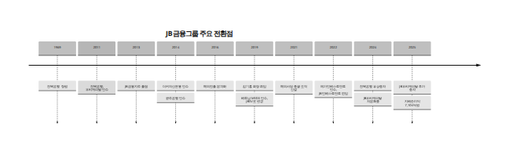

> 원본 파일: `D3f. gpt 5.5 xhigh. 20260630_JB금융그룹과_계열사_심층_프로필.docx`
> 회수 2026-06-30 · ⚠️ 대외비 · **사용 모델: GPT-5.5 xhigh (Deep Research)**

---

# JB금융그룹과 계열사 심층 프로필

## Executive Summary

JB금융그룹은 1969년 전북은행을 모태로 형성된 뒤 2013년 금융지주 체제로 전환했고, 2014년 광주은행과 더커자산운용, 2022년 메가인베스트먼트, 2019년 베트남 MSGS 인수, 2016년 이후 캄보디아·미얀마·베트남 확대를 통해 “지역은행 기반 + 캐피탈 + 자산운용 + 벤처투자 + 해외 현지법인” 구조를 완성한 서남권 기반 금융그룹이다. 2025년 말 기준 그룹은 전북은행·광주은행·JB우리캐피탈·JB자산운용·JB인베스트먼트의 5개 직접 자회사와 PPCBank·JBSV·JBCM·JB PPAM의 4개 해외 손자회사를 두고 있으며, 2024년 말 임직원 수는 4,650명이다. [\[1\]](https://www.jbfg.com/ko/prcenter/press/detail/1033.do?utm_source=chatgpt.com)

수익성은 JB금융의 가장 뚜렷한 투자 포인트다. 2025년 그룹 지배지분순이익은 7,104억원으로 다시 사상 최대를 경신했고, 2024년에도 6,775억원으로 최대 실적을 기록했다. 2024년 ROE 13.0%, ROA 1.06%, 2025년 총영업이익 2조 3,395억원과 당기순이익 7,300억원은 국내 금융지주 중에서도 높은 수익성 체질을 보여준다. 동시에 2025년 말 BIS자기자본비율 14.3%, 2024년 말 CET1 12.21%는 자본 완충력 역시 과거 대비 크게 개선됐음을 보여준다. [\[2\]](https://www.jbfg.com/ko/prcenter/press/detail/20.do?utm_source=chatgpt.com)

사업 포트폴리오는 아직 은행 비중이 높지만, 비은행과 해외가 빠르게 커지고 있다. 한국신용평가는 2025년 말 기준 광주은행과 전북은행이 그룹 총자산의 각각 47%, 36%를 차지한다고 평가했고, JB우리캐피탈은 여전업권 총자산 기준 8위, JB자산운용은 운용자산 기준 26위 수준으로 파악했다. 2025년 계열사별 순익 기여도는 전북은행 2,287억원, 광주은행 2,726억원, JB우리캐피탈 2,815억원, JB인베스트먼트 83억원, JB자산운용 20억원, PPCBank 486억원이었다. 즉, 이익 기준으로는 이미 캐피탈과 해외가 의미 있는 축으로 올라와 있으며, 단순 합산 기준 은행 비중은 2022년 약 65.7%에서 2025년 약 59.6%로 낮아졌다. [\[3\]](https://m.kisrating.com/fileDown.do?fileName=rs20260324-11.pdf&gubun=2&menuCd=R8&utm_source=chatgpt.com)

투자지표 측면에서 JB금융지주의 2026년 6월 26일 종가 기준 현재가시세는 22,850원, 시가총액은 4조 3,016억원, 외국인지분율은 34.19%, 상장주식수는 188,254천주였다. 2025년 4월 24일 외국인지분율 36.0%, 2025년 7월 29일 34.5%, 2026년 4월 24일 34.7%, 2026년 6월 26일 34.19%로 최근 1년여 동안 외국인 보유율은 34%대 중반에서 등락했다. 2025년 말 연결자본(지배기업 소유지분 중심의 단순 근사치)과 상장주식수를 기준으로 계산한 현 시점 PBR은 약 0.70배 수준으로 추정된다. [\[4\]](https://www.jbfg.com/ko/ir/stock/realtimeQuotes.do?utm_source=chatgpt.com)

본 보고서는 사용자가 요구한 형식에 맞춰 각 계열사를 “파트너사에게 직접 소개하는 IR·회사소개서 수준”으로 정리하되, 자료 접근성 차이를 엄밀하게 반영했다. 은행·캐피탈은 공개 웹상에서 비교적 일관된 5개년 재무지표를 확보할 수 있었지만, 자산운용·벤처투자·해외 손자회사는 웹 파서로 접근 가능한 1차 자료가 제한적이어서, 확인 가능한 항목을 중심으로 제시하고 확인 불가 값은 공란 또는 해당없음으로 남겼다. 추정치는 모두 `[추정]`으로 명시했다. [\[5\]](https://www.jbfg.com/ko/ir/disclosure/pillarDisclosure.do?utm_source=chatgpt.com)

## 조사범위와 출처 우선순위

본 보고서의 우선 출처 체계는 다음과 같다. 첫째, JB금융그룹 및 각 계열사 공식 웹사이트의 사업보고서·영업보고서·경영공시·IR 페이지와 회사소개 페이지를 1차 출처로 사용했다. 둘째, KIND·KRX·회사 공식 현재가시세 페이지를 1차 출처로 사용했다. 셋째, 공개 웹에서 일괄 파싱 가능한 5개년 재무표를 보완하기 위해 한국신용평가(KIS Rating) 신용평가보고서를 2차 출처로 사용했고, 외국인지분율의 과거 시점 추이를 보완하기 위해 증권사 리포트를 제한적으로 활용했다. [\[6\]](https://www.jbfg.com/ko/ir/disclosure/pillarDisclosure.do?utm_source=chatgpt.com)

아래 표는 본 보고서의 실제 사용 우선순위다.

| 우선순위 | 출처 유형 | 주요 활용 영역 | 신뢰도 기준 |
|----|----|----|----|
| 1 | JB금융그룹/계열사 공식 IR·공시·회사소개 | 연혁, 조직, 지배구조, 계열 구조, 공식 실적 발표, 현재가시세 | 1차 |
| 2 | KIND·KRX·공식 주가/주주 페이지 | 상장주식수, 시가총액, 주주구성, 공시 일정 | 1차 |
| 3 | KIS Rating | 5개년 은행·캐피탈 재무지표 시계열, 업권 내 위치 | 2차 |
| 4 | 증권사 리포트 | 외국인지분율의 과거 특정 시점 보완, BPS·PBR 보조 | 2차 |
| 5 | 웹 파서로 확인 불가한 항목에 대한 계산 | PBR, ROE 등 일부 보조지표 | `[추정]` |

은행과 캐피탈에는 공통 템플릿을 적용했다. 다만 자산운용·벤처투자·해외 현지법인에는 은행형 지표가 원천적으로 맞지 않거나 공개값이 부족하다. 따라서 JB자산운용·JB인베스트먼트·JBSV·JBCM·JB PPAM에는 AUM, 자본금, 조직, 거점, 순익 등 검증 가능한 지표 중심의 표를 사용했고, 예수금·BIS·NIM 등 업권상 해당하지 않거나 확인 불가한 값은 `해당없음` 또는 `공개 확인 불가`로 남겼다. 이 처리 원칙 자체가 데이터의 엄밀성을 유지하기 위한 것이다. [\[7\]](https://www.jbam.co.kr/about/company?utm_source=chatgpt.com)

## JB금융그룹

JB금융그룹은 전북은행을 모태로 2013년 7월 서남권 최초의 금융지주로 출범했다. 출범 이후 손자회사였던 JB우리캐피탈을 자회사로 편입했고, 2014년 더커자산운용(현 JB자산운용) 인수와 광주은행 인수로 외형 확대의 분수령을 만들었다. 2019년 김기홍 회장 취임 이후에는 질적 성장, 자본 효율, 주주환원, 해외사업 정비가 동시에 강화되었고, 2022년 메가인베스트먼트 인수로 벤처투자 축을 추가했다. 즉, 그룹의 큰 흐름은 “지방은행 중심 단순 구조 → 은행쌍두체제 + 캐피탈 → 자산운용·벤처투자 + 해외 플랫폼”으로 요약된다. [\[8\]](https://www.jbfg.com/ko/prcenter/press/detail/1033.do?utm_source=chatgpt.com)

주력 고객 기반은 광주·전남과 전북의 리테일 및 지역 중소기업이고, 이 거점 지역에서 여·수신 점유율 약 25% 내외를 장기간 유지해 왔다. 전국 시장점유율은 각각 1% 내외로 크지 않지만, 한국신용평가는 이 지역 기반의 안정성과 높은 수익성을 JB금융의 핵심 경쟁력으로 평가한다. 비은행에서는 JB우리캐피탈이 2025년 9월 말 총자산 기준 여전업권 8위, JB자산운용은 운용자산 기준 자산운용업권 26위 수준이며, 해외에서는 PPCBank가 캄보디아 현지에서 대표 은행 중 하나로 자리 잡았다. [\[9\]](https://m.kisrating.com/fileDown.do?fileName=rs20260324-11.pdf&gubun=2&menuCd=R8&utm_source=chatgpt.com)

그룹 규모는 2025년 말 기준 연결총자산 73조 1,270억원, 총여신 58조 1,147억원, 지배기업소유지분 6조 1,752억원, 지배지분순이익 7,104억원이다. 보통주자본비율(CET1) 12.4%와 BIS자기자본비율 14.3%는 2018년 말 CET1 9.0% 수준 대비 큰 개선이다. ROE는 2018년 9.1%에서 2024년 13.0%로 상승했고, CIR 역시 2018년 52.3%에서 2024년 37.5%로 낮아졌다. 이는 단순 외형확대가 아니라 비용·자본·포트폴리오를 함께 개선한 결과다. [\[10\]](https://m.kisrating.com/fileDown.do?fileName=rs20260324-11.pdf&gubun=2&menuCd=R8&utm_source=chatgpt.com)

|  |
|:--:|
|  |

위 타임라인은 JB금융 공식 보도자료·연혁·공시자료를 바탕으로 정리했다. 특히 2014년 광주은행 인수, 2019년 JBSV 편입, 2021년 해외총괄 신설, 2022년 JB인베스트먼트 편입, 2024~2025년 자본 재배치가 “성장-다각화-자본정교화”의 핵심 고리였다. [\[11\]](https://www.jbfg.com/ko/prcenter/press/detail/1033.do?utm_source=chatgpt.com)

**JB금융그룹 연혁 타임라인 표**

| 연도 | 주요 사건 | 출처 | 발행일 | 신뢰도 |
|----|----|----|----|----|
| 1969 | 전북은행 창립, 그룹의 실질적 모태 형성 | JB금융그룹 소개 [\[12\]](https://www.jbfg.com/ko/about/group.do?utm_source=chatgpt.com) | 웹페이지 기준 2026년 조회 | 1차 |
| 2011 | 전북은행, 우리캐피탈 인수로 캐피탈 진출 기반 확보 | JB우리캐피탈 개요/KIS 자료 [\[13\]](https://m.kisrating.com/fileDown.do?fileName=rs20260414-5.pdf&gubun=2&menuCd=R8&utm_source=chatgpt.com) | 2026-04-08 | 2차 |
| 2013 | JB금융지주 출범 | JB금융그룹 10주년 보도자료 [\[14\]](https://www.jbfg.com/ko/prcenter/press/detail/1033.do?utm_source=chatgpt.com) | 2023-06-27 | 1차 |
| 2014 | 더커자산운용 인수, 광주은행 인수 | JB금융그룹 10주년 보도자료 [\[14\]](https://www.jbfg.com/ko/prcenter/press/detail/1033.do?utm_source=chatgpt.com) | 2023-06-27 | 1차 |
| 2016 | 2014년 지주 출범 이후 해외진출 가속 | 해외사업 총괄 조직 신설 보도자료 [\[15\]](https://www.jbfg.com/ko/prcenter/press/detail/870.do?utm_source=chatgpt.com) | 2021-04-01 | 1차 |
| 2019 | 김기홍 회장 취임, MSGS 인수 후 JBSV로 변경 | JB금융지주 주총 보도자료·해외사업 조직 신설 보도자료 [\[16\]](https://www.jbfg.com/ko/prcenter/press/detail/529.do?utm_source=chatgpt.com) | 2019-04-01 / 2021-04-01 | 1차 |
| 2021 | 그룹 해외사업 총괄 조직 신설 | JB금융 보도자료 [\[15\]](https://www.jbfg.com/ko/prcenter/press/detail/870.do?utm_source=chatgpt.com) | 2021-04-01 | 1차 |
| 2022 | 메가인베스트먼트 자회사 편입, JB인베스트먼트로 확대 | JB금융 보도자료 [\[17\]](https://www.jbfg.com/ko/prcenter/press/detail/955.do?utm_source=chatgpt.com) | 2022-07-15 검색결과 기준 | 1차 |
| 2024 | 전북은행 5,000억원 유상증자, JB우리캐피탈 600억원 증자 | KIS Credit Opinion [\[18\]](https://m.kisrating.com/fileDown.do?fileName=rs20260626-86.pdf&gubun=2&menuCd=R8&utm_source=chatgpt.com) | 2026-03-27 | 2차 |
| 2025 | JB우리캐피탈 1,500억원 유상증자, 그룹 순익 7,104억원 | KIS Credit Opinion·JB금융 보도자료 [\[19\]](https://m.kisrating.com/fileDown.do?fileName=rs20260626-86.pdf&gubun=2&menuCd=R8&utm_source=chatgpt.com) | 2026-03-27 / 2026-02-05 | 2차 / 1차 |

**JB금융그룹 2021~2025 재무 시계열**

| 연도 | 총자산(억원) | 총여신(억원) | 총예수금(억원) | 지배순이익(억원) | ROE(%) | ROA(%) | NIM(%) | BIS(%) | CET1(%) | NPL(%) | 연체율(%) | 출처 | 발행일 | 신뢰도 |
|----|---:|---:|---:|---:|---:|---:|---:|---:|---:|---:|---:|----|----|----|
| 2021 | 563,956 | 438,627 | — | 5,066 | 12.8 | 0.9 | — | 13.1 | 10.3 | 0.5 | — | KIS Credit Opinion + JB금융 실적발표 [\[20\]](https://m.kisrating.com/fileDown.do?fileName=rs20260324-11.pdf&gubun=2&menuCd=R8&utm_source=chatgpt.com) | 2026-03-24 / 2022-02-10 | 2차 + 1차 |
| 2022 | 598,282 | 463,333 | — | 6,010 | 13.9 | 1.05 | 3.13 | 13.5 | 11.39 | 0.6 | — | KIS Credit Opinion + JB금융 실적발표 + 주요재무지표 페이지 스니펫 [\[21\]](https://m.kisrating.com/fileDown.do?fileName=rs20260324-11.pdf&gubun=2&menuCd=R8&utm_source=chatgpt.com) | 2026-03-24 / 2023-02-09 / 2026년 조회 | 2차 + 1차 |
| 2023 | 629,423 | 496,644 | — | 5,860 | 13.88 | 1.05 | 3.27 | 14.1 | 12.32 | 0.6 | — | KIS Credit Opinion + JB금융 실적발표 + 주요재무지표 페이지 스니펫 [\[22\]](https://m.kisrating.com/fileDown.do?fileName=rs20260324-11.pdf&gubun=2&menuCd=R8&utm_source=chatgpt.com) | 2026-03-24 / 2024-02-07 / 2026년 조회 | 2차 + 1차 |
| 2024 | 689,214 | 548,550 | — | 6,775 | 13.0 | 1.06 | 3.19 | 14.3 | 12.21 | 0.5 | — | KIS Credit Opinion + JB금융 실적발표 + 주요재무지표 페이지 스니펫 [\[23\]](https://m.kisrating.com/fileDown.do?fileName=rs20260324-11.pdf&gubun=2&menuCd=R8&utm_source=chatgpt.com) | 2026-03-24 / 2025-02-06 / 2026년 조회 | 2차 + 1차 |
| 2025 | 731,270 | 581,147 | — | 7,104 | 12.4 | 1.0 | 3.10 | 14.3 | 12.4 | 0.5 | — | KIS Credit Opinion + JB금융 실적발표 + 주요재무지표 페이지 스니펫 [\[24\]](https://m.kisrating.com/fileDown.do?fileName=rs20260324-11.pdf&gubun=2&menuCd=R8&utm_source=chatgpt.com) | 2026-03-24 / 2026-02-05 / 2026년 조회 | 2차 + 1차 |

주: 그룹 예수금·연체율의 연차 일괄 시계열은 웹 파서로 접근 가능한 공식 자료에서 동일 기준으로 확보되지 않아 공란 처리했다. NIM은 JB금융 공식 주요재무지표 페이지 검색 스니펫을 연차 순서대로 배치했다. 2021 NIM은 동일 방식의 검증 가능 값이 확보되지 않았다. [\[25\]](https://www.jbfg.com/ko/ir/finance/invest.do?utm_source=chatgpt.com)

**JB금융지주 주가·밸류에이션·외국인지분 추이**

| 기준일 | 주가(원) | 시가총액(억원) | 외국인지분율(%) | PBR(배) | 산식/비고 | 출처 | 발행일 | 신뢰도 |
|----|---:|---:|---:|---:|----|----|----|----|
| 2025-04-24 | 17,830 | 34,574 | 36.0 | 0.63 `[추정]` | 주가/BPS 28,302원 | LS증권 리포트 [\[26\]](https://file.alphasquare.co.kr/media/pdfs/company-report/_250425%20JB%EA%B8%88%EC%9C%B5_%EC%A0%84%EB%B0%B0%EC%8A%B9_742_Online%20report%20_%206_10p_JB%EA%B8%88%EC%9C%B5%EC%A7%80%EC%A3%BC.pdf?utm_source=chatgpt.com) | 2025-04-25 | 2차 |
| 2025-07-29 | 23,050 | 44,696 | 34.5 | 0.83 `[추정]` | 주가/BPS 27,915원 | LS증권 리포트 [\[27\]](https://file.alphasquare.co.kr/media/pdfs/company-report/_250730%20JB%EA%B8%88%EC%9C%B5%28%EB%AA%A9%ED%91%9C%EC%A3%BC%EA%B0%80%2036.8_%20%EC%83%81%ED%96%A5%2C%20%EB%AA%A9%EC%9A%9C%20%EB%B0%9C%ED%91%9C%29_%EC%A0%84%EB%B0%B0%EC%8A%B9_792_Online%20report%20_%206_10p_JB%EA%B8%88%EC%9C%B5%EC%A7%80%EC%A3%BC.pdf?utm_source=chatgpt.com) | 2025-07-30 | 2차 |
| 2026-04-24 | 28,700 | 54,029 | 34.7 | 0.93 `[추정]` | 주가/BPS 30,900원 | LS증권 리포트 [\[28\]](https://file.alphasquare.co.kr/media/pdfs/company-report/_260427%20JB%EA%B8%88%EC%9C%B5_%EC%A0%84%EB%B0%B0%EC%8A%B9_896_Online%20report%20_%206_10p_JB%EA%B8%88%EC%9C%B5%EC%A7%80%EC%A3%BC.pdf?utm_source=chatgpt.com) | 2026-04-27 | 2차 |
| 2026-06-26 | 22,850 | 43,016 | 34.19 | 0.70 `[추정]` | 주가 / 2025 말 추정 BPS 32,803원 | JB금융 현재가시세 + 2025 말 자본·상장주식수 계산 [\[29\]](https://www.jbfg.com/ko/ir/stock/realtimeQuotes.do?utm_source=chatgpt.com) | 2026-06-26 / 2026-03-24 | 1차 + `[추정]` |

**은행/비은행 이익 비중 변화**

| 연도 | 은행 이익 합계(억원) | 비은행·해외 이익 합계(억원) | 은행 비중(%) | 비은행·해외 비중(%) | 비고 | 출처 | 발행일 | 신뢰도 |
|----|---:|---:|---:|---:|----|----|----|----|
| 2022 | 3,770 | 1,971 | 65.7 `[추정]` | 34.3 `[추정]` | 전북+광주 / JB우리캐피탈+JB자산운용+PPCBank 단순합산 | JB금융 2022 실적발표 [\[30\]](https://www.jbfg.com/ko/prcenter/press/detail/996.do?utm_source=chatgpt.com) | 2023-02-09 | 1차 + `[추정]` |
| 2023 | 4,452 | 2,303 | 65.9 `[추정]` | 34.1 `[추정]` | 전북+광주 / 캐피탈+자산운용+인베스트+PPCBank 단순합산 | JB금융 2023 실적발표 [\[31\]](https://www.jbfg.com/ko/prcenter/press/detail/1074.do?utm_source=chatgpt.com) | 2024-02-07 | 1차 + `[추정]` |
| 2024 | 4,945 | 약 2,900 내외 | 약 63 `[추정]` | 약 37 `[추정]` | 은행부문은 KIS, 비은행은 자회사별 공개치 일부 조합 | KIS Credit Opinion + JB금융 보도자료 [\[32\]](https://m.kisrating.com/fileDown.do?fileName=rs20260310-33.pdf&gubun=2&menuCd=R8&utm_source=chatgpt.com) | 2026-03-10 / 2025-02-06 | 2차 + `[추정]` |
| 2025 | 5,013 | 3,404 | 59.6 `[추정]` | 40.4 `[추정]` | 전북+광주 / 캐피탈+자산운용+인베스트+PPCBank 단순합산 | JB금융 2025 실적발표 [\[33\]](https://www.jbfg.com/ko/prcenter/press/detail/20.do?utm_source=chatgpt.com) | 2026-02-05 | 1차 + `[추정]` |

해석상 중요한 점은, 자산 기준으로는 은행 의존도가 여전히 절대적이지만 이익 기준으로는 캐피탈과 해외 축이 빠르게 커졌다는 점이다. 특히 2025년에는 JB우리캐피탈 순익이 2,815억원으로 전북은행을 넘어섰고, PPCBank도 486억원으로 해외 법인 중 실질적인 이익 축이 되었다. 이는 JB금융의 “작지만 수익성 높은 그룹”이라는 포지션을 강화한다. [\[34\]](https://www.jbfg.com/ko/prcenter/press/detail/20.do?utm_source=chatgpt.com)

## 국내 은행 계열

**전북은행**

전북은행은 1969년 창립된 지방은행으로, JB금융그룹의 모태이자 현 지주의 실질적 출발점이다. 한국신용평가는 전북은행이 전북 지역을 기반으로 안정적인 고객 기반을 보유하고 있으며, 전국 시장점유율은 작지만 지역 내 여·수신 점유율은 25% 내외라고 평가한다. 그룹 차원에서는 2025년 말 기준 국내 83개 영업점과 베트남 1개 거점을 갖고 있다. “누구에게나 따뜻한 금융”이라는 모토 아래 외국인 금융, 중금리·포용금융, 지역기업금융에서 차별화되어 왔고, JB금융이 2016년 국내 최초 외국인 신용대출 시장을 개척했다고 밝힌 점은 전북은행의 실무 실행력을 보여준다. [\[35\]](https://m.kisrating.com/fileDown.do?fileName=rs20260430-24.pdf&gubun=2&menuCd=R8&utm_source=chatgpt.com)

전북은행의 강점은 첫째, 전북권에서의 높은 고객 접점과 행정·기업 네트워크, 둘째, 외국인 금융과 중금리 시장 개척 경험, 셋째, 그룹 자본 재배치의 핵심 축이라는 점이다. 2024년 5,000억원 유상증자는 단순 자본 확충을 넘어 규제자본과 성장여력을 동시에 확대하는 조치였다. 다만 여신 포트폴리오에서 부동산·중소기업 비중이 높다는 점은 경기 변동 시 모니터링 포인트다. [\[36\]](https://m.kisrating.com/fileDown.do?fileName=rs20260626-86.pdf&gubun=2&menuCd=R8&utm_source=chatgpt.com)

| 연도 | 주요 사건 | 출처 | 발행일 | 신뢰도 |
|----|----|----|----|----|
| 1969 | 전북은행 창립 | JB금융그룹 소개 / KIS Rating [\[37\]](https://www.jbfg.com/ko/about/group.do?utm_source=chatgpt.com) | 2026년 조회 / 2026-04-08 | 1차 / 2차 |
| 2013 | JB금융지주 출범, 지주 모태은행으로 편입 | JB금융 10주년 보도자료 [\[14\]](https://www.jbfg.com/ko/prcenter/press/detail/1033.do?utm_source=chatgpt.com) | 2023-06-27 | 1차 |
| 2016 | 국내 최초 외국인 신용대출 시장 개척(그룹 발표) | JB금융 보도자료 [\[38\]](https://www.jbfg.com/ko/prcenter/press/detail/1171.do?utm_source=chatgpt.com) | 2025-01-02 | 1차 |
| 2024 | 5,000억원 유상증자 실시 | KIS Credit Opinion [\[18\]](https://m.kisrating.com/fileDown.do?fileName=rs20260626-86.pdf&gubun=2&menuCd=R8&utm_source=chatgpt.com) | 2026-03-27 | 2차 |
| 2025 | 국내 83개·베트남 1개 거점 유지, 그룹 핵심 은행 자회사 지속 | JB금융 Global 페이지 [\[39\]](https://www.jbfg.com/ko/main.do?utm_source=chatgpt.com) | 2026년 조회 | 1차 |

| 연도 | 총자산(십억원) | 대출채권(십억원) | 예수부채(십억원) | 당기순이익(십억원) | ROE(%) `[추정]` | ROA(%) | NIM(%) | BIS(%) | 연체율(%) | NPL(%) | 출처 | 발행일 | 신뢰도 |
|----|---:|---:|---:|---:|---:|---:|---:|---:|---:|---:|----|----|----|
| 2021 | 25,379 | 20,503 | 21,222 | 161 | 10.22 | 0.70 | 2.63 | 15.04 | 0.50 | 0.48 | KIS Rating [\[40\]](https://m.kisrating.com/fileDown.do?fileName=rs20260430-24.pdf&gubun=2&menuCd=R8&utm_source=chatgpt.com) | 2026-04-08 / 2026-04-01 | 2차 |
| 2022 | 27,183 | 21,743 | 22,737 | 177 | 11.06 | 0.70 | 2.93 | 15.10 | 0.69 | 0.57 | KIS Rating [\[40\]](https://m.kisrating.com/fileDown.do?fileName=rs20260430-24.pdf&gubun=2&menuCd=R8&utm_source=chatgpt.com) | 2026-04-08 / 2026-04-01 | 2차 |
| 2023 | 28,952 | 23,103 | 23,987 | 173 | 10.20 | 0.60 | 3.27 | 15.25 | 1.09 | 0.84 | KIS Rating [\[40\]](https://m.kisrating.com/fileDown.do?fileName=rs20260430-24.pdf&gubun=2&menuCd=R8&utm_source=chatgpt.com) | 2026-04-08 / 2026-04-01 | 2차 |
| 2024 | 30,938 | 24,680 | 25,444 | 183 | 9.71 | 0.60 | 3.29 | 15.67 | 1.09 | 0.77 | KIS Rating [\[40\]](https://m.kisrating.com/fileDown.do?fileName=rs20260430-24.pdf&gubun=2&menuCd=R8&utm_source=chatgpt.com) | 2026-04-08 / 2026-04-01 | 2차 |
| 2025 | 32,327 | 25,287 | 26,452 | 171 | 8.58 | 0.50 | 2.81 | 16.97 | 1.46 | 0.93 | KIS Rating [\[40\]](https://m.kisrating.com/fileDown.do?fileName=rs20260430-24.pdf&gubun=2&menuCd=R8&utm_source=chatgpt.com) | 2026-04-08 / 2026-04-01 | 2차 |

주: 전북은행 ROE는 공개 파싱 가능한 연차 ROE 표가 확보되지 않아 순이익/평균자본으로 계산한 `[추정]` 값이다. [\[40\]](https://m.kisrating.com/fileDown.do?fileName=rs20260430-24.pdf&gubun=2&menuCd=R8&utm_source=chatgpt.com)

**광주은행**

광주은행은 1968년 설립된 광주·전남 대표 지방은행으로, 공식 연혁 페이지가 “Since 1968”을 명시하고 있다. 2014년 JB금융그룹에 편입된 이후 광주·전남 지역 지배력을 바탕으로 그룹 내 가장 큰 은행 자산 비중(2025년 말 기준 그룹 총자산의 약 47%)을 담당한다. 2025년 기준 영업거점은 국내 119개, 베트남 1개다. 그룹 내에서 광주은행은 상대적으로 더 높은 지역 점유력, 더 우수한 비용효율성, 안정적인 예수금 기반을 가진 은행으로 평가된다. [\[41\]](https://www.kjbank.com/ib20/mnu/BHPBKIF010300?utm_source=chatgpt.com)

광주은행의 핵심 경쟁력은 지역 개인·중소기업·공공기관 기반의 견고한 저원가성 조달력과 비교적 안정적인 자산건전성이다. 2018년 완전자회사화 이후 그룹 차원의 자본·리스크·주주환원 전략과의 정합성이 더 높아졌다. 파트너 관점에서 보면, 광주은행은 광주·전남권에서 사실상 로컬 챔피언 역할을 하면서도 JB금융 공통의 디지털·해외 네트워크를 활용할 수 있다는 점이 차별점이다. [\[42\]](https://m.kisrating.com/fileDown.do?fileName=rs20260430-21.pdf&gubun=2&menuCd=R8&utm_source=chatgpt.com)

| 연도 | 주요 사건 | 출처 | 발행일 | 신뢰도 |
|----|----|----|----|----|
| 1968 | 광주은행 설립 | 광주은행 연혁 페이지 [\[43\]](https://www.kjbank.com/ib20/mnu/BHPBKIF010300?utm_source=chatgpt.com) | 2026년 조회 | 1차 |
| 2014 | JB금융그룹이 광주은행 인수 | JB금융 10주년 보도자료 / KIS Rating [\[44\]](https://www.jbfg.com/ko/prcenter/press/detail/1033.do?utm_source=chatgpt.com) | 2023-06-27 / 2026-04-08 | 1차 / 2차 |
| 2018 | 광주은행 완전자회사화 | KIS Rating [\[45\]](https://m.kisrating.com/fileDown.do?fileName=rs20260430-21.pdf&gubun=2&menuCd=R8&utm_source=chatgpt.com) | 2026-04-08 | 2차 |
| 2019 | 베트남 MSGS 인수 후 JBSV를 광주은행 자회사로 편입 | JB금융 보도자료 [\[15\]](https://www.jbfg.com/ko/prcenter/press/detail/870.do?utm_source=chatgpt.com) | 2021-04-01 | 1차 |
| 2025 | 국내 119개·베트남 1개 거점 유지 | JB금융 Global 페이지 [\[39\]](https://www.jbfg.com/ko/main.do?utm_source=chatgpt.com) | 2026년 조회 | 1차 |

| 연도 | 총자산(십억원) | 대출채권(십억원) | 예수부채(십억원) | 당기순이익(십억원) | ROE(%) `[추정]` | ROA(%) | NIM(%) | BIS(%) | 연체율(%) | NPL(%) | 출처 | 발행일 | 신뢰도 |
|----|---:|---:|---:|---:|---:|---:|---:|---:|---:|---:|----|----|----|
| 2021 | 31,503 | 24,535 | 25,658 | 197 | 9.57 | 0.60 | 2.18 | 16.60 | — | 0.39 | KIS Rating [\[45\]](https://m.kisrating.com/fileDown.do?fileName=rs20260430-21.pdf&gubun=2&menuCd=R8&utm_source=chatgpt.com) | 2026-04-08 | 2차 |
| 2022 | 32,624 | 25,582 | 26,551 | 255 | 12.23 | 0.80 | 2.65 | 16.52 | — | 0.42 | KIS Rating [\[45\]](https://m.kisrating.com/fileDown.do?fileName=rs20260430-21.pdf&gubun=2&menuCd=R8&utm_source=chatgpt.com) | 2026-04-08 | 2차 |
| 2023 | 33,428 | 26,333 | 27,496 | 240 | 11.26 | 0.70 | 3.18 | 16.40 | — | 0.64 | KIS Rating [\[45\]](https://m.kisrating.com/fileDown.do?fileName=rs20260430-21.pdf&gubun=2&menuCd=R8&utm_source=chatgpt.com) | 2026-04-08 | 2차 |
| 2024 | 35,657 | 27,834 | 28,548 | 287 | 13.12 | 0.80 | 3.18 | 15.96 | — | 0.56 | KIS Rating [\[45\]](https://m.kisrating.com/fileDown.do?fileName=rs20260430-21.pdf&gubun=2&menuCd=R8&utm_source=chatgpt.com) | 2026-04-08 | 2차 |
| 2025 | 38,026 | 29,560 | 30,702 | 266 | 11.51 | 0.70 | 2.85 | 16.49 | — | 0.92 | KIS Rating [\[45\]](https://m.kisrating.com/fileDown.do?fileName=rs20260430-21.pdf&gubun=2&menuCd=R8&utm_source=chatgpt.com) | 2026-04-08 | 2차 |

주: 광주은행 ROE는 순이익/평균자본으로 계산한 `[추정]` 값이다. 공식 연차 연체율 시계열은 웹 파서로 확인 가능한 자료에서 같은 기준으로 확보되지 않아 공란 처리했다. [\[45\]](https://m.kisrating.com/fileDown.do?fileName=rs20260430-21.pdf&gubun=2&menuCd=R8&utm_source=chatgpt.com)

## 국내 비은행 계열

**JB우리캐피탈**

JB우리캐피탈의 모태는 아주캐피탈에서 분리된 우리캐피탈이며, 2011년 전북은행이 인수한 뒤 2012년 현재 사명으로 변경됐다. JB금융 출범 이후 손자회사에서 자회사로 편입되며 그룹 비은행 포트폴리오의 주축이 됐고, 현재는 “21C 초우량 여신 전문 금융회사”라는 그룹 내 포지셔닝을 가진다. 2025년 9월 말 총자산 기준 여전업권 8위이며, 국내 17개 거점과 미얀마 1개, 베트남 1개 거점을 운영한다. 2025년 6월 말 포트폴리오는 자동차금융 27%, 개인·기업금융 62%, 투자금융 11%로 분산돼 있다. [\[46\]](https://m.kisrating.com/fileDown.do?fileName=rs20260414-5.pdf&gubun=2&menuCd=R8&utm_source=chatgpt.com)

이 회사의 핵심 사업은 자동차금융, 개인신용대출, 기업금융과 투자금융이다. 시장지위만 놓고 보면 메이저 카드·캐피탈사 대비 절대 규모는 작지만, ROA 2%대 중반을 유지해 온 높은 수익성과 비교적 우수한 자산건전성이 강점이다. 그룹 내 이익 기여도 측면에서는 2025년 순이익 2,815억원으로 전북은행을 추월했고, 사실상 JB금융 비은행 성장 스토리의 중심축이 되었다. [\[47\]](https://m.kisrating.com/fileDown.do?fileName=rs20260414-5.pdf&gubun=2&menuCd=R8&utm_source=chatgpt.com)

| 연도 | 주요 사건 | 출처 | 발행일 | 신뢰도 |
|----|----|----|----|----|
| 2011 | 전북은행, 우리캐피탈 인수 | KIS Rating [\[13\]](https://m.kisrating.com/fileDown.do?fileName=rs20260414-5.pdf&gubun=2&menuCd=R8&utm_source=chatgpt.com) | 2026-04-24 | 2차 |
| 2012 | JB우리캐피탈로 사명 변경 | KIS Rating [\[13\]](https://m.kisrating.com/fileDown.do?fileName=rs20260414-5.pdf&gubun=2&menuCd=R8&utm_source=chatgpt.com) | 2026-04-24 | 2차 |
| 2013 | JB금융 출범 후 손자회사→자회사로 체계 정비 | JB금융 10주년 보도자료 [\[14\]](https://www.jbfg.com/ko/prcenter/press/detail/1033.do?utm_source=chatgpt.com) | 2023-06-27 | 1차 |
| 2024 | 600억원 유상증자 | KIS Credit Opinion [\[18\]](https://m.kisrating.com/fileDown.do?fileName=rs20260626-86.pdf&gubun=2&menuCd=R8&utm_source=chatgpt.com) | 2026-03-27 | 2차 |
| 2025 | 1,500억원 유상증자, 순익 2,815억원 | KIS Credit Opinion·JB금융 실적발표 [\[19\]](https://m.kisrating.com/fileDown.do?fileName=rs20260626-86.pdf&gubun=2&menuCd=R8&utm_source=chatgpt.com) | 2026-03-27 / 2026-02-05 | 2차 / 1차 |

| 연도 | 총자산(십억원) | 영업자산(십억원) | 예수금 | 차입부채(십억원) | 당기순이익(십억원) | ROA(%) | 이자마진율(%) | 조정레버리지(배) | 1개월 연체율(%) | 요주의이하여신비율(%) | 출처 | 발행일 | 신뢰도 |
|----|---:|---:|----|---:|---:|---:|---:|---:|---:|---:|----|----|----|
| 2021 | 11,511 | 10,724 | 해당없음 | 9,971 | 103 | 1.70 | 6.58 | 5.5 | 0.61 | 1.49 | KIS Rating [\[48\]](https://m.kisrating.com/fileDown.do?fileName=rs20260414-5.pdf&gubun=2&menuCd=R8&utm_source=chatgpt.com) | 2026-04-24 / 2026-04-08 | 2차 |
| 2022 | 11,930 | 11,108 | 해당없음 | 10,330 | 171 | 2.50 | 7.60 | 5.4 | 0.55 | 1.35 | KIS Rating [\[48\]](https://m.kisrating.com/fileDown.do?fileName=rs20260414-5.pdf&gubun=2&menuCd=R8&utm_source=chatgpt.com) | 2026-04-24 / 2026-04-08 | 2차 |
| 2023 | 12,719 | 11,942 | 해당없음 | 10,966 | 188 | 2.40 | 7.87 | 5.3 | 0.85 | 2.00 | KIS Rating [\[48\]](https://m.kisrating.com/fileDown.do?fileName=rs20260414-5.pdf&gubun=2&menuCd=R8&utm_source=chatgpt.com) | 2026-04-24 / 2026-04-08 | 2차 |
| 2024 | 13,736 | 13,063 | 해당없음 | 11,858 | 224 | 2.40 | 7.52 | 5.4 | 0.73 | 1.59 | KIS Rating [\[48\]](https://m.kisrating.com/fileDown.do?fileName=rs20260414-5.pdf&gubun=2&menuCd=R8&utm_source=chatgpt.com) | 2026-04-24 / 2026-04-08 | 2차 |
| 2025 | 14,684 | 14,264 | 해당없음 | 12,291 | 282 | 2.30 | 7.18 | 5.3 | 0.72 | 1.56 | KIS Rating [\[48\]](https://m.kisrating.com/fileDown.do?fileName=rs20260414-5.pdf&gubun=2&menuCd=R8&utm_source=chatgpt.com) | 2026-04-24 / 2026-04-08 | 2차 |

주: 캐피탈사는 은행과 달리 예수금·BIS·NPL 공시 구조가 동일하지 않으므로, 업권 적합 지표인 영업자산·차입부채·조정레버리지·요주의이하여신비율을 사용했다. [\[48\]](https://m.kisrating.com/fileDown.do?fileName=rs20260414-5.pdf&gubun=2&menuCd=R8&utm_source=chatgpt.com)

**JB자산운용**

JB자산운용은 2008년 3월 설립됐고, 2014년 JB금융그룹이 더커자산운용을 인수한 뒤 현재 브랜드로 재편된 자산운용사다. 회사소개 페이지에 따르면 2025년 12월 기준 자본금 277.2억원, 운용자산(AUM) 6조 3,492억원, 임직원 78명 규모다. 그룹은 JB자산운용을 “국내 해외자원 펀드 업계 1위”로 소개하고 있고, KIS는 2025년 9월 말 AUM 기준 운용업권 26위로 파악한다. [\[49\]](https://www.jbam.co.kr/about/company?utm_source=chatgpt.com)

JB자산운용의 핵심 사업은 공·사모펀드, 전통자산 운용, 구조화·대체자산 운용이다. 파트너 관점에서 강점은 그룹 자금력과 지역 금융그룹의 발굴 딜을 결합할 수 있다는 점, 그리고 캄보디아 JB PPAM과의 연계를 통해 부동산·대체자산의 해외 확장 채널을 보유했다는 점이다. 다만 공개 웹상에서 2021~2025 연차의 총자산·순자산·수익성 지표를 일괄 파싱할 수 있는 1차 공시자료가 제한적이어서, 아래에는 확인 가능한 최신 운용지표와 순익 추이를 우선 제시한다. [\[50\]](https://www.jbam.co.kr/about/company?utm_source=chatgpt.com)

| 연도 | 주요 사건 | 출처 | 발행일 | 신뢰도 |
|----|----|----|----|----|
| 2008 | 회사 설립 | JB자산운용 회사소개 [\[51\]](https://www.jbam.co.kr/about/company?utm_source=chatgpt.com) | 2026년 조회 | 1차 |
| 2014 | 더커자산운용 인수 후 JB금융 계열 편입 | JB금융 10주년 보도자료 [\[14\]](https://www.jbfg.com/ko/prcenter/press/detail/1033.do?utm_source=chatgpt.com) | 2023-06-27 | 1차 |
| 2025 | 자본금 277.2억원, AUM 6조 3,492억원, 임직원 78명 | JB자산운용 회사소개 [\[51\]](https://www.jbam.co.kr/about/company?utm_source=chatgpt.com) | 2026년 조회 | 1차 |

| 지표 | 2021 | 2022 | 2023 | 2024 | 2025 | 출처 | 발행일 | 신뢰도 |
|----|---:|---:|---:|---:|---:|----|----|----|
| 순이익(억원) | 공개 확인 불가 | 63 | 50 | 55 | 20 | JB금융 실적발표 + 금융지주 산업보고서 [\[52\]](https://www.jbfg.com/ko/prcenter/press/detail/922.do?utm_source=chatgpt.com) | 2023-02-09 / 2024-02-07 / 2026-03-10 / 2026-02-05 | 1차 + 2차 |
| AUM(억원) | 공개 확인 불가 | 공개 확인 불가 | 공개 확인 불가 | 공개 확인 불가 | 63,492 | JB자산운용 회사소개 [\[51\]](https://www.jbam.co.kr/about/company?utm_source=chatgpt.com) | 2026년 조회 | 1차 |
| 자본금(억원) | 공개 확인 불가 | 공개 확인 불가 | 공개 확인 불가 | 공개 확인 불가 | 277.2 | JB자산운용 회사소개 [\[51\]](https://www.jbam.co.kr/about/company?utm_source=chatgpt.com) | 2026년 조회 | 1차 |
| 임직원수(명) | 공개 확인 불가 | 공개 확인 불가 | 공개 확인 불가 | 공개 확인 불가 | 78 | JB자산운용 회사소개 [\[51\]](https://www.jbam.co.kr/about/company?utm_source=chatgpt.com) | 2026년 조회 | 1차 |

**JB인베스트먼트**

JB인베스트먼트의 모태는 메가인베스트먼트다. JB금융그룹은 2022년 메가인베스트먼트를 자회사로 편입했고, 2023년 10주년 보도자료에는 이를 통해 전북은행·광주은행·JB우리캐피탈·JB자산운용·JB인베스트먼트의 5개 자회사 체제가 완성됐다고 설명한다. 현재 그룹은 JB인베스트먼트를 “신기술 및 신성장 사업발굴을 주도하는 벤처투자회사”로 소개한다. [\[53\]](https://www.jbfg.com/ko/prcenter/press/detail/955.do?utm_source=chatgpt.com)

이 회사의 역할은 순수 이익 기여보다 전략적 딜 소싱과 그룹 생태계 확장에 더 가깝다. 즉, 벤처·스타트업·신사업 투자 플랫폼으로서, JB금융이 은행·캐피탈 중심 구조에서 지역·디지털·신성장 네트워크를 강화하는 수단이다. 2025년 순이익이 83억원으로 커졌다는 점은 아직 규모는 작아도 수익성과 존재감이 커지고 있음을 시사한다. 다만 웹 파서로 확인 가능한 공시에서 2021~2025 총자산·펀드 AUM·직원 수의 일괄 시계열은 확보되지 않았다. [\[54\]](https://www.jbfg.com/ko/prcenter/press/detail/20.do?utm_source=chatgpt.com)

| 연도 | 주요 사건 | 출처 | 발행일 | 신뢰도 |
|----|----|----|----|----|
| 2022 | 메가인베스트먼트 자회사 편입 | JB금융 보도자료 [\[17\]](https://www.jbfg.com/ko/prcenter/press/detail/955.do?utm_source=chatgpt.com) | 2022-07-15 검색결과 기준 | 1차 |
| 2023 | JB금융 5대 자회사 체제의 일부로 정착 | JB금융 10주년 보도자료 [\[55\]](https://www.jbfg.com/ko/prcenter/press/detail/1033.do?utm_source=chatgpt.com) | 2023-06-27 | 1차 |
| 2025 | JB인베스트먼트(주) 현황(경영공시) 공시 지속 | JB인베스트먼트 홈페이지 [\[56\]](https://www.jbinvest.co.kr/?utm_source=chatgpt.com) | 2026년 조회 | 1차 |

| 지표 | 2021 | 2022 | 2023 | 2024 | 2025 | 출처 | 발행일 | 신뢰도 |
|----|---:|---:|---:|---:|---:|----|----|----|
| 순이익(억원) | 공개 확인 불가 | 공개 확인 불가 | 37 | 4분기 기준 연간치 웹 파서 확인 불가 | 83 | JB금융 실적발표/보도자료 [\[57\]](https://www.jbfg.com/ko/prcenter/press/detail/1074.do?utm_source=chatgpt.com) | 2024-02-07 / 2024-04-22 / 2026-02-05 | 1차 |
| 회사 현황 공시 | — | — | 공시 지속 | 공시 지속 | 공시 지속 | JB인베스트먼트 홈페이지 [\[56\]](https://www.jbinvest.co.kr/?utm_source=chatgpt.com) | 2026년 조회 | 1차 |
| 핵심 역할 | — | 벤처투자 편입 | 신성장 투자 플랫폼 | 딜 소싱 확대 | 이익 기여 확대 | JB금융 그룹/회사소개 [\[58\]](https://www.jbfg.com/ko/main.do?utm_source=chatgpt.com) | 2026년 조회 | 1차 |

## 해외 계열

**PPCBank**

PPCBank는 2008년 9월 1일 캄보디아에서 영업을 시작한 상업은행으로, JB금융의 해외 진출 스토리에서 가장 성공한 사례다. 그룹은 PPCBank를 “캄보디아 프놈펜 대표 은행”으로 소개하고 있으며, 2026년 기준 캄보디아 25개 영업점을 보유한 것으로 공시한다. 2016년 JB금융 인수 후 3년 만에 자산이 3배 증가했고, 2019년 상반기 순익이 국내 금융사 캄보디아 진출 사례 중 가장 높은 수준이라고 그룹이 발표했다. [\[59\]](https://www.ppcbank.com.kh/wp-content/uploads/2025/05/PPCBank-profile_2024_NEW_FC.pdf?utm_source=chatgpt.com)

PPCBank의 핵심 상품은 개인 및 SME 대출, 예금, 디지털 뱅킹, 현지화 채널 서비스다. 파트너 관점의 장점은 현지 로컬 네트워크, 한국계 금융그룹 지원, 그리고 베트남·미얀마·한국 체류 외국인 금융과 연결될 수 있는 역내 허브 기능이다. 그룹은 2025년 PPCBank 순익을 486억원으로 공시했고, 이는 2023년 341억원, 2022년 203억원에서 크게 늘어난 수치다. [\[60\]](https://www.jbfg.com/ko/prcenter/press/detail/20.do?utm_source=chatgpt.com)

| 연도 | 주요 사건 | 출처 | 발행일 | 신뢰도 |
|----|----|----|----|----|
| 2008 | 캄보디아에서 영업 개시 | PPCBank Company Profile 검색결과 [\[61\]](https://www.ppcbank.com.kh/wp-content/uploads/2025/05/PPCBank-profile_2024_NEW_FC.pdf?utm_source=chatgpt.com) | 2025-05 업로드 검색결과 기준 | 1차 |
| 2016 | JB금융 인수 후 성장 가속 | PPCBank 실적 보도자료 [\[62\]](https://www.jbfg.com/ko/prcenter/press/detail/733.do?utm_source=chatgpt.com) | 2019-08-13 | 1차 |
| 2019 | 반기 순익 100억원 첫 돌파 | JB금융 보도자료 [\[62\]](https://www.jbfg.com/ko/prcenter/press/detail/733.do?utm_source=chatgpt.com) | 2019-08-13 | 1차 |
| 2025 | 캄보디아 25개 영업점 운영 | JB금융 Global 페이지 [\[39\]](https://www.jbfg.com/ko/main.do?utm_source=chatgpt.com) | 2026년 조회 | 1차 |

| 지표 | 2021 | 2022 | 2023 | 2024 | 2025 | 출처 | 발행일 | 신뢰도 |
|----|---:|---:|---:|---:|---:|----|----|----|
| 순이익(억원) | 공개 확인 불가 | 203 | 341 | 약 383 `[추정]` | 486 | JB금융 실적발표/보도자료 [\[63\]](https://www.jbfg.com/ko/prcenter/press/detail/922.do?utm_source=chatgpt.com) | 2023-02-09 / 2024-02-07 / 2026-02-05 | 1차 + `[추정]` |
| 영업점(개) | 공개 확인 불가 | 공개 확인 불가 | 공개 확인 불가 | 공개 확인 불가 | 25 | JB금융 Global 페이지 [\[39\]](https://www.jbfg.com/ko/main.do?utm_source=chatgpt.com) | 2026년 조회 | 1차 |
| 핵심 포지션 | 현지화 상업은행 | 국내 금융사 캄보디아 대표급 | 이익 성장 | 대표 해외수익원 | 역대 최대 이익 | JB금융 그룹 소개/보도자료 [\[64\]](https://www.jbfg.com/ko/main.do?utm_source=chatgpt.com) | 각 연도 | 1차 |

**JBSV**

JB Securities Vietnam은 광주은행이 2019년 말 베트남 증권사 MSGS를 인수해 사명을 변경한 회사다. 그룹은 JBSV를 “IB와 브로커리지 비즈니스 증권사”로 소개하며, 베트남 1개 거점을 운영 중이라고 공시한다. JBSV의 전략적 의미는 단기 이익보다 베트남 현지 기업금융·증권·투자은행 역량 확보에 있다. 즉, 광주은행 단독 해외 사무소 수준을 넘어 현지 자본시장 접근 채널을 확보한 것이다. [\[65\]](https://www.jbfg.com/ko/prcenter/press/detail/870.do?utm_source=chatgpt.com)

| 연도 | 주요 사건 | 출처 | 발행일 | 신뢰도 |
|----|----|----|----|----|
| 2019 | MSGS 인수, JBSV로 사명 변경 | JB금융 보도자료 [\[15\]](https://www.jbfg.com/ko/prcenter/press/detail/870.do?utm_source=chatgpt.com) | 2021-04-01 | 1차 |
| 2025 | 베트남 1개 거점, IB·브로커리지 증권사 포지셔닝 | JB금융 그룹/Global 페이지 [\[66\]](https://www.jbfg.com/ko/main.do?utm_source=chatgpt.com) | 2026년 조회 | 1차 |

**JBCM**

JB캐피탈 미얀마는 그룹이 “현지인 맞춤 대출 상품 전문”이라고 소개하는 해외 소액금융·캐피탈 법인이다. 2025년 기준 미얀마 23개 영업점을 보유하고 있으며, 그룹의 해외 네트워크 상에서는 PPCBank 다음으로 물리적 점포 수가 많다. 다만 미얀마의 정치·환율·규제 환경 특성상 최근 공시 자료에서 세부 재무수치의 웹 파서 접근성은 매우 낮다. 따라서 파트너사 관점에서는 “지역 맞춤형 소액대출 플랫폼”이라는 성격과 네트워크 규모가 핵심 포인트다. [\[66\]](https://www.jbfg.com/ko/main.do?utm_source=chatgpt.com)

| 연도 | 주요 사건 | 출처 | 발행일 | 신뢰도 |
|----|----|----|----|----|
| 2025 | 미얀마 23개 영업점, 현지인 맞춤 대출 상품 전문 법인으로 운영 | JB금융 그룹/Global 페이지 [\[66\]](https://www.jbfg.com/ko/main.do?utm_source=chatgpt.com) | 2026년 조회 | 1차 |

**JB PPAM**

JB PPAM은 캄보디아의 자산운용·부동산 투자신탁 법인으로, 그룹은 이를 “집합투자 및 부동산 투자신탁 전문” 회사이자 “그룹사 최고 해외자산 운용사를 목표로 설립된 자산운용사”로 소개한다. KIND 투자설명서에 따르면 JB PPAM은 자본금 300만달러 규모로, 전북은행이 60%, JB자산운용이 40%를 출자했다. 즉, JB PPAM은 그룹의 해외 대체투자·부동산금융 플랫폼 성격이 강하다. [\[67\]](https://www.jbfg.com/ko/main.do?utm_source=chatgpt.com)

| 연도 | 주요 사건 | 출처 | 발행일 | 신뢰도 |
|----|----|----|----|----|
| 설립기 | 그룹 최고 해외자산운용사 목표로 설립 | JB금융 Global 소개 [\[68\]](https://www.jbfg.com/ko/main.do?utm_source=chatgpt.com) | 2026년 조회 | 1차 |
| 2026 공시 기준 | 자본금 300만달러, 전북은행 60%·JB자산운용 40% 출자 | KIND 투자설명서 [\[69\]](https://kind.krx.co.kr/common/disclsviewer.do?acptno=20260325001141&docno=&method=search&viewerhost=&utm_source=chatgpt.com) | 2026-03-25 | 1차 |

## 그룹 전체 비교와 평가

아래 비교표는 파트너사 관점에서 “어느 계열사가 어떤 역할을 하는가”를 빠르게 파악하기 위한 요약본이다. 은행은 지역지배력과 조달력, 캐피탈은 수익성, 자산운용·인베스트먼트는 전략적 딜 소싱, 해외 4사는 현지 플랫폼 진출 창구라는 분업 구조가 JB금융의 본질이다. [\[70\]](https://m.kisrating.com/fileDown.do?fileName=rs20260324-11.pdf&gubun=2&menuCd=R8&utm_source=chatgpt.com)

| 회사 | 법인 성격 | 출발/모태 | 최신 규모 핵심치 | 거점/인력 | 핵심 강점 | 출처 | 발행일 | 신뢰도 |
|----|----|----|----|----|----|----|----|----|
| JB금융지주 | 금융지주 | 전북은행 모태, 2013 출범 | 2025 지배순익 7,104억원 / 총자산 73.1조원 | 그룹 임직원 4,650명 | 업종 최상위 수익성, 개선된 CET1, 지역은행+비은행 포트폴리오 | JB금융 공식/KIS [\[71\]](https://www.jbfg.com/ko/prcenter/press/detail/20.do?utm_source=chatgpt.com) | 2026-02-05 / 2026년 조회 / 2026-03-24 | 1차+2차 |
| 전북은행 | 지방은행 | 1969 설립 | 2025 총자산 32.3조원 | 국내 83 + 베트남 1 | 전북 거점력, 외국인금융, 그룹 모태은행 | KIS/JB금융 Global [\[72\]](https://m.kisrating.com/fileDown.do?fileName=rs20260430-24.pdf&gubun=2&menuCd=R8&utm_source=chatgpt.com) | 2026-04-08 / 2026년 조회 | 2차+1차 |
| 광주은행 | 지방은행 | 1968 설립 | 2025 총자산 38.0조원 | 국내 119 + 베트남 1 | 광주·전남 대표은행, 안정적 조달력 | 광주은행 연혁/KIS/JB금융 Global [\[73\]](https://www.kjbank.com/ib20/mnu/BHPBKIF010300?utm_source=chatgpt.com) | 2026년 조회 / 2026-04-08 | 1차+2차 |
| JB우리캐피탈 | 여전사 | 2011 인수, 2012 사명 변경 | 2025 순익 2,815억원 / 총자산 14.7조원 | 국내 17 + 미얀마 1 + 베트남 1 | 높은 ROA, 자동차/개인·기업/투자금융 분산 포트폴리오 | KIS/JB금융 실적/JB Global [\[74\]](https://m.kisrating.com/fileDown.do?fileName=rs20260414-5.pdf&gubun=2&menuCd=R8&utm_source=chatgpt.com) | 2026-04-24 / 2026-02-05 / 2026년 조회 | 2차+1차 |
| JB자산운용 | 자산운용 | 2008 설립, 2014 편입 | 2025 AUM 6.35조원 / 자본금 277.2억원 | 임직원 78명 | 대체자산/구조화/해외자원 펀드 경험 | JB자산운용 회사소개 [\[51\]](https://www.jbam.co.kr/about/company?utm_source=chatgpt.com) | 2026년 조회 | 1차 |
| JB인베스트먼트 | 벤처투자 | 메가인베스트먼트 편입 | 2025 순익 83억원 | 공시 지속 | 신기술·신성장 딜 소싱, 그룹 생태계 확장 | JB금융/JB인베스트먼트 홈페이지 [\[75\]](https://www.jbfg.com/ko/prcenter/press/detail/955.do?utm_source=chatgpt.com) | 2022-07-15 검색결과 기준 / 2026년 조회 / 2026-02-05 | 1차 |
| PPCBank | 캄보디아 상업은행 | 2008 영업개시, 2016 이후 성장 가속 | 2025 순익 486억원 | 캄보디아 25개점 | 해외 최대 이익기여 법인, 현지화 상업은행 | PPCBank/JB금융 [\[76\]](https://www.ppcbank.com.kh/wp-content/uploads/2025/05/PPCBank-profile_2024_NEW_FC.pdf?utm_source=chatgpt.com) | 2025-05 검색결과 / 2026년 조회 / 2026-02-05 | 1차 |
| JBSV | 베트남 증권사 | 2019 MSGS 인수 후 변경 | 공개 확인 가능한 실적 제한 | 베트남 1개 거점 | IB·브로커리지 플랫폼 | JB금융 보도자료/Global [\[77\]](https://www.jbfg.com/ko/prcenter/press/detail/870.do?utm_source=chatgpt.com) | 2021-04-01 / 2026년 조회 | 1차 |
| JBCM | 미얀마 소액대출 | 현지 맞춤형 캐피탈 | 공개 확인 가능한 실적 제한 | 미얀마 23개점 | 현지인 맞춤 대출 네트워크 | JB금융 Global [\[78\]](https://www.jbfg.com/ko/main.do?utm_source=chatgpt.com) | 2026년 조회 | 1차 |
| JB PPAM | 캄보디아 자산운용 | 해외 자산운용 플랫폼 | 자본금 300만달러 | 캄보디아 1개 거점 | 집합투자·부동산신탁 전문, 전북은행·JBAM 공동 출자 | KIND/JB금융 Global [\[79\]](https://kind.krx.co.kr/common/disclsviewer.do?acptno=20260325001141&docno=&method=search&viewerhost=&utm_source=chatgpt.com) | 2026-03-25 / 2026년 조회 | 1차 |

종합적으로 보면, JB금융그룹은 “대형 금융지주를 모방한 종합금융화”보다는 “지역은행의 높은 수익성 + 비은행의 선택적 강화 + 해외 현지 플랫폼 내재화”에 가까운 전략을 취해 왔다. 파트너사 입장에서는 전북은행·광주은행이 지역 고객·중소기업·공공금융 접점을 제공하고, JB우리캐피탈이 자금 공급과 구조화금융을, JB자산운용·JB인베스트먼트가 딜 구조화와 투자 파트너 기능을, 해외 4사가 캄보디아·베트남·미얀마 현지 실행 채널을 제공하는 구조로 이해하는 것이 가장 정확하다. 또한 2025년 이후의 자본 재배치와 주주환원 강화는 그룹이 단순한 지역금융회사에서 “자본 효율 중심의 강소 금융그룹”으로 진화하고 있음을 시사한다. [\[80\]](https://www.jbfg.com/ko/prcenter/press/detail/1196.do?utm_source=chatgpt.com)

------------------------------------------------------------------------

[\[1\]](https://www.jbfg.com/ko/prcenter/press/detail/1033.do?utm_source=chatgpt.com) [\[8\]](https://www.jbfg.com/ko/prcenter/press/detail/1033.do?utm_source=chatgpt.com) [\[11\]](https://www.jbfg.com/ko/prcenter/press/detail/1033.do?utm_source=chatgpt.com) [\[14\]](https://www.jbfg.com/ko/prcenter/press/detail/1033.do?utm_source=chatgpt.com) [\[44\]](https://www.jbfg.com/ko/prcenter/press/detail/1033.do?utm_source=chatgpt.com) [\[55\]](https://www.jbfg.com/ko/prcenter/press/detail/1033.do?utm_source=chatgpt.com) '창립 10주년' JB금융그룹…작지만 젊고 강한 '강소 ...

<https://www.jbfg.com/ko/prcenter/press/detail/1033.do?utm_source=chatgpt.com>

[\[2\]](https://www.jbfg.com/ko/prcenter/press/detail/20.do?utm_source=chatgpt.com) [\[33\]](https://www.jbfg.com/ko/prcenter/press/detail/20.do?utm_source=chatgpt.com) [\[34\]](https://www.jbfg.com/ko/prcenter/press/detail/20.do?utm_source=chatgpt.com) [\[54\]](https://www.jbfg.com/ko/prcenter/press/detail/20.do?utm_source=chatgpt.com) [\[60\]](https://www.jbfg.com/ko/prcenter/press/detail/20.do?utm_source=chatgpt.com) [\[71\]](https://www.jbfg.com/ko/prcenter/press/detail/20.do?utm_source=chatgpt.com) JB금융그룹, 2025년 당기순이익 7104억원 시현

<https://www.jbfg.com/ko/prcenter/press/detail/20.do?utm_source=chatgpt.com>

[\[3\]](https://m.kisrating.com/fileDown.do?fileName=rs20260324-11.pdf&gubun=2&menuCd=R8&utm_source=chatgpt.com) [\[9\]](https://m.kisrating.com/fileDown.do?fileName=rs20260324-11.pdf&gubun=2&menuCd=R8&utm_source=chatgpt.com) [\[10\]](https://m.kisrating.com/fileDown.do?fileName=rs20260324-11.pdf&gubun=2&menuCd=R8&utm_source=chatgpt.com) [\[20\]](https://m.kisrating.com/fileDown.do?fileName=rs20260324-11.pdf&gubun=2&menuCd=R8&utm_source=chatgpt.com) [\[21\]](https://m.kisrating.com/fileDown.do?fileName=rs20260324-11.pdf&gubun=2&menuCd=R8&utm_source=chatgpt.com) [\[22\]](https://m.kisrating.com/fileDown.do?fileName=rs20260324-11.pdf&gubun=2&menuCd=R8&utm_source=chatgpt.com) [\[23\]](https://m.kisrating.com/fileDown.do?fileName=rs20260324-11.pdf&gubun=2&menuCd=R8&utm_source=chatgpt.com) [\[24\]](https://m.kisrating.com/fileDown.do?fileName=rs20260324-11.pdf&gubun=2&menuCd=R8&utm_source=chatgpt.com) [\[70\]](https://m.kisrating.com/fileDown.do?fileName=rs20260324-11.pdf&gubun=2&menuCd=R8&utm_source=chatgpt.com) ㈜JB금융지주

<https://m.kisrating.com/fileDown.do?fileName=rs20260324-11.pdf&gubun=2&menuCd=R8&utm_source=chatgpt.com>

[\[4\]](https://www.jbfg.com/ko/ir/stock/realtimeQuotes.do?utm_source=chatgpt.com) [\[29\]](https://www.jbfg.com/ko/ir/stock/realtimeQuotes.do?utm_source=chatgpt.com) 현재가시세 \| 경영실적 \| 투자정보

<https://www.jbfg.com/ko/ir/stock/realtimeQuotes.do?utm_source=chatgpt.com>

[\[5\]](https://www.jbfg.com/ko/ir/disclosure/pillarDisclosure.do?utm_source=chatgpt.com) [\[6\]](https://www.jbfg.com/ko/ir/disclosure/pillarDisclosure.do?utm_source=chatgpt.com) 경영공시 \| 공시정보 \| 투자정보

<https://www.jbfg.com/ko/ir/disclosure/pillarDisclosure.do?utm_source=chatgpt.com>

[\[7\]](https://www.jbam.co.kr/about/company?utm_source=chatgpt.com) [\[49\]](https://www.jbam.co.kr/about/company?utm_source=chatgpt.com) [\[50\]](https://www.jbam.co.kr/about/company?utm_source=chatgpt.com) [\[51\]](https://www.jbam.co.kr/about/company?utm_source=chatgpt.com) 회사소개

<https://www.jbam.co.kr/about/company?utm_source=chatgpt.com>

[\[12\]](https://www.jbfg.com/ko/about/group.do?utm_source=chatgpt.com) [\[37\]](https://www.jbfg.com/ko/about/group.do?utm_source=chatgpt.com) JB금융그룹 소개

<https://www.jbfg.com/ko/about/group.do?utm_source=chatgpt.com>

[\[13\]](https://m.kisrating.com/fileDown.do?fileName=rs20260414-5.pdf&gubun=2&menuCd=R8&utm_source=chatgpt.com) [\[46\]](https://m.kisrating.com/fileDown.do?fileName=rs20260414-5.pdf&gubun=2&menuCd=R8&utm_source=chatgpt.com) [\[47\]](https://m.kisrating.com/fileDown.do?fileName=rs20260414-5.pdf&gubun=2&menuCd=R8&utm_source=chatgpt.com) [\[48\]](https://m.kisrating.com/fileDown.do?fileName=rs20260414-5.pdf&gubun=2&menuCd=R8&utm_source=chatgpt.com) [\[74\]](https://m.kisrating.com/fileDown.do?fileName=rs20260414-5.pdf&gubun=2&menuCd=R8&utm_source=chatgpt.com) https://m.kisrating.com/fileDown.do?fileName=rs20260414-5.pdf&gubun=2&menuCd=R8

<https://m.kisrating.com/fileDown.do?fileName=rs20260414-5.pdf&gubun=2&menuCd=R8&utm_source=chatgpt.com>

[\[15\]](https://www.jbfg.com/ko/prcenter/press/detail/870.do?utm_source=chatgpt.com) [\[65\]](https://www.jbfg.com/ko/prcenter/press/detail/870.do?utm_source=chatgpt.com) [\[77\]](https://www.jbfg.com/ko/prcenter/press/detail/870.do?utm_source=chatgpt.com) JB금융그룹, 해외사업 총괄 조직 신설

<https://www.jbfg.com/ko/prcenter/press/detail/870.do?utm_source=chatgpt.com>

[\[16\]](https://www.jbfg.com/ko/prcenter/press/detail/529.do?utm_source=chatgpt.com) JB금융지주, 제6기 주주총회 개최

<https://www.jbfg.com/ko/prcenter/press/detail/529.do?utm_source=chatgpt.com>

[\[17\]](https://www.jbfg.com/ko/prcenter/press/detail/955.do?utm_source=chatgpt.com) [\[53\]](https://www.jbfg.com/ko/prcenter/press/detail/955.do?utm_source=chatgpt.com) [\[75\]](https://www.jbfg.com/ko/prcenter/press/detail/955.do?utm_source=chatgpt.com) JB금융그룹, 메가인베스트먼트 자회사 편입 ...

<https://www.jbfg.com/ko/prcenter/press/detail/955.do?utm_source=chatgpt.com>

[\[18\]](https://m.kisrating.com/fileDown.do?fileName=rs20260626-86.pdf&gubun=2&menuCd=R8&utm_source=chatgpt.com) [\[19\]](https://m.kisrating.com/fileDown.do?fileName=rs20260626-86.pdf&gubun=2&menuCd=R8&utm_source=chatgpt.com) [\[36\]](https://m.kisrating.com/fileDown.do?fileName=rs20260626-86.pdf&gubun=2&menuCd=R8&utm_source=chatgpt.com) https://m.kisrating.com/fileDown.do?fileName=rs20260626-86.pdf&gubun=2&menuCd=R8

<https://m.kisrating.com/fileDown.do?fileName=rs20260626-86.pdf&gubun=2&menuCd=R8&utm_source=chatgpt.com>

[\[25\]](https://www.jbfg.com/ko/ir/finance/invest.do?utm_source=chatgpt.com) 주요재무지표 \| 재무정보 \| 투자정보

<https://www.jbfg.com/ko/ir/finance/invest.do?utm_source=chatgpt.com>

[\[26\]](https://file.alphasquare.co.kr/media/pdfs/company-report/_250425%20JB%EA%B8%88%EC%9C%B5_%EC%A0%84%EB%B0%B0%EC%8A%B9_742_Online%20report%20_%206_10p_JB%EA%B8%88%EC%9C%B5%EC%A7%80%EC%A3%BC.pdf?utm_source=chatgpt.com) JB금융지주(175330)

<https://file.alphasquare.co.kr/media/pdfs/company-report/_250425%20JB%EA%B8%88%EC%9C%B5_%EC%A0%84%EB%B0%B0%EC%8A%B9_742_Online%20report%20_%206_10p_JB%EA%B8%88%EC%9C%B5%EC%A7%80%EC%A3%BC.pdf?utm_source=chatgpt.com>

[\[27\]](https://file.alphasquare.co.kr/media/pdfs/company-report/_250730%20JB%EA%B8%88%EC%9C%B5%28%EB%AA%A9%ED%91%9C%EC%A3%BC%EA%B0%80%2036.8_%20%EC%83%81%ED%96%A5%2C%20%EB%AA%A9%EC%9A%9C%20%EB%B0%9C%ED%91%9C%29_%EC%A0%84%EB%B0%B0%EC%8A%B9_792_Online%20report%20_%206_10p_JB%EA%B8%88%EC%9C%B5%EC%A7%80%EC%A3%BC.pdf?utm_source=chatgpt.com) JB금융지주(175330)

<https://file.alphasquare.co.kr/media/pdfs/company-report/_250730%20JB%EA%B8%88%EC%9C%B5%28%EB%AA%A9%ED%91%9C%EC%A3%BC%EA%B0%80%2036.8_%20%EC%83%81%ED%96%A5%2C%20%EB%AA%A9%EC%9A%9C%20%EB%B0%9C%ED%91%9C%29_%EC%A0%84%EB%B0%B0%EC%8A%B9_792_Online%20report%20_%206_10p_JB%EA%B8%88%EC%9C%B5%EC%A7%80%EC%A3%BC.pdf?utm_source=chatgpt.com>

[\[28\]](https://file.alphasquare.co.kr/media/pdfs/company-report/_260427%20JB%EA%B8%88%EC%9C%B5_%EC%A0%84%EB%B0%B0%EC%8A%B9_896_Online%20report%20_%206_10p_JB%EA%B8%88%EC%9C%B5%EC%A7%80%EC%A3%BC.pdf?utm_source=chatgpt.com) JB금융지주(175330)

<https://file.alphasquare.co.kr/media/pdfs/company-report/_260427%20JB%EA%B8%88%EC%9C%B5_%EC%A0%84%EB%B0%B0%EC%8A%B9_896_Online%20report%20_%206_10p_JB%EA%B8%88%EC%9C%B5%EC%A7%80%EC%A3%BC.pdf?utm_source=chatgpt.com>

[\[30\]](https://www.jbfg.com/ko/prcenter/press/detail/996.do?utm_source=chatgpt.com) JB금융그룹, 2022년도 당기순이익 ...

<https://www.jbfg.com/ko/prcenter/press/detail/996.do?utm_source=chatgpt.com>

[\[31\]](https://www.jbfg.com/ko/prcenter/press/detail/1074.do?utm_source=chatgpt.com) [\[57\]](https://www.jbfg.com/ko/prcenter/press/detail/1074.do?utm_source=chatgpt.com) JB금융그룹, 2023년도 당기순이익 5860억원 시현

<https://www.jbfg.com/ko/prcenter/press/detail/1074.do?utm_source=chatgpt.com>

[\[32\]](https://m.kisrating.com/fileDown.do?fileName=rs20260310-33.pdf&gubun=2&menuCd=R8&utm_source=chatgpt.com) ㈜JB금융지주

<https://m.kisrating.com/fileDown.do?fileName=rs20260310-33.pdf&gubun=2&menuCd=R8&utm_source=chatgpt.com>

[\[35\]](https://m.kisrating.com/fileDown.do?fileName=rs20260430-24.pdf&gubun=2&menuCd=R8&utm_source=chatgpt.com) [\[40\]](https://m.kisrating.com/fileDown.do?fileName=rs20260430-24.pdf&gubun=2&menuCd=R8&utm_source=chatgpt.com) [\[72\]](https://m.kisrating.com/fileDown.do?fileName=rs20260430-24.pdf&gubun=2&menuCd=R8&utm_source=chatgpt.com) https://m.kisrating.com/fileDown.do?fileName=rs20260430-24.pdf&gubun=2&menuCd=R8

<https://m.kisrating.com/fileDown.do?fileName=rs20260430-24.pdf&gubun=2&menuCd=R8&utm_source=chatgpt.com>

[\[38\]](https://www.jbfg.com/ko/prcenter/press/detail/1171.do?utm_source=chatgpt.com) NICE평가정보와 국가 간 신용정보 연계 위한 업무협약 체결

<https://www.jbfg.com/ko/prcenter/press/detail/1171.do?utm_source=chatgpt.com>

[\[39\]](https://www.jbfg.com/ko/main.do?utm_source=chatgpt.com) [\[58\]](https://www.jbfg.com/ko/main.do?utm_source=chatgpt.com) [\[64\]](https://www.jbfg.com/ko/main.do?utm_source=chatgpt.com) [\[66\]](https://www.jbfg.com/ko/main.do?utm_source=chatgpt.com) [\[67\]](https://www.jbfg.com/ko/main.do?utm_source=chatgpt.com) [\[68\]](https://www.jbfg.com/ko/main.do?utm_source=chatgpt.com) [\[78\]](https://www.jbfg.com/ko/main.do?utm_source=chatgpt.com) JB금융그룹

<https://www.jbfg.com/ko/main.do?utm_source=chatgpt.com>

[\[41\]](https://www.kjbank.com/ib20/mnu/BHPBKIF010300?utm_source=chatgpt.com) [\[43\]](https://www.kjbank.com/ib20/mnu/BHPBKIF010300?utm_source=chatgpt.com) [\[73\]](https://www.kjbank.com/ib20/mnu/BHPBKIF010300?utm_source=chatgpt.com) 연혁

<https://www.kjbank.com/ib20/mnu/BHPBKIF010300?utm_source=chatgpt.com>

[\[42\]](https://m.kisrating.com/fileDown.do?fileName=rs20260430-21.pdf&gubun=2&menuCd=R8&utm_source=chatgpt.com) [\[45\]](https://m.kisrating.com/fileDown.do?fileName=rs20260430-21.pdf&gubun=2&menuCd=R8&utm_source=chatgpt.com) https://m.kisrating.com/fileDown.do?fileName=rs20260430-21.pdf&gubun=2&menuCd=R8

<https://m.kisrating.com/fileDown.do?fileName=rs20260430-21.pdf&gubun=2&menuCd=R8&utm_source=chatgpt.com>

[\[52\]](https://www.jbfg.com/ko/prcenter/press/detail/922.do?utm_source=chatgpt.com) [\[63\]](https://www.jbfg.com/ko/prcenter/press/detail/922.do?utm_source=chatgpt.com) JB금융그룹

<https://www.jbfg.com/ko/prcenter/press/detail/922.do?utm_source=chatgpt.com>

[\[56\]](https://www.jbinvest.co.kr/?utm_source=chatgpt.com) JB인베스트먼트: Main

<https://www.jbinvest.co.kr/?utm_source=chatgpt.com>

[\[59\]](https://www.ppcbank.com.kh/wp-content/uploads/2025/05/PPCBank-profile_2024_NEW_FC.pdf?utm_source=chatgpt.com) [\[61\]](https://www.ppcbank.com.kh/wp-content/uploads/2025/05/PPCBank-profile_2024_NEW_FC.pdf?utm_source=chatgpt.com) [\[76\]](https://www.ppcbank.com.kh/wp-content/uploads/2025/05/PPCBank-profile_2024_NEW_FC.pdf?utm_source=chatgpt.com) Corporate Profile 2024

<https://www.ppcbank.com.kh/wp-content/uploads/2025/05/PPCBank-profile_2024_NEW_FC.pdf?utm_source=chatgpt.com>

[\[62\]](https://www.jbfg.com/ko/prcenter/press/detail/733.do?utm_source=chatgpt.com) JB금융그룹 손자회사 프놈펜상업은행(PPCBank), 반기 당기 ...

<https://www.jbfg.com/ko/prcenter/press/detail/733.do?utm_source=chatgpt.com>

[\[69\]](https://kind.krx.co.kr/common/disclsviewer.do?acptno=20260325001141&docno=&method=search&viewerhost=&utm_source=chatgpt.com) [\[79\]](https://kind.krx.co.kr/common/disclsviewer.do?acptno=20260325001141&docno=&method=search&viewerhost=&utm_source=chatgpt.com) \[JB금융지주\] 투자설명서\[일괄신고-사채\] - 상장공시시스템(KIND)

<https://kind.krx.co.kr/common/disclsviewer.do?acptno=20260325001141&docno=&method=search&viewerhost=&utm_source=chatgpt.com>

[\[80\]](https://www.jbfg.com/ko/prcenter/press/detail/1196.do?utm_source=chatgpt.com) JB금융그룹, 'Season II'로 강소금융그룹 도약 시동

<https://www.jbfg.com/ko/prcenter/press/detail/1196.do?utm_source=chatgpt.com>
