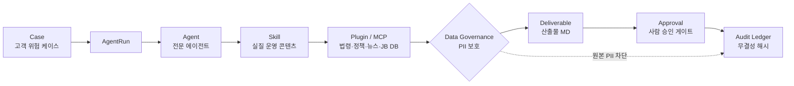
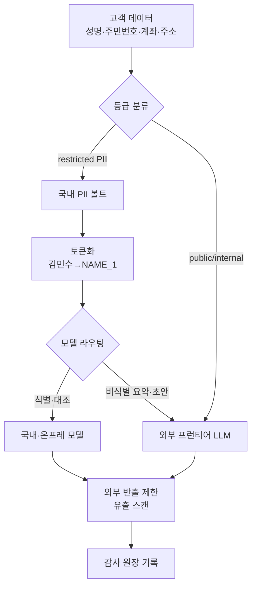

# JB LocalGuard OS

JB LocalGuard OS는 JB금융그룹 Fin:AI Challenge 자유주제 출품을 위한 AI Agent 운영 콘솔 MVP입니다.

## 제품 한 줄

지역 금융 고객의 위험 신호를 기사, 정책, 거래 맥락, 상담 기록에서 감지하고, 여러 AI Agent가 검토 가능한 조치 초안을 만들며, 사람 승인과 감사 로그를 통해 금융권 도입 가능성을 확보하는 Agent OS입니다.

## 핵심 범위

- 자유주제: JB금융그룹의 현재 사업과 미래 금융 AI 전략에 맞춘 Agent 운영체계
- 적용 도메인: 전북은행, 광주은행, JB우리캐피탈의 지역 금융 고객 사후관리와 위험 조기 대응
- 주요 pain point: 금리 부담, 매출 둔화, 정책금융 탐색, 보이스피싱, 전세사기 사전 점검
- 핵심 시스템: `Case -> AgentRun -> Agent -> Skill -> Plugin(법령·정책·뉴스·DB) -> Governance(PII) -> Approval -> Audit`
- 안전 원칙: 고객-facing 행동, 민감 판단, 법률/준법 표현은 사람 승인 전 자동 실행하지 않음
- 데이터 보호: 외부 LLM에는 가명·토큰화 데이터만 전송하고 원본 PII는 국내 볼트·온프레 모델에서만 처리 (은행은 **신용정보법 §40조의2** 특별법 우선, 개인정보보호법 **§28조의4·§28조의5** 보충, 전자금융감독규정 §15조 망분리 — [검증](docs/05_evidence/legal-citation-verification.md))

## 제출 핵심 (심사자용)

- 📄 **MVP 제안서**: [`docs/04_submission/mvp-proposal.md`](docs/04_submission/mvp-proposal.md) (공식 7섹션) · 데크 `proposal/*.pptx` · [.docx](05_제출/제출본/)
- 📄 **기능명세서**: [`docs/04_submission/function-spec.md`](docs/04_submission/function-spec.md) (공식 6파트) · [.docx](05_제출/제출본/)
- 🧭 **사실 단일 출처(Canon)**: [`docs/_canon.md`](docs/_canon.md) · **MOC**: [`_MOC/README.md`](_MOC/README.md) · **25항목 매핑**: [`05_제출/02`](05_제출/02-제출-패키지-체크리스트.md)

## 설치 및 실행

### 사전 요구
- Python 3 (정적 서버 실행용) — macOS/Linux 기본 탑재
- Node.js 18+ (npm 스크립트·Playwright E2E용)

### 설치
```bash
git clone https://github.com/LSB-afk/JB-Fin-AI-Challenge.git
cd JB-Fin-AI-Challenge
npm install        # 의존성(Playwright 등) 설치
```

### 실행
```bash
npm run dev        # = cd app && python3 -m http.server 8000
```
브라우저에서 `http://127.0.0.1:8000/index.html` 을 엽니다. 별도 빌드가 필요 없는 정적 앱입니다.

데모 시나리오는 URL 파라미터로 바로 진입할 수 있습니다.
- `…/index.html?demo=jeonse` — 전세사기 사전 점검
- `…/index.html?demo=phishing` — 보이스피싱 차단
- `…/index.html?demo=sme` — 소상공인 정책금융 (히어로 케이스)

### 검증
```bash
npm run build      # 정적 검증 (필수 파일·문서 키워드·JS 문법)
npm run test       # = verify_static.py
npm run test:e2e   # Playwright E2E (19개 시나리오·반응형), 캡처는 test-results/screenshots/
```

### 트러블슈팅
- 포트 8000 충돌: `lsof -i :8000` 로 기존 프로세스 확인 후 종료하거나 다른 포트로 `python3 -m http.server 8010`.
- E2E 최초 실행 시 브라우저 다운로드: `npx playwright install chromium`.

## 아키텍처

### 시스템 흐름 — Case에서 Audit까지


### 데이터 거버넌스 흐름 — 외부 LLM에 원본 PII를 보내지 않는다

> 근거: 전자금융감독규정(망분리), 개인정보보호법 §28-2(가명정보 처리 특례)·§28-3, 신용정보법 §40-2, 금융분야 AI 가이드라인.

## 실제 작동 화면

| 대시보드 | 케이스 자율운영 상세 |
| --- | --- |
|  |  |

| 플러그인·MCP 커넥터 | 데이터 거버넌스(PII 토큰화) |
| --- | --- |
|  |  |

산출물(MD 결과물) 뷰어: 

## 2026 업그레이드 하이라이트

모듈 레지스트리 아키텍처로 모든 요소를 갈아끼울 수 있게 구성했습니다. 요소별 설계는 [`docs/02_product/element-specs/`](./docs/02_product/element-specs/) 참고.

- **데이터 거버넌스 계층** — 등급제·토큰화·모델 라우팅·외부 반출 제한 (핵심 차별점, 금융권 실도입 가능성)
- **히어로 케이스 자율운영 상세 페이지** — 전주 카페 SME: 타임라인→에이전트 루프→산출물→승인→감사
- **플러그인/MCP 레지스트리** — 법령·정책·뉴스·재개발·JB 금융 DB 커넥터 (리서치 기반 실제 내용)
- **실질 스킬 콘텐츠** — 핵심 스킬에 실제 절차·판단 기준·근거 법령, 보기/편집
- **고객 DB + 추적** — 케이스↔고객 연결, 리스크 추이, 관찰 이력 (PII 마스킹)
- **산출물 MD + 보드 처리 훅** — 케이스를 옮기면 실제 결과물이 생성

## 심사자 빠른 경로

1. [_MOC](./_MOC/README.md)에서 전체 구조를 확인합니다.
2. [05_제출](./05_제출/README.md)에서 제출 패키지와 평가항목 대응을 봅니다.
3. [03_제품](./03_제품/README.md)에서 제품 화면과 기능 범위를 확인합니다.
4. [07_아키텍처](./07_아키텍처/README.md)에서 시스템/데이터/API/사용자 흐름 다이어그램을 확인합니다.
5. [app](./app/README.md)에서 실행 앱을 열어 AgentRun, 승인, 감사 로그 흐름을 검증합니다.
6. 앱에서 **케이스(전주 중앙로 카페) 선택 → "케이스 상세 페이지 열기"** 로 자율운영 전체 루프(타임라인·산출물·거버넌스·고객 추적)를 확인합니다.
7. 좌측 **플러그인** 메뉴에서 법령·정책·뉴스·JB DB 커넥터와 데이터 거버넌스 등급을 확인합니다.

## 폴더 지도

| 폴더 | 역할 | 먼저 볼 문서 |
| --- | --- | --- |
| [`_MOC`](./_MOC/README.md) | 전체 탐색 지도 | 워크스페이스 지도, 심사자/개발자 읽기 순서 |
| [`02_전략`](./02_전략/README.md) | 자유주제 전략과 JB 적합성 | 문제 정의, 차별점, 평가 대응 |
| [`03_제품`](./03_제품/README.md) | 제품 정의와 실행 화면 | 화면 구성, 기능 범위, 앱 연결 |
| [`04_증빙`](./04_증빙/README.md) | 공식자료, 기사, 정책 근거 | 출처 원칙, 증빙 연결 |
| [`05_제출`](./05_제출/README.md) | 제출 패키지 | 제안서, 평가표, 데모 체크리스트 |
| [`06_LLM위키`](./06_LLM위키/README.md) | Agent/LLM 운영 지식 | 운영 패턴, 다음 개발 프롬프트 |
| [`07_아키텍처`](./07_아키텍처/README.md) | Mermaid 아키텍처 | 시스템/데이터/API/사용자 흐름 |
| [`_체계`](./_체계/README.md) | 운영 규칙 | Case 생애주기, 승인/감사 정책 |
| [`app`](./app/README.md) | 실행 가능한 정적 MVP | `index.html`, `app.js`, `styles.css` |
| [`docs`](./docs/README.md) | 원문형 상세 문서 | PRD, Agent 설계, 증빙, 제출 문서 |
| [`scripts`](./scripts/README.md) | 검증 스크립트 | 정적 검증 방법 |
| [`자산`](./자산/README.md) | 앱/스크립트/원천 자료 인덱스 | 실행 자산, 원천 자료 |
| [`산출`](./산출/README.md) | 최종 제출/발표 산출물 | 제안서, 평가 대응, 작업 로그 |

## 현재 보완 필요 사항

- 실데이터 연결: 등기부, HUG 보증 가능성, 시세, 은행 상담/심사 시스템 어댑터
- 위험 점수 산식: 전세가율, 권리관계, 소득 부담, 보증 가능성의 설명 가능한 통합 점수
- 실행 실패 복구: API 지연, Agent 실패, 승인 SLA 초과 시 재시도와 상위 보고 규칙
- 권한과 보안: RM/준법/관리자별 접근권한, 개인정보 마스킹, 감사 로그 위변조 방지
- 문서 자동 생성: 체크리스트, 특약, 고객 안내문을 실제 문서/알림/상담 이력으로 연결
- 모델 품질 검증: 오탐/미탐 테스트셋, 근거 신뢰도, 사람 승인 전후 비교 지표
