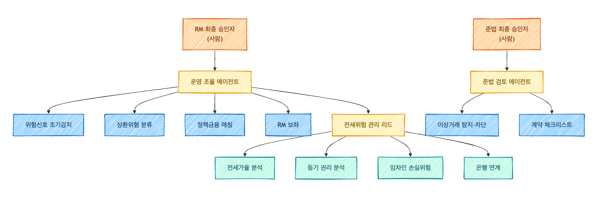
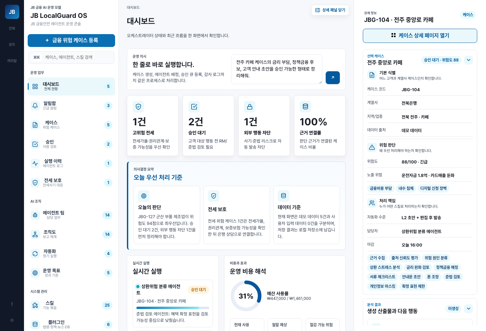
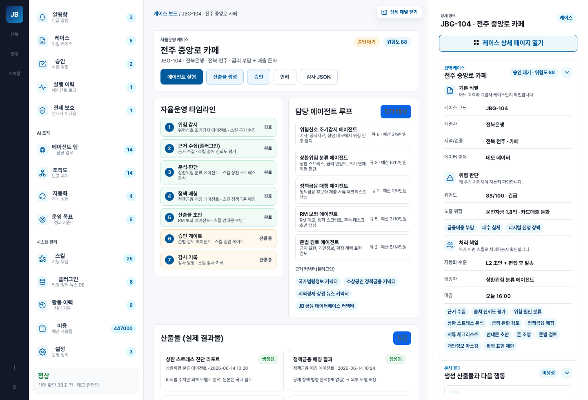
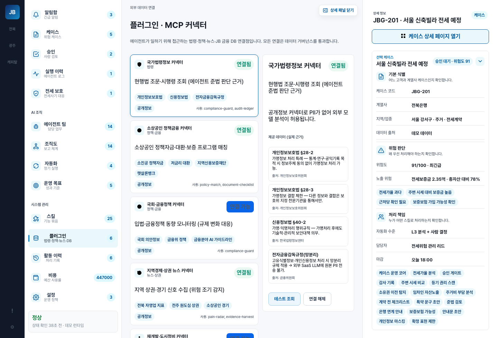
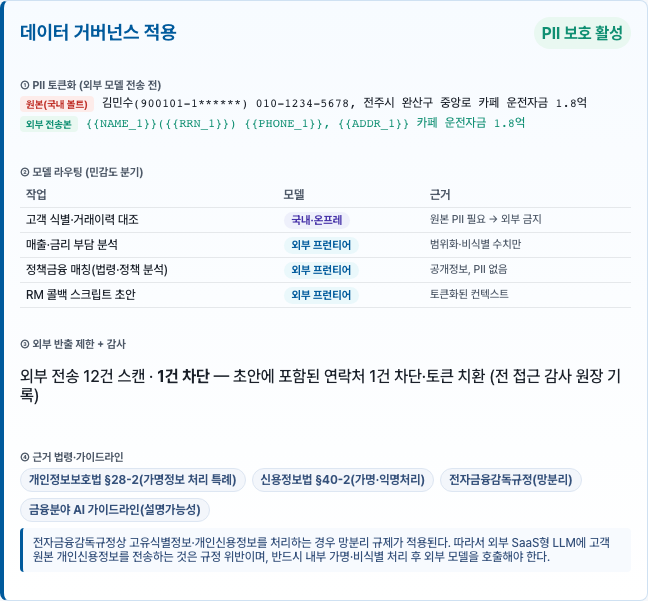
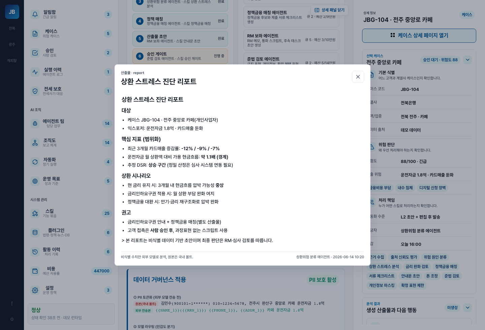

<div align="center">

# 🛡️ JB LocalGuard OS

**지역 금융 고객의 위험 신호를 모아, AI 에이전트가 판단·행동·검증하되 — 고객 대상 행동은 사람 승인 전까지 차단하는 금융 AI Agent 운영 콘솔**

JB금융그룹 Fin:AI Challenge · 자유주제 (JB 미래사업 AI)

`Vanilla JS` · `정적 MVP` · `멀티 에이전트` · `데이터 거버넌스(PII 비반출)` · `승인·감사형 자동화`

</div>

---

## 30초 요약

은행 RM·심사·사후관리·준법 담당자는 한 사람이 수십~수백 케이스를 본다. 그런데 위험 신호 — 기사·정책공고·시세·등기·상담기록·사기경보 — 는 **흩어져 있어** 조기에 모아 판단하고 다음 행동으로 잇기 어렵다.

**JB LocalGuard OS**는 고객별 위험을 하나의 `Case`로 모으고, **14종 전문 AI 에이전트**가 스킬을 장착해 **판단 → 행동 초안 → 검증**을 수행한다. 단, 고객 대상 행동은 **사람 승인 게이트**를 통과해야 하고 모든 판단·행동은 **감사 원장**에 남는다. 챗봇이 아니라 **승인·감사가 가능한 내부 운영체계**라 금융권 실도입 가능성이 높다.

> **최대 차별점** — 외부 프런티어 LLM의 추론력은 활용하되, **고객 원본 PII·신용정보는 절대 외부로 반출하지 않는다.** (데이터 등급제·토큰화·모델 라우팅·반출 스캔·감사 원장의 4중 방어)

---

## 작동 구조 — Case에서 Audit까지


`Case → AgentRun → Agent → Skill → Evidence → Governance → Approval → Audit` — 정적 분석 보고서가 아니라 **상태가 실제로 변하는 운영 루프**다. 데모(`?demo=sme/jeonse/phishing`)에서 케이스 선택·실행·승인·감사 로그 갱신이 클릭으로 재현된다.

---

## 핵심 차별점 — 데이터 거버넌스 (PII 비반출)


| 단계 | 무엇을 | 어떻게 |
| --- | --- | --- |
| ① 데이터 등급제 | 모든 필드에 등급 부여 | `public·internal·confidential·restricted(PII)` 가 모델 라우팅·반출 여부 결정 |
| ② 토큰화·가명처리 | 외부 호출 직전 PII 치환 | 토큰↔원본 매핑은 **국내 PII 볼트**에만 |
| ③ 모델 라우팅 | 민감도로 분기 | 원본 PII → 국내·온프레 모델 / 비식별 요약 → 외부 LLM(토큰만) |
| ④ 반출 스캔 + 감사 원장 | 외부 전송 사전 검사·기록 | 주민번호·계좌·전화 패턴 + 토큰 검증, 무결성 해시 기록 |

**법적 근거(검증 완료)** — 은행은 **신용정보법 §40조의2**(특별법 우선, §3조의2), 개인정보보호법 **§28조의4·§28조의5** 보충, **전자금융감독규정 §15조(망분리)**. 금융위 **망분리 개선 로드맵(2024-08-13, 다층보안체계·생성형 AI 클라우드 허용)**. → [근거 검증 문서](06_증빙/legal-citation-verification.md) · [편집 가능 Excalidraw](02_제품/자산/diagrams/governance-4defense.excalidraw.url)

---

## 에이전트 팀 구성



| 라인 | 에이전트 |
| --- | --- |
| 운영 지휘·분석 | 운영 조율 · 포트폴리오 분석 |
| 위험·금융 판단 | 위험신호 조기감지 · 상환위험 분류 · 정책금융 매칭 |
| 전세 보호 | 전세위험 관리 리드 · 전세가율 분석 · 등기 권리 분석 · 임차인 손실위험 |
| 준법·차단·계약 | 이상거래 탐지·차단 · 준법 검토 · 계약 체크리스트 |
| 고객·은행 연계 | RM 보좌 · 은행 연계 |

사람 승인자(RM·준법) 2종 + 승인 게이트가 모든 고객 대상 행동을 통제한다.

---

## 실제 작동 화면

| 대시보드 | 케이스 자율운영 상세 |
| --- | --- |
|  |  |

| 플러그인·MCP 커넥터                                         | 데이터 거버넌스(PII 토큰화)                                       |
| ---------------------------------------------------- | ------------------------------------------------------- |
|  |  |

> 산출물(MD) 뷰어: 

---

## 우리가 풀려는 문제 (검증된 데이터)

| 도메인 | 근거 | 담당 에이전트 |
| --- | --- | --- |
| 소상공인 자금압박 | 자영업자 대출 1,064조 · 취약 차주 42.7만명(연체율 11.16%) · 2024 폐업 100.8만명 | 상환위험 분류 |
| 전세사기 | 피해 인정 약 3.9만건 · HUG 사고액 2024년 4.49조원 | 전세위험 관리 리드 |
| 보이스피싱 | 2025년 1~11월 피해액 1.13조원(+56%) | 이상거래 탐지·차단 |

출처·신뢰도는 [심사 인용 카드](06_증빙/01-심사인용카드.md)에서 1:1 추적.

---

## 빠른 시작

```bash
git clone https://github.com/LSB-afk/JB-Fin-AI-Challenge.git
cd JB-Fin-AI-Challenge
npm install                     # Playwright 등 (검증용)

npm run dev                     # = python3 -m http.server 8000 --directory 02_제품/app
# http://127.0.0.1:8000/index.html
```

데모 시나리오(URL 파라미터):

- `?demo=sme` — 소상공인 정책금융 (**히어로: 전주 중앙로 카페**)
- `?demo=jeonse` — 전세사기 사전 점검
- `?demo=phishing` — 보이스피싱 차단

검증:

```bash
npm run test        # 정적 검증 (verify_static.py)
npm run test:e2e    # Playwright E2E (19개 시나리오·반응형)
```

---

## 저장소 구성

최상위는 **번호 폴더(00–07) + `_체계`**로만 구성된다. 제품 소스·검증 도구·자산은 `02_제품/` 안에, 발표 데크는 `00_제출/`, 작업 리포트는 `06_증빙/` 안에 정리되어 있다.

```
JB-Fin-AI-Challenge/
├── README.md · _MOC.md · _canon.md   # 관문 · 탐색 지도 · 사실 단일 출처(SSOT)
├── 00_제출/        🟦 제출물 — 제안서·기능명세서·통계·발표스크립트·제출본(DOCX)
│   └── 발표자료/       발표 데크 빌더(PPTX) + Mermaid·스크린샷
├── 01_전략/        문제정의·JB 사업연계·경쟁차별성·자유주제 포지셔닝
├── 02_제품/        제품·실행·검증
│   ├── app/            🟦 MVP 소스코드 (정적 vanilla JS)
│   ├── 자산/           스크린샷·손그림 다이어그램·시연 녹화
│   ├── scripts/        정적 검증 (verify_static.py)
│   ├── tests/          Playwright E2E (19 시나리오)
│   └── *.md            화면별 기능명세·사용자스토리·IA·로드맵·element-specs·히어로 워크스루
├── 03_에이전트/    에이전트 프롬프트 계약·모델 라우팅/거버넌스·안전정책·시스템 설계
├── 04_아키텍처/    시스템·데이터·API·거버넌스 Mermaid 다이어그램
├── 05_리서치/      Pain-point·JB 사업·데이터/API/라이선스 (출처 검증)
├── 06_증빙/        심사 인용카드·법령정책 근거·증빙추적·법령 검증·출처 인덱스
│   └── 산출/           작업 로그·QA 리포트
├── 07_원천/        대회 PDF·DAKER 정독 노트
└── _체계/          운영 규칙 · 심사기준
```
> `node_modules/`·`test-results/`는 npm/Playwright 생성물이라 `.gitignore` 처리되어 저장소에 포함되지 않는다.

---

## 심사자 5분 경로

1. [`_canon.md`](_canon.md) — 제품·차별점·심사 25항목을 한눈에
2. [`00_제출/mvp-proposal.md`](00_제출/mvp-proposal.md) — MVP 제안서(공식 7섹션, 부록 A = 25항목 커버리지 맵)
3. [`00_제출/function-spec.md`](00_제출/function-spec.md) — 기능명세서(공식 6파트)
4. [`app/index.html`](02_제품/app/index.html) → `?demo=sme` 전주 카페 골든 패스 실행
5. [`04_아키텍처/`](04_아키텍처/README.md) — 데이터 거버넌스 아키텍처(PII 비반출)

전체 지도: [`_MOC.md`](_MOC.md)

---

## 기술 구성

- **현재 MVP**: Vanilla JS/CSS/HTML 정적 앱, 네트워크 API 없이 브라우저 상태로 운영 루프 재현. 검증: `verify_static.py` + Playwright E2E(19).
- **본선 목표**: 정적 함수 계약(`computeRiskDecision`·`buildDashboardData`·`auditChainRecords`·`moveCaseToColumn`)을 서버 API로 1:1 승격. RAG(공공/내부 문서) + Rule Engine(승인 레벨 L0–L4) + 멀티 에이전트 오케스트레이션 + 모델 라우팅(국내/외부).

## 발전 경로

PoC(현재) → 파일럿(1개 영업본부 RM) → 내부 적용(사후관리·심사 보조 — 네이버클라우드 MOU 방향과 정합) → 고객 서비스화. 계열사(광주은행·JB우리캐피탈)·업무영역(기업여신 심사·WM)·고객군으로 스킬 추가 확장.

## 운영 리스크 대응

개인정보·보안(PII 비반출 거버넌스) · 환각(에이전트는 근거·불확실성·다음 확인 항목 의무 출력) · 설명가능성(점수 분해·출처 칩·승인 라우팅) · 책임소재(승인 게이트 + 무결성 감사 원장) · 저작권(외부 데이터 라이선스·출처 명시).

## 현재 한계

실데이터 어댑터(등기·HUG·시세·은행 시스템) 미연결 · 위험 점수 산식 고도화 필요 · 실행 실패 복구(재시도·SLA 상위보고) 규칙 · 모델 품질 검증(오탐/미탐 테스트셋).

---

## 한 줄 정리

> **JB LocalGuard OS** — 외부 LLM은 쓰되 고객 PII는 내보내지 않는, 승인·감사형 지역 금융 AI Agent 운영체계.

<div align="center">

[MVP 제안서](00_제출/mvp-proposal.md) · [기능명세서](00_제출/function-spec.md) · [Canon](_canon.md) · [MOC](_MOC.md) · [앱 실행](02_제품/app/index.html)

</div>
